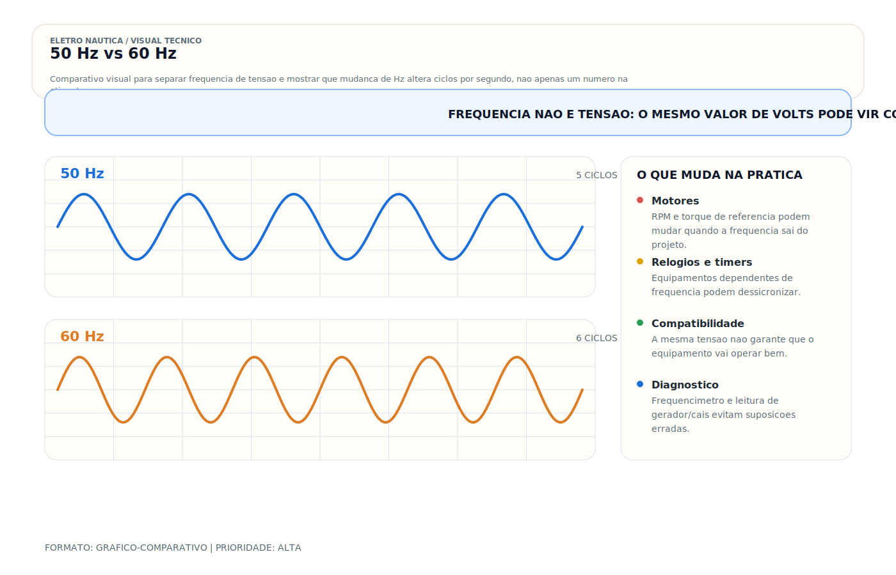

# DC vs AC — Corrente Contínua e Alternada

> [!abstract] Resumo técnico
> DC vs AC — Os dois sistemas de eletricidade coexistem em embarcações modernas. Entender as diferenças, onde cada um é usado e como eles se relacionam é essencial para trabalhar com segurança e eficiência.

> [!tip] Regra de decisão em 30 segundos
> - **DC e AC são domínios separados**: painéis, cabos, barramentos, proteções e diagrama separados. Compartilhamento = ambiguidade = risco.
> - **Componente AC ≠ componente DC**: disjuntor, fusível, porta-fusível, chave — tudo precisa ser especificado para a corrente correta. Arco DC não se extingue sozinho.
> - **Risco dominante em DC = arco + incêndio**. Em AC = choque + ESD. As proteções refletem isso (fusível/breaker DC, DR/ELCI/GFCI AC).
> - **Frequência ≠ tensão**: 220 V a 50 Hz ≠ 220 V a 60 Hz para motores, relógios, temporizadores, cargas indutivas. Verificar ambos.
> - **Inversor é ponte com custo**: eficiência 85–92%; cada W de AC puxa ~1,10–1,18× em DC.
> - **Senoidal puro é padrão prudente**; onda modificada aceitável apenas em cargas resistivas bem caracterizadas.
> - **Tensão DC do sistema** escala com potência: 12 V pequeno, 24 V médio, 48 V+ propulsão/alta potência.
> - **Shore power sempre desligado antes de intervenção**, mesmo com disjuntor "off"; confirmar com multímetro.
> - **Cores e rotulagem**: DC preto/vermelho/amarelo; AC verde-amarelo/azul/marrom; nunca trocar convenção para "encaixar" material à mão.

## O que é

**DC (Direct Current / Corrente Contínua):** corrente que circula com polaridade fixa em relação à referência do circuito. Na prática de bordo, é fornecida por baterias, controladores/MPPT, conversores DC-DC e saídas retificadas de sistemas de carga.

**AC (Alternating Current / Corrente Alternada):** corrente cuja polaridade se inverte periodicamente. No contexto de bordo, a rede AC útil normalmente vem do shore power, de geradores AC ou de inversores; alternadores automotivos/marinizados geram AC internamente, mas entregam DC retificada ao banco.

Em embarcações de recreio, os dois sistemas coexistem: DC para operação autônoma (baterias) e AC quando conectado à marina (shore power) ou com gerador ligado.

## Comparação direta

| Característica | DC (12V/24V) | AC (220V) |
| --- | --- | --- |
| Fonte principal | Banco de baterias | Shore power / Gerador / Inversor |
| Tensão típica a bordo | 12V ou 24V | 220V (Brasil) / 120V (EUA) |
| Frequência | 0 Hz (contínuo) | 60 Hz (Brasil) / 50 Hz (Europa) |
| Distância máxima eficiente | Limitada (queda de tensão em baixa tensão) | Longa (alta tensão = baixa corrente) |
| Risco de choque | Menor na maior parte das aplicações em extra-baixa tensão, mas não nulo | Alto e potencialmente letal |
| Facilidade de armazenar | Alta (baterias) | Baixa (capacitores — impraticável) |
| Eficiência de transmissão | Baixa em baixas tensões | Alta |
| Corrosão / fuga | Correntes DC e fugas DC são as mais críticas para eletrólise e stray current corrosion | Fugas AC indicam falha séria de isolação; o mecanismo e o efeito não são equivalentes ao da fuga DC |

## Visual didático — frequência não é tensão



Este visual ajuda a separar duas ideias que iniciantes costumam misturar: tensão e frequência. A tensão diz "quanto" o circuito entrega; a frequência diz "quantas alternâncias por segundo" estão acontecendo.

Use a figura para fixar três pontos:

- 50 Hz e 60 Hz podem existir com a mesma tensão nominal;
- frequência errada afeta motores, temporização e equipamentos dependentes do ritmo da rede;
- shore power, gerador e inversor precisam ser avaliados também pela frequência, não só pela tensão.

Material de apoio: [50 Hz vs 60 Hz](../_visuals/generated/50hz-vs-60hz.md)

## Como coexistem a bordo

**Sistema DC:**

- Baterias (banco de serviço + banco de partida)
- Todos os equipamentos de navegação (VHF, GPS, radar, AIS, chartplotter)
- Iluminação LED
- Bombas (porão, combustível, água doce)
- Equipamentos de áudio
- Sistemas de automação e alarme
- Geladeira DC (compressor Danfoss/Secop)
- Carregadores USB

**Sistema AC:**

- Ar-condicionado
- Microondas
- Tomadas domésticas (carregador de laptop, TV de 220V)
- Boiler elétrico (aquecimento de água)
- Máquina de lavar
- Shore power (quando atracado)
- Saída do inversor (quando navegando)
- Gerador

## A interface entre DC e AC

| Dispositivo | Direção | Função |
| --- | --- | --- |
| Alternador | DC (gerado) | Motor AC do barco → bateria DC |
| Inversor | DC → AC | Bateria DC → 220V AC |
| Carregador de bateria | AC → DC | 220V AC shore power → bateria DC |
| Inversor-carregador (MultiPlus) | Bidirecional | Tanto inverte quanto carrega |
| Conversor DC-DC | DC → DC | 24V → 12V, 12V → 5V (USB) |

## Tensões práticas do sistema DC

**Por que 12V?**

Padrão automotivo consolidado. Ampla disponibilidade de equipamentos. Adequado para embarcações pequenas e médias.

**Por que 24V?**

- Para a mesma potência (Watts), a corrente em 24V é metade da corrente em 12V
- Cabos menores, menor queda de tensão, mais eficiente
- Padrão em embarcações europeias e em barcos com sistemas de alta potência (thrusters, dessalinizadores)

**Por que 48V?**

- Sistemas de propulsão elétrica e barcos elétricos/híbridos
- Eficiência máxima de transmissão em DC
- Crescente em sistemas de energia residencial e náutica avançada

**Heurística inicial de arquitetura:**

- 12V costuma atender embarcações menores, com circuitos curtos e correntes moderadas
- 24V passa a fazer sentido quando as correntes de serviço e potência instalada crescem e a queda de tensão vira limitante
- 48V ou tensões superiores entram em discussão em arquiteturas energéticas avançadas, sistemas híbridos ou propulsão elétrica

Essa triagem não substitui cálculo de corrente, queda de tensão, disponibilidade de equipamentos e estratégia de integração entre bancos, fontes e cargas.

## Riscos distintos de DC e AC

**DC 12V/24V:**

- O risco de choque por contato simples costuma ser menor que em AC, mas não deve ser tratado como inexistente
- Risco real dominante: arco elétrico em curto-circuito e energia disponível do banco
- Arco DC é mais difícil de extinguir que arco AC (não passa por zero)
- Risco de incêndio por cabo superaquecendo sem fusível

**AC 220V:**

- Tensão com potencial letal e com maior probabilidade de fibrilação/choque grave
- Risco de choque: contato entre condutor ativo e partes aterradas, estrutura metálica ou outro condutor ativo
- Proteção diferencial/ELCI/GFCI/DR deve ser definida pela topologia da instalação e pelo padrão adotado
- Tensão de pico 311V — mais perigoso ainda em caso de contato

**Regra:** trabalhar em DC com precaução. Trabalhar em AC com o sistema desligado e verificado com multímetro.

## Eficiência: por que AC vence em distâncias longas

**A física por trás:**

```jsx
Perda de potência no cabo: P_perda = I² × R
Para a mesma potência transmitida:
  Em 12V DC: P=1200W → I = 100A → P_perda = 100² × R (enorme)
  Em 220V AC: P=1200W → I = 5,5A → P_perda = 5,5² × R (pequeno)
```

Por isso a rede elétrica usa alta tensão AC (13,8kV ou 138kV) — menos corrente = menos perda. No barco, usar 24V em vez de 12V para sistemas de alta potência tem o mesmo raciocínio.

## Shore power: quando o AC chega no barco

Ao atracar na marina e conectar o shore power:

- A fase e o neutro da marina entram no barco
- O carregador de bateria converte AC → DC para recarregar o banco
- Os equipamentos AC (ar-condicionado, microondas) funcionam diretamente
- O inversor pode entrar em modo carregador (ex: Victron MultiPlus)
- O dispositivo diferencial da interface de entrada monitora corrente residual/desequilíbrio conforme sua classe e corrente diferencial nominal

Sem shore power (navegando ou fundeado):

- Todo o AC vem do inversor (alimentado pelo banco DC)
- Cada Watt de AC consumido é descontado do banco DC com perda de eficiência (~85–92%)
- Gerenciar o uso de AC é gerenciar a autonomia do banco

## Boas práticas profissionais

- Manter os sistemas DC e AC fisicamente separados (cabos, painéis, barramentos)
- Nunca misturar cabos DC e AC no mesmo conduíte sem divisória física
- Identificar claramente cada cabo: cor e etiqueta (DC preto/vermelho, AC preto/azul/verde)
- Prever proteção diferencial compatível com a arquitetura de shore power/inversor/gerador e com o referencial normativo adotado
- Dimensionar o inversor para as cargas AC que serão usadas simultaneamente
- Documentar no diagrama unifilar a separação entre os dois sistemas

> [!danger] Quando chamar um especialista
> Não assumir sozinho quando houver:
> - Retrofit de embarcação com conversão completa AC→DC (p.ex. propulsão elétrica pura) — envolve ISO 16315, ABYC, e análise de potência total.
> - Sistema híbrido DC/AC com múltiplas fontes (shore + gerador + inversor + solar + hidrogerador) operando em paralelo — coordenação exige chave de transferência com intertravamento e/ou grid-tie.
> - Instalação de tensão DC acima de 48 V ou sistema de eletropropulsão — categorias diferentes de risco elétrico, acesso restrito conforme norma.
> - Incidente com choque AC, eletrocussão ou ESD — perito técnico e laudo com ART/CREA.
> - Incêndio no banco, no inversor ou no painel — causa raiz pode ser sistêmica (coordenação de proteção, queda de tensão, conexão frouxa).
> - Laudo técnico para seguradora, Marinha, Justiça.
> - Importação de barco projetado para 120 V / 60 Hz operar no Brasil 127 ou 220 V / 60 Hz — requer reprojeto AC; alguns equipamentos são descartáveis.
> - Embarcação comercial, SOLAS, passageiro ou classificada — IEC 60092 e regime de classe aplicam-se.
> - Conversão 220 V BR (fase-fase) para 220 V fase-neutro via transformador — decisão de topologia.
>
> Confundir DC com AC em projeto, proteção ou manutenção é uma das causas mais comuns de incêndio em embarcação de recreio. Quando houver dúvida, pare.

## Erros comuns

**Usar componentes DC em circuito AC:**

Disjuntor DC em circuito AC — não extingue o arco AC corretamente. Fusível de lâmina (especificado 12V/32V) em circuito de 220V — pode explodir ao fundir.

**Inversor de onda modificada (modified sine wave) para equipamentos sensíveis:**

Pode até alimentar cargas resistivas simples, mas introduz aquecimento, ruído, mau desempenho ou incompatibilidade em eletrônicos, motores, carregadores e instrumentação. Para uma instalação AC de uso geral e sem surpresas futuras, a referência prudente é inversor senoidal puro.

**Não desligar o sistema AC antes de trabalhar:**

"O disjuntor está desligado." A fase ainda está presente no cabo. Desconectar fisicamente o shore power antes de qualquer trabalho em sistema AC.

**Ignorar o custo energético do AC em autonomia:**

Ar-condicionado de 1.500W via inversor = 1.500W / 0,9 (eficiência) = 1.667W do banco = 139A em 12V. 2 horas de AC = 278Ah. Banco de 200Ah não aguenta.

## Relação com outros sistemas

- **Banco de baterias:** armazena DC, alimenta o sistema DC e (via inversor) o AC
- **Inversor/carregador:** o dispositivo que faz DC e AC conversarem
- **Shore power:** fonte de AC externa ao barco
- **Gerador:** gera AC que alimenta cargas AC e carrega banco via carregador
- **Alternador:** gera DC (não AC — apesar do nome, a saída é DC após retificação)

## Normas aplicáveis

- **ABYC E-11 (2023)** — separação e especificação de sistemas AC e DC
- **ABNT NBR 5410 (2004 + emendas)** e família **ABNT/IEC** aplicável — referência complementar para princípios de baixa tensão, identificação e proteção
- **IEC 60092 (edição a verificar)** — electrical installations in ships

## Como ensinar este tópico

**Sequência recomendada:**

1. Analogia: DC = corrente de rio (sempre mesma direção); AC = ondas do mar (vai e vem)
2. Mostrar osciloscópio: forma de onda DC (linha reta) vs AC (senoide) — impacto visual imediato
3. Identificar nos dois sistemas: onde está o DC no barco? Onde está o AC?
4. A interface: inversor e carregador — o "câmbio" entre os dois sistemas
5. Comparar eficiência: por que AC é melhor para distâncias; por que DC é melhor para armazenamento
6. Discutir segurança: 12V vs 220V — risco real de cada um

**Conceito-chave para fixar:**

"DC armazena e alimenta equipamentos de navegação. AC entrega conforto e potência. O inversor é a ponte — e tem custo de eficiência."

## FAQ

**Pode-se usar multímetro DC para medir AC?**

Não. A medição de tensão DC em circuito AC vai dar zero (ou valor incorreto). Sempre selecionar o modo correto: VAC para tensão alternada, VDC para tensão contínua.

**O alternador do motor de popa gera AC ou DC?**

A saída do alternador que vai às baterias é DC (o alternador interno gera AC trifásico, mas os diodos integrados retificam para DC). A tensão de saída é tipicamente 13,8–14,4V em motor de popa.

**Posso carregar baterias com gerador AC direto?**

Não diretamente. O gerador gera AC. Para carregar baterias DC, é necessário um carregador de bateria AC→DC entre o gerador e o banco.

**Qual o risco real de 12V DC?**

Em extra-baixa tensão, o risco de choque costuma ser menor que em 127/220V, mas isso não autoriza tratar o sistema como "seguro por definição". Em embarcações, o risco operacional dominante costuma ser arco, aquecimento e incêndio por curto-circuito ou proteção inadequada; em ambiente molhado, mãos lesionadas e contatos extensos, o risco fisiológico também aumenta.

## Glossário rápido

- **DC (Direct Current)** — corrente de polaridade fixa; fornecida por bateria, MPPT, retificador ou conversor DC-DC.
- **AC (Alternating Current)** — corrente de polaridade que alterna periodicamente; shore, gerador ou inversor.
- **Senoide** — forma de onda AC ideal; referência para todo equipamento AC bem projetado.
- **Onda quadrada** — AC grosseiramente alternada; inadequada para cargas indutivas/eletrônicos.
- **Onda modificada (modified sine wave)** — aproximação em degraus; aceitável só em cargas resistivas simples.
- **Frequência (Hz)** — número de ciclos por segundo; 60 Hz no Brasil, 50 Hz na Europa.
- **Zero crossing** — passagem por zero da senoide; permite extinção natural do arco em AC.
- **Tensão de pico** — valor máximo instantâneo; 220 V RMS ≈ 311 V pico.
- **RMS (Root Mean Square)** — valor eficaz da AC; é o que o multímetro em VAC mostra.
- **Inversor** — converte DC→AC; eficiência típica 85–92%.
- **Carregador** — converte AC→DC; eficiência típica 85–92%.
- **Inversor-carregador** — bidirecional (p.ex. Victron MultiPlus, Mastervolt Mass Combi).
- **Conversor DC-DC** — transforma um nível DC em outro (24→12 V, 48→24 V); mantém o domínio DC.
- **Alternador** — gera AC trifásica internamente, retifica para DC; saída prática é DC.
- **Retificador** — converte AC→DC via diodos; parte do alternador, do carregador, do MPPT.
- **Shore power** — alimentação AC externa do cais (50/60 Hz, 127/220/230/240 V).
- **Banco de baterias** — armazenamento de energia DC; autonomia em Ah ou kWh.
- **Queda de tensão** — perda ao longo do condutor (V = I×R); DC baixa tensão sofre muito mais.
- **Extra-baixa tensão (ELV)** — convencionalmente ≤ 50 V AC ou 120 V DC; risco de choque reduzido, não zero.
- **Baixa tensão (LV)** — até 1000 V AC ou 1500 V DC; inclui shore power 220 V BR.
- **Topologia de rede** — arrangements: L+N+PE, L1+L2+PE, split-phase 120/240 V, trifásico — define proteção.
- **Polaridade (DC)** — positivo e negativo fixos; inverter = queimar equipamento ou bateria.
- **Convenção de cores** — DC: preto (+) / vermelho (+) / amarelo (−); AC BR: marrom/preto (fase), azul claro (neutro), verde-amarelo (PE).

## Integração com outras notas

- [[Diagrama Unifilar — Documentação do Sistema Elétrico]]
- [[Dimensionamento de Banco de Baterias — Cálculo de Autonomia]]
- [[Dimensionamento de Cabos DC — Cálculo Prático]]
- [[Fase e Neutro]]
- [[Ferramentas do Eletricista Náutico]]
- [[Inspeção de Cabos Terminais e Conexões]]
- [[Lei de Ohm e Cálculos Básicos]]
- [[Leitura de Diagramas e Esquemas Elétricos]]

## Perguntas que esta nota responde

- O que é DC vs AC — Corrente Contínua e Alternada em instalações elétricas náuticas?
