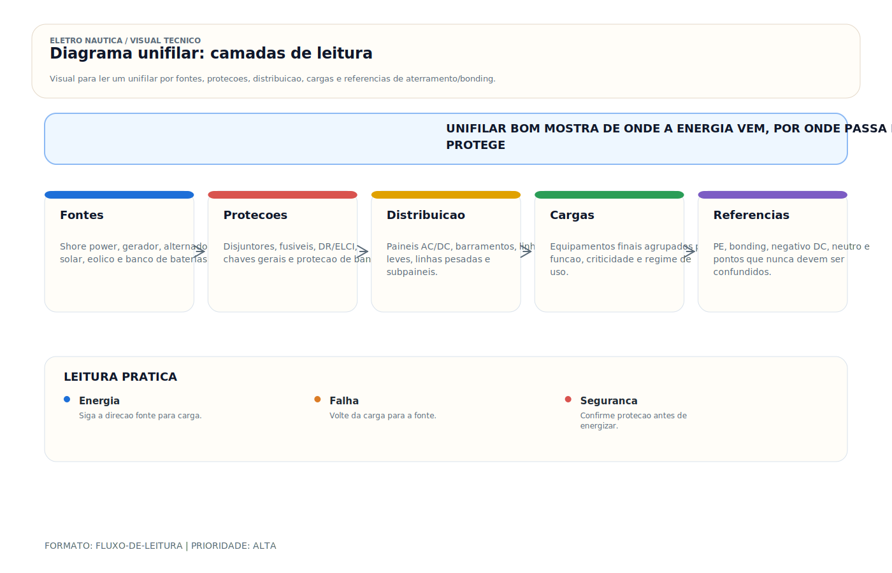

# Diagrama Unifilar — Documentação do Sistema Elétrico

> [!abstract] Resumo técnico
> DIAGRAMA UNIFILAR — Representação esquemática simplificada do sistema elétrico, mostrando os circuitos, proteções e equipamentos em uma visão de conjunto. A linguagem universal da elétrica náutica.

> [!tip] Regra de decisão em 30 segundos
> - **Sem diagrama, sem laudo e sem modificação segura**: qualquer intervenção significativa sem unifilar atualizado aumenta risco de incêndio, choque e custo de reparo.
> - **Uma linha por circuito, não por condutor**: a unifilar simplifica; detalhe fica no esquemático, na lista de cabos e no layout físico.
> - **DC e AC em seções visualmente separadas**: cores, blocos, molduras ou folhas diferentes. Misturar = técnico no sistema errado.
> - **Proteção com valor, cabo com bitola**: "Disj. 20 A, curva C" e "#10 AWG / 6 mm²" — não apenas "fusível".
> - **Numeração espelha o painel físico**: circuito #3 no diagrama = chave #3 no painel; divergência = retrabalho garantido.
> - **Data e revisão obrigatórias**: diagrama sem versão vira ficção em 12 meses.
> - **Cópia a bordo plastificada + cópia digital na nuvem**: papel molha, celular quebra; redundância é projeto.
> - **Retroengenharia > ausência**: sem projeto original, documentar a partir do painel existente com multímetro; melhor esboço à mão que nada.
> - **Bonding tem diagrama próprio ou seção dedicada**: não confundir caminho de corrente com malha equipotencial.

## O que é

O diagrama unifilar (também chamado de diagrama de uma linha ou single line diagram — SLD) é a representação gráfica do sistema elétrico completo da embarcação, onde cada circuito é representado por uma única linha independentemente do número de condutores. Mostra a hierarquia do sistema: fontes de energia → proteções → barramentos → circuitos → cargas.

É um dos documentos centrais do projeto elétrico e, quando existe e está atualizado, costuma ser o primeiro material consultado por quem vai diagnosticar, ampliar ou auditar a instalação.

## Função

| Função | Aplicação prática |
| --- | --- |
| Visão geral do sistema | Entender a topologia elétrica sem abrir painéis |
| Base para dimensionamento | Verificar se proteções e cabos estão corretos |
| Guia de diagnóstico | Localizar circuito com problema rapidamente |
| Documentação de manutenção | Registro de modificações ao longo da vida da embarcação |
| Comunicação entre profissionais | Linguagem comum para orçamentos e intervenções |

## Como aparece na prática

- Folha A3 plastificada dentro do painel elétrico
- Arquivo PDF no tablet ou notebook a bordo
- Versão simplificada colada na tampa do painel de fusíveis
- Diagrama no manual de bordo (quando existe)
- Ausente na maioria das embarcações de recreio no Brasil

## Fundamentos mínimos

**Hierarquia do diagrama DC:**

```jsx
Banco de baterias
    → Chave geral (master switch)
        → Barramento positivo principal
            → Fusível de circuito
                → Equipamento
            → Fusível de circuito
                → Equipamento
        → Barramento negativo principal
```

**Hierarquia do diagrama AC:**

```jsx
Shore power / Gerador / Inversor
    → Chave de transferência (se houver múltiplas fontes)
        → Disjuntor geral AC
            → Painel AC
                → Disjuntor de circuito
                    → Equipamento
```

**Elementos mínimos recomendados no diagrama:**

- Fontes de energia e seus caminhos de interligação (baterias, alternador, carregador, shore power, gerador, inversor, solar)
- Chaves, disjuntores e fusíveis com identificação e valores relevantes para seleção/manutenção
- Barramentos e referências de retorno/proteção (positivo DC, negativo DC, barramento AC, PE, bonding)
- Identificação dos circuitos principais e das cargas críticas
- Informação suficiente para rastrear a arquitetura: bitola, proteção, função e, quando útil, comprimento ou schedule associado
- Sistema de bonding e pontos de equipotencialização em diagrama próprio ou integrado
- Definição clara da topologia de neutro/PE/negativo, inclusive ponto único de conexão quando essa filosofia existir

## Características de um bom diagrama

| Item | Requisito |
| --- | --- |
| Escala e legenda | Clara, com símbolos explicados |
| Identificação de circuitos | Numeração correspondente ao painel |
| Valores nas proteções | Amperagem de cada fusível/disjuntor |
| Bitola dos cabos | Por circuito (AWG ou mm²) |
| Separação AC / DC | Visualmente distintos (cores ou seções) |
| Data de revisão | Versionado — saber qual é o atual |
| Assinatura | Quem fez e quando |

## Tipos e formatos

**Diagrama unifilar simplificado (muito comum no Brasil quando existe):**

- Apenas os circuitos principais
- Sem especificação de bitola e comprimento
- Útil para orientação geral

**Diagrama unifilar completo (padrão profissional):**

- Todos os circuitos com especificação completa
- Separado por sistemas (DC, AC, bonding)
- Inclui notas técnicas

**Diagrama esquemático (avançado):**

- Mostra os condutores individuais (fase, neutro, terra, positivo, negativo)
- Usado em diagnóstico de falhas específicas
- Mais complexo, mais informativo

**Diagrama de instalação / layout:**

- Visão física — onde cada componente está fisicamente no barco
- Complementa o unifilar (mostra o "onde", o unifilar mostra o "como")

## Ferramentas para criar diagramas unifilares

- **QElectroTech** — software gratuito, símbolos elétricos padrão IEC/ANSI
- **AutoCAD Electrical** — profissional, pago, padrão industrial
- **EPLAN** — profissional, mais usado em aplicações industriais
- **Lucidchart / [Draw.io](http://Draw.io)** — ferramentas online, boas para diagramas rápidos
- **Microsoft Visio** — familiar para muitos, com biblioteca de símbolos elétricos
- **Excel + formas geométricas** — solução mínima viável, funcional

## Simbologia padrão

| Símbolo | Elemento |
| --- | --- |
| Retângulo com R | Resistência / carga resistiva |
| Retângulo com M | Motor |
| Losango ou X | Fusível |
| Quadrado com traço | Disjuntor |
| Círculo com L | Lâmpada |
| Traço vertical | Bateria (par de traços = célula) |
| Triângulo | Diodo / retificador |
| Símbolo de terra | Aterramento |
| Seta bidirecional | Inversor / conversor |

## Problemas por ausência de diagrama

| Problema | Consequência |
| --- | --- |
| Diagnóstico lento | Técnico passa horas rastreando circuito a mão |
| Modificações mal feitas | Sem referência, instalações novas criam conflitos |
| Fusíveis errados | Sem documentação, troca-se por valores "parecidos" |
| Vendabilidade reduzida | Comprador sério exige documentação — embarcação sem vale menos |
| Risco de incêndio | Modificações sem projeto em sistema sem documentação |

## Como fazer retroengenharia do diagrama

**Para embarcações sem documentação:**

```jsx
1. Fotografar painel principal (frente e verso)
2. Identificar cada disjuntor/fusível e sua carga
3. Rastrear os cabos de cada circuito (com multímetro em modo continuidade)
4. Medir bitola dos cabos visíveis
5. Registrar na planilha: circuito, proteção, bitola, equipamento
6. Gerar diagrama a partir dos dados coletados
7. Datar e guardar a bordo
```

## Boas práticas profissionais

- Criar diagrama antes de qualquer instalação — ou ao menos em paralelo
- Atualizar o diagrama sempre que um circuito for modificado
- Manter a versão atual no painel e a anterior arquivada
- Adotar uma convenção de cores coerente com o padrão escolhido e documentá-la explicitamente na legenda
- Numerar os circuitos no diagrama com o mesmo número da chave no painel
- Incluir bitola e comprimento de cada cabo — facilita revisão futura

## Cuidados com o diagrama

- Não deixar diagrama em papel simples na bilge — plastificar ou usar proteção
- Manter cópia digital (tablet, nuvem)
- Revisar a cada 2 anos mesmo sem modificações (verificar se reflete a realidade)
- Não usar diagrama genérico de "barco similar" — cada embarcação tem sua configuração

> [!danger] Quando chamar um especialista
> Não assumir sozinho quando houver:
> - Laudo técnico para seguradora, Marinha ou Justiça envolvendo o sistema elétrico — diagrama assinado por profissional habilitado (ART/CREA) é documento primário.
> - Embarcação comercial, SOLAS, passageiro ou classificada — diagrama segue padrões IEC 60092 e regime da sociedade classificadora (ABS, DNV, BV, Lloyd's).
> - Projeto novo ou refit completo de sistema elétrico AC+DC com múltiplas fontes (shore + gerador + inversor + solar + hidro) — coordenação é projeto de engenharia, não desenho.
> - Eletropropulsão, 48 V+ DC, baterias de íon-lítio — ISO 16315 + ABYC E-13 exigem diagrama específico com BMS, contator principal, Class T e sinalização.
> - Retrofit sem projeto original disponível — retroengenharia precisa de ART para validar topologia, não apenas "mapear".
> - Incêndio, sinistro ou perda de cobertura de seguro cuja causa raiz envolva diagrama ausente/desatualizado — perícia exige reconstituição documental.
> - Venda/importação de embarcação — comprador ou seguradora internacional exige diagrama conforme padrão ABYC/ISO.
> - Modificação que altere topologia AC (monofásico ↔ bifásico ↔ split-phase) — reemissão completa do diagrama AC.
> - Bancos paralelos de tecnologias diferentes (AGM + lítio) ou múltiplos bancos de 24/48 V — diagrama deve mostrar chave de transferência, BMS e isolação entre bancos.
>
> O diagrama unifilar é o **contrato técnico da instalação**. Quando ele importa (laudo, venda, sinistro, refit, conformidade), precisa carimbo de quem assume responsabilidade.

## Erros comuns

**Diagrama desatualizado:**

O barco foi modificado mas o diagrama não foi atualizado. Pior que não ter — o técnico segue o diagrama e encontra algo diferente, perde tempo e confiança na documentação.

**Diagrama sem valores nas proteções:**

"Disjuntor 20A" vs "Disjuntor X". Sem o valor, não há como verificar se está correto.

**Diagrama sem separação AC/DC:**

Misturar os dois sistemas no mesmo diagrama sem distinção visual causa confusão — risco de trabalhar no sistema errado.

**Copiar diagrama de outro barco:**

Dois barcos aparentemente iguais têm variações de equipamentos e comprimentos de cabo. O diagrama copiado gera falsa segurança.

**Diagrama só em papel:**

Sem backup digital, o diagrama molha, rasga ou se perde. A versão digital deve existir sempre.

## Relação com outros sistemas

- **Projeto elétrico:** o diagrama unifilar é o principal documento do projeto
- **Painel de distribuição:** cada chave do painel deve corresponder a um circuito no diagrama
- **Bonding:** deve ter diagrama próprio ou seção dedicada no unifilar
- **Manutenção preventiva:** técnico usa o diagrama para identificar o que inspecionar
- **Troubleshooting:** diagnóstico começa no diagrama — sem ele, é busca no escuro

## Brasil x Internacional

| Aspecto | Brasil | Internacional |
| --- | --- | --- |
| Diagrama presente a bordo | Raro (< 10% das embarcações) | Padrão em embarcações certificadas |
| Formato padrão | Inexistente (cada um faz como quer) | ABYC / IEC como referência |
| Software usado | Excel, papel | AutoCAD Electrical, software dedicado |
| Exigência legal | Não para recreio | Obrigatório para certificação classe (Lloyd's, BV) |
| Retroengenharia | Serviço frequentemente solicitado | Raro — diagrama já existe |

## Normas aplicáveis

- **ABYC E-11 (2023)** — seção de documentação e diagrama unifilar
- **IEC 60617** — símbolos gráficos para diagramas elétricos
- **ABNT NBR 5410 (2004 + emendas)** e família **ABNT/IEC** aplicável — referência complementar para princípios de baixa tensão, identificação e proteção
- **NORMAM-211 (2022 rev. aplicável via DPC)** — referencial regulatório brasileiro a ser confirmado primeiro para amadores, embarcações de esporte e recreio e universo correlato

## Como ensinar este tópico

**Sequência recomendada:**

1. Mostrar embarcação sem diagrama — técnico rastreando cabos às cegas
2. Mostrar a mesma embarcação com diagrama — encontrar o circuito em 30 segundos
3. Apresentar os elementos obrigatórios do diagrama
4. Criar um diagrama simples ao vivo (embarcação simples, 5–6 circuitos)
5. Exercício: dado um diagrama, encontrar o problema descrito
6. Mostrar ferramentas (QElectroTech, [Draw.io](http://Draw.io)) para criar diagrama profissional

**Conceito-chave para fixar:**

"Um diagnóstico sem diagrama é como navegar sem carta náutica. Chega, mas demora e arrisca."

## Ideias de vídeos

- **"Por que todo barco precisa de diagrama elétrico"** — antes e depois, tempo de diagnóstico
- **"Como criar diagrama unifilar do seu barco no QElectroTech"** — tutorial gratuito
- **"Retroengenharia elétrica: como documentar um barco sem projeto"** — passo a passo com multímetro
- **"Lendo um diagrama unifilar náutico"** — como interpretar os símbolos e hierarquia
- **"5 erros que vi em diagramas de embarcações reais"** — casos reais, análise crítica

## Diagramas sugeridos

- Diagrama unifilar completo de embarcação simples (veleiro 32 pés, sistema 12V)
- Diagrama unifilar de embarcação com shore power e gerador (dois sistemas AC)
- Modelo de diagrama de bonding integrado ao unifilar
- Template de planilha de circuitos (cable schedule) para preencher e imprimir
- Fluxo de decisão: circuito com problema → localizar no diagrama → seguir o caminho → encontrar a falha

## FAQ

**Diagrama unifilar é o mesmo que diagrama esquemático?**

Não. O unifilar usa uma linha para representar o circuito independentemente do número de condutores. O esquemático mostra cada condutor individualmente. O unifilar é mais fácil de ler para visão geral; o esquemático é mais detalhado para diagnóstico específico.

**Preciso de software para fazer o diagrama?**

Não. Um diagrama feito à mão com papel e caneta é melhor que nenhum. O importante é que seja claro, completo e esteja a bordo.

**Com que frequência devo atualizar o diagrama?**

Sempre que qualquer circuito for modificado, adicionado ou removido. Em embarcações com muita intervenção de campo, vale auditar periodicamente a aderência entre diagrama e instalação real; o intervalo depende do uso, da criticidade e da taxa de mudanças.

**Quem deve ter o diagrama?**

O original fica a bordo (no painel ou na pasta de documentos). O técnico que fez a instalação ou manutenção deve ter cópia. O armador deve ter cópia digital.

**Um diagrama feito no celular (foto do esboço) vale?**

Sim, temporariamente. É melhor que nada e melhor que esperar ter software profissional. O importante é registrar e atualizar.

## Visual didático



Ensinar a ler o diagrama unifilar como mapa de energia e protecao, nao como desenho decorativo.

**Cautela:** O unifilar simplifica condutores e detalhes fisicos. Ele deve ser complementado por lista de cabos, layout fisico, etiquetas e plano de teste.

Material de apoio: [Diagrama unifilar: camadas de leitura](../_visuals/generated/diagrama-unifilar-camadas.md)

## Glossário rápido

- **Unifilar / SLD (Single Line Diagram)** — representação com uma linha por circuito, independentemente do número de condutores; visão arquitetural.
- **Esquemático / multifilar** — mostra cada condutor individualmente; usado em diagnóstico e controle.
- **Diagrama de blocos** — representação de macrofunções (fontes, proteções, cargas) sem detalhamento de circuito.
- **Diagrama de layout** — vista física de onde cada componente está no barco; complementa o unifilar.
- **Cable schedule / lista de cabos** — planilha com bitola, comprimento, origem, destino e proteção de cada cabo.
- **Legenda (key)** — tabela que decodifica símbolos, cores, abreviações e convenções usados no diagrama.
- **Símbolo IEC 60617** — padrão internacional de símbolos para diagramas elétricos.
- **Símbolo ANSI / IEEE 315** — padrão americano; convivem com IEC em barcos multiorigem.
- **TAG / designação de referência** — código único que identifica cada componente (IEC 81346); p.ex. "-F1" para fusível 1, "-QM1" para chave geral.
- **Barramento (busbar)** — ponto de conexão comum de múltiplos circuitos; representado por linha horizontal espessa.
- **SPOG (Single Point of Grounding)** — ponto único onde negativo DC, PE AC e bonding convergem; destaque explícito no diagrama.
- **Fonte** — origem de energia: banco, alternador, shore, gerador, inversor, MPPT, hidrogerador.
- **Carga** — consumidor de energia; representada com símbolo funcional (motor, lâmpada, resistência, eletrônico).
- **Proteção a montante / a jusante** — posição relativa entre dispositivos em cascata; fundamental para seletividade.
- **Chave de transferência (ATS/MTS)** — seleciona entre fontes AC (shore/gerador/inversor); automática ou manual com intertravamento.
- **Intertravamento** — mecanismo que impede duas fontes AC em paralelo simultâneo; representado no diagrama com símbolo de acoplamento.
- **Sistema derivado** — secundário de transformador de isolamento ou saída de inversor; tem seu próprio N-PE no diagrama.
- **Revisão / revision table** — histórico de mudanças; "Rev A, 2026-04-19, added solar MPPT".
- **As-built** — versão do diagrama que reflete o instalado final, diferente do "as-designed" (projetado).
- **Retroengenharia (reverse engineering)** — processo de reconstruir diagrama a partir da instalação física existente sem projeto original.
- **Padrão de cor** — convenção visual para identificar sistemas (DC vermelho/preto/amarelo, AC preto-marrom/azul/verde-amarelo) no diagrama e no cabo real.
- **Nota técnica (note)** — texto anexo ao diagrama com premissas, restrições e observações (p.ex. "todos os cabos AC em conduíte metálico aterrado").

## Integração com outras notas

- [[DC vs AC — Corrente Contínua e Alternada]]
- [[Dimensionamento de Banco de Baterias — Cálculo de Autonomia]]
- [[Dimensionamento de Cabos DC — Cálculo Prático]]
- [[Fase e Neutro]]
- [[Ferramentas do Eletricista Náutico]]
- [[Inspeção de Cabos Terminais e Conexões]]
- [[Lei de Ohm e Cálculos Básicos]]
- [[Leitura de Diagramas e Esquemas Elétricos]]

## Perguntas que esta nota responde

- O que é Diagrama Unifilar — Documentação do Sistema Elétrico em instalações elétricas náuticas?
- Qual é a função de Diagrama Unifilar — Documentação do Sistema Elétrico na embarcação?

