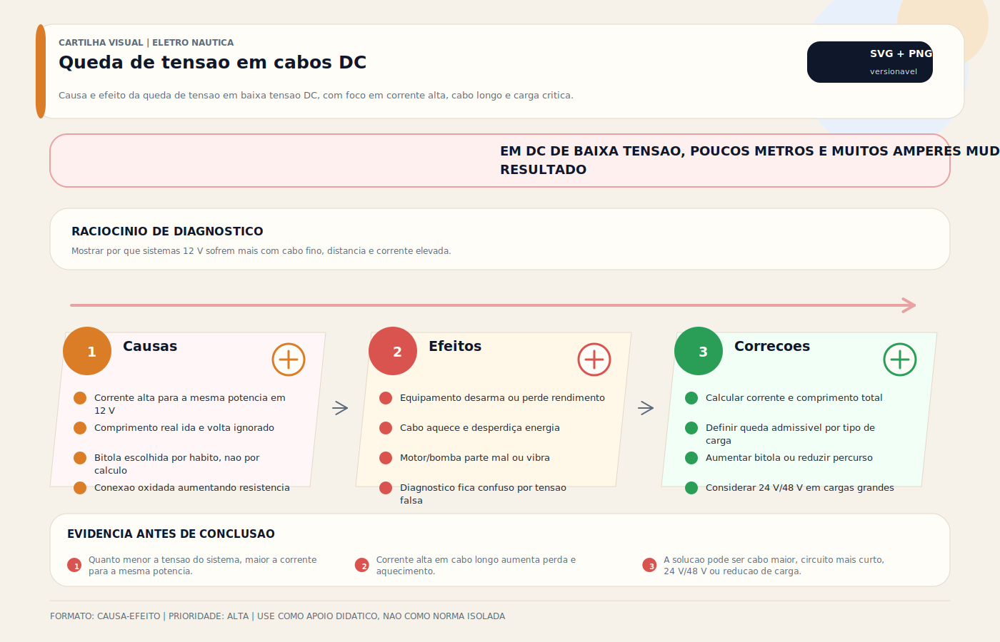

# Dimensionamento de Cabos DC — Cálculo Prático

> [!abstract] Resumo técnico
> DIMENSIONAMENTO DE CABOS DC — Como calcular a bitola correta para cada circuito DC. Um dos cálculos mais práticos e importantes da elétrica náutica — feito errado, o resultado é queda de tensão, superaquecimento ou incêndio.

> [!tip] Regra de decisão em 30 segundos
> 1. **Dois critérios simultâneos:** ampacidade (corrente sem superaquecer) **e** queda de tensão. **O maior AWG vence.**
> 2. **Run = ida + volta.** O negativo conduz a mesma corrente que o positivo. `L_cálculo = 2 × L_físico`.
> 3. **Limite ABYC E-11:** 3% para circuitos críticos, até 10% para cargas não-críticas. Em 12V: 0,36V / 1,2V.
> 4. **24V reduz a corrente à metade para mesma potência;** 48V reduz a 1/4. Em alta potência (thruster, inversor, BMS) a vantagem é decisiva.
> 5. **Negativo = mesma bitola do positivo.** Não negociável. Cabo desbalanceado = aquecimento localizado.
> 6. **Fusível ≤ ampacidade do cabo.** Proteção errada anula toda a boa escolha de bitola.
> 7. **Use a calculadora:** [`scripts/calc_queda_tensao_dc.py`](../scripts/calc_queda_tensao_dc.py) — aplica ambos os critérios e retorna AWG mínimo vencedor.

## O que é

Dimensionamento de cabos DC é o processo de determinar a seção transversal mínima (bitola) necessária para um condutor elétrico conduzir uma determinada corrente em um comprimento específico, mantendo a queda de tensão dentro dos limites aceitáveis e a temperatura do cabo dentro dos limites seguros.

Na prática: é escolher o AWG ou mm² correto para cada circuito da embarcação.

## Os dois critérios de dimensionamento

Um cabo deve satisfazer **ambos** os critérios simultaneamente:

**Critério 1 — Capacidade de corrente (ampacity):**

O cabo deve conduzir a corrente máxima do circuito sem superaquecer.

→ Define o AWG MÍNIMO baseado na corrente.

**Critério 2 — Queda de tensão:**

A queda de tensão ao longo do cabo não deve exceder o limite para o tipo de circuito.

→ Define o AWG MÍNIMO baseado no comprimento e na queda aceitável.

**O maior dos dois valores vence.**

## Limites de queda de tensão (ABYC E-11, 2023)

| Tipo de circuito | Faixa de projeto de referência |
| --- | --- |
| Circuitos sensíveis/críticos e alimentadores onde desempenho é determinante | Tipicamente 3% |
| Cargas gerais não críticas | Pode-se admitir valores maiores, frequentemente até 10%, conforme referencial adotado |
| Partida/propulsão intermitente | Exigem verificação específica de desempenho e recomendação do fabricante; não devem ser tratados por um número único simplista |

**Em números:**

| Sistema | 3% (críticos) | 10% (não-críticos) |
| --- | --- | --- |
| 12V | 0,36V | 1,2V |
| 24V | 0,72V | 2,4V |
| 48V | 1,44V | 4,8V |

**Por que isso importa:**

Equipamento especificado para 12V funcionando abaixo da faixa mínima do fabricante pode ter desempenho reduzido, reinicialização, aquecimento ou falha. O limite correto deve sempre ser compatibilizado com a criticidade do circuito e com a tensão mínima admissível do equipamento real.

## Fórmula de dimensionamento

**Passo 1 — Corrente do circuito:**

```jsx
I = P / V
P = potência do equipamento em Watts
V = tensão do sistema (12 ou 24V)
Se houver corrente contínua elevada, inrush relevante ou incerteza de regime, aplicar o fator apropriado ao caso em vez de assumir um único multiplicador universal
```

**Passo 2 — Comprimento do run (ida + volta):**

```jsx
L = comprimento físico × 2
(o cabo vai e volta — ambos os condutores têm resistência)
```

**Passo 3 — Resistência máxima admitida:**

```jsx
R_máx = ΔV_máx / I
ΔV_máx = 0,03 × V_sistema (para 3%)
R_máx = 0,36 / I_dim (para sistema 12V)
```

**Passo 4 — Seção mínima:**

```jsx
A_mín = (ρ × L) / R_máx
ρ = 0,0175 Ω·mm²/m (resistividade do cobre)
A_mín em mm² → converter para AWG mais próximo (acima)
```

## Tabela de referência rápida (ABYC E-11, 2023)

**Sistema 12V, queda máxima 3% (0,36V):**

| Corrente | Run 1m | Run 3m | Run 5m | Run 10m | Run 15m |
| --- | --- | --- | --- | --- | --- |
| 5A | AWG 18 | AWG 18 | AWG 16 | AWG 14 | AWG 12 |
| 10A | AWG 18 | AWG 14 | AWG 12 | AWG 10 | AWG 8 |
| 15A | AWG 16 | AWG 12 | AWG 10 | AWG 8 | AWG 6 |
| 20A | AWG 14 | AWG 10 | AWG 8 | AWG 6 | AWG 4 |
| 30A | AWG 12 | AWG 8 | AWG 6 | AWG 4 | AWG 2 |
| 50A | AWG 10 | AWG 6 | AWG 4 | AWG 2 | AWG 1/0 |

*(Valores aproximados — usar tabela completa ABYC para projetos reais)*

## Fatores de correção

**Temperatura ambiente:**

Cabos em locais quentes (casa de máquinas, próximo ao motor) têm capacidade de corrente reduzida:

- Os fatores exatos dependem da isolação, método de instalação e tabela de referência adotada
- Os valores abaixo são apenas exemplo didático de de-rating, não substituem tabela normativa do cabo
- 30°C: sem correção em muitos referenciais
- 40°C: redução moderada de ampacidade
- 50–60°C: redução relevante e frequentemente decisiva no dimensionamento

**Cabos agrupados:**

Múltiplos cabos juntos no mesmo conduíte se aquecem mutuamente:

- Agrupamento reduz a dissipação de calor e pode impor de-rating significativo
- O fator correto depende do número de condutores carregados, ventilação e método construtivo

**Aplicação:**

```jsx
Ampacidade efetiva do cabo = ampacidade tabelada × fator_temperatura × fator_agrupamento
O circuito só está adequado se a ampacidade efetiva permanecer acima da corrente de projeto
```

## Exemplos práticos

**Exemplo 1 — VHF fixo:**

```jsx
Potência: 25W transmissão → usar 25W (pior caso)
I = 25W / 12V = 2,1A → com margem: 2,6A
Run: painel a antena = 3m físico × 2 = 6m total
R_máx = 0,36V / 2,6A = 0,138 Ω
A_mín = (0,0175 × 6) / 0,138 = 0,76 mm² → AWG 16 (com margem)
```

**Exemplo 2 — Bilge pump automática:**

```jsx
Potência: 60W (5A em 12V)
I_dim = 5 × 1,25 = 6,25A
Run: painel a bilge = 4m × 2 = 8m
R_máx = 0,36 / 6,25 = 0,058 Ω
A_mín = (0,0175 × 8) / 0,058 = 2,4 mm² → AWG 14 (2,5 mm²) ✓
```

**Exemplo 3 — Motor bow thruster 3kW:**

```jsx
I = 3000W / 24V = 125A → com margem: 156A
Run: banco a thruster = 6m × 2 = 12m
R_máx = 0,72V / 156A = 0,0046 Ω
A_mín = (0,0175 × 12) / 0,0046 = 45,6 mm² → AWG 1/0 (53 mm²) ✓
Sistema 24V reduz corrente à metade vs 12V — diferença crítica em cabos de alta potência
```

**Exemplo 4 — Inversor 3000W em 48V vs 12V (comparação):**

```jsx
Em 12V: I = 3000 / 12 = 250A  → cabo 4/0 (107 mm²)  típico em 2m de run
Em 24V: I = 3000 / 24 = 125A  → cabo 1/0 (53 mm²)    em 2m de run
Em 48V: I = 3000 / 48 = 62,5A → cabo 6 AWG (13 mm²)  em 2m de run (critério ampacidade)
A diferença em peso, custo e facilidade de instalação é significativa
para potências >2kW. Barcos novos maiores adotam 48V por esse motivo.
(Valores validados por calc_queda_tensao_dc.py — ver seção abaixo.)
```

## Calculadora Python (`calc_queda_tensao_dc.py`)

O script `scripts/calc_queda_tensao_dc.py` aplica ambos os critérios (ampacidade + queda de tensão) e retorna o AWG mínimo vencedor, com warnings de contexto. Uso:

```bash
python scripts/calc_queda_tensao_dc.py \
    --potencia 3000 --tensao 24 --comprimento 6 \
    --queda-pct 3 --temperatura 50
```

Saída real (smoke test):

```
================================================================================
DIMENSIONAMENTO DC - calc_queda_tensao_dc.py
================================================================================
Potencia:         3000 W
Tensao sistema:   24 V
Corrente:         125.0 A  (com margem 25%: 156.2 A)
Run total:        12.0 m  (ida + volta)
Queda maxima:     3.0% -> 0.720 V
Temperatura:      50C (fator: 0.82)
--------------------------------------------------------------------------------
AWG recomendado:     1/0  (53.5 mm^2)
Criterio vencedor:   queda_tensao
Queda final:         0.61 V  (2.6%)
Ampacidade efetiva:  160 A
--------------------------------------------------------------------------------
Avisos:
  - Temperatura 50C aplica de-rating 0.82x na ampacidade
================================================================================
```

## Regras práticas de campo

**Quando não há tempo para calcular:**

- Use apenas como triagem inicial de campo, nunca como base final de projeto
- Validar depois por tabela/norma considerando corrente, comprimento, agrupamento, temperatura, terminal e proteção
- Em dúvida, subir bitola costuma ser mais seguro que insistir no mínimo calculado

**Nunca dimensionar pelo equipamento sem considerar o comprimento:**

Um cabo AWG 14 para 10A funciona em 3m mas não em 10m — a queda de tensão ultrapassa 3%.

## Problemas por dimensionamento incorreto

| Erro | Consequência |
| --- | --- |
| Cabo fino demais para a corrente | Superaquecimento, incêndio |
| Cabo fino demais para o comprimento | Queda de tensão — equipamento mal alimentado |
| Cabo correto, terminal subdimensionado | Ponto quente no terminal — falha prematura |
| Ignorar fator de temperatura | Cabo com capacidade menor que calculado |
| Cabo de ida correto, retorno (negativo) subdimensionado | A corrente percorre ambos — mesma bitola obrigatória |

## Boas práticas profissionais

- Sempre calcular — nunca estimar "parece igual ao que tinha"
- Dimensionar para a corrente máxima real, não para a corrente média
- O negativo deve ter a mesma bitola que o positivo — transporta a mesma corrente
- Documentar no diagrama: bitola e comprimento de cada circuito
- Ao adicionar equipamento a circuito existente: recalcular o cabo inteiro

## Quando chamar especialista

> [!danger] Situações que saem do DIY
> - Cabos principais do banco (>100 A contínuo) em embarcações com mais de uma fonte (shore + gerador + inversor + solar) — a interação entre fontes pode impor ampacidade combinada diferente do cálculo individual.
> - Sistemas com paralelismo de condutores (dois cabos em paralelo para alcançar corrente alvo) — balanceamento de impedância é crítico; assimetria gera ponto quente.
> - Dimensionamento de cabo de propulsão elétrica ou banco de lítio >200 Ah com BMS centralizado — ISO 16315, ABYC E-11 e E-30 têm requisitos específicos.
> - Substituição de cabo AC de shore power 30 A/50 A em embarcação com isolador galvânico ou transformador de isolamento — topologia da entrada afeta dimensionamento.
> - Dúvida sobre classificação "crítico vs não-crítico" (ABYC): luz de navegação e bomba de porão são sempre críticas; iluminação de cabine não é; mas cozinha moderna com indução/bomba d'água pode transitar.
>
> O critério geral: sempre que a potência × distância × temperatura combinadas colocam o cabo na zona de AWG >= 1/0, justificar via tabela normativa completa (não apenas calculadora), especialmente sob shore power compartilhado.

## Erros comuns

**Usar a corrente do equipamento sem margem:**

O equipamento pode ter corrente de pico (inrush) maior que a nominal. Reserva para corrente contínua, partida ou incerteza pode ser necessária, mas o fator deve refletir o circuito real e não uma regra fixa aplicada cegamente.

**Medir o cabo mais curto disponível:**

O comprimento do run é a distância total percorrida pelo circuito (ida + volta) — não apenas o trecho mais visível.

**Não corrigir para temperatura:**

Cabo em casa de máquinas com motor a diesel: 50–60°C. A capacidade de corrente cai 25–42%. Ignorar isso é garantia de cabo superaquecendo.

**Cabo correto, fusível errado:**

Dimensionar o cabo corretamente mas colocar fusível maior que a capacidade do cabo anula toda a proteção.

## Relação com outros sistemas

- **Fusíveis DC:** o fusível deve ser ≤ capacidade do cabo calculado
- **Cabeamento náutico:** bitola calculada deve ser especificada no pedido de cabo
- **Banco de baterias:** cabos de potência (bateria → barramento) têm as maiores correntes — exigem cálculo cuidadoso
- **Inversor:** cabo bateria → inversor pode ter corrente > 200A em sistema 12V — cabo 4/0 frequente
- **Bow thruster:** exemplo extremo de alta corrente e curto run — cálculo obrigatório

## Normas aplicáveis

- **ABYC E-11 (2023)** — critérios de ampacidade, proteção e queda de tensão para sistemas de bordo
- **ISO 13297:2020** — referência internacional para instalações elétricas em pequenas embarcações; verificar a edição vigente
- **UL 1426** — referência de construção para cabos marinhos
- **Ancor Wire Size Calculator** — ferramenta prática baseada em critérios amplamente usados no mercado

## Como ensinar este tópico

**Sequência recomendada:**

1. Dois critérios: corrente → ampacity / comprimento → queda de tensão
2. Fórmula simplificada ao vivo: calcular cabo para um circuito real (bilge pump)
3. Mostrar a tabela ABYC: como ler e interpretar
4. Erro do cabo fino para distância longa: medir queda de tensão em cabo subdimensionado
5. Fatores de correção: temperatura na casa de máquinas — demonstrar impacto prático

**Conceito-chave para fixar:**

"Não é só a corrente que define o cabo. A distância importa igualmente. Longo + fino = queda de tensão + perda de eficiência."

## FAQ

**O negativo precisa ter a mesma bitola que o positivo?**

Sim, obrigatoriamente. A corrente percorre o positivo na ida e o negativo na volta — mesma corrente, mesma resistência necessária.

**Posso usar cabo maior do que o calculado?**

Sim, sempre. Cabo maior tem menor resistência, menor queda de tensão e menor aquecimento. O único contra é o custo e o espaço físico.

**O cabo de bonding também precisa ser calculado?**

O condutor de bonding não é normalmente dimensionado pelos mesmos critérios de carga de um circuito DC de serviço. Em muitos referenciais ele é definido por seção mínima, robustez mecânica e continuidade equipotencial. O valor exato deve seguir o padrão adotado e a função esperada do sistema.

**Como calcular para sistema 24V vs 12V?**

A fórmula é igual. A diferença: para a mesma potência em Watts, a corrente em 24V é metade da corrente em 12V (I = P/V). Resultado: cabos menores em sistemas 24V para mesma potência — grande vantagem em sistemas de alta potência.

## Visual didático



Mostrar por que sistemas 12 V sofrem mais com cabo fino, distancia e corrente elevada.

**Cautela:** Este visual explica a logica. Bitola real depende de corrente, comprimento ida e volta, temperatura, agrupamento, queda admissivel e norma/fabricante.

Material de apoio: [Queda de tensao em cabos DC](../_visuals/generated/queda-tensao-cabos-dc.md)

## Integração com outras notas

- [[Dimensionamento de Banco de Baterias — Cálculo de Autonomia]]
- [[Inspeção de Cabos Terminais e Conexões]]
- [[DC vs AC — Corrente Contínua e Alternada]]
- [[Diagrama Unifilar — Documentação do Sistema Elétrico]]
- [[Fase e Neutro]]
- [[Ferramentas do Eletricista Náutico]]
- [[Lei de Ohm e Cálculos Básicos]]
- [[Leitura de Diagramas e Esquemas Elétricos]]

## Perguntas que esta nota responde

- O que é Dimensionamento de Cabos DC — Cálculo Prático em instalações elétricas náuticas?

