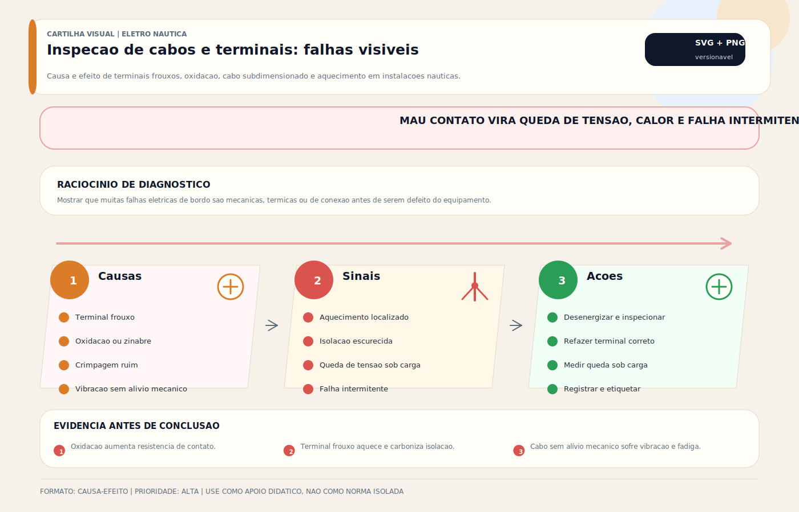

# Inspeção de Cabos Terminais e Conexões

> [!abstract] Resumo técnico
> INSPEÇÃO DE CABOS — Verificação sistemática do estado físico, elétrico e mecânico do cabeamento da embarcação. Cabos são o sistema circulatório da elétrica náutica — quando falham, tudo falha.

> [!tip] Regra de decisão em 30 segundos
> 1. **Cabo náutico = cobre estanhado (tinned copper), NÃO automotivo** — ABYC E-11 + UL 1426 + SAE J1127; cobre nu corrói por capilaridade em ambiente salino, mesmo com isolação aparentemente íntegra.
> 2. **Encordoamento flexível classe 5 ou 6 (IEC 60228)** — cabos rígidos fadigam em vibração; fios finos encordoados toleram balanço, movimento e curvatura repetida sem ruptura interna.
> 3. **Inspeção visual em 4 camadas: isolação + terminal + roteamento + fixação** — problemas de cabo aparecem em uma dessas quatro; percorrer a rota completa, não "dar uma olhada" no painel.
> 4. **Teste de tração em cada terminal** — segurar e puxar suavemente; movimento interno = crimp comprometido = recrimpar ou substituir.
> 5. **Queda de tensão sob carga real** — ABYC E-11 3% críticos / 10% não-críticos; medir V no fusível vs V no equipamento em operação. Maior que o limite = cabo subdimensionado ou oxidado internamente.
> 6. **Ponto quente sob carga = diagnóstico** — câmera termográfica ou termômetro IR; terminal ≥ 20 °C acima do entorno sinaliza mau contato ou cabo insuficiente; não ignorar.
> 7. **Isolação AC com megôhmetro 500 V anual** — IEC 60092-401 + IEC 60092-352; valor ≥ 1 MΩ entre condutor e terra em embarcação de lazer; < 100 kΩ em qualquer circuito → investigar + substituir.
> 8. **Cabos em bilge SUSPENSOS, nunca imersos** — conexões submersas estão fora de especificação; capilaridade por dentro do cabo é falha silenciosa que precede incêndio.
> 9. **Identificação obrigatória em toda extremidade** — etiqueta ou marcação numerada correspondente ao diagrama unifilar; cabo sem ID = tempo perdido em troubleshooting.

> [!danger] Quando chamar um especialista (eletricista náutico certificado / engenheiro / surveyor)
> 1. **Ponto quente persistente em cabo-tronco (banco, alternador, inverter, inversor-solar)** — corrente alta + conexão comprometida = risco iminente de incêndio; isolar o circuito, diagnosticar e refazer a conexão com terminais classe T + tubo termorretrátil adesivo + torque conforme ABYC E-11 Tabela IX.
> 2. **Deterioração generalizada em embarcação > 15 anos** — recabeamento parcial ou total exige projeto + ART; isolar, mapear, substituir por fases; surveyor avalia custo-benefício vs substituição pontual.
> 3. **Cabo AC com isolação < 1 MΩ (teste megôhmetro)** — risco de choque fatal em água; desconectar shore power imediatamente, investigar ponto de falha (não basta substituir cabo sem identificar causa: geralmente infiltração em conector ou passagem).
> 4. **Perícia pós-incêndio elétrico** — preservar cabos queimados, fotografar, não remover; laudo IBAPE/Abracem baseia seguro e responsabilização; substituir sem perícia = perda de direito indenização.
> 5. **Embarcação comercial NORMAM-201/204/205 com não-conformidade de cabeamento** — reavaliação pelo RBNA/sociedade classificadora + possível mudança de classe; DPC pode suspender certificado de navegabilidade.
> 6. **Retrofit para banco lítio exigindo upgrade de cabo-tronco** — LiFePO4 exige bitola maior + fusível classe T + conectores especiais (Mega Fuse, MRBF); cálculo dedicado ABYC E-13 + E-11.
> 7. **Medição em cabo de bateria sob carga pesada (partida motor, guincho, inverter ≥ 3 kW)** — risco de arco elétrico e queimadura; EPI classe 0 + ferramenta isolada + sequência NR-10 obrigatória para profissional brasileiro.
> 8. **Sistemas de eletrônica crítica com EMI (NMEA 2000 + radar + autopilot falhando juntos)** — cabo com shielding deteriorado ou aterramento ruim; requer técnico com instrumentação específica (analisador NMEA, osciloscópio, TDR).
> 9. **Cabos em área classificada (compartimento de motor gasolina, GLP, tanques)** — ISO 8846 (ignition protection) + IEC 60079-series; cabo não certificado nessas áreas = risco de explosão.

## O que é

Inspeção de cabos náuticos é o processo de verificação visual, tátil e instrumental do estado dos condutores elétricos da embarcação — incluindo isolação, terminais, roteamento, fixação e continuidade. É um dos serviços mais importantes e menos valorizados na manutenção náutica, pois a deterioração do cabeamento é progressiva, invisível e precede falhas graves (mau contato, curto-circuito, incêndio).

## Função

| Função | Resultado prático |
| --- | --- |
| Detecção de deterioração | Encontrar isolação rachada antes que cause curto |
| Prevenção de incêndio | Identificar sobreaquecimento por mau contato |
| Garantia de desempenho | Queda de tensão por cabo oxidado reduz eficiência |
| Proteção de equipamentos | Corrente parasita via cabo danificado queima eletrônicos |
| Base para manutenção | Identificar onde intervir nas próximas manutenções |

## Como aparece na prática

- Inspeção visual ao longo do percurso de cada cabo (bancos, bilge, painéis)
- Verificação dos terminais em cada conexão (painel, baterias, equipamentos)
- Medição de resistência e continuidade com multímetro
- Teste de queda de tensão sob carga real
- Teste de isolação com megôhmetro (cabos AC)
- Fotodocumentação do estado encontrado

## Fundamentos mínimos

**Por que cabos deterioram em embarcações:**

| Fator | Mecanismo de deterioração |
| --- | --- |
| Maresia | Penetra em microfissuras da isolação, conduz corrosão por dentro |
| Vibração do motor | Fadigas o cobre no ponto de fixação e nos terminais |
| Temperatura | Ciclos de aquecimento/resfriamento ressecam a isolação |
| Raios UV | Degradam PVC e borracha na superfície (cabos expostos) |
| Roçamento | Abrasão na isolação em borda de bulkhead, passa-fio danificado |
| Imersão em bilge | Água salgada corrói cobre não-estanhado por dentro do cabo |
| Oxidação nos terminais | Resistência cresce com a camada de óxido — gera calor |

**Cobre estanhado vs não-estanhado:**

Cabos náuticos preferem cobre estanhado (banhado em estanho) por sua maior resistência à corrosão salina. Cabos automotivos de cobre nu tendem a deteriorar mais cedo em ambiente marítimo, sobretudo quando expostos a umidade, sal e capilaridade.

**Ponto quente como diagnóstico:**

Uma conexão com resistência elevada (oxidação, aperto insuficiente) dissipa energia em forma de calor. Um terminal muito mais quente que os demais sob carga é forte indício de mau contato, embora a causa raiz ainda precise ser confirmada por inspeção e medição.

## Itens de inspeção — passo a passo

### Inspeção visual da isolação

**O que procurar:**

- Rachaduras longitudinais ou circunferenciais na isolação
- Ressecamento e endurecimento (perda de flexibilidade)
- Amolecimento ou derretimento parcial (sobreaquecimento)
- Descoloração (manchas escuras = arco elétrico ou calor)
- Cortes ou abrasão por roçamento
- Afrouxamento da isolação (deslizando sobre o cobre)

**Locais prioritários:**

- Onde o cabo passa por bulkhead ou barras metálicas
- Pontos de fixação com abraçadeiras — podem cortar a isolação
- Onde o cabo dobra em ângulo fechado (fadiga)
- Área da bilge — imersão e umidade constante

### Inspeção dos terminais

**O que procurar:**

- Oxidação verde ou branca no terminal
- Tubo de calor danificado ou ausente
- Terminal solto no cabo (o cabo gira ou puxa para fora)
- Terminal corroído na área de crimpar
- Parafuso de fixação frouxo no barramento ou equipamento
- Cobre exposto fora do terminal (isolação recuada)

**Teste de tração:**

Segurar o terminal e tracionar o cabo suavemente. O cabo não deve se mover dentro do terminal. Se mover: recrimpar ou substituir.

### Roteamento e fixação

**O que procurar:**

- Cabo sem fixação — balanço cria fadiga mecânica
- Abraçadeiras plásticas quebradas ou soltas
- Cabo passando em borda metálica afiada sem passa-fio
- Cabo sem identificação (impossível rastrear)
- Loops de cabo sem suporte (peso próprio criando tração)
- Cabos DC e AC no mesmo feixe sem separação

### Inspeção de cabos na bilge

**O que procurar:**

- Cabos imersos em água (devem estar suspensos)
- Isolação inchada ou bolhada (água penetrou)
- Conexões submersas (nenhuma deve ficar submersa)
- Cobre exposto em contato com metal da embarcação

## Medições instrumentais

**Teste de continuidade:**

```jsx
Multímetro → modo Ω ou buzzer
Desligar circuito, desconectar equipamento
Medir entre os dois extremos do cabo
Buzzer contínuo → cabo OK
OL → cabo rompido ou interrompido
```

**Teste de queda de tensão sob carga:**

```jsx
Multímetro → modo DCV
Com equipamento ligado e em operação normal
Medir tensão na saída do fusível → V1
Medir tensão nos terminais do equipamento → V2
Queda = V1 - V2
Aceitável: < 3% da tensão nominal (< 0,36V em 12V)
```

**Teste de resistência do cabo:**

```jsx
Em cabos curtos e grossos, a resistência pode ser baixa demais para um multímetro comum dar resposta confiável
Quando for necessária leitura em miliohms, usar instrumento apropriado ou método Kelvin
Em campo, o teste mais útil costuma ser queda de tensão sob carga combinada com inspeção visual/termográfica
```

**Teste de isolação AC (megôhmetro 500V):**

```jsx
Desligar e desconectar todos os equipamentos AC
Aplicar 500V DC entre cada condutor e o terra
Interpretar conforme o padrão adotado, o tipo de cabo e o estado ambiental
Valor baixo exige investigação imediata, mas o critério final não deve ser tratado como número universal fora do método de ensaio aplicável
```

## Critérios de substituição

| Condição | Ação |
| --- | --- |
| Isolação rachada com cobre visível | Substituir imediatamente |
| Isolação ressecada e quebradiça | Substituir — risco de falha próxima |
| Terminal com oxidação verde densa | Substituir terminal + limpar cabo |
| Cabo muito antigo sem histórico confiável | Inspecionar criticamente; idade isolada não substitui diagnóstico |
| Queda de tensão > 5% | Substituir por cabo de bitola maior |
| Resistência de isolação < 100 kΩ | Substituir e investigar causa |
| Cabo não-estanhado em ambiente náutico | Substituir por cabo náutico estanhado |

## Ferramentas necessárias

| Ferramenta | Uso |
| --- | --- |
| Multímetro True RMS | Continuidade, resistência, queda de tensão |
| Alicate amperímetro | Corrente sob carga sem abrir circuito |
| Megôhmetro 500V | Isolação de cabos AC |
| Câmera termográfica | Localizar ponto quente por infravermelhos |
| Lanterna + espelho de inspeção | Visualizar cabos em locais confinados |
| Alicate de crimpar ratchet | Recrimpar terminais |
| Termômetro de contato | Verificar temperatura de terminais e conexões |
| Câmera fotográfica | Documentar estado encontrado |

## Problemas mais frequentes

| Problema | Localização típica | Diagnóstico |
| --- | --- | --- |
| Oxidação interna severa | Cabos antigos na bilge | Corte do cabo → cobre escuro |
| Roçamento da isolação | Passa-bulkhead sem passa-fio | Inspeção visual, raspagem |
| Terminal crimpad solto | Qualquer circuito antigo | Tração manual |
| Conexão quente | Barramento, terminal de bateria | Câmera termográfica |
| Falha de isolação AC | Cabos próximos a fontes de calor | Megôhmetro |
| Queda de tensão excessiva | Circuitos longos ou subdimensionados | Medição DCV sob carga |

## Causas raiz

**Oxidação por cobre não-estanhado:**

Cabo automotivo (cobre nu) corrói por dentro em ambiente marítimo. Visualmente parece normal por anos, mas a resistência interna aumenta progressivamente. Causa mau contato, aquecimento, perda de potência.

**Roçamento progressivo:**

Cabo sem passa-fio adequado roca na borda do bulkhead. A cada balanço do barco, a isolação é abrasionada um pouco mais. Em anos, a isolação desaparece — curto-circuito ou incêndio.

**Fadiga por vibração:**

Cabo fixado rígido perto do motor sofre fadiga mecânica. Os fios de cobre rompem internamente sem sinal externo — aumento de resistência, calor, falha.

**Crimp mal executado:**

Crimpar com alicate errado ou força insuficiente deixa o fio parcialmente preso. Vibração afrouxa progressivamente. Resistência elétrica aumenta, gera calor, pode arco elétrico.

## Boas práticas profissionais

- Documentar o estado de todos os cabos com fotos antes e depois da inspeção
- Marcar cabos com problemas não corrigidos imediatamente para acompanhamento
- Substituir cabos automotivos por cabos náuticos estanhados sempre que possível
- Usar tubo de calor com adesivo interno em todos os terminais em áreas úmidas
- Proteger passes de bulkhead com passa-fio de borracha ou prensa-cabo
- Suspender cabos da bilge com abraçadeiras e brackets — nunca permitir imersão
- Identificar cada cabo com etiqueta numerada correspondente ao diagrama

## Cuidados durante a inspeção

- Nunca fazer inspeção de cabos AC com o sistema energizado
- Desligar o banco de baterias antes de inspecionar cabos DC em áreas de difícil acesso
- Usar luvas isolantes ao manusear cabos de alta corrente (cabos de bateria)
- Não forçar curvatura de cabos rígidos — fratura interna invisível

## Erros comuns

**Inspecionar só o que é visível:**

Os cabos mais problemáticos estão atrás de painéis, na bilge e dentro de canaletas. Inspeção superficial dá falsa segurança.

**Substituir apenas o terminal, não o cabo:**

Terminal oxidado é sinal de que o cabo adjacente também está comprometido. Substituir só o terminal e deixar 5cm de cabo oxidado é solução parcial.

**Usar isolamento com fita isolante comum:**

Fita isolante PVC comum perde adesão com calor e umidade. Em ambiente náutico, usar fita de auto-fusão (self-amalgamating) + fita PVC por cima.

**Não verificar o roteamento após manutenção:**

Ao reassemblar painéis ou acessar áreas internas, cabos são frequentemente deslocados e passam a roçar em estruturas novas. Verificar após qualquer intervenção.

**Assumir que cabo novo está OK:**

Cabo armazenado incorretamente (UV, calor) deteriora antes de ser instalado. Verificar origem e condições de armazenamento.

## Relação com outros sistemas

- **Manutenção preventiva:** inspeção de cabos é item fixo do checklist semestral
- **Troubleshooting:** muitos problemas têm origem em deterioração de cabo identificável por inspeção
- **Projeto elétrico:** inspeção revela discrepâncias entre o projeto e a instalação real
- **Bonding:** cabos de bonding também deterioram — inspecionar junto ao cabeamento principal
- **Sistemas de segurança:** cabos de alarmes e EPIRB devem receber inspeção prioritária

## Brasil x Internacional

| Aspecto | Brasil | Internacional (ABYC) |
| --- | --- | --- |
| Frequência de inspeção | Não padronizada | Semestral mínimo |
| Uso de cabo estanhado | Raro — cabo automotivo dominante | Obrigatório em instalações sérias |
| Teste de isolação (megôhmetro) | Quase inexistente | Parte da inspeção anual |
| Câmera termográfica | Raramente usada | Ferramenta padrão de inspeção profissional |
| Documentação do estado dos cabos | Inexistente | Relatório com fotos antes/depois |

## Normas aplicáveis

**ABYC — cabeamento náutico:**

- **ABYC E-11 (2023)** — AC & DC Electrical Systems on Boats: especificações de cabo (cobre estanhado, encordoamento fino), identificação por cor (cláusula 11.12), torque de terminais (Tabela IX), proteção contra roçamento (passa-fios, brackets), fixação a cada 450 mm.
- **ABYC E-2 (2020)** — Cathodic Protection: cabos de bonding exigem bitola compatível com corrente de falta + cobre estanhado para massas submersas.
- **ABYC E-9 (2019)** — DC Alternators and Chargers: bitola do cabo de saída do alternador + proteção em caso de disconnect em carga.
- **ABYC E-10 (2023)** — Storage Batteries: cabos do banco (positivo + negativo) com isolação resistente ao eletrólito + cable-tray com retenção mecânica.

**ISO — embarcações de recreio (mercado CE):**

- **ISO 13297:2020** — Small craft — Electrical systems AC & DC (sucessora de ISO 10133, unificada).
- **ISO 10133:2012** — retirada, mas relevante para embarcações construídas na vigência.
- **ISO 8846:1990** — Small craft — Electrical devices — Ignition protection: cabos em compartimento de motor gasolina exigem isolação certificada.

**IEC — embarcações comerciais (SOLAS + IEC 60092-series):**

- **IEC 60092-101** — Definitions and general requirements.
- **IEC 60092-352** — Choice and installation of electrical cables: método de dimensionamento, roteamento, agrupamento, proteção mecânica.
- **IEC 60092-353** — Power cables for rated voltages 1 kV and 3 kV.
- **IEC 60092-359** — Sheathing materials for shipboard power and telecommunication cables (HEPR, XLPE, EPR).
- **IEC 60092-376** — Cables for control and instrumentation circuits 150/250 V.
- **IEC 60228** — Conductors of insulated cables: classes de encordoamento (1-6); náutico típico classe 5 ou 6 (flexível).
- **IEC 60332-1/-3** — Tests on electric cables under fire — Flame spread (retardância); exigida em embarcação comercial.
- **IEC 60754-1/-2** — Halogen acid gas / toxicity (LSZH — Low Smoke Zero Halogen).
- **IEC 60945** — Marine navigation equipment: cabos de eletrônica marítima com requisitos EMC específicos.
- **IEC 61162-1/-2/-3 (NMEA 0183 / 2000)** — Cabos digitais marinhos: shielded twisted pair + impedância controlada + CAN bus 250 kbps (2000).

**UL / SAE — EUA:**

- **UL 1426** — Cables for Use on Boats: padrão de cabo náutico de baixa tensão (≤ 600 V); cobre estanhado obrigatório, isolação resistente a combustível e óleo.
- **UL 1309 / MIL-C-24640** — Boat/Navy shipboard cables: alta confiabilidade militar/comercial.
- **SAE J1127** — Battery Cable: cabo especificamente para banco (isolação mais espessa, resistente a eletrólito).
- **SAE J1128** — Low Voltage Primary Cable: tipos GPT, HDT, SXL, STX (automotivo/náutico leve).
- **SAE J378** — Marine propulsion system wiring: interface de ignição/partida em motor náutico (rabeta, centro-raiador).

**Brasil:**

- **ABNT NBR 5410:2004 + emendas** — Instalações elétricas de baixa tensão.
- **ABNT NBR NM 247-3** — Cabos isolados com PVC para tensões nominais até 450/750 V (adoção Mercosul).
- **NORMAM-211/DPC** — Esporte e recreio.
- **NORMAM-201/204/DPC** — Comercial / SMM (exige rastreabilidade de cabo + certificação).
- **NR-10 (MTE)** — Segurança em instalações e serviços em eletricidade (profissional brasileiro).

**Diretiva europeia:**

- **CE-RCD Directive 2013/53/EU** — Recreational Craft Directive: marcação CE exige conformidade com harmonised standards (ISO 13297 + ISO 8846 + UL 1426 ou equivalente).

## Glossário rápido

- **Abrasion protection (passa-fios, cable tray, loom)** — proteção mecânica em passagem por bulkhead e borda metálica; ABYC E-11 exige.
- **Adhesive heat-shrink (termorretrátil adesivo)** — tubo termorretrátil com cola interna que veda o terminal; padrão náutico (não usar termorretrátil seco em ambiente úmido).
- **AWG (American Wire Gauge)** — escala de bitola usada em ABYC/UL/SAE; inverso: AWG menor = cabo mais grosso. Equivalências: AWG 10 ≈ 5,26 mm², AWG 4 ≈ 21,15 mm², AWG 4/0 ≈ 107,2 mm².
- **Battery cable (ABYC E-10)** — cabo específico de banco com isolação resistente a ácido, alta flexibilidade, cobre estanhado; não confundir com SAE J1127.
- **Bonding conductor** — cabo dedicado à interligação de massas metálicas submersas (ABYC E-2); bitola mínima AWG 8 (8,37 mm²) em cobre estanhado.
- **Burnback (retrocesso de queima)** — retorno de chama ao cabeamento em caso de incêndio; IEC 60332 testa.
- **Cable gland (prensa-cabo)** — conexão mecânica estanque de cabo em painel/caixa; IP-67/68 em ambiente externo.
- **Cable tray (bandeja / canaleta)** — suporte contínuo para roteamento; exigido a cada 450 mm em cabo pesado (ABYC E-11).
- **Capilaridade em cobre nu** — água salina penetra entre os fios do encordoamento e oxida de dentro para fora; falha silenciosa característica do cabo automotivo em ambiente náutico.
- **Chafing (roçamento)** — desgaste mecânico por atrito; principal causa de falha externa de cabo.
- **Classe de encordoamento IEC 60228** — classe 1 (sólido) a classe 6 (ultra-fino flexível); náutico típico classe 5 (flexível) ou 6 (muito flexível).
- **Cobre estanhado (tinned copper)** — fios de cobre com camada de estanho eletrodeposta; resistente a corrosão salina; padrão náutico (ABYC E-11 + UL 1426).
- **Cold flow (fluência a frio)** — deformação permanente do terminal sob vibração; típico em crimp mal executado.
- **Color code ABYC E-11 (cláusula 11.12)** — vermelho positivo, preto ou amarelo negativo, verde bonding, amarelo-listra negativo (alternativo); sem cor padrão = sistema não auditável.
- **Continuity test (teste de continuidade)** — multímetro modo buzzer; < 1 Ω = OK, OL = circuito aberto.
- **Core (alma / núcleo do cabo)** — conjunto de fios condutores; monocore vs multicore.
- **Crimp ratchet tool (alicate catraca)** — alicate com catraca que só libera após crimpe completo; único alicate aceitável em terminal náutico (ABYC).
- **Dielectric grease (graxa dielétrica)** — protetor para terminal pós-limpeza; padrão: NoOx-A, Corrosion Block, Fluid Film.
- **Drain wire** — fio de dreno em cabo blindado (NMEA 0183/2000); aterrar em UMA extremidade apenas.
- **EPR / EPDM rubber** — isolação de borracha etileno-propileno; resistente a UV, ozônio, óleo; padrão IEC 60092-359.
- **Fadiga mecânica (fatigue)** — ruptura progressiva de fios internos por vibração; invisível externamente.
- **Fusível MRBF (Marine Rated Battery Fuse)** — fusível de alta AIC diretamente no polo da bateria; ABYC E-11.
- **HSA (Heat Shrink Adhesive)** — termorretrátil adesivo (padrão náutico).
- **Insulation resistance (IR)** — resistência entre condutor e terra em MΩ; teste com megôhmetro 500 V; ≥ 1 MΩ aceitável em embarcação de lazer.
- **Jacket** — capa externa do cabo (proteção mecânica/ambiental); distinta da isolação do condutor.
- **Loom (tubo corrugado)** — tubo flexível para agrupamento; apenas ordinariamente aceito (ABYC prefere cable tray).
- **LSZH (Low Smoke Zero Halogen)** — isolação que não libera halogênios tóxicos em incêndio; IEC 60754-1/-2; padrão em passageiros.
- **Lug (terminal de olhal)** — terminal com furo para parafuso; instalado com crimp ratchet + termorretrátil adesivo.
- **Megger (megôhmetro)** — instrumento de teste de isolação 250/500/1000 V DC.
- **Nominal voltage rating** — tensão máxima do cabo (600 V UL 1426 típico; 1 kV IEC 60092-353).
- **Passa-fio / Grommet** — acessório de borracha ou plástico em furo de bulkhead para proteger a isolação.
- **PVC (Polyvinyl Chloride)** — isolação mais comum; resistente a umidade mas libera HCl em incêndio; substituída por EPR/LSZH em comerciais.
- **Ratchet crimp quality** — qualidade do crimp controlada pela catraca; aceitável = cabo não gira nem puxa no terminal.
- **Shielding (blindagem)** — malha metálica em cabos de sinal (NMEA, radar, autopilot); aterrar em um ponto só.
- **Strain relief (alívio de tração)** — dispositivo mecânico que transfere força do cabo para a estrutura (não para o terminal).
- **Stranding (encordoamento)** — arranjo de fios dentro do condutor; classe IEC 60228.
- **Surveyor marítimo** — profissional homologado para emitir laudo de cabeamento pós-sinistro ou pré-venda.
- **Tape isolante de auto-fusão (self-amalgamating)** — fita que vulcaniza sozinha; uso emergencial + fita PVC por cima.
- **TDR (Time Domain Reflectometer)** — instrumento que localiza falha em cabo longo sem abrir; avançado.
- **Termografia IR** — câmera infravermelha para detectar ponto quente; padrão de inspeção semestral profissional.
- **Tinned copper stranded wire** — síntese do cabo náutico: cobre + estanho + encordoamento flexível.
- **Torque de terminal (ABYC E-11 Tabela IX)** — valor em in-lb por AWG; torquímetro obrigatório em cabo-tronco.
- **UL 1426 marking** — selo UL estampado no cabo; autenticidade verificável via website UL.
- **Voltage drop (ΔV sob carga)** — medida final da qualidade do cabo-tronco; 3% crítico / 10% geral (ABYC E-11 Tabela VI-A).
- **Wear strip (reforço mecânico)** — tecido adesivo (cloth tape, Tesa) em pontos de roçamento recorrente.
- **XLPE (Cross-Linked Polyethylene)** — isolação de polietileno reticulado; alta resistência térmica, padrão IEC 60092.

## Como ensinar este tópico

**Sequência recomendada:**

1. Mostrar corte transversal de cabo marinho vs cabo automotivo antigo (cobre verde vs cobre limpo)
2. Demonstrar roçamento: simular o efeito de 1.000 balanços em um passa-fio sem proteção
3. Medir resistência de terminal oxidado vs terminal limpo — diferença visível no multímetro
4. Inspeção ao vivo em embarcação real — achar os problemas juntos
5. Demonstrar câmera termográfica em terminal com mau contato — ponto quente visível
6. Mostrar a diferença: relatório de inspeção com fotos vs "parece estar OK"

**Conceito-chave para fixar:**

"O cabo que você não vê é o que vai te deixar na mão. Inspeção vai atrás."

## Ideias de vídeos

- **"Inspeção de cabos: o que procurar e onde"** — vídeo de campo em embarcação real
- **"Cabo automotivo vs cabo náutico: por que importa"** — corte transversal, teste de corrosão
- **"Câmera termográfica na inspeção elétrica náutica"** — casos reais de ponto quente
- **"Como detectar queda de tensão no seu barco"** — medição ao vivo com multímetro
- **"Os 5 sinais que seu cabeamento precisa de atenção"** — inspeção visual simplificada

## Diagramas sugeridos

- Mapa de pontos de inspeção prioritária em embarcação típica (painel, bilge, motor, popa)
- Tabela de critérios de substituição: condição × decisão (OK / Monitorar / Substituir)
- Esquema de medição de queda de tensão: posição dos ponteiros do multímetro, interpretação
- Fluxo de inspeção: visual → tração manual → medição de continuidade → medição de isolação → termografia
- Comparação visual: isolação boa vs rachada vs derretida (fotos ou ilustrações)

## FAQ

**Com que frequência devo inspecionar os cabos?**

Inspeção visual básica: semestral. Medição elétrica completa: anual. Embarcações em água salgada com uso intenso: trimestral para pontos críticos (bilge, motor, painel).

**Posso usar fita isolante para corrigir isolação danificada?**

Como solução temporária de emergência: sim. Como solução definitiva: não. Substituir o trecho de cabo é a solução correta. Se usar fita, usar fita de auto-fusão + fita PVC por cima.

**Como saber se o problema é no cabo ou no terminal?**

Usar uma combinação de inspeção visual, tração mecânica, termografia e queda de tensão sob carga. Em conexões de baixa resistência, o multímetro comum nem sempre consegue separar terminal ruim de cabo ruim com precisão suficiente.

**Cabo com 10 anos deve ser substituído preventivamente?**

Depende das condições: ambiente (bilge úmida = deterioração acelerada), material (estanhado dura mais), carga (alto amperagem = mais calor = mais degradação). Inspeção instrumental decide melhor que a idade.

**É possível verificar a integridade interna do cabo sem cortá-lo?**

Sim: medição de resistência elétrica. Resistência muito alta para o comprimento e bitola indica deterioração interna (oxidação progressiva do cobre). Câmera termográfica sob carga mostra pontos quentes sem abrir o cabo.

## Visual didático



Mostrar que muitas falhas eletricas de bordo sao mecanicas, termicas ou de conexao antes de serem defeito do equipamento.

**Cautela:** Desenergize antes de apertar, limpar ou desmontar conexoes. Em AC, confirme ausencia de tensao.

Material de apoio: [Inspecao de cabos e terminais: falhas visiveis](../_visuals/generated/inspecao-cabos-terminais-falhas.md)

## Integração com outras notas

- [[Dimensionamento de Cabos DC — Cálculo Prático]]
- [[DC vs AC — Corrente Contínua e Alternada]]
- [[Diagrama Unifilar — Documentação do Sistema Elétrico]]
- [[Dimensionamento de Banco de Baterias — Cálculo de Autonomia]]
- [[Fase e Neutro]]
- [[Ferramentas do Eletricista Náutico]]
- [[Lei de Ohm e Cálculos Básicos]]
- [[Leitura de Diagramas e Esquemas Elétricos]]

## Perguntas que esta nota responde

- O que é Inspeção de Cabos Terminais e Conexões em instalações elétricas náuticas?
- Qual é a função de Inspeção de Cabos Terminais e Conexões na embarcação?
