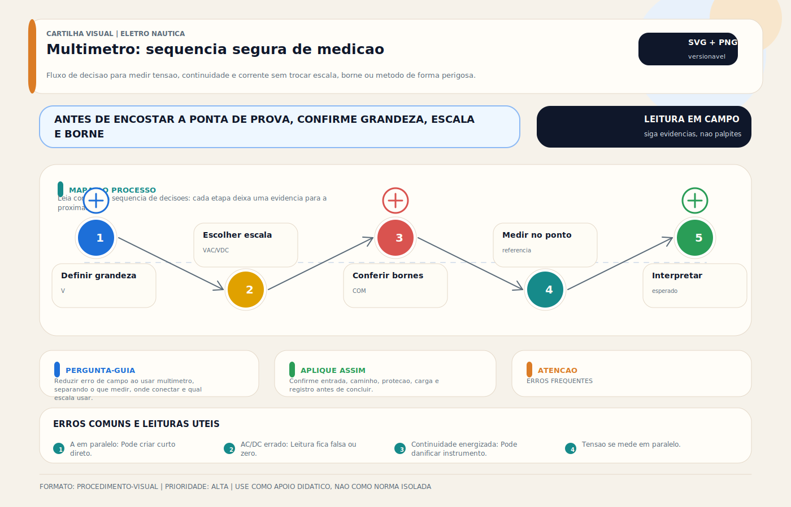

# Multímetro e Instrumentos de Medição

> [!abstract] Resumo técnico
> MULTÍMETRO E INSTRUMENTOS DE MEDIÇÃO — O instrumento de medição mais versátil e mais importante do eletricista náutico. Saber usar o multímetro corretamente é a diferença entre diagnóstico preciso e adivinhação cara.

> [!tip] Regra de decisão em 30 segundos
> 1. **Categoria de segurança (CAT) = tensão DE PICO transitória suportada, não nominal** — IEC 61010-1; CAT III 600 V protege em circuito até 600 V nominal com surtos até 6 kV; usar CAT II em painel AC da embarcação = risco de explosão do instrumento.
> 2. **True RMS é obrigatório em AC a bordo** — inverter, gerador e variador produzem onda não-senoidal; multímetro average-responding lê 20-40% errado em onda quadrada modificada. Para eletricista náutico profissional, True RMS não é opcional.
> 3. **Modo antes de encostar as pontas** — verificar knob + posição de ponteira (V/Ω vs A) ANTES de conectar no circuito; erro mais comum = pontos em A com knob em V queima fusível interno e pode criar arco.
> 4. **Sempre começar pela maior escala** — grandeza desconhecida vai na escala mais alta e desce até leitura estável; auto-range moderno resolve, mas não todas as funções.
> 5. **Impedância de entrada ≥ 10 MΩ (DC)** — multímetro bom não carrega o circuito; voltímetro antigo com 20 kΩ/V distorce leitura em circuitos de alta impedância (eletrônica moderna).
> 6. **Queda de tensão sob carga real > mensuração de resistência** — em cabo-tronco e terminais, medir V em ambas pontas COM corrente passando é mais confiável que modo Ω (resolução 0,01 Ω).
> 7. **Continuidade (buzzer) ≠ baixa resistência** — buzzer dispara até ~50 Ω típico; cabo parcialmente rompido pode "fazer bip" mas entregar queda de tensão excessiva sob carga.
> 8. **Corrente DC só com alicate amperímetro (Hall effect) no cabo-tronco** — inserir multímetro em série em banco de 200 A abre o fusível de 10 A do instrumento e cria arco; alicate Hall lê sem abrir o circuito.
> 9. **Megôhmetro para isolação AC, NÃO multímetro** — teste de isolação exige 500 V DC aplicado; multímetro em modo Ω aplica ≤ 9 V e NÃO detecta falha progressiva de isolação (IEC 60092-401).

> [!danger] Quando chamar um especialista (técnico com instrumentação avançada)
> 1. **Diagnóstico de inverter/inversor-carregador com distorção harmônica** — analisador de qualidade de energia (Fluke 435, Hioki PQ3198) mede THD, harmônicas, flicker; multímetro comum não vê o problema.
> 2. **Medição de corrente de fuga a terra (< 30 mA)** — alicate amperímetro de corrente diferencial (Fluke 368) em cabo de terra; corrente residual acima do RCD dispara a proteção em shore power.
> 3. **Teste de isolação AC sistema inteiro (500/1000 V)** — megôhmetro IEC 60092-401; sem isso não há comissionamento nem renovação de certificado comercial.
> 4. **Teste de continuidade de bonding em embarcação de casco metálico** — miliohmímetro Kelvin (4 fios) mede < 100 mΩ com precisão; multímetro comum mostra "0,3 Ω" sem confiança.
> 5. **Análise térmica em painel AC energizado** — câmera termográfica + training NFPA 70E / NR-10; detecta conexão ruim em tempo real sem desenergizar.
> 6. **Medição em circuito de alta corrente com onda não-senoidal (motor de partida, guincho, truster)** — osciloscópio + sonda de corrente Hall (Rogowski coil) + shunt calibrado; engenharia de potência.
> 7. **Certificação INMETRO / RBC de instrumento** — multímetro usado em perícia técnica ou certificação exige calibração rastreável (laboratório acreditado pela RBC); sem certificado = laudo contestável.
> 8. **Diagnóstico de rede NMEA 2000 com falha intermitente** — analisador de rede CAN dedicado (Maretron N2KAnalyzer, Actisense NMEA Reader) + terminador 120 Ω; multímetro não basta.
> 9. **Perícia pós-choque elétrico / acidente** — IBAPE/Abracem com instrumentação rastreável; multímetro doméstico em perícia = fraqueza processual.

## O que é

O multímetro é um instrumento eletrônico que mede múltiplas grandezas elétricas — tensão (AC e DC), corrente (AC e DC), resistência, continuidade, diodo e, em modelos avançados, capacitância, frequência e temperatura. Em elétrica náutica, é a ferramenta de diagnóstico mais usada em campo.

## Tipos de multímetro

**Multímetro analógico (ponteiro):**

- Leitura por ponteiro em escala impressa
- Útil para visualizar variações (ponteiro se move com a grandeza)
- Menos preciso que digital para leituras pontuais
- Raramente usado profissionalmente hoje

**Multímetro digital (DMM):**

- Leitura numérica no display
- Preciso, fácil de ler
- Padrão atual para qualquer trabalho elétrico profissional

**Multímetro True RMS:**

- Tipo especial de digital que calcula o valor RMS real da forma de onda
- Essencial para medições AC em sistemas com inversores, variadores e distorção harmônica
- Modelos não-True RMS medem corretamente apenas formas de onda próximas da senoidal ideal
- Para trabalho náutico profissional, é a opção mais prudente como padrão de ferramenta

## Categorias de segurança (CAT)

| Categoria | Aplicação | Tensão máxima |
| --- | --- | --- |
| CAT I | Eletrônicos protegidos | 150V |
| CAT II | Tomadas domésticas, equipamentos portáteis | 300V |
| CAT III | Painéis de distribuição, instalações fixas | 600V |
| CAT IV | Entrada de energia, cabos externos | 1000V |

**Para trabalho náutico:**

- Sistema DC (12/24V): CAT II é suficiente
- Sistema AC (shore power, gerador): mínimo CAT III 600V
- Nunca usar multímetro CAT I em circuito AC de 220V — risco de explosão do instrumento em sobretensão

## Funções e como usar cada uma

### Tensão DC (VDC)

```
Configuração: modo DCV, escala acima da tensão esperada (ex: 20V para sistema 12V)
Conexão: preto no negativo (−), vermelho no ponto positivo a medir
Resultado: tensão em relação ao negativo (GND)
Aplicação: verificar carga da bateria, tensão no equipamento, queda de tensão
```

**Leituras de referência para sistema 12V:**

- Só fazem sentido com química conhecida e bateria em repouso
- Em chumbo-ácido, 12,6–12,8V costuma indicar carga elevada; 12,0V já representa bateria bastante descarregada
- Durante carga, tensões na faixa de absorção/float dependem de química, temperatura e configuração do carregador
- Tensão alta isoladamente não basta para diagnosticar falha; é preciso comparar com o setpoint esperado do equipamento

### Tensão AC (VAC)

```
Configuração: modo VAC, escala 200V ou 600V (para 220V)
Conexão: preto em neutro ou terra, vermelho na fase
Resultado: tensão eficaz (RMS)
Aplicação: verificar shore power, saída de gerador/inversor
```

**Leituras normais:**

- 220V ± 10% (198–242V) → OK na marina
- < 190V → subtensão — problema na marina ou no cabo
- 

    > 250V → sobretensão — risco para equipamentos
    > 

### Corrente DC (ADC) — ponteira em série

```
⚠️ ATENÇÃO: modo corrente exige abrir o circuito e inserir o multímetro em SÉRIE
Configuração: modo ADC, selecionar escala adequada (ex: 10A)
Conexão: inserir o multímetro em série no circuito positivo
Fusível de proteção do multímetro: verificar o fusível interno antes
Aplicação: medir correntes pequenas de stand-by, consumo preciso em bancada ou ramos específicos
```

**Corrente de stand-by (consumo em repouso):**

```
Desligar os circuitos conhecidos e garantir que a corrente esperada está dentro da faixa do instrumento
Inserir o multímetro em série apenas em circuitos de baixa corrente ou usar alicate/shunt para o banco principal
Consumo de repouso aceitável depende da embarcação; alarmes, monitores e roteadores podem justificar correntes permanentes
```

### Resistência (Ω)

```
Configuração: modo Ω, circuito completamente desligado e desconectado
Conexão: preto e vermelho nos dois pontos a medir
Resultado: resistência em ohms
Aplicação: testar fusível, continuidade de cabo, resistência de terminal
```

**Leituras de referência:**

- Fusível OK: < 1Ω
- Fusível queimado: OL (overload — circuito aberto)
- Em cabos curtos, a resistência é muito baixa e pode ficar abaixo da confiabilidade prática do multímetro comum
- Para cabos e terminais de potência, o método mais útil em campo costuma ser medir queda de tensão sob carga

### Continuidade (buzzer)

```
Configuração: modo buzzer (ícone de som)
Conexão: igual ao modo Ω
Resultado: bipe sonoro se resistência < 30–50Ω (depende do modelo)
Aplicação: verificar continuidade de cabo, confirmar que fusível está OK, rastrear circuito
Vantagem: não precisa olhar o display — o som indica continuidade
```

### Diodo

```
Configuração: modo diodo
Conexão: vermelho no anodo, preto no catodo
Resultado: queda de tensão do diodo (0,5–0,7V para diodo de silício)
Se OL: diodo invertido (ou aberto)
Se 0V: diodo em curto
Aplicação: verificar diodos de isolamento de bancos, retificadores de alternador
```

## Medição de queda de tensão — técnica prática

**Medir queda de tensão em um cabo sob carga:**

```
1. Equipamento ligado e em operação (carga presente)
2. Preto na extremidade onde o cabo sai da fonte (ex: barramento)
3. Vermelho na outra extremidade (ex: terminal do equipamento)
4. Resultado: tensão entre os dois pontos = queda de tensão no cabo
Aceitável: < 0,36V em sistema 12V (3%)
```

**Medir queda de tensão em um terminal:**

```
Preto em um lado do terminal
Vermelho no outro lado
Com corrente passando
Queda > 0,1V em terminal = mau contato
```

## Erros clássicos com multímetro

**Medir corrente no modo tensão:**

O multímetro em modo tensão tem altíssima impedância interna. Se colocado em série num circuito (como se fosse amperímetro), praticamente nenhuma corrente passa e o circuito fica aberto. Não queima o multímetro, mas não mede nada.

**Medir tensão no modo corrente:**

O multímetro em modo corrente tem baixíssima impedância. Se colocado em paralelo num circuito (como voltímetro), cria um curto-circuito. Queima o fusível interno do multímetro — e pode criar faísca.

**Usar escala abaixo da grandeza esperada:**

Colocar na escala 2V para medir 12V — o display mostra "OL" (overload). Sempre começar pela escala mais alta e ir diminuindo.

**Não verificar se está no modo certo antes de medir:**

Esqueceu no modo Ω e foi medir tensão AC de 220V → fusível interno queima / pode danificar o instrumento.

## Cuidados de uso e manutenção

- Verificar o fusível interno periodicamente (especialmente após medição de corrente em escala errada)
- Armazenar em bolsa com proteção para as pontas
- Não deixar em modo corrente quando não está medindo (risco de curto acidental)
- Verificar a bateria do multímetro — leitura instável pode ser bateria fraca
- Limpar as pontas com pano seco — contaminação por óleo ou sal afeta leituras

## Marcas recomendadas

| Marca/Modelo | Faixa de preço | Nível |
| --- | --- | --- |
| Fluke 107 | R$500–700 | Profissional acessível |
| Fluke 117 | R$1.200–1.500 | Profissional completo |
| UNI-T UT139C | R$150–200 | Bom custo-benefício |
| Brymen BM235 | R$300–400 | Excelente resolução |
| Klein MM600 | R$400–600 | Robusto, popular nos EUA |
| Genérico < R$50 | < R$50 | NÃO USAR |

## Boas práticas profissionais

- Sempre verificar o modo selecionado antes de conectar as pontas
- Começar pela escala mais alta ao medir grandeza desconhecida
- Em sistema AC: usar CAT III mínimo, verificar a categoria do instrumento
- Manter um multímetro de reserva a bordo (o principal pode cair na água)
- Usar ponteiras de qualidade — pontas ruins têm alta resistência de contato

## Como ensinar este tópico

**Sequência recomendada:**

1. Apresentar o instrumento: knobs, displays, terminais (V/Ω, COM, A, 10A)
2. Demonstrar cada modo em circuito real: tensão DC (bateria), tensão AC (tomada), resistência (fusível), continuidade (cabo)
3. Erro clássico ao vivo: colocar no modo corrente e tentar medir tensão — faz o fusível queimar → lição memorável
4. Técnica de queda de tensão: medir antes e depois de um cabo sob carga
5. Corrente parasita: inserir em série, desligar equipamentos um a um
6. Exercício: dado um circuito com problema, usar o multímetro para diagnosticar

**Conceito-chave para fixar:**

"Modo errado + ponta no lugar errado = multímetro morto. Checar sempre: modo e escala antes de conectar."

## FAQ

**Por que meu multímetro mostra leitura instável?**

Bateria fraca (troca a pilha), pontas com mau contato, cabo com resistência variável. Em AC: forma de onda com harmônicas (necessita True RMS).

**Posso medir 48V com multímetro de escala 20V?**

Não — você estará acima da escala selecionada. Selecionar escala acima da tensão esperada (ex: 200V ou 600V).

**Qual a diferença prática de True RMS vs não-True RMS?**

Em circuito próximo da senóide ideal, a diferença pode ser pequena. Em saídas de inversor, cargas não lineares ou sistemas com distorção harmônica, a leitura pode ficar materialmente errada num instrumento não-True RMS. Para diagnóstico confiável de AC a bordo, o True RMS é a referência profissional.

## Visual didático



Reduzir erro de campo ao usar multimetro, separando o que medir, onde conectar e qual escala usar.

**Cautela:** Este visual nao substitui procedimento de seguranca para AC, bloqueio, verificacao de ausencia de tensao e manual do instrumento.

Material de apoio: [Multimetro: sequencia segura de medicao](../_visuals/generated/multimetro-sequencia-medicao.md)

## Normas aplicáveis

**Segurança do instrumento (IEC / UL / ABNT):**

- **IEC 61010-1:2010 + A1:2016** — Safety requirements for electrical equipment for measurement, control and laboratory use: categoria CAT I-IV, distâncias de isolação, resistência dielétrica, ensaios.
- **IEC 61010-2-030:2017** — Particular requirements for testing and measuring circuits (multímetros, alicates).
- **IEC 61010-031:2015** — Hand-held probe assemblies: pontas de prova, clipes, isolação de dedos.
- **IEC 61326-1:2020** — EMC requirements for measurement: imunidade e emissão do instrumento.
- **IEC 60529** — IP (grau de proteção contra poeira e água); IP-54 típico em multímetro de campo, IP-67 em modelos offshore.
- **ANSI/ISA S82.02.01** — Safety standard for electrical test equipment (padrão EUA paralelo a IEC 61010).
- **UL 61010-1:2012** — adoção EUA (Fluke, Klein, Ideal certificados).
- **ABNT NBR IEC 61010-1:2010** — adoção brasileira; INMETRO regulamenta via Portaria 200/2002.

**Procedimentos de medição (aplicados ao náutico):**

- **ABYC E-11 (2023)** — AC & DC Electrical Systems: procedimentos de teste pós-instalação, queda de tensão 3% críticos / 10% não-críticos, verificação de polaridade AC.
- **ABYC E-2 (2020)** — Cathodic Protection: medição de continuidade de bonding (< 1 Ω), potencial de eletrodo em água (referência Ag/AgCl ou Zn).
- **ABYC E-10 (2023)** — Storage Batteries: teste de tensão, densidade (hidrômetro), capacidade por descarga controlada.
- **ISO 13297:2020** — Small craft AC & DC: critérios de teste e inspeção.
- **IEC 60092-401** — Installation and test of completed installation: comissionamento elétrico comercial (continuidade, isolação, funcional).
- **IEC 60092-504** — Control and instrumentation on ships.

**Segurança do trabalhador:**

- **NR-10 (MTE)** — Segurança em instalações e serviços em eletricidade: instrumento adequado à categoria do circuito; EPI compatível.
- **NR-6 (MTE)** — EPI: luvas isolantes classe 0 (para trabalho até 1 kV), protetor facial arc-flash, ferramenta isolada.

**Referência complementar brasileira:**

- **NBR 5410:2004 + emendas** — Instalações elétricas de baixa tensão: verificações finais (continuidade, isolação, polaridade, funcional).
- **NBR 14039:2005** — Média tensão (referência cruzada para painéis de marina com alta potência).

## Glossário rápido

- **AC (Alternating Current)** — corrente alternada; modo VAC/ACV do multímetro mede valor RMS.
- **Accuracy (exatidão)** — especificação: ±(% leitura + dígitos). Ex: ±(0,5% + 2) em 100 V = ±(0,5 + 0,02) = ±0,52 V.
- **Alicate amperímetro (clamp meter)** — mede corrente pelo campo magnético (sem abrir o circuito); AC por CT (transformer), DC+AC por efeito Hall.
- **Analog multimeter (ponteiro)** — leitura por agulha em escala; útil para ver variação, obsoleto para leitura precisa.
- **Auto-ranging** — seleção automática da escala; conveniente mas pode demorar em leitura transitória.
- **Average responding vs True RMS** — average lê onda senoidal correta; True RMS lê qualquer forma de onda corretamente (inverter, SCR, etc.).
- **Burden voltage** — queda de tensão interna do multímetro em modo corrente; limita precisão em circuitos de baixa tensão.
- **Buzzer (continuity)** — modo sonoro; dispara em < 30-50 Ω (varia por modelo).
- **CAT I (IEC 61010)** — eletrônica protegida sem conexão à rede (150 V nominal); bancada de laboratório.
- **CAT II (IEC 61010)** — tomadas domésticas, equipamentos portáteis (300 V).
- **CAT III (IEC 61010)** — painéis de distribuição, instalações fixas (600-1000 V).
- **CAT IV (IEC 61010)** — entrada de energia, cabos externos de concessionária (1000 V+).
- **Crest factor** — razão pico/RMS de uma onda; senoidal = 1,414; onda quadrada modificada = 1 a 3+.
- **Current shunt** — resistor de precisão (mΩ) para medir corrente alta via queda de tensão; padrão em banco de bateria com monitor.
- **DC (Direct Current)** — corrente contínua; modo VDC/DCV mede tensão com polaridade.
- **DMM (Digital Multimeter)** — multímetro digital (padrão atual).
- **Display count** — resolução: 2000 counts (0-1999), 4000, 6000, 20000; mais counts = melhor resolução.
- **EMI (Electromagnetic Interference)** — interferência eletromagnética que perturba leitura; filtros digitais (True RMS modernos) mitigam.
- **Fluke 107 / 117 / 87V** — multímetros de referência profissional náutica (Fluke = benchmark do setor).
- **Frequency counter (Hz)** — modo que mede frequência de sinal AC; útil em gerador (60 Hz nominal).
- **GFCI/DR/ELCI tester** — testador diferencial dedicado (simula falta de 30 mA); complementa multímetro.
- **Ground bond tester (miliohmímetro)** — instrumento Kelvin 4-fios para < 100 mΩ com precisão (bonding).
- **High Z (high impedance input)** — entrada de alta impedância ≥ 10 MΩ; não carrega o circuito.
- **Hold button** — congela leitura no display.
- **In-rush current mode** — modo que captura pico de corrente de partida (típico em compressor AC, motor de bomba).
- **Input fuse (fusível interno)** — fusível HRC (250 V / 600 V) no caminho do ampèrímetro; HRC = High Rupture Capacity.
- **Inrush / Surge** — corrente transitória de partida; 5-8× nominal em motor; exige medição de pico.
- **Insulation test (500 V DC)** — função megôhmetro; multímetro comum NÃO faz.
- **Jaws (mandíbulas do alicate)** — abertura do clamp; tamanho limita bitola máxima do cabo.
- **Kelvin probes / Kelvin clips** — garras de 4 fios para miliohmímetro; elimina resistência de contato.
- **LoZ (Low Z / Low Impedance mode)** — modo de baixa impedância (típico 3 kΩ) que "mata" tensões fantasmas (ghost voltage) em cabo desenergizado; útil em AC.
- **MAX/MIN/AVG** — registra valores extremos e média durante a medição.
- **Megôhmetro (megger) 500 V / 1000 V DC** — instrumento para teste de isolação; distinto do multímetro.
- **Modo diodo** — aplica pequena corrente (1-2 mA) e mede queda de tensão direta; silício = 0,5-0,7 V, germânio = 0,2-0,3 V, LED = 1,6-3,5 V.
- **Multímetro True RMS (True Root Mean Square)** — calcula RMS real por amostragem + processamento digital; essencial em AC náutico.
- **NCV (Non-Contact Voltage detector)** — função de detecção sem contato; presença de fio vivo próximo à ponta.
- **Osciloscópio** — instrumento que mostra forma de onda no tempo; obrigatório em diagnóstico de ripple, harmônicas, transitórios.
- **Overload (OL no display)** — grandeza acima da escala selecionada (ou circuito aberto no modo Ω).
- **Ponta de prova categoria CAT** — ponteira categorizada igual ao multímetro; pontas baratas NÃO têm CAT certificada.
- **Ponta de prova tipo agulha (needle tip)** — penetra isolação para medição sem desfazer terminal; usar com cuidado (danifica).
- **Rangeless (Low-Ohms mode)** — escala específica para baixa resistência (faixa 0,0-10 Ω típica).
- **Relative mode (REL / Δ)** — subtrai leitura de referência (zero dinâmico); útil para cabos curtos.
- **Resolution (resolução)** — menor diferença detectável; 0,1 mV em escala 600 mV = 0,00001 V.
- **Response time** — tempo para estabilizar leitura; 0,5-2 s típico em True RMS.
- **Resistance mode (Ω)** — aplica ≤ 9 V ao circuito; NÃO substitui megôhmetro para isolação.
- **RMS (Root Mean Square)** — valor eficaz; em senoidal = pico / √2 = 0,707 × pico.
- **Safety margin (overvoltage protection)** — capacidade de sobreviver a surtos acima do nominal; CAT IV > CAT III > CAT II.
- **Sample rate** — taxa de amostragem interna; 1000 Hz típico em True RMS moderno.
- **Shunt resistor externo** — resistor calibrado (ex.: 500 A/50 mV) usado com voltímetro para medir corrente alta.
- **Ten-amp jack (10 A)** — terminal de corrente alta do multímetro; fusível HRC 10-20 A.
- **Tensão fantasma (ghost voltage)** — tensão induzida em cabo desligado por cabo adjacente energizado; LoZ elimina.
- **TRMS multi-function** — True RMS + diodo + capacitância + frequência + temperatura (termopar K); padrão profissional moderno.
- **USB logging** — multímetro com registro digital (Fluke 289, Keysight U1272A) para análise temporal.
- **VAC / VDC** — tensão AC / DC.

## Integração com outras notas

- [[DC vs AC — Corrente Contínua e Alternada]]
- [[Diagrama Unifilar — Documentação do Sistema Elétrico]]
- [[Dimensionamento de Banco de Baterias — Cálculo de Autonomia]]
- [[Dimensionamento de Cabos DC — Cálculo Prático]]
- [[Fase e Neutro]]
- [[Ferramentas do Eletricista Náutico]]
- [[Inspeção de Cabos Terminais e Conexões]]
- [[Lei de Ohm e Cálculos Básicos]]

## Perguntas que esta nota responde

- O que é Multímetro e Instrumentos de Medição em instalações elétricas náuticas?
- Quais erros comuns aparecem em Multímetro e Instrumentos de Medição?
