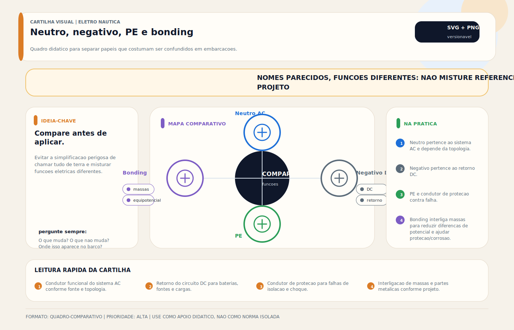

# Neutro, Negativo, Terra, PE, Bonding e DR — Diferenças Críticas

> [!abstract] Resumo técnico
> Em elétrica náutica, a maioria dos erros graves nasce quando funções diferentes são tratadas como se fossem a mesma coisa. **Neutro AC**, **negativo DC**, **PE / terra de proteção**, **terra do pier**, **bonding** e **DR** podem se tocar em certos arranjos, mas não são equivalentes. Misturá-los fora da topologia correta produz fuga de corrente por caminhos indevidos, corrosão, disparos erráticos, danos eletrônicos e incêndio. Esta nota organiza essas diferenças por função, barramento, topologia, fonte ativa e cenário prático.

> [!tip] Regra de decisão em 30 segundos
> 1. **PE ≠ Neutro ≠ Negativo DC ≠ Bonding** — cada um tem barramento, função e percurso próprios. Se eles se tocam, é **só** no ponto único previsto pelo projeto.
> 2. **"220 V" não implica neutro.** No Brasil, a maior parte das marinas entrega `L1 + L2 + PE` (fase-fase). Rebatizar um ativo como neutro é o erro que contamina PE, bonding e DC.
> 3. **Dispositivo em série apenas no verde-amarelo é quase sempre isolador galvânico** — não é DR. DR precisa dos ativos passando pelo toróide.
> 4. **Quando a topologia da marina difere da projetada a bordo**, a solução correta é reorganizar a entrada AC (transformador de isolamento), não "um DR melhor".
> 5. **Negativo DC não é terra universal.** Usá-lo como referência da entrada AC gera loop de terra, disparo errático e corrosão acelerada.

## Por que essa confusão é tão comum

Porque, no painel, vários desses elementos se parecem:

- barramentos metálicos próximos;
- cabos verdes ou verde-amarelos;
- tensões aparentemente "zeradas" em relação à carcaça;
- embarcação funcionando "normalmente" mesmo com arquitetura errada.

O problema é que **aparência de painel não define função elétrica**.

## Definições sem atalhos

### Fase

É o condutor ativo do sistema AC. Em algumas topologias existe uma fase; em outras existem dois ou mais condutores ativos.

### Neutro

É o condutor funcional de retorno em sistemas AC que realmente o possuam. Ele nasce da topologia da fonte ou de um sistema derivado. Não é criado por cor, nome, convenção local ou conveniência de instalação.

### Negativo da bateria

É a referência e o retorno funcional do sistema DC. Ele pertence ao universo de baterias, alternador, carregadores DC, BMS, iluminação DC e cargas 12/24/48 V.

### PE / terra de proteção

É o condutor de proteção do sistema AC. Sua função é conduzir corrente de falha para permitir a atuação das proteções e reduzir tensão de toque nas massas expostas.

### Terra do pier

É o **PE que vem da marina pelo cabo de shore power**. Não é "terra do planeta" dentro do barco; é o condutor de proteção da infraestrutura em terra chegando ao sistema da embarcação.

### Bonding

É a malha de equipotencialização e proteção anticorrosiva que interliga metais selecionados da embarcação e os relaciona aos ânodos e ao ponto de referência previsto pela arquitetura.

### DR / RCD / RCCB / RCBO / ELCI

São dispositivos de proteção por corrente residual. O nome varia por mercado e pelo tipo de aparelho, mas o princípio é o mesmo: monitorar a soma vetorial das correntes nos **condutores ativos** do circuito e abrir quando parte da corrente escapa por caminho não previsto.

## Quadro comparativo central

| Elemento | Universo | Função | Conduz corrente em operação normal? | Pode estar em barramento próprio? |
| --- | --- | --- | --- | --- |
| Fase | AC | alimentar carga | sim | sim |
| Neutro | AC | retorno funcional quando a topologia o prevê | sim | sim |
| Negativo | DC | retorno funcional e referência DC | sim | sim |
| PE / terra de proteção | AC | caminho de falha e controle de tensão de toque | não deveria, exceto em falha | sim |
| Terra do pier | AC / interface com marina | PE externo vindo do pedestal | não deveria, exceto em falha e pequenas correntes compatíveis com a arquitetura | integra o barramento de proteção conforme o arranjo adotado |
| Bonding | corrosão/equipotencialização | unificar potenciais entre massas metálicas selecionadas | não deveria conduzir corrente operacional | sim |
| DR / RCD | proteção | detectar corrente residual em condutores ativos | não é barramento nem retorno | não |

## A distinção que mais importa

### Neutro não é negativo

Mesmo quando ambos parecem "zero" em relação a alguma referência, eles pertencem a sistemas diferentes:

- neutro é retorno **AC**;
- negativo é retorno **DC**.

Uni-los indiscriminadamente pode contaminar o sistema DC com fenômenos AC e vice-versa.

### Neutro não é PE

Neutro conduz corrente de carga. PE não deve conduzir corrente de carga em operação normal. Quando PE começa a virar retorno, a instalação já está errada.

### PE não é bonding

PE existe para choque elétrico e caminho de falha em AC. Bonding existe para equipotencialização anticorrosiva de partes metálicas selecionadas. Eles podem convergir no ponto de referência da arquitetura, mas não são intercambiáveis.

### Terra do pier não é automaticamente "terra da embarcação"

É apenas o PE externo vindo da marina. Dependendo da solução adotada:

- pode entrar diretamente no sistema de proteção do barco;
- pode passar por **isolador galvânico**;
- pode ficar separado do sistema interno por **transformador de isolamento**.

## Barramentos: quando podem e quando não podem

### 1. Barramento de neutro

**Pode existir quando:**

- a fonte ativa realmente entrega ou deriva neutro funcional;
- a embarcação foi projetada para `L + N + PE`;
- o secundário de um transformador de isolamento/bivolt foi configurado para ter neutro;
- o gerador/inversor tem estratégia documentada de neutro.

**Não pode existir como neutro funcional de entrada quando:**

- o barco recebe apenas `L1 + L2 + PE`;
- o instalador decide chamar um dos ativos de neutro;
- o projeto não define claramente a topologia da fonte ativa.

### 2. Barramento de negativo DC

**Pode existir quando:**

- há sistema DC de bordo, o que é praticamente sempre;
- ele serve de referência para cargas DC e para medição/shunt/retornos do banco.

**Não pode ser tratado como:**

- barramento de neutro AC;
- extensão do PE;
- solução improvisada para dar "referência" ao shore power.

### 3. Barramento de PE / terra de proteção

**Pode existir quando:**

- há sistema AC;
- existe caminho de proteção das massas expostas;
- o projeto define o ponto de referência e a integração com as fontes.

**Não pode ser usado como:**

- retorno de carga;
- neutro improvisado;
- substituto do bonding.

### 4. Barramento de bonding

**Pode existir quando:**

- há conjunto de metais que exigem equipotencialização e estratégia anticorrosiva;
- o projeto define quais partes entram e quais não entram.

**Não pode ser usado como:**

- neutro AC;
- PE substituto;
- retorno "escondido" de corrente.

## Quadro de permissões e proibições

| União / vínculo | Pode? | Quando | Quando não |
| --- | --- | --- | --- |
| `neutro -> PE` | sim, às vezes | somente no ponto único previsto pela topologia da fonte ou do sistema derivado | nunca como correção improvisada de marina ou painel |
| `negativo DC -> PE` | depende da arquitetura | apenas no ponto de referência definido pelo projeto, quando a filosofia da embarcação o prevê | nunca em múltiplos pontos, nunca por chute |
| `bonding -> negativo DC` | depende da arquitetura | quando o projeto prevê convergência no ponto único de referência | nunca espalhado por todo o casco |
| `bonding -> PE` | depende da arquitetura | relação controlada no ponto definido pelo sistema | nunca como gambiarra para "dar terra" |
| `fase -> PE` | não | apenas em situação de falha elétrica, jamais como projeto | sempre proibido como solução normal |
| `L1 ou L2 -> neutro artificial` | não | não há caso legítimo sem sistema derivado corretamente criado | sempre proibido como adaptação improvisada |

## Cenários com neutro aterrado

### Cenário 1. Shore power com neutro real vindo da marina

Se a marina realmente entrega `L + N + PE`, existe neutro funcional de origem. O vínculo `N-PE` pertence à arquitetura daquela fonte e da instalação, não a uma invenção aleatória dentro do barco.

### Cenário 2. Shore power `220 V fase-fase + PE`

Aqui a entrada **não tem neutro funcional entregue**. Portanto:

- não existe "barramento de neutro de entrada" legítimo;
- um dos ativos não pode ser rebatizado como neutro;
- qualquer neutralização artificial contamina `PE`, `negativo DC` e `bonding`.

### Cenário 3. Gerador

O gerador pode criar um sistema derivado a bordo, mas a forma de tratar neutro e `N-PE` depende:

- do fabricante;
- da lógica de transferência;
- da coexistência com shore power e inversor.

### Cenário 4. Inversor / inversor-carregador

Alguns equipamentos:

- comutam neutro;
- têm relé interno de neutral-ground bond;
- mudam o comportamento conforme modo ilha ou shore assist.

Aqui não cabe improviso. Vale o diagrama do fabricante.

### Cenário 5. Transformador de isolamento / transformador bivolt

Esse é o cenário mais limpo para a realidade brasileira quando a embarcação precisa operar em topologias diferentes. O secundário pode gerar uma saída previsível e, se o projeto pedir, um neutro funcional com bond `N-PE` único e documentado.

## O caso clássico do Brasil

Barco concebido em ambiente `220 V fase-neutro` vai para marina `220 V fase-fase`.

O erro típico:

- criar barramento de neutro como se a entrada sempre trouxesse `N`;
- ligar esse barramento ao `PE`, ao negativo DC e ao bonding;
- operar como se nada tivesse mudado.

Resultado possível:

- corrente operacional no `PE`;
- DR disparando de forma errática;
- carcaças e massas com tensão anormal;
- corrosão piorada;
- danos eletrônicos;
- incêndio.

## DR nacional e europeu: o que muda de verdade

### O princípio é o mesmo

No Brasil, chamamos genericamente de **DR**. Na Europa é comum encontrar:

- **RCD**: termo guarda-chuva;
- **RCCB**: residual current circuit breaker sem sobrecorrente;
- **RCBO**: residual current + overcurrent no mesmo aparelho.

O princípio não muda: o dispositivo monitora a soma das correntes nos **condutores ativos**. A literatura técnica dos fabricantes trata o toróide envolvendo todos os condutores ativos, incluindo o neutro, **se ele existir**. Isso é incompatível com a ideia de "DR em série só no PE".

### O que o DR não faz

- não é instalado em série apenas no `PE`;
- não protege corrosão galvânica;
- não substitui disjuntor;
- não transforma fase em neutro;
- não conserta topologia errada.

## Caso de campo: dispositivo em série com o verde-amarelo em embarcação europeia

Situação comum em embarcações europeias importadas (exemplo típico: veleiros de fabricantes como Hanse, Bavaria, Beneteau, Jeanneau em entrada de shore power 230 V): um componente no painel parece "um DR" à primeira vista, mas observado em detalhe **interrompe apenas o condutor verde-amarelo** da entrada do cais.

### Leitura técnica

Se o dispositivo do painel:

- interrompe apenas os fios verde-amarelo;
- não tem os condutores ativos passando por ele para comparação vetorial;
- está associado à entrada de shore power,

a hipótese **mais provável** é **isolador galvânico** em série com o `PE` da marina, e **não DR**.

### Por que essa hipótese é a mais forte

A documentação oficial de fabricantes como a Victron descreve o **isolador galvânico** exatamente como um dispositivo instalado logo atrás da conexão de `230 V` do barco, em série com o condutor de terra do shore power, para bloquear correntes DC de baixa tensão que entram pelo earth wire da marina.

Já o DR/RCD, por definição, precisa enxergar os **condutores ativos monitorados** dentro do toróide. Se só o verde-amarelo passa por aquele componente, ele não está funcionando como DR clássico.

### O que confirma a identificação

Para afirmar sem margem, conferir em campo:

- foto do componente;
- marca/modelo;
- ligação vista no diagrama elétrico da embarcação;
- presença de botão `TEST`, marcação em `mA`, classe `A/AC/B` (DR); ou indicação explícita de "galvanic isolator".

Sem esses sinais, a conclusão correta é:

> **inferência técnica forte**: muito provavelmente isolador galvânico ou outro dispositivo ligado ao PE, e **não** um DR.

## Isolador galvânico: o que ele é e o que ele não é

### O que é

É um dispositivo instalado em série com o `PE` de shore power para bloquear correntes DC de baixa tensão associadas à corrosão galvânica, mas ainda permitir a passagem de corrente de falha em condição anormal para que as proteções atuem.

### O que ele não é

- não é DR;
- não cria neutro;
- não redefine topologia de entrada;
- não corrige marina `fase-fase` para barco que espera `fase-neutro`;
- não substitui transformador de isolamento.

### Quando faz sentido

- barco ligado com frequência a marinas;
- consumo acelerado de ânodos;
- interface direta do PE da marina com o casco/sistema de proteção;
- quando se quer solução menor e mais barata que transformador de isolamento.

### Quando não basta

- marina com topologia confusa;
- necessidade de sistema derivado previsível;
- barco circulando entre `fase-neutro` e `fase-fase`;
- demanda por isolamento galvânico robusto e limpeza total da fronteira elétrica.

## Transformador de isolamento e o cenário do neutro

A documentação oficial da Victron mostra explicitamente que, no transformador de isolamento, a ligação `N-PE` relevante pode ser criada **na saída AC do secundário**, e que existe até um jumper próprio para isso no equipamento. Ou seja: a topologia de bordo pode ser derivada e definida ali, de forma documentada, em vez de improvisada no painel.

Esse é o motivo pelo qual, no cenário brasileiro, a solução certa muitas vezes não é "um DR melhor", e sim **reorganizar a arquitetura da entrada AC**.

## Diagnóstico prático mínimo

Quando houver dúvida entre neutro, negativo, PE, terra do pier e bonding:

1. identificar qual fonte está ativa;
2. levantar a topologia esperada no diagrama;
3. medir entre condutores ativos;
4. medir relação de cada condutor com `PE`;
5. verificar se existe neutro real ou só dois ativos;
6. localizar onde está o bond `N-PE`, se existir;
7. identificar se há isolador galvânico ou transformador de isolamento;
8. localizar os barramentos de `N`, `PE`, negativo DC e bonding;
9. conferir se há múltiplas interligações indevidas.

## Quando chamar um especialista

> [!danger] Situações que não são DIY
> - Suspeita de corrente operacional no `PE` (hot earth) — pessoas na água correm risco imediato.
> - DR da embarcação disparando mesmo com todas as cargas desligadas — pode ser vazamento estrutural.
> - Casco metálico ou ânodo sumindo em ritmo anormal (semanas em vez de temporada).
> - Entrada de shore power com barramento N improvisado ou dúvida sobre onde existe o bond `N-PE`.
> - Equipamento europeu (Hanse, Bavaria, Beneteau, Jeanneau, etc.) com dispositivo no painel cujo papel não está claro no diagrama.
> - Qualquer alteração em transformador de isolamento que envolva o jumper `N-PE` do secundário.
>
> Nesses casos a análise exige diagrama elétrico completo da embarcação, medição sob carga em modo shore + gerador + inversor, e checagem do ponto único de referência. Contato com eletricista naval certificado (ABYC / ISO 13297:2020 / NORMAM-211) é o caminho seguro.

## Erros mais perigosos

- tratar `220 V` como sinônimo de `fase-neutro`;
- usar o barramento de negativo como referência improvisada da entrada AC;
- usar o bonding como retorno invisível;
- achar que todo verde-amarelo é "terra" no mesmo sentido;
- chamar qualquer aparelho do painel de DR sem analisar o que passa por ele;
- instalar isolador galvânico e vender isso como se fosse transformador de isolamento.

## Fontes e referências de apoio

- [Schneider Electric: como o RCD funciona](https://www.se.com/nz/en/faqs/FAQ000210095/)
- [ABB: RCDs](https://electrification.us.abb.com/products/circuit-breakers/residual-current-devices-rcds)
- [Victron: Galvanic Isolator](https://www.victronenergy.com/isolation-transformers/galvanic-isolator)
- [Victron: instalação do Isolation Transformer, incluindo link N-PE de saída](https://www.victronenergy.com/media/pg/Isolation_Transformer_7000W/en/installation.html)
- [[Normas e Regulamentações — Abyc Iso e Brasil]]

## Visual didático

### Diagrama base — funções separadas

Evitar a simplificacao perigosa de chamar tudo de terra e misturar funcoes eletricas diferentes.

**Cautela:** As conexoes permitidas dependem da topologia shore/gerador/inversor/transformador. Nao use este visual como diagrama de ligacao.

Material de apoio: [Neutro, negativo, PE e bonding](../_visuals/generated/neutro-negativo-pe-bonding.md)

### Analogia visual controlada — PE, Neutro, Negativo, Bonding

Spec editorial (em renderização — sprint 1 pós-Fase 4): [`_visuals/specs/ac-dc-pe-bonding-analogia.json`](../_visuals/specs/ac-dc-pe-bonding-analogia.json)

Quatro painéis em cores distintas reforçam a separação funcional, com três "erros comuns" catalogados:

1. **Verde — PE (terra de segurança):** caminho de falha AC; não conduz em operação normal.
2. **Azul — Neutro AC (retorno funcional):** carrega corrente de trabalho; no barco, sempre isolado do casco.
3. **Amarelo — Negativo DC (retorno funcional):** carrega corrente de trabalho DC; referência do banco, não terra universal.
4. **Vermelho — Bonding (equalização):** mantém massas metálicas no mesmo potencial; não é caminho de corrente de trabalho.

**Erros catalogados no visual:**

- **Erro 1** — conectar neutro AC ao bonding/casco gera corrente parasita no mar (risco elétrico para nadadores + corrosão acelerada).
- **Erro 2** — assumir negativo DC como terra de segurança: DR não detecta falha e bonding vira caminho não previsto.
- **Erro 3** — ligar bonding ao neutro para "aterrar" um equipamento inverte o papel das proteções e invalida o projeto.

> [!warning] Cautela crítica
> Conectar neutro AC ao bonding ou ao casco pode criar corrente parasita no mar (risco de corrosão acelerada e choque em nadadores). Conectar negativo DC ao PE sem critério gera loop de terra e falsos acionamentos de DR. Consultar **ABYC E-11 (2023)** e **ISO 13297:2020** antes de qualquer alteração.

## Integração com outras notas

- [[Fase e Neutro]]
- [[Aterramento]]
- [[Bonding — Sistema de Interligação de Massas]]
- [[Proteção Dr]]
- [[Isolador Galvânico / Transformador de Isolamento]]
- [[CAIS (Pier) (AC)]]
- [[Transformador Bivolt]]

## Perguntas que esta nota responde

- Qual a diferença entre neutro e negativo?
- Qual a diferença entre PE e bonding?
- O que é terra do pier?
- Quando pode existir barramento de neutro?
- Quando não pode existir barramento de neutro?
- Quando posso unir neutro e terra?
- Quando não posso unir neutro e terra?
- Quando posso unir negativo e bonding?
- O que é ponto único de referência?
- DR europeu é diferente do DR brasileiro?
- RCBO, RCCB e DR são a mesma coisa?
- DR pode ficar só no fio verde-amarelo?
- Um dispositivo no verde-amarelo pode ser o quê?
- Dispositivo em série apenas com o verde-amarelo em embarcação europeia — é DR ou isolador galvânico?
- O que faz um isolador galvânico?
- O que um isolador galvânico não faz?
- Quando preciso de transformador de isolamento?
- Quando preciso de transformador bivolt?
- Onde existe neutro aterrado?
- Onde o neutro não existe e não pode ser inventado?

## Glossário rápido

| Sigla | Expansão | Contexto |
| --- | --- | --- |
| `AC` | Alternating Current (corrente alternada) | shore power, gerador, inversor, saída de transformador |
| `DC` | Direct Current (corrente contínua) | baterias, painéis solares, alternador, BMS, cargas 12/24/48 V |
| `PE` | Protective Earth (terra de proteção) | condutor de proteção AC contra choque; não é retorno de carga |
| `N` | Neutro | retorno funcional AC quando a topologia o entrega |
| `N-PE bond` | Ligação ponto único entre neutro e PE | criada na fonte ativa ou sistema derivado (transformador de isolamento), não no painel |
| `L / L1 / L2` | Fase ativa AC | condutor ativo que alimenta a carga; em 220 V fase-fase existem dois |
| `DR` | Diferencial Residual (termo BR) | genérico para dispositivos de proteção por corrente residual |
| `RCD` | Residual Current Device | termo guarda-chuva europeu para DR |
| `RCCB` | Residual Current Circuit Breaker | RCD sem proteção contra sobrecorrente |
| `RCBO` | Residual Current Breaker with Overcurrent | RCD + disjuntor no mesmo dispositivo |
| `ELCI` | Equipment Leakage Circuit Interrupter | termo ABYC para DR de entrada de shore power (30 mA, ≤100 ms) |
| `GFCI` | Ground Fault Circuit Interrupter | DR de tomada (termo norte-americano, 5 mA) |
| `Bonding` | Interligação de massas metálicas | equalização de potencial anticorrosiva |
| `Shore power` | Alimentação AC da marina via cabo de pier | entrada externa; topologia varia por jurisdição |
| `Hot earth` | Condutor de proteção conduzindo corrente operacional | condição de falha grave; risco imediato para nadadores |
| `Sistema derivado` | Fonte AC criada a bordo (transformador isolamento, inversor, gerador) | permite definir topologia própria e ponto único de bond |

