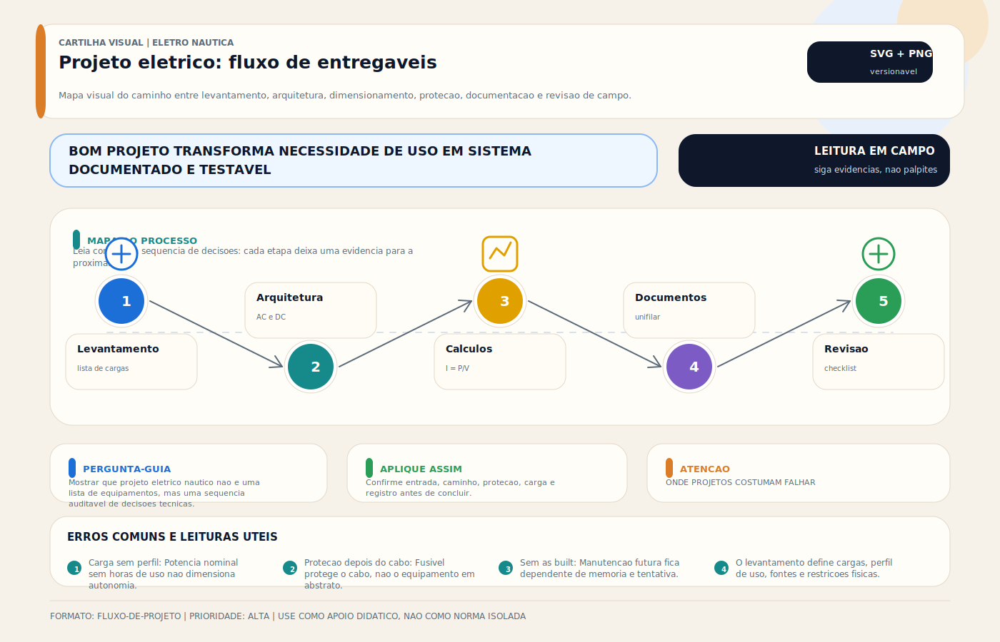

# Projeto Elétrico de Embarcação — Passo a Passo

> [!abstract] Resumo técnico
> PROJETO ELÉTRICO — Planejamento e documentação completa do sistema elétrico da embarcação antes da execução. A diferença entre um sistema confiável e um sistema problemático começa aqui.

## O que é

Projeto elétrico náutico é o conjunto de documentos técnicos que descrevem, dimensionam e organizam todos os sistemas elétricos de uma embarcação — antes da instalação. Inclui levantamento de cargas, dimensionamento de cabos e proteções, seleção de equipamentos, diagrama unifilar, diagrama de bonding e layout de instalação.

Em embarcações de recreio no Brasil, a maioria das instalações é feita sem projeto formal — o que explica a alta incidência de problemas, reformas e riscos de incêndio.

## Função

| Função | Resultado prático |
| --- | --- |
| Documentação | Registro de toda a instalação para manutenção futura |
| Dimensionamento | Cabos e proteções corretos desde o início |
| Planejamento | Evita retrabalho e adaptações improvisadas |
| Segurança | Identificação de riscos antes da execução |
| Base para auditoria e perícia | Facilita interface com seguradora, survey e reforma controlada |
| Referência para diagnóstico | Facilita troubleshooting futuro |

## Como aparece na prática

- Planilha de carga (load list) com todos os consumidores
- Diagrama unifilar AC e DC
- Diagrama de bonding
- Especificação de cabos por circuito (bitola, comprimento, tipo)
- Especificação de proteções (fusíveis, disjuntores, valores)
- Layout de instalação (onde cada painel, bateria, gerador fica)
- Documentação da topologia de aterramento, bonding e pontos de conexão entre sistemas quando aplicável

## Fundamentos mínimos

**Sequência lógica do projeto:**

```jsx
1. Levantamento de cargas (o que vai existir no barco)
       ↓
2. Análise de perfil de uso (o que fica ligado ao mesmo tempo e por quanto tempo)
       ↓
3. Dimensionamento do banco de baterias (capacidade necessária)
       ↓
4. Dimensionamento do sistema de geração/carregamento
       ↓
5. Dimensionamento de cabos (corrente, queda de tensão, temperatura)
       ↓
6. Especificação de proteções (fusíveis e disjuntores)
       ↓
7. Diagrama unifilar
       ↓
8. Layout físico
       ↓
9. Lista de materiais
```

**Queda de tensão de projeto:**

- Circuitos críticos ou sensíveis costumam ser tratados em faixa mais conservadora
- Cargas gerais podem admitir quedas maiores, conforme o padrão adotado e a tolerância do equipamento
- Circuitos de partida e outras cargas transitórias exigem verificação específica de desempenho, e não apenas um número genérico

**Cálculo de bitola de cabo:**

```jsx
I = P / V (corrente em amperes)
R_máx = (ΔV_máx) / I (resistência máxima admitida)
Comprimento = ida + volta (dobrar comprimento físico)
Seção = (ρ × L) / R_máx
ρ (cobre) = 0,0175 Ω·mm²/m
```

## Características de um bom projeto

| Item | Requisito |
| --- | --- |
| Levantamento de cargas | Completo — cada consumidor com potência e horas/dia |
| Perfil de uso | Realista — não somar tudo como se ligasse ao mesmo tempo |
| Dimensionamento de banco | Autonomia coerente com a missão, o perfil de uso e a estratégia de recarga |
| Dimensionamento de cabos | Por cálculo, não por "costume" |
| Proteções | Fusível em cada circuito, no positivo, próximo ao barramento |
| Documentação | Legível, atualizada, a bordo |
| Revisão | Prevista — sistema elétrico evolui com o barco |

## Etapas detalhadas

**Etapa 1 — Levantamento de cargas:**

| Equipamento | Potência (W) | Tensão | Horas/dia | Wh/dia |
| --- | --- | --- | --- | --- |
| Piloto automático | 20–80W | 12V | 8h | 160–640 |
| VHF | 6W (RX) / 25W (TX) | 12V | 8h RX / 0,5h TX | 60,5 |
| GPS/Chartplotter | 15–25W | 12V | 8h | 120–200 |
| Radar | 30–50W | 12V | 4h | 120–200 |
| Bomba de porão | 5A × 12V = 60W | 12V | 0,25h | 15 |
| Iluminação LED total | 30–60W | 12V | 5h | 150–300 |
| Geladeira DC | ~40W médio (ciclo) | 12V | contínuo (duty ~40%) | 400–800 |
| **Total típico veleiro** |  |  |  | **1.000–2.200 Wh/dia** |

**Etapa 2 — Dimensionamento do banco:**

```jsx
Consumo diário: 1.000 Wh/dia (exemplo)
Autonomia desejada: 2 dias sem recarga
Consumo total: 2.000 Wh
DOD máximo recomendado: 50% (chumbo-ácido) / 80% (LiFePO4)
Capacidade banco chumbo-ácido: 2.000 / 0,5 = 4.000 Wh ÷ 12V = 333 Ah
Capacidade banco LiFePO4: 2.000 / 0,8 = 2.500 Wh ÷ 12V = 208 Ah
```

## Ferramentas de projeto

- **Planilha Excel / Google Sheets** — levantamento de cargas e cálculo de banco
- **CAD elétrico (QElectroTech, EPLAN, AutoCAD Electrical)** — diagrama unifilar profissional
- **Victron VictronConnect / VRM** — monitoramento e planejamento integrado
- **ABYC DC Wiring Sizing Chart** — tabela de referência para bitola de cabos
- **Ancor Marine Wire Size Calculator** — calculadora online gratuita

## Documentos que o projeto deve incluir

- **Load List (Planilha de cargas)** — todos os consumidores com potência, tensão e horas de uso
- **Battery Bank Sizing (Dimensionamento do banco)** — cálculo de capacidade e autonomia
- **Charging System Sizing (Sistema de geração)** — alternador, carregador, painel solar, gerador
- **Cable Schedule (Lista de cabos)** — circuito, bitola, comprimento, tipo, fusível
- **Single Line Diagram (Diagrama unifilar)** — esquema elétrico simplificado AC e DC
- **Bonding Diagram** — interligação de todas as massas metálicas
- **Equipment List** — especificação de cada equipamento instalado

## Problemas por falta de projeto

| Consequência | Causa típica |
| --- | --- |
| Incêndio elétrico | Cabo subdimensionado sem fusível adequado |
| Banco descarregando rápido | Consumo real maior que o estimado sem levantamento |
| Equipamentos queimando | Proteções erradas ou ausentes |
| Cabos superaquecendo | Queda de tensão excessiva por bitola insuficiente |
| Dificuldade de manutenção | Sem documentação — técnico não sabe o que é o quê |
| Corrosão acelerada | Bonding ausente por falta de planejamento |

## Causas raiz dos problemas de projeto

**Ausência total de projeto:**

Embarcações no Brasil são frequentemente montadas por intuição — "coloco um fio desse tamanho porque parece certo." Sem cálculo, sem margem, sem proteção correta.

**Projeto desatualizado:**

O projeto foi feito para a embarcação original. Com o tempo, novos equipamentos são adicionados sem revisão — banco insuficiente, cabos sobrecarregados, proteções incompatíveis.

**Projeto copiado de outro barco:**

"Esse barco igual ao meu, vou copiar o projeto." Perfis de uso, equipamentos e autonomia diferem entre embarcações aparentemente iguais.

## Diagnóstico (auditoria do sistema existente)

**Para embarcações sem projeto:**

```jsx
1. Fotografar todo o sistema existente (painel, baterias, distribuidores)
2. Medir corrente em cada circuito com alicate amperímetro (carga normal de uso)
3. Verificar bitola dos cabos existentes (comparar com corrente medida)
4. Identificar fusíveis/disjuntores existentes e seus valores
5. Medir queda de tensão em cabos críticos (motor de partida, bomba principal)
6. Documentar o que foi encontrado → gerar retroengenharia do projeto
```

## Boas práticas profissionais

- Iniciar qualquer novo projeto ou reforma com levantamento de cargas completo
- Usar perfil de uso realista — não máximo teórico
- Dimensionar banco com reserva de projeto compatível com envelhecimento, incerteza de uso e criticidade da missão
- Documentar o projeto com revisão datada
- Manter cópia do projeto a bordo (pasta física + digital)
- Revisar o projeto sempre que um equipamento novo for instalado
- Usar norma ABYC como referência técnica (tabelas de bitola, proteção, etc.)

## Cuidados ao executar sem projeto

**Se não houver projeto formal:**

- Ao menos fazer levantamento de cargas informal
- Seguir regra prática: fusível ≤ capacidade do cabo, não da carga
- Usar bitola sempre acima do calculado por corrente (margem de temperatura)
- Documentar o que foi instalado mesmo que de forma simples

## Erros comuns

**Projetar por kVA total sem perfil de uso:**

Somar todas as cargas como se ligassem ao mesmo tempo gera banco superdimensionado e sistema sobredimensionado. Perfil de uso realista é mais útil.

**Não incluir cargas de partida (inrush):**

Motor de ar-condicionado na partida puxa 5–8× a corrente nominal. Sem considerar isso, o fusível geral é subdimensionado.

**Esquecer as cargas parasitas:**

Relés, displays em standby, eletrônicos em modo espera, carregadores de celular — somam 50–200W que ficam ligados o dia todo. Impacto real no banco.

**Projeto em papel que não sai do escritório:**

Projeto impecável que nunca chega ao barco. Manter documentação acessível a bordo é parte do projeto.

**Não incluir plano de manutenção:**

O projeto deve indicar quando inspecionar cabos, terminais, baterias, fusíveis. Sem isso, o sistema se deteriora sem intervenção.

## Relação com outros sistemas

- **Banco de baterias:** dimensionamento é o coração do projeto
- **Diagrama unifilar:** documento derivado do projeto
- **Bonding:** parte integrante do projeto elétrico
- **Painel de distribuição:** resultado do dimensionamento de circuitos
- **Todos os sistemas:** o projeto é o documento que os integra

## Brasil x Internacional

| Aspecto | Brasil | Internacional |
| --- | --- | --- |
| Projeto obrigatório | Não (embarcações de recreio) | Recomendado (ABYC) / Obrigatório (certificação Lloyd's, BV) |
| Profissionais que fazem projeto | Minoria | Padrão em instalações sérias |
| Documentação a bordo | Rara | Comum em embarcações certificadas |
| Ferramentas de projeto | Planilha Excel improvisada | Software dedicado |
| Auditoria pós-instalação | Inexistente | Inspeção por seguradora em embarcações novas |

## Normas aplicáveis

- **ABYC E-11 (2023)** — tabelas de bitola, queda de tensão, proteção (referência técnica mais usada)
- **ABYC E-2 (2020)** — bonding (parte do projeto)
- **ISO 13297:2020** — sistemas elétricos AC e DC em pequenas embarcações (sucessora de ISO 10133)
- **NORMAM-211 (2022 rev. aplicável via DPC)** — enquadramento regulatório brasileiro para amadores, embarcações de esporte e recreio e universo correlato
- **ABNT NBR 5410 (2004 + emendas)** e família **ABNT/IEC** aplicável — referências complementares para princípios de baixa tensão, identificação e proteção
- **IEC 60092 (edição a verificar)** — Electrical installations in ships (referência internacional)

## Como ensinar este tópico

**Sequência recomendada:**

1. Mostrar embarcação real sem projeto — cabeamento caótico, fusíveis errados, banco subdimensionado
2. Iniciar levantamento de cargas ao vivo — cada equipamento, cada hábito de uso
3. Calcular banco necessário com fórmula simples
4. Gerar primeiro diagrama unifilar simplificado juntos
5. Discutir: quanto custaria um incêndio elétrico vs custo de fazer o projeto

**Conceito-chave para fixar:**

"Projeto não é burocracia — é a diferença entre um barco confiável e um barco que te deixa na mão (ou pior)."

## Ideias de vídeos

- **"Por que 90% das embarcações no Brasil não têm projeto elétrico"** — realidade do mercado
- **"Como fazer o levantamento de cargas do seu barco"** — planilha passo a passo
- **"Dimensionando banco de baterias do zero"** — cálculo prático, sem fórmula complicada
- **"Auditoria elétrica: como encontrar os problemas antes que eles te encontrem"** — checklist ao vivo em embarcação real
- **"Projeto elétrico náutico: do levantamento ao diagrama"** — série completa

## Diagramas sugeridos

- Fluxo do projeto: levantamento → banco → geração → cabos → proteções → diagrama → layout
- Template de Load List (planilha modelo com todas as colunas necessárias)
- Exemplo de diagrama unifilar simplificado (DC + AC com legenda clara)
- Fórmula visual de dimensionamento de banco: consumo × autonomia ÷ DOD = capacidade

## FAQ

**Preciso de engenheiro para fazer o projeto?**

Para embarcações de recreio, não há exigência legal de ART. Mas um projeto feito por profissional qualificado (eletricista náutico ou engenheiro especializado) tem muito mais valor em caso de sinistro ou venda.

**O projeto precisa ser refeito se eu mudar equipamentos?**

Sim, sempre que equipamentos forem adicionados ou substituídos. Um projeto desatualizado é pior que nenhum — dá falsa segurança.

**Existe software gratuito para projeto elétrico náutico?**

QElectroTech é gratuito e serve para diagramas unifilares. Para dimensionamento, uma planilha bem organizada no Excel/Sheets resolve. Software dedicado como o da Victron (para sistemas Victron) é gratuito.

**Qual é o erro mais caro por falta de projeto?**

Incêndio elétrico. Segundo estatísticas da BOAT/US (EUA), problemas elétricos são a principal causa de incêndio a bordo — e a maioria é prevenível com projeto adequado.

**Como fazer retroengenharia do projeto de uma embarcação sem documentação?**

Fotografar todo o sistema, medir correntes com alicate amperímetro, identificar bitolas, mapear fusíveis. É trabalhoso mas viável. A partir daí, gerar o documento de retroengenharia e atualizar com cada intervenção.

## Visual didático



Mostrar que projeto eletrico nautico nao e uma lista de equipamentos, mas uma sequencia auditavel de decisoes tecnicas.

**Cautela:** Este fluxo e uma estrutura editorial e didatica. O projeto real deve considerar normas aplicaveis, manual dos fabricantes, vistoria e condicoes da embarcacao.

Material de apoio: [Projeto eletrico: fluxo de entregaveis](../_visuals/generated/projeto-eletrico-fluxo-entregaveis.md)

## Integração com outras notas

- [[Tipos de Embarcação]]
- [[DC vs AC — Corrente Contínua e Alternada]]
- [[Diagrama Unifilar — Documentação do Sistema Elétrico]]
- [[Dimensionamento de Banco de Baterias — Cálculo de Autonomia]]
- [[Dimensionamento de Cabos DC — Cálculo Prático]]
- [[Fase e Neutro]]
- [[Ferramentas do Eletricista Náutico]]
- [[Inspeção de Cabos Terminais e Conexões]]

## Perguntas que esta nota responde

- O que é Projeto Elétrico de Embarcação — Passo a Passo em instalações elétricas náuticas?
- Qual é a função de Projeto Elétrico de Embarcação — Passo a Passo na embarcação?

