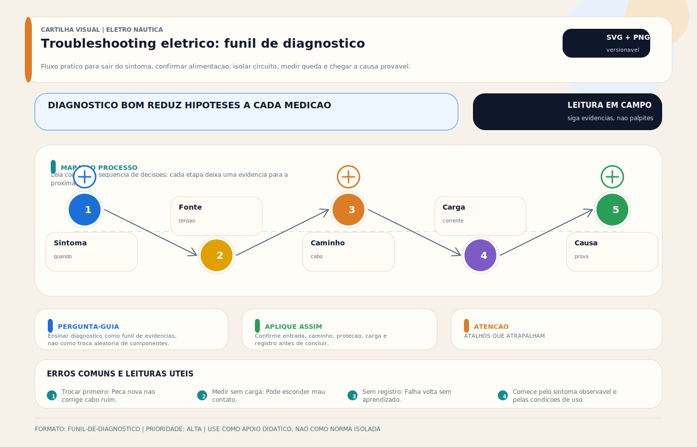

# Troubleshooting — Diagnóstico de Falhas Elétricas

> [!abstract] Resumo técnico
> TROUBLESHOOTING ELÉTRICO — Metodologia sistemática para diagnóstico de falhas elétricas a bordo. A diferença entre um profissional e um amador está no método — não na sorte.

> [!tip] Regra de decisão em 30 segundos
> 1. **Medir antes de trocar.** Toda peça substituída sem medição tem custo duplo (peça + problema persistente).
> 2. **Verificar o óbvio antes do complexo.** Fusível, disjuntor, chave geral e conexões soltas cobrem >40% das falhas.
> 3. **Método da metade (divide-and-conquer).** Medir na fonte → meio → fim. Cada medição elimina metade do circuito.
> 4. **Sob carga, não em circuito aberto.** Queda de tensão só aparece com o equipamento ligado consumindo.
> 5. **Documentar valores reais** — "está baixo" não é medição. `12,4V → 11,2V após 5m` é medição.
> 6. **Intermitente = registrar.** Multímetro em modo MIN/MAX, datalogger ou câmera termográfica. Memória humana é o pior sensor.

## O que é

Troubleshooting elétrico náutico é o processo sistemático de identificar, isolar e corrigir falhas em sistemas elétricos de embarcações. Envolve raciocínio lógico, uso correto de instrumentos de medição e conhecimento do funcionamento esperado de cada sistema. A abordagem correta reduz o tempo de diagnóstico de horas para minutos e evita a troca de peças boas por erro de diagnóstico.

## Princípio fundamental

**"Medir antes de trocar."**

O erro mais caro no troubleshooting é substituir peças por intuição. Uma peça trocada desnecessariamente tem custo duplo: a peça em si e o problema que continuou sem ser resolvido.

## A metodologia em 6 passos

**Passo 1 — Coletar informações:**

```jsx
O que falhou exatamente?
Quando começou?
O que mudou antes da falha?
A falha é intermitente ou constante?
Acontece sempre ou em condições específicas? (mar agitado, chuva, motor ligado)
Alguém mexeu no sistema recentemente?
```

**Passo 2 — Verificar o óbvio primeiro:**

```jsx
Fusível queimado?
Disjuntor desarmado?
Chave geral ligada?
Bateria carregada?
Conexão solta visível?
```

**Passo 3 — Testar o sistema, não o componente:**

```jsx
O problema está isolado ou afeta múltiplos equipamentos?
Se múltiplos equipamentos no mesmo circuito → problema no barramento ou fusível geral
Se apenas um equipamento → problema no equipamento ou no seu circuito específico
```

**Passo 4 — Dividir o circuito (método da metade):**

```jsx
Medir na fonte → OK?
  Sim → medir após o fusível → OK?
    Sim → medir após o interruptor → OK?
      Sim → problema no equipamento ou no retorno
    Não → fusível ou interruptor com problema
  Não → problema na fonte (bateria, alternador, barramento)
```

**Passo 5 — Medir, não adivinhar:**

```jsx
Usar multímetro para confirmar cada hipótese
Não substituir sem medir
Documentar cada medição
```

**Passo 6 — Corrigir e verificar:**

```jsx
Corrigir o problema identificado
Testar o sistema completo
Verificar que o problema original foi resolvido
Verificar que não foram criados novos problemas
Documentar a correção
```

## Ferramentas de diagnóstico

| Ferramenta | Para que serve |
| --- | --- |
| Multímetro True RMS | Tensão, resistência, continuidade e medições básicas de corrente em baixa intensidade |
| Alicate amperímetro DC/AC | Corrente sem abrir circuito |
| Megôhmetro 500V | Resistência de isolação de cabos AC |
| Testador de fusíveis | Verificar fusível sem remover (continuidade com carga) |
| Câmera termográfica | Detectar ponto quente (sobreaquecimento) |
| Osciloscópio portátil | Diagnosticar problemas de sinal em NMEA, VHF |
| Testador de bateria | Teste de carga interno (CCA real) |

## Falhas mais comuns e diagnóstico

**Equipamento não liga:**

```jsx
Verificar:
1. Fusível queimado → substituir
2. Disjuntor desarmado → rearmar e observar
3. Tensão no terminal do equipamento sob carga → se abaixo da faixa mínima do fabricante ou anormal em relação à fonte, investigar circuito
4. Continuidade do circuito → multímetro em Ω, desconectar equipamento
5. Equipamento em si → testar em outro circuito ou na bancada
```

**Fusível queima repetidamente:**

```jsx
NUNCA substituir por fusível de maior amperagem.
Diagnóstico:
1. Medir corrente do circuito (alicate amperímetro) → se > valor do fusível = sobrecarga real
2. Verificar resistência do circuito (Ω) → baixo = curto-circuito
3. Inspecionar cabo em busca de roçamento ou dano de isolação
4. Verificar equipamento (motor travado = alta corrente)
```

**Bateria descarregando rápido:**

```jsx
1. Medir corrente parasita (consumo em standby, motor desligado):
   - Preferir alicate de baixa corrente, monitor com shunt ou inserção em série apenas em circuitos de baixa corrente e dentro do limite do instrumento
   - Desligar equipamentos um a um — quando a corrente cair, o ramo suspeito foi localizado
   - O valor aceitável depende da embarcação; eletrônicos embarcados, roteadores, alarmes e monitores podem justificar consumos permanentes que precisam estar documentados

2. Teste de capacidade:
   - Aplicar método compatível com a química da bateria
   - Em chumbo, usar descarga controlada até tensão terminal definida para o ensaio
   - Em lítio, seguir limites do fabricante/BMS e nunca reproduzir cegamente um ensaio de chumbo-ácido
```

**Equipamento liga mas não funciona corretamente:**

```jsx
1. Medir tensão nos terminais do equipamento sob carga
   Sistema 12V → < 11,5V geralmente indica queda excessiva
   Sistema 24V → < 23,0V sinaliza queda excessiva (~4%)
   Sistema 48V → < 46,0V sinaliza queda excessiva (~4%)
   Critério exato: comparar com a faixa de operação do fabricante

2. Se queda excessiva: medir ao longo do circuito (divisão por metade)
   Bateria (12V): 12,4V
   Após fusível: 12,3V (0,1V de queda — normal)
   Após 5m de cabo AWG18: 11,2V (1,2V de queda — cabo subdimensionado!)

3. Calcular: queda esperada = I × R_cabo
   Se queda real > esperada → mau contato no percurso
```

> [!note] Critério ABYC E-11 para queda de tensão
> Circuitos **críticos** (navegação, bombas de porão, luzes de navegação): queda total ≤ **3%**. Circuitos **não-críticos** (iluminação de cabine, acessórios): queda total ≤ **10%**. Em sistemas de 12V isso equivale a 0,36V e 1,2V respectivamente. O critério é aplicado à combinação `cabo + terminais + chave + fusível`, não apenas ao cabo.

**Interferência em equipamentos eletrônicos:**

```jsx
1. Ruído em VHF ao ligar tomada USB → interferência EMI do conversor DC-DC
   Solução: afastar tomada, usar modelo com filtro EMI

2. GPS perdendo sinal ao ligar equipamento específico → interferência de RF
   Solução: blindagem, afastamento, ferrite no cabo

3. NMEA com leitura errática → loop de terra entre equipamentos
   Solução: isolar shields dos cabos NMEA, verificar aterramento de cada equipamento
```

**Motor elétrico não funciona:**

```jsx
1. Verificar tensão nos terminais do motor sob carga
   < 10,5V → problema no circuito ou no banco

2. Verificar corrente do motor:
   Se muito alta → motor travado ou sobrecarga mecânica
   Se zero → circuito aberto (fusível, relé, cabo)

3. Verificar relé (se aplicável):
   - Tensão na bobina do relé: > 11V → relé deve acionar
   - Continuidade nos contatos do relé (medição com motor desconectado)
```

## Árvore de decisão geral — funil do diagnóstico

```
[SINTOMA REPORTADO]
     │
     ▼
[Passo 1: Coletar informações]
     │  (o que falhou, quando, em que condição, o que mudou)
     ▼
[Passo 2: Verificar o óbvio]
     │
     ├── fusível aberto?  ──► trocar E investigar causa raiz
     ├── disjuntor armado? ──► rearmar E observar reincidência
     ├── chave geral ligada? ──► caminho físico completo?
     └── bateria com carga suficiente? ──► se não: tratar bateria primeiro
     │
     ▼
[Passo 3: Testar sistema, não componente]
     │
     ├── múltiplos equipamentos afetados ──► BARRAMENTO / FUSÍVEL GERAL
     └── apenas um equipamento ──► CIRCUITO ESPECÍFICO ou EQUIPAMENTO
     │
     ▼
[Passo 4: Método da metade]
     │
     ├── medir na fonte (bateria/barramento): OK?
     │     ├── sim ──► medir após proteção (fusível/disjuntor)
     │     │            ├── sim ──► medir após chave/interruptor
     │     │            │            ├── sim ──► retorno ou equipamento
     │     │            │            └── não ──► chave/interruptor
     │     │            └── não ──► fusível/disjuntor ou cabo antes
     │     └── não ──► fonte (banco, carregador, alternador, conexões do barramento)
     │
     ▼
[Passo 5: Confirmar com medição]
     │  (nunca substituir sem valor documentado)
     ▼
[Passo 6: Corrigir + verificar + documentar]
```

Esse funil transforma qualquer falha em ≤ 5 medições. A regra: **cada galho derruba metade das hipóteses**. Se o diagnóstico passou das 5 medições sem convergir, a hipótese de partida estava errada — voltar ao Passo 1.

## Diagnóstico por sintoma — referência rápida

| Sintoma | Primeiro lugar a verificar |
| --- | --- |
| Nada funciona | Bateria, chave geral, fusível principal |
| Circuito inteiro sem energia | Fusível do barramento, disjuntor do painel |
| Apenas um equipamento | Fusível do circuito, cabo, equipamento |
| Fusível queima ao ligar | Curto no equipamento ou no cabo (medir R) |
| Equipamento esquenta | Sobrecarga, subdimensionamento, mau contato |
| Bateria sempre baixa | Corrente parasita, alternador com falha, banco deteriorado |
| Tensão baixa no equipamento | Queda de tensão (cabo, mau contato, distância) |
| Alternador sem carga | Diodo de isolamento, correia, regulador |
| Ruído nos eletrônicos | EMI, loop de terra, interferência de RF |
| Alarme ativando sem razão | Sensor com falha, entrada de água no sensor |

## Quando parar e buscar especialista

> [!danger] Situações que saem do perímetro DIY
> - Suspeita de corrente no PE/verde-amarelo em shore power (hot earth) — risco imediato para pessoas na água.
> - Sistema AC com shore power + gerador + inversor simultâneos, onde o ponto único `N-PE` não está documentado.
> - Falha em sistema de propulsão elétrica ou banco de lítio com BMS disparando proteção — ISO 16315 e ABYC E-11 têm critérios específicos.
> - Odor de queimado persistente sem identificação da origem — antes de medir mais, fazer inspeção térmica/visual com o sistema desligado.
> - Embarcação que pegou raio recentemente — diagnóstico elétrico pode induzir falhas latentes a se manifestarem em cascata.
> - Fusível de proteção principal (> 100 A) atuando de forma recorrente — ordem de grandeza exige análise estrutural do banco e do cabeamento principal.
>
> Nesses cenários, continuar o troubleshooting sem análise qualificada pode transformar um defeito em dano irreversível (ou em acidente). A regra editorial: **se a hipótese atual pede medição em ponto energizado de alto risco, parar e escalar.**

## Erros de diagnóstico mais comuns

**Substituir sem medir:**

"A bomba de porão deve estar com defeito." Mas não mediu a tensão nos terminais. A bomba estava OK — o relé é que tinha falha. Peça boa jogada fora, problema não resolvido.

**Medir tensão em circuito aberto:**

Medir 12V no terminal do equipamento com ele desconectado. "Está chegando tensão." Mas ao conectar e ligar, a tensão cai para 9V — cabo subdimensionado não aparece sem carga.

**Confundir sintoma com problema:**

"O problema é que a bateria está descarregada." Não — a bateria descarregada é o sintoma. O problema é o carregamento insuficiente ou a corrente parasita.

**Não verificar o retorno (negativo):**

Medir tensão no positivo do equipamento (12V) e concluir que está tudo certo. Mas o equipamento não funciona porque o negativo tem mau contato e impedância alta.

**Falta de metodologia sistemática:**

Trocar peças aleatoriamente até funcionar. Funciona por sorte, não por diagnóstico. E quando a mesma falha ocorre de novo, não se sabe o que foi feito.

## Medições fundamentais com multímetro

**Tensão:**

```jsx
Modo DCV ou ACV
Preto no negativo (GND), vermelho no ponto medido
Medir sempre sob carga real (equipamento ligado)
Não medir em circuito aberto para diagnosticar queda de tensão
```

**Continuidade:**

```jsx
Modo Ω ou buzzer
Desligar o circuito completamente
Desconectar o equipamento
Medir entre início e fim do cabo
Buzzer → continuidade OK; OL → circuito aberto
```

**Corrente (amperímetro de alicate):**

```jsx
Abraçar apenas um condutor por vez (positivo OU negativo)
Abraçar os dois cancela a medição
Posicionar na direção do fluxo de corrente indicado no alicate
```

**Resistência de isolação (megôhmetro):**

```jsx
Desligar tudo, desconectar equipamentos
Aplicar ensaio apenas em circuito completamente isolado e com equipamentos sensíveis desconectados
Em AC, medir entre condutores ativos e PE conforme o ensaio definido
Em DC, usar megôhmetro somente quando a arquitetura permitir e o fabricante não proibir
Interpretar o resultado com base no padrão adotado, no equipamento e na condição de umidade/contaminação
```

## Como documentar o diagnóstico

**Registro mínimo:**

- Data e descrição do sintoma
- Medições realizadas (valores exatos, não "estava baixo")
- Causa raiz identificada
- Solução aplicada
- Resultado do teste após correção
- Recomendações para prevenção

## Boas práticas profissionais

- Nunca trabalhar em sistema AC energizado — desligar shore power e gerador antes
- Verificar a presença de tensão antes de qualquer intervenção (mesmo que "desligado")
- Usar fusível de proteção ao medir corrente em série com a bateria
- Nunca substituir fusível por outro de maior amperagem sem corrigir a causa
- Manter o diagrama elétrico durante o diagnóstico — referência para o circuito esperado
- Testar o sistema completo após qualquer intervenção

## Relação com outros sistemas

- **Projeto elétrico / Diagrama:** troubleshooting sem diagrama é investigação às cegas
- **Manutenção preventiva:** problemas identificados no troubleshooting devem alimentar o plano de manutenção
- **Banco de baterias:** banco fraco mascara outros problemas — verificar sempre como primeiro passo
- **Todos os sistemas:** troubleshooting é aplicável a qualquer sistema elétrico da embarcação

## Brasil x Internacional

| Aspecto | Brasil | Internacional |
| --- | --- | --- |
| Metodologia sistemática | Rara — diagnóstico por intuição predomina | Treinamento formal disponível (ABYC, NMEA) |
| Uso de instrumentos | Multímetro básico apenas | Multímetro + alicate + câmera termal |
| Documentação do diagnóstico | Quase inexistente | Relatório é parte do serviço |
| Substituição sem diagnóstico | Muito comum | Considerado má prática |
| Treinamento específico | Inexistente | Formação estruturada por fabricantes, NMEA, ABYC e centros especializados |

## Normas aplicáveis

- **ABYC E-11 (2023)** — critérios de instalação AC/DC e conformidade que orientam o diagnóstico; referência central para queda de tensão, proteção e dimensionamento
- **ABYC A-31 (2024)** — baterias de lítio: requisitos de BMS, ensaio e diagnóstico (substitui referências antigas)
- **ISO 13297:2020** — sistemas AC em embarcações de recreio; topologia e ensaios de isolação
- **IEC 60364** — instalações elétricas BT (aplicável a shore power e quadros AC em jurisdições europeias)
- **NMEA 2000** — diagnóstico de rede (addressing, bus voltage, termination, PGN logging)
- **Documentação do fabricante** — sequência correta de testes e limites aceitos por equipamento (vence qualquer norma genérica)
- **Procedimentos internos de manutenção** — histórico e medições comparativas da própria embarcação (baseline)

## Como ensinar este tópico

**Sequência recomendada:**

1. Apresentar a metodologia dos 6 passos — memorização do fluxo
2. Treinar cada medição com multímetro em bancada antes de ir ao barco
3. Exercícios de diagnóstico com falhas injetadas (fusível retirado, cabo desconectado, resistência em série simulando mau contato)
4. Caso real: embarcação com problema desconhecido → diagnóstico ao vivo
5. Revisão dos erros comuns com exemplos reais

**Conceito-chave para fixar:**

"O método antes da ferramenta. Medir antes de trocar. Causa antes do sintoma."

## Ideias de vídeos

- **"Como diagnosticar qualquer falha elétrica no barco"** — os 6 passos ao vivo
- **"Fusível queimou: o que fazer ANTES de trocar"** — metodologia de investigação
- **"Bateria descarregando: encontrando a corrente parasita"** — multímetro em série, desligando equipamento por equipamento
- **"Os 10 erros de diagnóstico que custam caro"** — casos reais, análise crítica
- **"Como usar o multímetro no barco: 5 medições essenciais"** — tutorial prático com embarcação real

## Diagramas sugeridos

- Fluxo de diagnóstico geral (árvore de decisão): sintoma → verificar fonte → verificar proteção → verificar circuito → verificar equipamento
- Diagrama de divisão do circuito (método da metade): ponto de medição 1 → 2 → 3 → 4
- Tabela de sintoma × causa raiz × solução (referência rápida para campo)
- Esquema de medição de corrente parasita: multímetro em série, sequência de desligamento

## FAQ

**Posso usar multímetro comum para diagnosticar sistemas de 12V?**

Sim. Multímetro True RMS de qualidade média (Fluke 107, UNI-T UT139) é suficiente para a maioria dos diagnósticos DC. Para AC e diagnósticos avançados, o True RMS é importante.

**Posso medir a corrente da bateria colocando o multímetro em série?**

Somente se a corrente esperada estiver dentro da faixa do instrumento e se o procedimento for controlado. Para correntes principais de banco, o método profissional é alicate amperímetro DC ou shunt; multímetro em série é mais indicado para correntes pequenas e rastreamento de standby/parasitismo.

**Como saber se um fusível está queimado sem tirá-lo do suporte?**

Usar testador de fusível ou multímetro em modo de continuidade. Também é possível medir a tensão nos dois lados do fusível com ele no lugar — se um lado tem tensão e o outro não, o fusível está aberto.

**E se o problema for intermitente?**

Problemas intermitentes são os mais difíceis. Estratégia: monitorar continuamente com multímetro (modo MAX para registrar o menor valor), usar câmera termográfica para detectar ponto quente, ou registrar com datalogger. Procurar conexões soltas ou cabos que flexionam com o movimento.

**Quanto tempo leva um diagnóstico completo?**

Com metodologia correta: 30 minutos a 2 horas para a maioria dos problemas comuns. Sem metodologia, o mesmo problema pode ocupar um dia inteiro sem solução.

## Glossário rápido — termos e instrumentos

| Termo / sigla | Significado | Uso no troubleshooting |
| --- | --- | --- |
| `True RMS` | Valor eficaz verdadeiro | obrigatório para medir AC não-senoidal (inversor, chopper) |
| `CCA` | Cold Cranking Amps | teste de capacidade de partida em bateria chumbo-ácido |
| `SoC` | State of Charge | nível de carga do banco (%); base para corrente parasita |
| `SoH` | State of Health | saúde relativa do banco vs novo; cai com ciclos/envelhecimento |
| `EMI` | Electromagnetic Interference | ruído irradiado ou conduzido; afeta VHF, GPS, NMEA |
| `Loop de terra` | Caminho de corrente indesejado por múltiplas ligações a massa/PE/bonding | causa de leitura errática em NMEA e shields de áudio |
| `Ponto quente` | Conexão com resistência anômala gerando calor sob corrente | detectável por câmera termográfica ou toque cauteloso |
| `Corrente parasita` | Consumo DC com tudo "desligado" | mede-se em série ou com alicate de baixa corrente |
| `Queda de tensão` | Diferença de tensão entre fonte e carga sob operação | calcula-se `ΔV = I × R_total` |
| `Método da metade` | Divide-and-conquer aplicado a circuitos | reduz hipóteses pela metade a cada medição |
| `Intermitente` | Falha que aparece e some | requer registro automatizado (MIN/MAX, datalogger) |
| `Hot earth` | PE carregando corrente operacional | condição de falha grave; escalar imediatamente |
| `Megôhmetro` | Ohmímetro de alta tensão (250V/500V/1000V) | mede resistência de isolação; só em circuito desenergizado |
| `Shunt` | Resistor de precisão baixa para medir corrente DC | base do monitor BMV; alternativa a alicate para alta corrente |

## Visual didático



Ensinar diagnostico como funil de evidencias, nao como troca aleatoria de componentes.

**Cautela:** Em AC ou sistemas criticos, diagnostico deve respeitar bloqueio, ausencia de tensao, EPI e procedimento profissional.

Material de apoio: [Troubleshooting eletrico: funil de diagnostico](../_visuals/generated/troubleshooting-funil-diagnostico.md)

## Integração com outras notas

- [[DC vs AC — Corrente Contínua e Alternada]]
- [[Diagrama Unifilar — Documentação do Sistema Elétrico]]
- [[Dimensionamento de Banco de Baterias — Cálculo de Autonomia]]
- [[Dimensionamento de Cabos DC — Cálculo Prático]]
- [[Fase e Neutro]]
- [[Ferramentas do Eletricista Náutico]]
- [[Inspeção de Cabos Terminais e Conexões]]
- [[Lei de Ohm e Cálculos Básicos]]

## Perguntas que esta nota responde

- O que é Troubleshooting — Diagnóstico de Falhas Elétricas em instalações elétricas náuticas?
- Como diagnosticar falhas em Troubleshooting — Diagnóstico de Falhas Elétricas?
