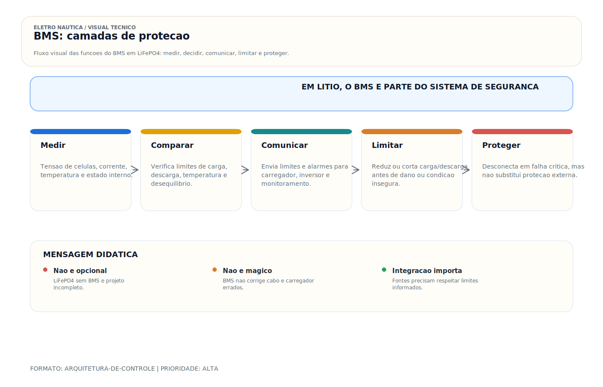

# BMS — Battery Management System

> [!abstract] Resumo técnico
> BMS é o sistema de supervisão e proteção do banco de lítio. Ele monitora células, corrente, temperatura e permissões de carga/descarga, e precisa ser coordenado com carregadores, alternadores, inversores e estratégias de desligamento do sistema.

> [!tip] Regra de decisão em 30 segundos
> 1. **BMS em lítio não é acessório — é requisito estrutural.** ABYC E-13 (2023) e IEC 62619:2022 tratam como sistema de segurança indispensável, junto com fusível, cabo, bandeja, ventilação e carregador compatível.
> 2. **BMS monitora cada célula, não o banco.** Tensão média de 13,2 V pode esconder uma célula em 2,5 V e outra em 3,9 V — desbalanceamento que o voltímetro do banco nunca revela.
> 3. **BMS integrado em bateria pronta ≠ BMS projetado para o sistema.** BMS "drop-in" barato muitas vezes apenas corta, sem comunicar com o resto do sistema — útil em cenário simples, insuficiente em retrofit completo.
> 4. **Corte abrupto do BMS em carga é evento elétrico.** Se o inversor continua puxando corrente no momento em que o BMS abre o MOSFET, pode haver pico de tensão, alarme e até falha do inversor — comunicação (VE.Bus, CAN, NMEA 2000) é que evita o corte duro.
> 5. **Nunca "reset" do BMS sem diagnóstico.** BMS que dispara repetidamente indica causa raiz (célula desbalanceada, temperatura, carregador mal configurado, sobrecorrente real). Forçar reconexão esconde o sintoma e acelera falha.
> 6. **Temperaturas abaixo de 0 °C bloqueiam carga em LiFePO4** — deposição de lítio metálico é irreversível. BMS bloqueia por projeto; solução é aquecedor de bateria, não bypass.
> 7. **Fusível entre banco e BMS é obrigatório** — BMS não substitui fusível. Curto-circuito franco em lítio gera Isc de milhares de ampères; MOSFET do BMS é protegido pelo fusível, não o contrário.
> 8. **Balanceamento passivo equilibra no topo da carga;** diferenças grandes de capacidade entre células nunca ficam perfeitamente balanceadas — BMS ativo corrige em qualquer ponto, mas não compensa seleção ruim de células.
> 9. **Parâmetros do BMS devem vir do fabricante da célula, não do default do BMS.** Daly, JBD e similares saem com configuração genérica; célula CATL, EVE ou Winston tem limites próprios em datasheet. Configurar sem ler datasheet é instalar às cegas.

> [!danger] Quando chamar um especialista
> - **Banco LiFePO4 sem BMS, ou com BMS "misterioso" sem documentação.** Não faça primeiro uso sem identificar o BMS (marca, modelo, datasheet), tirar configuração atual via app/console, validar parâmetros contra a célula instalada e registrar na pasta técnica da embarcação. "Comprei com BMS" não é evidência.
> - **BMS desconectando repetidamente sem causa aparente.** Causa pode ser célula com falha interna, temperatura oculta, carregador com tensão excessiva, shunt mal dimensionado ou cabo com queda de tensão fora de especificação. Diagnóstico com app, multímetro, termômetro IR e, em último caso, teardown da célula — não é tentativa-e-erro.
> - **Integração BMS + alternador + regulador em projeto novo ou retrofit.** Alternador original não "sabe" que o banco é lítio; regulador externo programável, DC-DC charger ou sistema integrado com BMS é decisão de projeto, com ART/CREA e teste em bancada.
> - **Retrofit de banco AGM → LiFePO4 mantendo carregador/inversor antigos.** Parâmetros de carga, comportamento em float, corrente de absorção e estratégia de desligamento são todos diferentes. Sem reconfiguração e comunicação, o BMS será "ponto de conflito" permanente.
> - **Eletropropulsão com bancos > 10 kWh ou 48/96/400 V.** BMS precisa cobrir balanceamento, isolamento galvânico, detecção de fuga à massa (ground fault), contatores de potência, interlock com freio regenerativo. ISO 16315 + IEC 62619 + ABYC E-30 (draft) como base.
> - **Incêndio, venting ou "puff event" em célula LiFePO4.** Isolar, ventilar, não apagar com água (ver fabricante), acionar seguradora, laudo com ART/CREA. Preservar BMS e células para análise — não descartar antes da perícia.
> - **Banco DIY com células prismáticas soltas (CATL, EVE) e BMS externo.** Montagem exige busbar calibrado, aperto com torquímetro, teste de capacidade inicial célula a célula, topbalance antes do pack final e cronograma de inspeção. Não é projeto de fim de semana.
> - **Comunicação BMS-carregador-inversor em ambiente Victron, Mastervolt, Mastervolt CZone, NMEA 2000.** VE.Bus, VE.Can, CAN bus proprietário — mapa de mensagens é específico. Tentar "fazer funcionar sem documentação" leva a falsa integração que só falha em regime real.
> - **Laudo pericial ou parecer técnico sobre evento em banco lítio** (sinistro, incêndio, inchamento, dano em equipamento). Responsável técnico com ART/CREA, reconstituição da cadeia causal, evidência fotográfica e registro de parâmetros do BMS no momento do evento.

## O que é

O BMS (Battery Management System) é o circuito eletrônico inteligente integrado a bancos de baterias de lítio (LiFePO4, NMC, LTO) que monitora continuamente o estado de cada célula individual e protege o banco contra condições que causariam dano irreversível ou risco de segurança: sobretensão, subtensão, sobrecorrente, temperatura excessiva e desbalanceamento de células.

Em sistemas de chumbo-ácido não se usa BMS no sentido aplicado ao lítio, porque a gestão da química e a proteção são tratadas de outra forma. Em bancos LiFePO4 de uso náutico, a supervisão por BMS é parte do sistema, não acessório opcional.

## Função

| Proteção | Condição | Ação |
| --- | --- | --- |
| Sobretensão de célula | Acima do limite definido para a célula e o fabricante | Reduz ou interrompe carregamento |
| Subtensão de célula | Abaixo do limite definido para a célula e o fabricante | Reduz ou interrompe descarga |
| Sobrecorrente de carga | Corrente > limite configurado | Desconecta carga ou carregamento |
| Sobrecorrente de partida | Pico de corrente > limite de curto | Desconecta (proteção de curto) |
| Temperatura alta | Acima da faixa segura definida pelo fabricante | Limita ou interrompe operação |
| Temperatura baixa | Abaixo da faixa segura de carga | Bloqueia ou limita carregamento |
| Balanceamento | Diferença entre células > threshold | Balancea passivo ou ativo |

## Como aparece na prática

- Módulo eletrônico integrado dentro do case da bateria (baterias prontas como Battle Born, Lithionics, Victron Smart Lithium)
- Módulo externo para bancos DIY (montagem própria com células soltas)
- Comunicação com o sistema via: display próprio, Bluetooth (app), CAN bus (NMEA 2000), VE.Bus (Victron)
- LED de status ou display de tensão por célula
- Relé ou MOSFET de potência que isola o banco quando proteção ativa

## Fundamentos mínimos

**Células em série vs banco:**

Um banco LiFePO4 de 12V é formado por 4 células de 3,2V em série (4 × 3,2V = 12,8V nominal). O BMS monitora cada célula individualmente — a tensão total do banco não revela o problema de uma célula desbalanceada.

**Balanceamento passivo vs ativo:**

| Tipo | Mecanismo | Eficiência | Custo |
| --- | --- | --- | --- |
| Passivo | Dissipa excesso em resistência (calor) | Baixa | Barato |
| Ativo | Transfere energia de célula mais cheia para mais vazia | Alta | Caro |

A maioria dos BMS acessíveis usa balanceamento passivo. Em bancos maiores, ciclos intensos ou células com maior dispersão, o balanceamento ativo pode ser vantajoso, mas não substitui seleção correta de células e boa montagem do banco.

**Comunicação BMS → sistema:**

BMS modernos podem comunicar limites dinâmicos de carga/descarga a carregadores, inversores e controladores. Isso permite reduzir corrente antes de um corte duro. Sem essa coordenação, a desconexão abrupta pode criar indisponibilidade de cargas, alarmes ou eventos elétricos indesejados no sistema.

## Parâmetros de configuração

| Parâmetro | Valor típico LiFePO4 |
| --- | --- |
| Tensão de corte superior (por célula) | Definida pelo fabricante da célula e pela estratégia do sistema |
| Tensão de corte inferior (por célula) | Definida pelo fabricante da célula e pela reserva de segurança adotada |
| Tensão de flutuação alvo | Muitas arquiteturas LiFePO4 trabalham com float reduzido ou sem float sustentado |
| Corrente máxima de carga (C-rate) | 0,5C a 1C (50–100A para banco 100Ah) |
| Corrente máxima de descarga | 1C a 2C |
| Temperatura máxima de operação | 45–60°C |
| Temperatura mínima para carga | 0°C (sem aquecimento) |

## Tipos de BMS por topologia

**BMS centralizado (comum em baterias prontas):**

- Um único módulo controla todas as células
- Mais simples, menor custo
- Ponto único de falha

**BMS distribuído (modular):**

- Um módulo por célula ou grupo de células
- Mais robusto, maior custo
- Usado em bancos grandes industriais

**BMS com relé de potência:**

- Usa relé eletromecânico para isolar o banco
- Mais simples, consome mais energia, gera arco no relé em alta corrente

**BMS com MOSFET de estado sólido:**

- Usa transistores MOSFET para isolação
- Sem arco elétrico, sem desgaste mecânico
- Padrão em baterias de qualidade

## Marcas e referências

- **Daly BMS** — barato, amplamente usado em bancos DIY, funcional
- **JBD/Overkill Solar** — melhor qualidade que Daly, app Bluetooth
- **Electrodacus** — DIY de alta qualidade, comunicação avançada
- **Victron Smart Lithium** — bateria pronta com BMS integrado e VE.Bus
- **Battle Born** — bateria americana pronta, BMS robusto, 10 anos de garantia
- **REC BMS** — BMS profissional com CAN bus, usado em iates
- **Orion BMS** — industrial, altamente configurável, caro

## Problemas mais frequentes

| Problema | Causa | Diagnóstico |
| --- | --- | --- |
| BMS desconectando banco frequentemente | Célula desbalanceada atingindo limite | Medir tensão de cada célula |
| BMS não permite carregamento | Temperatura abaixo de 0°C | Verificar temperatura do banco |
| BMS corta sob alta corrente | Corrente de pico excede limite configurado | Reduzir carga simultânea ou reconfigurar limite |
| Banco nunca atinge 100% | BMS interrompendo absorção prematuramente | Verificar configuração de tensão de corte |
| BMS morreu | Sobretensão externa, inversão de polaridade | Substituir BMS, verificar causa |
| Células com diferença > 0,2V | Desbalanceamento acumulado | Balanceamento manual ou ciclos de equalização |

## Diagnóstico prático

**Verificar estado das células:**

```
Via app Bluetooth do BMS (JBD, Daly, Victron):
→ Ver tensão individual de cada célula
→ Diferença entre maior e menor > 0,1V = desbalanceamento relevante
→ Diferença > 0,3V = problema sério de balanceamento

Sem app: medir tensão total do banco
→ Dividir por número de células (4 para 12V)
→ Resultado é a média — não revela desbalanceamento
```

**Verificar proteção ativa:**

```
BMS desconectou → verificar qual proteção ativou:
→ LED/app indica motivo (sobretensão, subtensão, temp, sobrecorrente)
→ Resolver a condição que causou a proteção
→ Nunca "forçar" o BMS a reconectar sem resolver a causa
```

## Boas práticas profissionais

- Nunca instalar banco LiFePO4 sem estratégia de BMS/supervisão adequada ao banco e à aplicação
- Verificar compatibilidade do BMS com o carregador/inversor (tensão de absorção, comunicação)
- Configurar o BMS com parâmetros corretos para o tipo de célula (não usar padrão de fábrica sem verificar)
- Comunicar o BMS com o sistema (Victron VE.Bus, NMEA 2000) para proteção suave
- Inspecionar as células periodicamente — balanceamento acumulado indica célula com problema

## Cuidados de instalação

- Verificar polaridade antes de conectar — inversão de polaridade destrói o BMS instantaneamente
- Instalar fusível entre o banco e o BMS (em série com o positivo) — o BMS não é o fusível do sistema
- Verificar que os cabos do BMS têm bitola adequada para a corrente máxima configurada
- Ventilação adequada — BMS com balanceamento passivo gera calor durante o balanceamento

## Erros comuns

**Usar carregador ou inversor sem coordenar limites com o BMS:**

O problema não é apenas "ser de chumbo" ou "ser de lítio". O problema é carregar fora da janela aceita pela célula e sem coordenação com o BMS. Isso gera cortes frequentes, envelhecimento prematuro e instabilidade do sistema.

**Instalar banco LiFePO4 sem qualquer BMS:**

"As células são LiFePO4, são mais seguras." Mais seguras que NMC, sim — mas ainda precisam de proteção contra sobrecorrente, subtensão e desbalanceamento.

**Ignorar a comunicação BMS-carregador:**

BMS sem comunicação desconecta abruptamente. Inversor em carregamento pode sofrer dano (pico de tensão na desconexão brusca). Usar comunicação para desligamento suave.

## Relação com outros sistemas

- **Banco de baterias LiFePO4:** o BMS é parte integrante, não acessório
- **Carregador de bateria:** deve ser compatível com a janela de tensão/corrente do banco e, idealmente, receber limites do BMS
- **Alternador:** precisa ser tratado junto com o BMS quando o banco puder absorver corrente elevada por longos períodos
- **Inversor/carregador Victron:** comunicação VE.Bus com BMS para proteção integrada
- **Monitor de bateria (BMV/Shunt):** complementa o BMS — monitoramento do banco como um todo
- **VRM:** dados do BMS podem aparecer no painel remoto Victron

## Glossário rápido

- **BMS (Battery Management System)** — sistema eletrônico que monitora tensão de célula, temperatura, corrente e SoC/SoH; protege contra sobretensão, subtensão, sobrecorrente e temperatura; balanceia células.
- **Célula** — unidade eletroquímica básica. LiFePO4: 3,2 V nominais / 2,5 V mínimo / 3,65 V máximo.
- **Pack / banco** — conjunto de células em série e/ou paralelo formando a bateria instalada.
- **4S** — 4 células em série (4 × 3,2 V = 12,8 V nominal). Padrão LiFePO4 12 V.
- **8S / 16S** — 8 células em série (24 V nominal) / 16 células (48 V nominal).
- **4S2P** — 4 em série, 2 em paralelo — dobra capacidade mantendo tensão.
- **Balanceamento passivo** — BMS dissipa energia da célula mais alta em resistor (calor). Simples, lento, gera calor.
- **Balanceamento ativo** — BMS transfere energia entre células via conversor DC-DC. Eficiente, complexo, caro.
- **Topbalance** — equalização inicial do banco antes do primeiro uso; leva células ao mesmo SoC via fonte de bancada.
- **Bottombalance** — equalização ao fundo da curva; menos comum, exige descarga controlada.
- **Sobretensão de célula (OVP)** — proteção contra tensão acima do limite da célula (típico LiFePO4: 3,65 V).
- **Subtensão de célula (UVP)** — proteção contra tensão abaixo do mínimo (típico LiFePO4: 2,5 V).
- **Sobrecorrente de carga (OCP-C)** — proteção contra carga acima do limite configurado.
- **Sobrecorrente de descarga (OCP-D)** — proteção contra descarga acima do limite configurado.
- **Short Circuit Protection (SCP)** — proteção contra curto franco; atua em microssegundos.
- **OTP (Over Temperature Protection)** — proteção contra sobreaquecimento.
- **UTP (Under Temperature Protection)** — proteção contra carga abaixo de 0 °C.
- **MOSFET de potência** — transistor semicondutor usado pelo BMS para isolar o banco; sem arco mecânico.
- **Relé de potência** — contator eletromecânico usado em bancos grandes; arco elétrico ao abrir, desgaste mecânico.
- **BMS centralizado** — um módulo controla todas as células; comum em baterias prontas; ponto único de falha.
- **BMS distribuído** — um módulo por célula ou grupo; robusto, industrial, caro.
- **BMS inteligente** — com app/Bluetooth/CAN para leitura e configuração remota.
- **BMS "burro"** — apenas corta; sem comunicação com o sistema.
- **SoC (State of Charge)** — percentual de carga atual; BMS integra corrente para calcular.
- **SoH (State of Health)** — percentual de capacidade remanescente em relação à nova.
- **Coulomb counting** — método de cálculo de SoC por integração de corrente no tempo.
- **Shunt** — resistor calibrado de baixo valor na linha negativa; BMS/monitor lê queda de tensão para medir corrente.
- **VE.Bus / VE.Can** — protocolos Victron para comunicação entre BMS, inversor, carregador.
- **CAN bus** — protocolo automotivo; base do NMEA 2000 e da maioria dos BMS industriais.
- **NMEA 2000** — rede marítima padronizada sobre CAN; permite BMS reportar SoC, alarmes, comandos.
- **UN 38.3** — teste mandatório para transporte aéreo/marítimo de baterias lítio.
- **DIY pack** — banco montado a partir de células soltas + BMS externo; requer topbalance, busbar, torquímetro.
- **Pack pronto (drop-in)** — bateria com case, BMS e terminais prontos para substituir AGM.
- **Pré-carga (precharge)** — resistor que limita inrush ao fechar contator; evita arco e proteção espúria.
- **Interlock / E-stop** — botão de emergência que comanda BMS a abrir; requisito em eletropropulsão.
- **Ground fault detection** — detecção de fuga à massa em banco isolado (48 V+); essencial em eletropropulsão.
- **Thermal runaway** — reação exotérmica em cadeia; LiFePO4 resiste melhor, NMC é o risco real.
- **Venting** — liberação de gás por válvula de alívio da célula sob falha; sinal de dano irreversível.
- **Datasheet da célula** — documento do fabricante com limites elétricos, térmicos e mecânicos; base para configurar BMS.
- **AIC (Ampere Interrupting Capacity)** — capacidade do fusível de interromper Isc; crítico em lítio.
- **Isc** — corrente de curto-circuito do banco; em LiFePO4 pode ultrapassar 10 kA.

## Normas aplicáveis

- **ABYC E-13 (2023) — Lithium Ion Batteries** — referência mais completa para instalação, BMS, ensaios e manutenção de bancos de lítio em embarcação; trata BMS como sistema de segurança.
- **ABYC E-11 (2023) — AC and DC Electrical Systems** — regra do fusível ≤ 178 mm do terminal positivo, proteção de cabo, bitolagem, cores.
- **ABYC E-10 (2023) — Storage Batteries** — separação de bancos, ventilação, fixação, compartimento.
- **IEC 62619:2022** — Safety requirements for secondary lithium cells and batteries (industrial) — base técnica referenciada em datasheets de células importadas.
- **IEC 62620:2014** — Desempenho e durabilidade de células e packs secundários lítio industriais.
- **IEC 63056:2020** — Baterias lítio em sistemas de armazenamento de energia elétrica (BESS).
- **UL 1973:2022** — Baterias estacionárias/auxiliares/light rail; ensaio de segurança de pack completo.
- **UL 9540A** — Método de avaliação de propagação de thermal runaway em sistemas de armazenamento.
- **UL 2580** — Baterias para veículos elétricos; referência em automotivo e eletropropulsão.
- **UN 38.3** — transporte aéreo e marítimo de baterias de lítio (importação/exportação obrigatório).
- **SAE J2464** — Ensaios de segurança e abuso para sistemas de armazenamento de energia de veículos elétricos.
- **ISO 13297:2020** — Sistemas AC e DC em pequenas embarcações.
- **ISO 16315:2016** — Sistemas de propulsão elétrica em pequenas embarcações; base para projetos com bancos > 10 kWh.
- **NMEA 2000 (IEC 61162-3)** — Rede marítima para comunicação entre BMS, MFD, inversor, carregador.
- **NBR 5410:2004** — Instalações elétricas de baixa tensão; aplicável ao AC após o shore inlet.
- **NORMAM-211/DPC** — Embarcações de esporte e recreio; exigências da autoridade marítima brasileira.
- **Especificações do fabricante** — parâmetros de configuração por célula e por BMS; consulta obrigatória antes da instalação.

## Como ensinar este tópico

**Sequência recomendada:**

1. Por que o lítio é diferente: sensibilidade a sobretensão e subtensão — sem BMS, morre rápido
2. O que o BMS monitora: mostrar app ao vivo — tensão de cada célula em tempo real
3. Proteções: simular subtensão (descarregar célula) — BMS desconecta
4. Balanceamento: o que é, por que acumula, como corrigir
5. Integração com Victron: como BMS e MultiPlus conversam, por que isso importa

**Conceito-chave para fixar:**

"O BMS é o sistema nervoso do banco de lítio. Sem ele, o banco não dura — e pode ser perigoso."

## FAQ

**Posso usar banco LiFePO4 sem BMS se for muito cuidadoso?**

Não recomendado. O desbalanceamento de células ocorre gradualmente e é invisível sem monitoramento por célula. Uma célula desbalanceada não aparece na tensão total do banco até o momento em que atinge o limite — e então o dano já pode ser irreversível.

**BMS externo ou bateria com BMS interno?**

Para usuário final: bateria com BMS interno (plug-and-play, sem configuração). Para instalações técnicas com personalização: BMS externo configurável. Para bancos DIY com células soltas: BMS externo obrigatório.

**O BMS garante balanceamento perfeito?**

BMS com balanceamento passivo equilibra na carga (topo do ciclo). Células com diferença grande de capacidade nunca ficam perfeitamente balanceadas por BMS passivo. BMS ativo equilibra em qualquer ponto do ciclo — solução superior para bancos com células heterogêneas.

## Visual didático



Mostrar BMS como sistema de seguranca e coordenacao, nao como acessorio opcional.

**Cautela:** BMS nao substitui projeto, fusivel, cabos, ventilacao, configuracao de carregadores e compatibilidade com fabricantes.

Material de apoio: [BMS: camadas de protecao](../_visuals/generated/bms-camadas-protecao.md)

## Integração com outras notas

- [[Bancos de Bateria]]
- [[Alternador (DC)]]
- [[Carregador de Bateria (AC To DC)]]
- [[Inversora (DC To AC)]]
- [[Lítio LiFePO4 — Instalação e Cuidados Específicos]]
- [[Monitor de Bateria / BMV / Shunt]]
- [[Tipos de Bateria]]

## Perguntas que esta nota responde

- O que é BMS — Battery Management System em instalações elétricas náuticas?
- Qual é a função de BMS — Battery Management System na embarcação?

