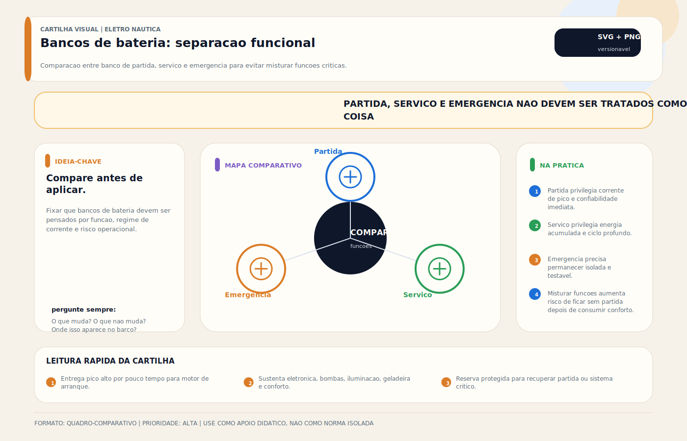

# Bancos de Bateria

> [!abstract] Resumo técnico
> Banco de baterias é um subsistema de armazenamento e distribuição de energia. Seu desempenho depende da química, da função do banco, do arranjo série/paralelo, da proteção, do método de carga e do monitoramento. Somar capacidade sem coordenar esses fatores produz autonomia ilusória e baixa confiabilidade.

## O que é

Banco de baterias é um conjunto de duas ou mais baterias conectadas de forma organizada para funcionar como uma única fonte de energia com maior capacidade (paralelo) ou maior tensão (série).

No contexto náutico, o termo "banco" designa especialmente o conjunto de baterias de serviço — responsável por sustentar as cargas de bordo durante a operação sem motor ligado. Um barco pode ter mais de um banco com funções distintas: banco de serviço, banco de partida e, em embarcações maiores, banco de emergência.

A organização correta de um banco de baterias envolve:

- Definição de capacidade (Ah)
- Escolha da tecnologia
- Configuração elétrica (série, paralelo ou mista)
- Dimensionamento dos cabos de interligação
- Proteção (fusíveis, disjuntores)
- Monitoramento (shunt, monitor de bateria)
- Gerenciamento de carga (chave seletora, BMS, isolador)

## Função na embarcação

O banco de baterias cumpre o papel de reservatório de energia do sistema elétrico DC da embarcação.

Suas funções são:

- **Sustentar as cargas de serviço** quando o motor está desligado ou em baixa rotação (iluminação, bombas, refrigeração, eletrônicos)
- **Receber energia** de múltiplas fontes: alternador, shore power via carregador, solar via MPPT, gerador AC via carregador
- **Garantir partida** quando separado em banco de partida específico
- **Agir como buffer** em sistemas de geração intermitente (solar, eólico)
- **Suprir picos de demanda** de cargas com consumo variável (bombas, inversores)

A autonomia do banco — medida em horas de uso nas condições normais da embarcação — é o parâmetro mais importante para dimensionamento.

## Como aparece na prática

**Lanchas populares (até 24 pés):**

Um único banco AGM de 80-150Ah, geralmente não separado de partida. Autonomia limitada. Proprietário frequentemente reclama que "a bateria não aguenta a noite".

**Lanchas médias e trawlers (24-36 pés):**

Dois bancos separados (partida + serviço). Banco de serviço entre 150-300Ah em AGM. Chave seletora para seleção manual. Começa a aparecer monitor de bateria.

**Veleiros e barcos de cruzeiro:**

Banco de serviço maior (300-600Ah), às vezes dividido em dois bancos alternados. Sistema solar integrado. Atenção maior ao dimensionamento de autonomia (costumam ficar dias sem marina).

**Embarcações maiores e motoryachts:**

Banco de serviço de alta capacidade (400Ah+), gerador AC dedicado, carregador de cais potente. LiFePO4 começa a aparecer aqui pela vantagem de peso e autonomia.

**Projetos customizados:**

Banco LiFePO4 com BMS avançado, integração NMEA 2000, solar, alternador regulado. Configuração profissional com monitoramento completo de SoC.

## Fundamentos mínimos

**Conexão em paralelo:**

Conectar o positivo de uma bateria no positivo da outra e o negativo no negativo da outra. Resultado: tensão permanece igual (12V), capacidade soma (100Ah + 100Ah = 200Ah).

**Conexão em série:**

Conectar o positivo de uma bateria no negativo da outra. Resultado: tensão soma (12V + 12V = 24V), capacidade permanece igual (100Ah).

**Por que paralelo exige compatibilidade real:**

Baterias em paralelo precisam ter química, tensão nominal, estado de carga, resistência interna e histórico de uso suficientemente próximos para compartilhar corrente de forma aceitável. Misturar elementos muito diferentes cria correntes de equalização, divisão desigual de carga e degradação acelerada.

**Autodescarga diferencial:**

Baterias de idades ou estados de uso diferentes autodescargam em taxas diferentes. Em poucos ciclos, o desequilíbrio se amplifica e o banco passa a ter performance inferior à bateria mais fraca.

**Capacidade real vs capacidade nominal:**

Fabricantes especificam capacidade sob um regime de ensaio definido. Em chumbo-ácido, a capacidade útil cai com aumento da taxa de descarga, temperatura e envelhecimento. Em lítio, o efeito é menor, mas continua existindo. Por isso, Ah de catálogo nunca devem ser usados como autonomia garantida sem contexto.

## Características principais

**Capacidade (Ah):**

Define quanto tempo o banco sustenta o perfil de carga da embarcação. O cálculo precisa considerar consumo médio, picos, simultaneidade, temperatura, envelhecimento e reserva operacional. Como regra de projeto, o banco não deve operar rotineiramente em profundidade de descarga agressiva para a química escolhida; o limite exato vem do fabricante e da estratégia de vida útil.

**Tensão nominal:**

12V na grande maioria das embarcações recreativas. 24V em motores diesel maiores, sistemas com maior eficiência de cabo ou embarcações com maior demanda.

**Número de baterias:**

Depende do espaço disponível, capacidade por unidade e tecnologia. Bancos em paralelo com mais de 4 baterias exigem atenção especial ao equilíbrio de cabos.

**Tempo de autonomia:**

Parâmetro de projeto. Quantas horas o banco deve sustentar o consumo médio sem recarga? Para veleiros de cruzeiro: 24-48h. Para lanchas de uso diário: 8-12h.

**Taxa de carga disponível:**

O banco absorve carga do alternador e carregadores. Bancos grandes de chumbo chegam a 90% de carga lentamente — as últimas horas de absorção são lentas. LiFePO4 absorve mais rápido, mas exige controle de tensão adequado no alternador.

## Configurações e variações comuns

**Banco simples de serviço:**

Uma ou mais baterias em paralelo como banco único de serviço. Configuração básica de lanchas populares. Sem separação de partida — risco de não partir o motor.

**Dois bancos separados (partida + serviço):**

Configuração correta para a maioria das embarcações. Chave seletora (1/2/Ambos/Off) permite selecionar qual banco usar ou combinar ambos. Banco de partida: 1 bateria de CCA alto. Banco de serviço: baterias de ciclo profundo em paralelo.

**Três bancos (partida + serviço + reserva):**

Presente em embarcações maiores. Banco de reserva fica isolado — garantia de partida mesmo com bancos de serviço descarregados.

**Sistema com isolador de carregamento:**

Alternador carrega ambos os bancos simultaneamente através de isolador, ACR/VSR, DC-DC charger ou arquitetura equivalente. A solução correta depende da química, da tensão do sistema e do comportamento do alternador.

**Banco LiFePO4 com BMS:**

Configuração profissional. O BMS gerencia células, temperaturas e permissões de carga/descarga. LiFePO4 e chumbo-ácido não devem compor o mesmo banco em paralelo direto; se coexistirem na mesma embarcação, a integração precisa ser tratada por arquitetura de carregamento e distribuição, não por conexão direta simplista.

**Sistema de 24V:**

Dois bancos de 12V em série. Usado em embarcações com motor diesel 24V ou sistemas de maior eficiência (cabos mais finos para mesma potência).

## Principais marcas e produtos

**Baterias para banco (AGM ciclo profundo):**

- **Victron Energy AGM Deep Cycle** — referência no mercado náutico, linha completa de 20Ah a 220Ah
- **Trojan T-series** — americana, ciclo profundo reconhecido, popular em instalações maiores
- **Fullriver DC-series** — importada, custo acessível, boa qualidade
- **Moura Estacionária** — nacional, disponível, opção de entrada

**Baterias para banco (LiFePO4):**

- **Victron Smart Lithium** — integração total com ecossistema Victron, BMS compatível, NMEA 2000
- **Battle Born 100Ah** — americana, popular em cruising, BMS interno robusto
- **SOK 100/200Ah** — custo acessível, BMS razoável, boa relação custo-benefício para orçamento limitado

**Monitoramento e proteção:**

- **Victron BMV-712 / SmartShunt** — referência em monitor de banco
- **Simarine PICO** — alternativa profissional com display dedicado
- **Blue Sea Systems** — fusíveis ANL, chaves seletoras, barramentos
- **Mastervolt** — chaves seletoras e sistemas de gerenciamento

## Componentes e sistemas relacionados

- **Chave seletora de banco:** Blue Sea Systems, Mastervolt. Permite isolar, selecionar e combinar bancos. Nunca abrir a chave com motor e alternador ligados em sistemas sem proteção — pode queimar o alternador.
- **Fusível de banco (ANL/MIDI):** proteção do cabo principal contra curto-circuito. Dimensionado para o cabo, não para a carga.
- **Barramento DC positivo e negativo:** ponto central de distribuição das cargas. Facilita diagnóstico e organização.
- **Shunt de corrente:** resistor de precisão na linha negativa para medição de corrente pelo monitor de banco.
- **Monitor de banco (BMV):** lê tensão, corrente e calcula SoC por integração. Necessário para qualquer banco de serviço sério.
- **Isolador de carga / combinador:** permite carregar múltiplos bancos do alternador sem interligá-los permanentemente.
- **Carregador de cais:** carrega o banco via shore power. Deve ter perfil compatível com a tecnologia.
- **MPPT solar:** contribui para carga do banco durante o dia.

## Onde costuma dar problema

| Problema | Sintoma | Consequência |
| --- | --- | --- |
| Banco subdimensionado | Tensão cai rapidamente | Cargas desligam, motor não parte |
| Baterias de idades diferentes em paralelo | Banco "cansa" rápido, desequilíbrio | Vida útil muito reduzida |
| Cabos de interligação desiguais | Corrente distribuída de forma desigual | Baterias trabalham em cargas diferentes |
| Ausência de fusível no banco | Sem sintoma — até o curto-circuito | Incêndio, perda total |
| Chave seletora aberta com alternador ligado | Pico de tensão sem carga | Queima do diodo do alternador ou de equipamentos |
| Monitor mal calibrado | SoC incorreto | Descarga profunda sem aviso |
| Banco LiFePO4 sem BMS adequado | Proteção inexistente ou mal coordenada | dano prematuro, desligamentos intempestivos ou falha de segurança |

## Causas raiz

**Banco não aguenta a noite:**

Causa raiz mais comum: subdimensionamento. O proprietário soma incorretamente as cargas ou não considera picos de consumo (bomba de porão, geladeira, etc.). Solução: levantamento real de consumo com multímetro na linha ou medição com shunt.

**Uma bateria do banco sempre descarrega mais que as outras:**

Causa raiz: cabos de interligação desiguais. Bateria mais próxima do barramento tem menor resistência de cabo — recebe e entrega mais corrente. Solução: usar cabos de igual comprimento e seção nos pontos de conexão do banco.

**Banco perdeu capacidade em 2 anos:**

Causa raiz mais comum: descarga profunda frequente (>50% DoD para AGM) sem reposição rápida. Em segundo lugar: baterias de lotes diferentes conectadas em paralelo desde o início.

**BMS do banco LiFePO4 dispara frequentemente:**

Causa raiz: arquitetura de carga inadequada, célula desequilibrada, limite de corrente mal coordenado ou alternador/regulador incapaz de lidar com o perfil do banco. Solução: revisar estratégia de carga, limites do BMS e integração entre alternador, carregador e banco.

## Diagnóstico prático

**Diagnóstico de banco subdimensionado:**

1. Medir consumo total das cargas normais com shunt ou amperímetro de alicate
2. Multiplicar corrente média pelas horas de uso
3. Comparar com capacidade útil do banco (50% da capacidade nominal para AGM)
4. Se consumo esperado > capacidade útil → banco subdimensionado

**Diagnóstico de desequilíbrio no banco:**

1. Carregar banco completamente
2. Aguardar 2h sem carga (tensão se estabiliza)
3. Medir tensão em cada bateria individualmente nos terminais
4. Diferença > 0,2V → bateria mais fraca comprometida

**Diagnóstico de cabos desiguais:**

1. Desconectar o banco das cargas
2. Aplicar carga controlada (ex: 10A)
3. Medir tensão em cada bateria durante a descarga
4. Queda diferente em baterias do mesmo lote → resistência de cabo desigual

**Verificação do fusível de banco:**

Verificar visual e continuidade. Fusível escurecido internamente ou com sinais de aquecimento indica sobrecarga anterior — investigar causa antes de substituir.

## Boas práticas

✅ Dimensionar o banco para que a profundidade de descarga de rotina seja compatível com a química, a vida útil desejada e a autonomia exigida

✅ Usar baterias do mesmo lote, marca e data de fabricação em bancos em paralelo

✅ Cabos de interligação do banco com comprimento e seção iguais para cada unidade

✅ Instalar proteção contra sobrecorrente próxima à fonte e coordenada com a ampacidade do circuito principal

✅ Instalar shunt + monitor de banco para controle real de SoC

✅ Documentar a configuração do banco: capacidade, data, tecnologia, parâmetros do carregador

✅ Registrar tensão, temperatura, histórico de carga e condição de cada unidade em inspeções periódicas

✅ Usar barramento dedicado para distribuição — facilita diagnóstico e organização futura

✅ Etiquetar claramente banco de partida e banco de serviço

✅ Para LiFePO4: usar BMS com comunicação e alarme — não apenas proteção passiva

## Cuidados de instalação

**Simetria dos cabos de interligação:**

Em banco com 3+ baterias em paralelo, o caminho elétrico de cada bateria ao barramento deve ter a mesma resistência total. Isso exige cabos de igual comprimento e seção. A configuração em "estrela" (todos os cabos partindo de um único ponto central) é mais difícil de balancear que a configuração em "cadeia" com conexão alternada de positivos e negativos.

**Configuração recomendada para banco em paralelo:**

Conectar os cabos de saída nos extremos opostos do banco — positivo na primeira bateria, negativo na última. Isso distribui a corrente de forma mais equilibrada naturalmente.

**Torque nos terminais:**

Terminais soltos causam resistência de contato, aquecimento e arco elétrico. Usar torquímetro ou apertar firmemente com chave de qualidade. Aplicar vaselina técnica após aperto.

**Proteção mecânica:**

Compartimento de bateria com proteção contra água de porão e respingos. Tampa ou proteção física nos terminais para evitar contato acidental.

**Etiquetagem:**

Etiquetar cada bateria do banco com número e data de instalação. Etiquetar cabos de banco, barramento e fusíveis. Facilita manutenção e diagnóstico futuro.

## Cuidados de uso

- Não abrir a chave seletora com motor e alternador em funcionamento (em sistemas sem proteção anti-transiente)
- Monitorar SoC via monitor de banco — não confiar em voltímetro simples
- Recarregar o banco antes de atingir 50% de SoC (AGM) ou 20% (LiFePO4)
- Verificar temperatura do compartimento no verão — bancos AGM em compartimentos fechados atingem temperaturas que reduzem vida útil
- Não combinar bancos de tecnologias diferentes no mesmo barramento sem sistema de gerenciamento específico
- Inspecionar terminais e interligações a cada 3-6 meses — ambiente marinho é agressivo

## Erros comuns

❌ **Conectar baterias de idades diferentes em paralelo** — desequilíbrio permanente desde o primeiro ciclo.

❌ **Cabos de banco com comprimentos desiguais** — distribuição de corrente desigual entre baterias. Erro silencioso que reduz vida útil.

❌ **Não instalar fusível de banco** — um curto-circuito sem fusível pode gerar incêndio.

❌ **Usar monitor de tensão simples como medidor de SoC** — tensão de chumbo não é proporcional ao SoC de forma confiável sem repouso prolongado.

❌ **Abrir chave seletora com alternador funcionando** — pico de tensão pode queimar diodo do alternador ou equipamentos sensíveis.

❌ **Banco em paralelo com mais de 4 baterias sem equilíbrio de cabos** — dificulta muito o equilíbrio e o diagnóstico.

❌ **Não documentar data e parâmetros do banco** — substituição futura fica sem referência para escolha correta do lote.

❌ **Misturar LiFePO4 com AGM no mesmo banco** — incompatível. Perfis de tensão diferentes criam corrente de equalização permanente e perigosa.

## Relação com outros sistemas

- **Alternador:** principal fonte de carga do banco em barcos com motor. A compatibilidade depende da química, do regulador, da corrente disponível e da estratégia de proteção do sistema.
- **Carregador de cais:** deve ter corrente e perfil compatíveis com o banco e com o tempo real disponível de recarga.
- **Solar / MPPT:** contribuição parcial. Dimensionar para cobrir o consumo médio diário — não para carregar banco vazio em um dia.
- **Monitor de banco:** shunt é o componente central do monitoramento. Toda corrente que entra e sai do banco passa pelo shunt.
- **Sistema de distribuição DC:** barramento principal, chaves, disjuntores e fusíveis devem ser dimensionados para a corrente máxima possível do banco (pico de partida ou corrente de curto-circuito).
- **Inversor DC/AC:** carga pesada sobre o banco. Dimensionamento do banco deve incluir a corrente de pico do inversor.

## Brasil x referências internacionais

🌎 **Brasil x referências internacionais**

**Prática comum no Brasil:**

Banco único sem separação partida/serviço é a norma em embarcações menores. Dimensionamento feito empiricamente ("coube dois, então dois"). Ausência de monitor de banco na grande maioria das instalações. Fusível de banco ausente em ~70% das instalações observadas em marinas.

**Referência ABYC E-10:**

Exige fusível de banco no máximo a 72 polegadas (versões antigas) ou 18 polegadas (versões mais recentes) do terminal positivo. Define que o banco deve ser adequado para a demanda real da embarcação. Requer fixação que resista a 1G de aceleração lateral.

**Referência ABYC E-11 (sistemas AC):**

Para embarcações com sistema AC, complementa E-10 na definição de proteção e interação entre sistemas.

**Ponto de conflito:**

No Brasil, a infraestrutura de certificação de instalações náuticas é praticamente inexistente no segmento de embarcações pequenas e médias. A maioria das instalações é feita sem projeto formal e sem inspeção técnica.

**Leitura equilibrada:**

Adotar os princípios técnicos da ABYC — fusível de banco, dimensionamento por demanda real, separação funcional de bancos — é viável e recomendável. Os princípios são de segurança, não de burocracia.

## Normas e referências aplicáveis

| Referência | O que orienta | Aplicação prática |
| --- | --- | --- |
| ABYC E-10 | Sistemas de bateria — separação, proteção, fixação | Fusível de banco, separação partida/serviço, ventilação |
| ISO 10133 | Instalações elétricas DC em embarcações menores | Proteção, bitolamento, instalação de banco |
| Victron Energy — application notes | Dimensionamento, integração, boas práticas | Documento prático de alta qualidade para bancos AGM e LiFePO4 |
| Trojan Battery — tech specs | Parâmetros de ciclo profundo | Referência útil para dimensionamento e condições de carga |

## Destaques para ensino

🧠 **Pontos de maior impacto pedagógico:**

- **Dimensionamento com levantamento real de consumo** — muitos técnicos nunca fizeram isso formalmente. Ensinar a metodologia com shunt ou amperímetro de alicate no barramento.
- **Simetria dos cabos de interligação** — conceito pouco conhecido que explica boa parte dos problemas de banco em paralelo.
- **Fusível de banco** — obrigatório, mas ausente na maioria das instalações no Brasil. Mostrar o custo real de um incêndio por curto-circuito sem fusível.
- **Monitor de banco com shunt** — mostrar a diferença entre um barco "voando no escuro" (sem monitor) e um com SoC real.
- **Documentação da instalação** — hábito profissional que diferencia o técnico sério do "cobre-buraco".

## Ideias de vídeo, aula prática ou demonstração

🎬 **Conteúdo sugerido:**

- **"Como dimensionar o banco de baterias do seu barco"** — tutorial prático com tabela de consumo real.
- **Demonstração: cabos desiguais vs cabos iguais no banco** — medição de corrente em cada bateria com e sem simetria.
- **Instalando shunt e monitor de banco** — passo a passo em barco real.
- **"Quanto custa não ter fusível de banco"** — discussão técnica com foto de incêndio e levantamento de custos.
- **Configurando chave seletora corretamente** — quais posições usar, quando nunca usar "Off" com alternador ligado.

## Ideias de diagramas, circuitos ou imagens

📊 **Diagramas e visuais sugeridos:**

- **Diagrama completo de banco duplo:** partida + serviço, chave seletora, fusíveis, shunt, barramento, carregador
- **Comparativo de conexão de banco:** configuração em estrela vs cadeia vs alternada — distribuição de corrente
- **Esquema de simetria de cabos** em banco de 4 baterias em paralelo
- **Diagrama: onde instalar o fusível ANL** — distância do terminal, posição no cabo
- **Foto real:** banco bem organizado com etiquetagem, fusível ANL instalado, shunt na linha negativa
- **Tabela de dimensionamento de banco:** consumo × horas × fator de segurança × tecnologia
- ❓ Perguntas frequentes

**Posso colocar três baterias em paralelo?**

Sim, desde que sejam do mesmo tipo, marca e lote. Com 3 ou mais baterias, a simetria dos cabos de interligação passa a ser crítica para distribuição equilibrada de corrente.

**Qual o tamanho ideal do banco de serviço?**

Depende do consumo real da embarcação. Regra prática: calcular consumo diário em Ah, dobrar (para AGM usar apenas 50%) e verificar se cabe no espaço e orçamento disponível.

**Preciso separar banco de partida do banco de serviço?**

Sim, é a configuração recomendada. Garante que o motor sempre possa partir, mesmo após uma noite de consumo no banco de serviço.

**Qual o fusível correto para o banco?**

O fusível protege o cabo, não a carga. Use fusível ANL ou MIDI com valor próximo à capacidade do cabo — não da corrente de carga normal.

**Posso usar banco de 24V em embarcação que veio de fábrica com 12V?**

Tecnicamente possível, mas exige conversão completa do sistema de distribuição. Raramente vale o custo em embarcações já existentes. Em projeto novo, 24V tem vantagens em embarcações acima de 36 pés.

**Com que frequência devo trocar o banco?**

Não há prazo fixo. Troca quando a capacidade real cair abaixo de 70-80% da nominal, ou quando o diagnóstico indicar célula morta. Com uso correto, AGM dura 5-7 anos.

**Monitor de banco é realmente necessário?**

Para banco de serviço: sim. Voltímetro simples não fornece informação confiável de SoC para chumbo-ácido fora de repouso prolongado. Monitor com shunt é o único jeito de saber com precisão quanto de energia ainda há disponível.

## Visual didático

Fixar que bancos de bateria devem ser pensados por funcao, regime de corrente e risco operacional.

**Cautela:** A configuracao exata depende do porte do barco, motor, cargas e estrategia de chaveamento/isolamento.

Material de apoio: [Bancos de bateria: separacao funcional](../_visuals/generated/bancos-bateria-separacao-funcional.md)

## Integração com outras notas

- [[Carregador de Bateria (AC To DC)]]
- [[Alternador (DC)]]
- [[Fusíveis DC — Proteção Contra Sobrecorrente]]
- [[Inversora (DC To AC)]]
- [[Monitor de Bateria / BMV / Shunt]]
- [[Tipos de Bateria]]
- [[BMS — Battery Management System]]
- [[Lítio LiFePO4 — Instalação e Cuidados Específicos]]

## Perguntas que esta nota responde

- O que é Bancos de Bateria em instalações elétricas náuticas?
- Qual é a função de Bancos de Bateria na embarcação?

