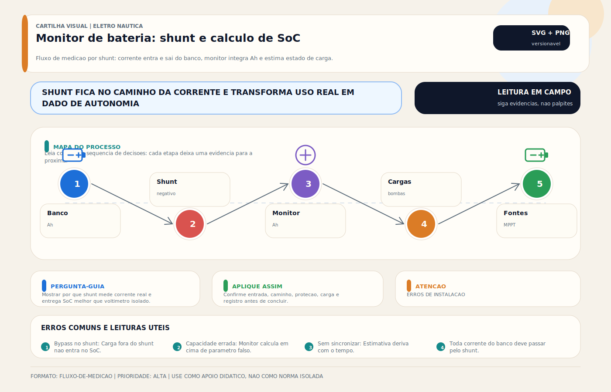

# Monitor de Bateria / BMV / Shunt

> [!abstract] Resumo técnico
> Monitor de bateria com shunt mede corrente, tensão e balanço acumulado de carga/descarga do banco para estimar SoC e autonomia. É uma ferramenta de gestão, não um oráculo: a qualidade do resultado depende da instalação do shunt, da parametrização e da rotina de sincronização.

## O que é

O monitor de bateria (também chamado BMV — Battery Monitor, ou coulomb counter) é um instrumento que mede a corrente que entra e sai do banco de baterias e, com base no acumulado, calcula o estado de carga (SoC — State of Charge) em percentual. O ponto de medição de corrente é o **shunt** — uma resistência de baixo valor calibrada que produz uma queda de tensão proporcional à corrente.

É um dos instrumentos mais importantes para gestão de energia a bordo, especialmente quando a embarcação depende de autonomia e múltiplas fontes de carga.

## Função

| Função | O que mede/calcula |
| --- | --- |
| Estado de carga (SoC%) | Quanto de energia restante no banco (de 0 a 100%) |
| Corrente instantânea | Quantos amperes estão entrando (+) ou saindo (−) agora |
| Tensão do banco | Tensão atual em tempo real |
| Consumo acumulado | Ah consumidos desde a última carga completa |
| Tempo restante | Estimativa de tempo até descarga total |
| Potência instantânea (W) | Alguns modelos calculam V × I |
| Histórico | Ciclos, profundidade de descarga, temperatura |

## Como aparece na prática

- Display compacto no painel principal (Victron BMV-712)
- App no smartphone via Bluetooth (SmartShunt, SmartSolar)
- Integrado ao painel touchscreen do chartplotter via NMEA 2000
- Dados no dashboard VRM (monitoramento remoto)
- Shunt instalado no cabo negativo entre a bateria e o barramento negativo

## Fundamentos mínimos

**O shunt como sensor de corrente:**

O shunt é uma resistência de valor muito pequeno e precisão muito alta (tipicamente 500A / 50mV — 0,0001Ω). Ao circular corrente pelo shunt, gera-se uma queda de tensão proporcional (I = V/R). O monitor mede essa microvolátagem e calcula a corrente.

**Por que shunt no negativo:**

O monitor de bateria mede TODA a corrente que entra ou sai do banco. Para isso, o shunt deve estar em série com TODOS os cabos negativos. O cabo negativo principal é o ponto correto — se houver cabos negativos bypassando o shunt, a medição será incorreta.

**Diferença entre SoC por tensão vs SoC por coulomb counting:**

- Por tensão: estimativa limitada, especialmente sob carga, logo após carga ou em químicas de curva plana
- Por coulomb counting: muito superior para gestão diária, mas ainda depende de calibração, eficiência assumida e sincronização correta

**Necessidade de sincronização (sync):**

O monitor de bateria acumula Ah desde a última sincronização (quando o banco estava a 100%). Quando o banco chega a 100% (absorção completa), o monitor zera o contador e recalibra. Sem sincronização frequente, o SoC vai derivar.

## Características

| Parâmetro | Victron SmartShunt 500A |
| --- | --- |
| Corrente máxima | 500A (shunt 500A/50mV) |
| Precisão | ±1% na corrente, ±2% no SoC |
| Conectividade | Bluetooth (app VictronConnect) |
| Integração | VRM, Cerbo GX, NMEA 2000 (via adaptador) |
| Consumo próprio | < 4mA (desprezível) |
| Tensão de trabalho | 8–70V DC |
| Temperatura de operação | −40 a +50°C |

## Configurações

**Parâmetros críticos a configurar:**

| Parâmetro | O que define |
| --- | --- |
| Capacidade do banco (Ah) | Base de cálculo do SoC — deve ser a capacidade REAL, não a nominal |
| Fator Peukert | Correção para descarga rápida (baterias de chumbo) — para lítio, usar 1.05 |
| Corrente de carga completa (tail current) | Corrente abaixo da qual o monitor sincroniza para 100% |
| Tensão de carga completa | Tensão acima da qual o monitor aguarda a tail current |
| Eficiência de carga | Quanto Ah retorna para o banco a cada Ah carregado (95% lítio, 80–85% chumbo) |

**Erro mais comum na configuração:**

Colocar a capacidade nominal em vez da capacidade real. Um banco de 200Ah teórico com 5 anos de uso pode ter apenas 130Ah reais. Com 200Ah configurado, o monitor indicará 65% quando o banco já está vazio.

## Marcas e referências

- **Victron SmartShunt 500A** — melhor custo-benefício, Bluetooth nativo, integração VRM
- **Victron BMV-712** — mesma tecnologia + display físico
- **Victron BMV-700** — versão sem Bluetooth, display, econômico
- **Simarine PICO** — monitor naval premium, múltiplos bancos, display touchscreen
- **Empirbus / Garnet SeeLevel** — integração com nível de tanques
- **Wakespeed WS500** — monitor de alternador com comunicação avançada
- **Sterling Power BAM** — monitor básico acessível

## Instalação do shunt

**Posição correta:**

```
[BANCO (−)] → [SHUNT] → [BARRAMENTO NEGATIVO] → [todas as cargas e retornos]
```

**O que NÃO pode estar entre o banco e o shunt:**

- Nenhum retorno que se queira contabilizar pode bypassar o shunt
- Exceções e caminhos paralelos precisam ser tratados conscientemente no projeto

**O que pode estar entre o shunt e o barramento:**

- Todos os cabos negativos de carga e retorno
- Shunt do alternador (se houver monitor separado)

**Resistência do shunt:**

Verificar se os terminais do shunt estão bem apertados — resistência adicional por mau contato altera a medição de corrente.

## Problemas mais frequentes

| Problema | Causa | Solução |
| --- | --- | --- |
| SoC indica 100% mas banco está vazio | Falta sincronização | Verificar tensão de sync e tail current |
| SoC deriva ao longo de dias | Configuração de eficiência incorreta | Ajustar fator Peukert e eficiência |
| Corrente mostrando valor errado | Cabo negativo bypassando o shunt | Verificar que TODOS os negativos passam pelo shunt |
| Monitor não sincroniza | Banco nunca atinge carga completa (carregador fraco, consumo alto) | Verificar sistema de geração |
| Display não acende | Alimentação do monitor (tipicamente do banco) | Verificar cabo de alimentação do monitor |

## Diagnóstico prático

**Verificar se o shunt está medindo corretamente:**

```
1. Ligar um equipamento com corrente conhecida (ex: lâmpada 12W = 1A)
2. Monitor deve mostrar −1A de descarga
3. Se mostrar valor diferente → verificar calibração ou cabo bypassando
```

**Verificar sincronização:**

```
1. Carregar o banco completamente (shore power, absorção completa)
2. Monitor deve ir para 100% automaticamente
3. Se não foi → verificar configurações de tail current e tensão de sync
```

## Boas práticas profissionais

- Instalar shunt em posição acessível — inspeção e verificação de terminais facilitada
- Configurar todos os parâmetros antes de usar — capacidade real, não nominal
- Fazer ciclo de calibração inicial (descarga controlada + carga completa) para afinar o SoC
- Verificar que o monitor sincroniza corretamente após carga completa
- Em bancos de lítio: configurar eficiência de carga para 95–98% (vs 80–85% do chumbo)
- Revisar periodicamente se a capacidade configurada ainda representa a capacidade real do banco envelhecido

## Erros comuns

**Instalar shunt no positivo:**

O monitor funciona, mas a instalação no negativo é o padrão correto (ABYC, Victron). No negativo, o shunt monitora toda a corrente do sistema — mais confiável.

**Cabo negativo bypassando o shunt:**

O técnico instalou o shunt mas esqueceu de passar o retorno de um circuito pelo shunt. Resultado: o monitor não conta essa corrente → SoC deriva rapidamente.

**Não configurar a capacidade real:**

Configurar 200Ah em banco que tem 150Ah reais → o monitor indica "50%" quando o banco já está quase vazio.

**Ignorar o monitor após instalar:**

Instalar e não usar os dados. O monitor só agrega valor se consultado regularmente para gerenciar o consumo.

## Relação com outros sistemas

- **Banco de baterias:** o monitor fornece o SoC real — essencial para gestão de autonomia
- **Victron VRM:** dados do SmartShunt aparecem no dashboard remoto
- **Monitoramento Remoto — VRM - Telemetria:** o monitor alimenta dashboards, alarmes e histórico de autonomia
- **Automação:** Cerbo GX usa dados do shunt para ativar gerador, controlar cargas
- **BMS (lítio):** BMS monitora células individuais; shunt monitora o banco como um todo — complementares
- **NMEA 2000:** SmartShunt com adaptador publica dados no barramento de instrumentos

## Normas aplicáveis

- **ABYC E-11** — medição e monitoramento de sistemas DC
- **Manuais dos fabricantes** — configuração específica por modelo

## Como ensinar este tópico

**Sequência recomendada:**

1. Problema: "seu banco tem 200Ah. Quanto tem agora?" → sem monitor, é chute
2. Mostrar app ao vivo: SoC%, corrente instantânea, tempo restante
3. Instalar shunt fisicamente — posição correta no negativo
4. Configurar parâmetros: capacidade real, eficiência, tail current
5. Fazer teste de calibração: descarregar e carregar, verificar que sincroniza em 100%

**Conceito-chave para fixar:**

"Gerenciar banco sem monitor é navegar sem GPS. Você chega — mas não sabe onde está."

## FAQ

**Posso usar o multímetro de tensão para estimar o SoC?**

Sim, aproximadamente, se a bateria estiver em repouso por pelo menos 1 hora sem carga ou carregamento. Mas a precisão é baixa e não fornece Ah restantes ou tempo estimado. O monitor de bateria é incomparavelmente mais preciso.

**SmartShunt ou BMV-712: qual escolher?**

SmartShunt se você usa smartphone para monitoramento (mais barato, mesmo desempenho). BMV-712 se quer display físico permanente no painel ou se o acesso ao smartphone é inconveniente a bordo.

**O monitor de bateria funciona com qualquer tipo de bateria?**

Sim — configura-se para chumbo-ácido, AGM, GEL ou LiFePO4 mudando os parâmetros (tensão de sync, tail current, eficiência, Peukert). A configuração correta por tipo de bateria é essencial para precisão.

## Visual didático



Mostrar por que shunt mede corrente real e entrega SoC melhor que voltimetro isolado.

**Cautela:** A posicao do shunt, referencia negativa e configuracao de capacidade/eficiencia devem seguir o fabricante.

Material de apoio: [Monitor de bateria: shunt e calculo de SoC](../_visuals/generated/monitor-bateria-shunt-fluxo.md)

## Integração com outras notas

- [[Bancos de Bateria]]
- [[Carregador de Bateria (AC To DC)]]
- [[Tipos de Bateria]]
- [[BMS — Battery Management System]]
- [[Lítio LiFePO4 — Instalação e Cuidados Específicos]]
- [[Monitoramento Remoto — VRM - Telemetria]]

## Perguntas que esta nota responde

- O que é Monitor de Bateria / BMV / Shunt em instalações elétricas náuticas?
- Qual é a função de Monitor de Bateria / BMV / Shunt na embarcação?
