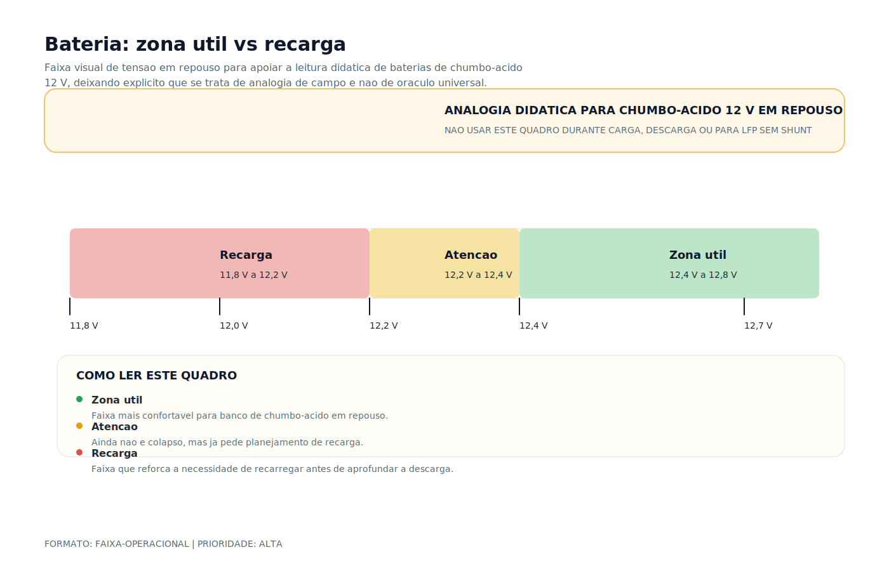

# Tipos de Bateria

> [!abstract] Resumo técnico
> Tipos de bateria devem ser comparados por química, função, regime de carga, profundidade de descarga, manutenção e integração com o restante do sistema. Escolher a bateria só por preço ou Ah de catálogo leva a erro de projeto, baixa autonomia e envelhecimento prematuro.

> [!tip] Regra de decisão em 30 segundos
> 1. **Partida e serviço em bancos separados — sempre.** Mesmo em lancha pequena, misturar partida e ciclo profundo no mesmo banco é o erro elétrico mais comum e mais caro do mercado brasileiro.
> 2. **Bateria automotiva só para partida, nunca para serviço.** Placas finas otimizadas para corrente de pico destroem-se em 6-18 meses sob descarga cíclica.
> 3. **A química define o carregador.** FLA ≠ AGM ≠ GEL ≠ LiFePO4. Tensão de absorção errada em 0,3-0,6 V causa dano cumulativo em centenas de ciclos — a bateria "some" antes do prazo e o proprietário acha que veio defeituosa.
> 4. **LiFePO4 sem BMS não é instalação — é risco estrutural.** ABYC E-13 e IEC 62619 tratam BMS como requisito, não acessório. Bateria lítio "drop-in" barata sem BMS certificado é economia que compra sinistro.
> 5. **Dimensione pela capacidade útil, não pela nominal.** AGM 100 Ah = 50 Ah úteis (50 % DoD). LiFePO4 100 Ah = 80 Ah úteis (80 % DoD). Projetar pelo número da etiqueta leva a subdimensionamento sistemático.
> 6. **Paralelo só com mesma química, marca, lote, idade e SoC no momento da conexão.** Diferente disso é circulação permanente de corrente, desequilíbrio e desgaste acelerado da bateria mais fraca.
> 7. **Série dobra tensão (12 V + 12 V = 24 V); paralelo dobra Ah, não tensão.** Combinar série-paralelo exige cuidado redobrado com equalização inicial e seleção de bateria.
> 8. **Fusível de banco ≤ 178 mm (7") do terminal positivo.** ABYC E-11 é explícita; a proteção precisa atuar antes do cabo derreter em curto franco com banco lítio ou AGM grande (Isc pode ultrapassar 10 kA).
> 9. **Ventilação é obrigatória para FLA** (H₂ durante carga é explosivo) e recomendada para AGM/GEL em compartimento fechado. Proximidade a motor, escapamento e cargas irradiantes degrada eletrólito em qualquer tecnologia.

> [!danger] Quando chamar um especialista
> - **Retrofit chumbo → lítio em embarcação existente.** Nunca trocar "1 por 1" — exige reavaliação do alternador (com regulador externo programável), do carregador (perfil LiFePO4), do BMS, do fusível e bitola de cabo (Isc do lítio é ordens de grandeza maior), da ventilação, da topologia de aterramento e da coordenação com inversor/shore. Projeto assinado com ART/CREA.
> - **Incêndio ou "thermal event" em banco** (LiFePO4 sem BMS, AGM inchada com liberação de ácido, FLA com explosão por H₂). Preservar cena, acionar seguradora, laudo pericial com ART/CREA, análise de causa raiz (química, carregador, BMS, cabeamento). Não recolocar bateria sem diagnóstico.
> - **Projeto de eletropropulsão** (48 V, 96 V, 400 V, bancos > 10 kWh). ISO 16315:2016, ABYC E-30 (draft) e IEC 62619/62620 entram como base. Exige responsável técnico, não balconista de loja.
> - **Sinistro com perda total ou parcial de banco** em marina, trânsito ou guarda. Laudo com química compatível com ISO 13297, ABYC E-10/E-13 e documentação de data de instalação, SoH e histórico de ciclos.
> - **Conversão de topologia de tensão** (12 V → 24 V, 24 V → 48 V). Recalcular banco, alternador, carregador, inversor, todo o cabeamento, proteção, bitolas e aterramento. Não é upgrade incremental — é reprojeto.
> - **Paralelismo de bancos heterogêneos** (idades, marcas, químicas ou tamanhos diferentes). Equalização fica impossível, a bateria mais fraca puxa a mais forte permanentemente, desgaste acelerado e risco térmico. Refazer o banco do zero.
> - **Bateria automotiva com mais de 1 ano em uso como serviço** com histórico de descargas profundas repetidas. Sulfatação irreversível, risco de falha súbita em momento crítico (ancoragem, motor principal, bomba de porão).
> - **Importação de embarcação ou retrofit de AGM europeia 12 V em sistema projetado para 24 V americano.** Reverificar toda a arquitetura de energia antes do primeiro uso. Documentação técnica do estaleiro original é essencial.
> - **Bateria comprada com mais de 12 meses de estoque sem rotação ou manutenção de tensão.** Capacidade comprometida, garantia normalmente invalidada, ciclos úteis reduzidos mesmo antes da instalação.

## O que é

Bateria é um dispositivo eletroquímico que converte energia química em elétrica (descarga) e energia elétrica em química (carga). Em embarcações, ela cumpre funções críticas que vão da partida do motor ao sustento de toda a carga de bordo sem motor ligado.

Cada tecnologia tem uma química diferente, com comportamento elétrico, perfil de carga, ciclo de vida e custo específicos. Não existe "bateria universal" para uso náutico — a escolha correta depende da função, do sistema de carga e do orçamento.

As tecnologias mais relevantes para embarcações de esporte e recreio no Brasil:

- **Chumbo-ácido inundada (FLA)** — mais barata, exige manutenção, pouco tolerante a vibração
- **AGM (Absorbed Glass Mat)** — selada, resistente, padrão atual no mercado náutico brasileiro
- **GEL** — selada, curva de carga específica, tolerante a calor, comum em embarcações europeias
- **Lítio LiFePO4** — alta performance, exige BMS e integração correta, custo inicial mais alto

## Função na embarcação

As baterias servem a bordo como:

- **Banco de partida:** fornece corrente de pico alta e curta para o motor de arranque. Parâmetro relevante: CCA (Cold Cranking Amperes). Bateria automotiva pode servir aqui desde que protegida de vibração.
- **Banco de serviço:** fornece corrente moderada por tempo prolongado para iluminação, bombas, eletrônicos, rádio, GPS. Exige bateria de ciclo profundo.
- **Reserva de emergência:** terceiro banco em embarcações maiores, isolado para garantia de partida do motor principal.
- **Buffer de energia:** em sistemas com múltiplas fontes (shore power, solar, gerador, alternador), o banco recebe e entrega energia conforme disponibilidade.

A separação de bancos por função é um dos princípios fundamentais do projeto elétrico náutico. Misturar partida e serviço em um único banco é o erro mais comum e mais custoso.

## Como aparece na prática

**Embarcações nacionais menores (alumínio, pesca, lanchas populares):**

Quase sempre bateria automotiva convencional para tudo — partida e serviço misturados. Vida útil de 1-2 anos no melhor caso. Erro comum repetido por anos sem o proprietário entender a causa.

**Lanchas médias de fibra (18-28 pés):**

AGM como banco de serviço começa a aparecer, mas configuração raramente está correta. Bateria de partida separada às vezes existe, mas mal gerenciada — sem chave seletora adequada, sem fusível de banco.

**Barcos de vela e cruising:**

Configuração mais cuidadosa — banco de serviço AGM ou GEL de maior capacidade, alternador regulado, às vezes solar. Nível de organização elétrica superior ao mercado de potência.

**Embarcações importadas (Beneteau, Jeanneau, Azimut, etc.):**

AGM em configuração de banco, às vezes dois bancos separados (partida + serviço). Sistema projetado para padrão europeu.

**Embarcações premium e projetos modernos:**

LiFePO4 com BMS dedicado. Crescente especialmente em barcos acima de 40 pés ou projetos de integração elétrica completa.

## Fundamentos mínimos

**Por que a química importa:**

Cada tecnologia tem um perfil de tensão diferente durante carga e descarga. Usar carregador de AGM em GEL pode danificar as células ao longo do tempo. Usar carregador de chumbo em lítio pode causar incêndio.

**Conceitos essenciais:**

- **Capacidade (Ah):** quantidade de carga elétrica entregue sob um regime de ensaio. O valor real a bordo depende da taxa de descarga, temperatura e envelhecimento.
- **DoD (Depth of Discharge):** profundidade de descarga segura. AGM: 50%. GEL: 50-60%. LiFePO4: 80-90%.
- **C-rate:** taxa de carga/descarga em relação à capacidade. 1C em 100Ah = 100A. Chumbo-ácido prefere baixo C-rate de carga (C/5 a C/10).
- **Ciclos de vida:** número de ciclos carga/descarga antes de perda significativa de capacidade.
- **Tensão de corte:** deve ser interpretada com carga, repouso, química e proteção do sistema. Não existe um único número útil para todos os cenários.
- **SoC (State of Charge):** percentual de carga atual. Monitorar SoC real exige shunt — voltímetro sozinho é impreciso para chumbo.

## Visual didático — zona útil vs momento de recarga

Este gráfico é uma analogia didática para leitura rápida de tensão em repouso em baterias de chumbo-ácido de 12 V. Ele não substitui ficha técnica do fabricante, medição sob procedimento controlado nem monitor com shunt.

Leitura prática sugerida:

- zona confortável: a bateria ainda está em faixa saudável para operação cotidiana;
- zona de atenção: vale investigar consumo, tempo sem recarga e estado geral do banco;
- zona de recarga: a prioridade passa a ser restaurar energia antes de aprofundar a descarga.

Para LiFePO4, esta heurística não serve como medidor confiável de estado de carga, porque a curva de tensão é mais plana.

Material de apoio: [Bateria: zona util vs recarga](../_visuals/generated/bateria-zona-util-vs-recarga.md)

## Características principais por tecnologia

**Chumbo-ácido inundada (FLA):**

- Custo mais baixo de todas as tecnologias
- Exige ventilação obrigatória — libera H₂ durante carga (explosivo)
- Exige reposição de água destilada periodicamente
- Alta sensibilidade a vibração
- DoD recomendado depende da vida útil desejada e da ficha técnica do fabricante
- Ciclos: 200-400 a 50% DoD
- Tensão nominal: 12V (6 células de 2V cada)

**AGM (Absorbed Glass Mat):**

- Eletrólito absorvido em mantas de fibra de vidro
- Selada — sem necessidade de reposição de nível
- Tolerante a vibração e instalação em ângulo
- Baixa autodescarga (~3% ao mês)
- Aceita carga mais rápida que GEL
- Tensão de absorção: 14,4-14,7V
- DoD recomendado: 50%
- Ciclos: 300-600 a 50% DoD
- Muito difundida no mercado náutico brasileiro

**GEL:**

- Eletrólito em forma de gel (sílica + ácido sulfúrico)
- Selada, tolerante a temperaturas altas
- Tensão máxima de absorção: ~14,1V (menor que AGM — ponto crítico)
- Não aceita carga rápida — danifica as células
- Melhor performance em descarga profunda lenta
- DoD recomendado: 50-60%
- Ciclos: 500-800
- Encontrada em parte das embarcações importadas e em aplicações específicas

**Lítio LiFePO4:**

- Peso reduzido — 1/3 do chumbo para mesma capacidade útil
- Alta eficiência de carga: ~98% vs ~85% do chumbo
- Exige BMS (Battery Management System) — obrigatório
- Carga rápida possível dentro do limite declarado pelo fabricante e pela estratégia térmica do sistema
- Temperatura segura para carga: 0°C a 45°C
- DoD seguro: 80-90%
- Ciclos: 2000-5000 a 80% DoD
- Custo inicial: 3-5x maior que AGM equivalente
- Em alguns cenários de uso intensivo, o custo total de propriedade pode ser competitivo

## Configurações e variações comuns

**Banco de partida vs banco de serviço:**

Separação funcional é a prática correta na maioria das embarcações. Banco de partida privilegia corrente de pico e confiabilidade de arranque; banco de serviço privilegia ciclo e autonomia.

**Bancos em paralelo:**

Aumenta capacidade em Ah sem alterar tensão. Exige baterias do mesmo tipo, mesma marca, mesma idade e estado de carga equilibrado no momento da conexão. Baterias desiguais criam circulação de corrente permanente entre elas.

**Bancos em série:**

Dobra a tensão (dois 12V = 24V). Capacidade em Ah permanece igual à de uma bateria individual. Comum em sistemas 24V e motores diesel maiores.

**Sistema isolado para emergência:**

Terceiro banco separado em embarcações maiores. Garantia de partida mesmo com bancos de serviço descarregados.

**LiFePO4 com BMS centralizado:**

Configuração profissional. BMS monitora tensão de célula, temperatura e corrente. Protege contra sobrecarga, descarga profunda e curto-circuito. Pode comunicar com monitores e sistemas de bordo via NMEA 2000 ou CAN bus.

## Principais marcas

**Chumbo-ácido / AGM — Mercado nacional:**

- **Moura** — líder no Brasil, boa disponibilidade, qualidade consistente. Linha Estacionária/Solar para ciclo profundo.
- **Heliar** — tradicional, acessível. Linha Freedom com perfil de ciclo profundo.
- **Tudor / Exide** — presentes no varejo, qualidade adequada para uso básico.

**AGM — Mercado náutico importado:**

- **Victron Energy** — referência absoluta no náutico. AGM Deep Cycle e AGM Super Cycle. Ecossistema completo integrado.
- **Fullriver** — importada, boa qualidade, popular em instalações maiores.
- **Trojan** — americana, referência em ciclo profundo, popular em sistemas náuticos e off-grid.

**GEL:**

- **Victron GEL** — referência no náutico, curva de carga bem documentada.
- **Sonnenschein (Exide)** — tradicional europeia, qualidade técnica reconhecida.
- **Banner** — europeia, boa performance em aplicações náuticas.

**LiFePO4:**

- **Victron** — padrão premium, integração total com ecossistema Smart Battery System.
- **Battle Born** — americana, popular em barcos de cruising.
- **SOK / Ampere Time / LiTime** — chinesas, custo acessível, qualidade variável. Avaliar BMS integrado.

## Componentes e sistemas relacionados

- **Carregador de bateria** — deve ter perfil compatível com a química (AGM, GEL e LiFePO4 são configurações diferentes no carregador)
- **Alternador** — tensão, corrente contínua e estratégia de regulação devem ser compatíveis com a química e o banco
- **BMS** — obrigatório em LiFePO4. Pode ser integrado (bateria pronta) ou externo (bancos de células)
- **Monitor de bateria / Shunt** — mede SoC real por integração de corrente. Victron BMV, Victron SmartShunt, Simarine PICO
- **Chave seletora de banco** — isola e seleciona bancos. Blue Sea Systems, Mastervolt
- **Fusíveis de banco** — proteção contra curto-circuito. Fusível ANL ou MIDI próximo ao terminal positivo
- **Controlador MPPT solar** — deve ter perfil configurado para a química da bateria
- **Sistema de ventilação** — obrigatório para FLA, recomendado para AGM/GEL em compartimentos fechados

## Onde costuma dar problema

| Problema | Sintoma típico | Consequência |
| --- | --- | --- |
| Bateria automotiva como serviço | Descarga rápida, não sustenta carga por tempo | Vida útil 6-18 meses |
| Banco subdimensionado | Tensão cai com carga leve | Motor não parte, cargas caem |
| Tecnologias mistas em paralelo | Desequilíbrio de carga | Desgaste acelerado da bateria mais fraca |
| Carregador incorreto para GEL | Superaquecimento, inchamento | Dano prematuro, substituição antecipada |
| LiFePO4 sem BMS | Sem sintoma visível até a falha | Risco de incêndio, perda total do banco |
| Descarga profunda não revertida | Tensão abaixo de 10,5V | Sulfatação irreversível no chumbo |
| Terminais sem proteção | Corrosão branca nos bornes | Alta resistência de contato, perda de carga |

## Causas raiz

**Bateria morre em menos de 2 anos:**

Causa raiz mais comum: bateria automotiva usada como banco de serviço. A bateria automotiva tem placas finas otimizadas para corrente de pico, não para descarga cíclica. Cada ciclo profundo destrói uma camada de material ativo. Não é defeito de fabricação — é uso inadequado.

**Banco em paralelo desequilibrado:**

Causa raiz: baterias de idades, marcas ou estados de carga diferentes. A bateria mais fraca age como carga permanente para a mais forte — aquece e se degrada mais rapidamente, puxando o banco inteiro para baixo.

**GEL danificada por carregador AGM:**

Causa raiz: tensão de absorção incorreta. GEL aceita máximo ~14,1V. Carregadores AGM chegam a 14,4-14,7V. Diferença pequena no número, grande no dano acumulado ao longo de centenas de ciclos.

**LiFePO4 com BMS disparando frequentemente:**

Causa raiz: célula desequilibrada, temperatura extrema, limite de corrente inadequado ou sistema de carga não coordenado com o BMS.

## Diagnóstico prático

**Verificação rápida em campo:**

Tensão em repouso (sem carga há mais de 2h) — bateria de chumbo:

- 12,7V ou mais → carga completa (~100% SoC)
- 12,4V → ~75% SoC
- 12,2V → ~50% SoC
- 12,0V → ~25% SoC
- Abaixo de 11,8V → profundamente descarregada

Teste com carga (10A por 30 segundos): tensão caiu mais de 0,5V imediatamente? Bateria enfraquecida.

Teste de partida: durante cranking, tensão não deve cair abaixo de 9,6V (sistema 12V).

**Banco em paralelo com problema:**

Medir tensão individual de cada bateria após carga completa e 2h de repouso. Diferença acima de 0,2V indica desequilíbrio — bateria com menor tensão provavelmente com problema.

**AGM inchada:**

Visual direto: caixa deformada. Causa: sobrecarga por carregador com tensão incorreta. Não tem reparo — substituir imediatamente.

**LiFePO4 com BMS disparado:**

Banco "desaparece" — tensão sobe ao remover carga mas não fornece corrente. Verificar alarmes do BMS, temperatura das células e equilíbrio de célula.

## Boas práticas

✅ Separar sempre banco de partida do banco de serviço

✅ Dimensionar o banco pela profundidade de descarga compatível com a química e com a vida útil desejada

✅ Usar baterias do mesmo tipo, marca e lote em bancos em paralelo

✅ Instalar monitor de bateria com shunt — voltímetro sozinho não é suficiente

✅ Documentar data de instalação, capacidade e parâmetros do banco

✅ Proteger terminais com vaselina técnica ou spray anticorrosivo

✅ Instalar fusível de banco o mais próximo possível do terminal positivo

✅ Fixar mecanicamente contra vibração — suporte firme, cinta ou bandeja dedicada

✅ Verificar tensão e estado dos terminais a cada 3-6 meses

✅ Para FLA: verificar nível do eletrólito mensalmente em clima quente

## Cuidados de instalação

- **Fixação mecânica:** vibração a bordo é constante e intensa. Bateria mal fixada se move, quebra terminais, causa curto-circuito. Usar bandeja, suporte com cinta ou compartimento específico.
- **Ventilação:** FLA libera H₂ durante carga — explosivo. Compartimento ventilado com saída para o exterior é obrigatório. AGM e GEL dispensam ventilação rígida, mas local arejado ainda é preferível.
- **Proteção dos terminais:** ambiente marinho corrói cobre e chumbo rapidamente. Aplicar vaselina técnica ou spray de proteção após conexão.
- **Fusível de banco:** proteção contra curto-circuito na linha principal. ANL ou MIDI fuse dimensionado para o cabo, instalado no máximo 30cm do terminal positivo da bateria.
- **Distância de fontes de calor:** motor, escapamento, equipamentos eletrônicos. Calor reduz vida útil e pode degradar o eletrólito.
- **Cabos dimensionados para pico:** corrente de partida pode atingir 400-600A. Cabo subdimensionado aquece, cai tensão e pode causar incêndio.

## Cuidados de uso

- Não descarregar AGM/GEL abaixo de 50% com frequência — reduz drasticamente a vida útil
- Recarregar imediatamente após descarga profunda — sulfatação começa em poucas horas no chumbo
- Monitorar temperatura no verão — baterias de chumbo degradam mais rápido acima de 30°C
- Desconectar banco de serviço em longos períodos sem uso
- LiFePO4: nunca carregar abaixo de 0°C — dano permanente por deposição de lítio metálico
- Não aplicar equalização em AGM, GEL ou LiFePO4 — processo válido apenas para FLA inundada
- Nunca conectar baterias de datas de fabricação muito diferentes em paralelo

## Erros comuns

❌ **Usar bateria automotiva como banco de serviço** — erro mais comum e mais custoso. Dura 6-18 meses no máximo em ciclo profundo.

❌ **Misturar marcas, idades ou estados de carga em bancos paralelos** — desequilíbrio permanente, desgaste acelerado.

❌ **Usar carregador de carro (14,8V+) em AGM ou GEL** — tensão de equalização destrói baterias seladas.

❌ **Instalar LiFePO4 sem BMS** — risco real de incêndio. BMS não é opcional.

❌ **Não separar banco de partida do banco de serviço** — arrisca não partir o motor após uma noite de consumo.

❌ **Dimensionar pela disponibilidade de espaço, não pela demanda** — banco subdimensionado sofre descarga profunda constante.

❌ **Não proteger terminais em ambiente marinho** — corrosão visível em 3-6 meses de marina.

❌ **Ignorar data de fabricação na compra** — bateria estocada por 1+ ano perde capacidade. Verificar sempre.

❌ **Conectar lítio e chumbo no mesmo banco** — perfis de carga completamente incompatíveis. Nunca fazer isso.

## Relação com outros sistemas

- **Alternador:** tensão de regulagem precisa ser compatível com a química. AGM: 14,4-14,7V de absorção. GEL: máximo 14,1V. LiFePO4: exige regulador externo programável.
- **Carregador de cais:** perfil de carga (bulk/absorção/flutuação) deve ser configurado para o tipo correto. Carregador errado é a causa mais comum de dano em baterias de barco.
- **BMS (LiFePO4):** controla cada célula individualmente. Comunica com alternador, carregador e monitor em sistemas avançados via NMEA 2000 ou CAN bus.
- **Monitor de bateria:** shunt na linha negativa mede corrente real e integra para calcular SoC. Dados precisos de tensão, corrente, Ah consumidos e Ah restantes.
- **Controlador MPPT solar:** perfil configurável para AGM, GEL ou LiFePO4.
- **Sistema de distribuição DC:** chave seletora, barramento, disjuntores — todos dimensionados para a corrente máxima possível do banco.

## Glossário rápido

- **Bateria** — dispositivo eletroquímico que converte energia química em elétrica (descarga) e vice-versa (carga). "Bateria" no uso técnico é o conjunto; "célula" é a unidade.
- **Célula** — unidade eletroquímica básica. Chumbo-ácido: 2,0 V nominais (6 células em série = 12 V). LiFePO4: 3,2 V nominais (4 células em série = 12,8 V).
- **FLA (Flooded Lead-Acid)** — chumbo-ácido inundada, eletrólito líquido, placas imersas. Exige ventilação (H₂), reposição de água, cuidado com derramamento.
- **AGM (Absorbed Glass Mat)** — chumbo-ácido selada, eletrólito absorvido em mantas de fibra de vidro. Padrão atual no náutico brasileiro.
- **GEL** — chumbo-ácido selada, eletrólito em forma de gel de sílica. Tensão máxima de absorção menor que AGM (~14,1 V).
- **VRLA (Valve-Regulated Lead-Acid)** — família de chumbo selado que inclui AGM e GEL. Válvula de alívio para gases sob pressão.
- **LiFePO4 (Lítio Ferro-Fosfato)** — química de lítio mais estável termicamente; padrão náutico atual. 3,2 V/célula nominal.
- **NMC (Nickel Manganese Cobalt)** — química lítio de maior densidade de energia, usada em automotivo; menos estável termicamente que LiFePO4, uso naval restrito.
- **LCO, LMO, LTO, NCA** — outras químicas lítio (cobalto, manganês, titanato, níquel-cobalto-alumínio); raras em náutica recreativa.
- **Banco de partida** — conjunto dedicado a fornecer corrente de pico alta (CCA/MCA) para o motor de arranque.
- **Banco de serviço (house bank)** — conjunto dedicado a cargas prolongadas (luzes, bombas, eletrônicos). Exige ciclo profundo.
- **Banco de emergência** — terceiro conjunto isolado, garante partida do motor mesmo com bancos principais descarregados.
- **Buffer** — função de "pulmão" do banco em sistemas com múltiplas fontes (shore, solar, gerador, alternador).
- **Ah (ampère-hora)** — capacidade nominal de carga. Depende do regime de ensaio (C/20 padrão chumbo, C/5 padrão lítio).
- **Wh (watt-hora)** — energia armazenada: Ah × tensão nominal. Métrica mais comparável entre tecnologias diferentes.
- **C-rate** — taxa de carga/descarga em múltiplos da capacidade: 1C em 100 Ah = 100 A. Chumbo prefere C/5–C/10; LiFePO4 tolera 0,5C-1C em carga.
- **DoD (Depth of Discharge)** — percentual descarregado em relação à nominal. AGM 50 %, GEL 50-60 %, LiFePO4 80-90 % como regra de projeto.
- **SoC (State of Charge)** — percentual de carga atual. Medido por tensão em repouso (chumbo) ou integração de corrente com shunt (todas).
- **SoH (State of Health)** — percentual de capacidade remanescente em relação à nova. Cai com ciclos e tempo.
- **Ciclo** — uma descarga parcial ou total seguida de recarga. Ciclos a 50 % DoD contam diferente de ciclos a 100 % DoD.
- **CCA (Cold Cranking Amperes)** — corrente entregue a -18 °C por 30 s mantendo ≥ 7,2 V em bateria 12 V. Métrica de partida.
- **MCA (Marine Cranking Amperes)** — equivalente a 0 °C; número maior que CCA para a mesma bateria (SAE J1495).
- **RC (Reserve Capacity)** — minutos que a bateria sustenta 25 A descendo a 10,5 V a 27 °C. Métrica de autonomia.
- **Tensão nominal** — valor de referência (12 V, 24 V, 48 V). Não é tensão real medida — é classe do banco.
- **Tensão de absorção** — tensão alta de recarga (14,4-14,7 V para AGM 12 V; 14,6 V para LiFePO4). Carregador mantém até corrente cair abaixo de limiar.
- **Tensão de flutuação (float)** — tensão baixa de manutenção (13,2-13,8 V chumbo; 13,6 V ou desligada em LiFePO4). Carregador mantém indefinidamente.
- **Tensão de equalização** — tensão extra-alta (15,5-16 V) aplicada periodicamente em FLA para dessulfatar. **Nunca aplicar em AGM, GEL ou lítio.**
- **Bulk / Absorção / Flutuação** — três estágios do perfil clássico de carga: corrente constante, tensão constante, manutenção.
- **Sulfatação** — formação de cristais de sulfato de chumbo nas placas por descarga profunda prolongada. Irreversível após horas.
- **Gassing** — liberação de H₂ e O₂ durante carga. Intenso em FLA; controlado em VRLA. **Hidrogênio é explosivo em 4-75 % v/v no ar.**
- **Thermal runaway** — reação em cadeia exotérmica. Em LiFePO4 é extremamente improvável sem dano mecânico; em NMC/LCO é o risco central. UL 9540A avalia propagação.
- **BMS (Battery Management System)** — sistema eletrônico obrigatório em lítio. Mede tensão/temperatura de célula, corrente do banco, estado de carga; protege contra sobrecarga, sobredescarga, curto, sobreaquecimento; balanceia células.
- **Balanceamento passivo / ativo** — passivo dissipa energia da célula mais alta em resistor; ativo transfere carga entre células. Ativo é mais eficiente mas mais complexo.
- **Shunt** — resistor calibrado de baixo valor na linha negativa; o monitor lê a queda de tensão e calcula corrente real (bidirecional).
- **Monitor de bateria** — BMV/SmartShunt/Simarine PICO; integra corrente no tempo para SoC real (coulomb counting).
- **Paralelismo** — ligação +/+ e -/- entre baterias; dobra Ah, mantém tensão. Exige química, marca, idade e SoC iguais.
- **Série** — ligação + de uma ao - da outra; dobra tensão, mantém Ah. Banco de 24 V típico é 2 × 12 V em série.
- **Fusível de banco** — proteção contra curto-circuito na saída do positivo. ANL, MRBF, Class T. Máximo **178 mm (7")** do terminal positivo segundo ABYC E-11.
- **AIC (Ampere Interrupting Capacity)** — capacidade do fusível de interromper a corrente máxima esperada. Critico em lítio — Isc pode ultrapassar 10 kA.
- **Isc (corrente de curto-circuito)** — corrente máxima que o banco entrega em curto franco. Varia por química e configuração; declarada em datasheet do fabricante.
- **NMEA 2000 / CAN bus** — redes de comunicação para BMS moderno reportar SoC, SoH, alarmes e comandar carregador/alternador.
- **Compartimento ventilado** — requisito ABYC/ISO para FLA; entrada baixa + saída alta com saída ao exterior; cálculo de vazão por Ah e regime de carga.
- **Fixação mecânica** — bandeja, cinta, suporte rígido contra vibração. Bateria solta quebra terminal, fura invólucro, causa curto.
- **Data code / data de fabricação** — estampagem ou etiqueta do fabricante. Rotação FIFO em revenda; bateria > 12 meses de estoque perde capacidade e garantia.
- **ESD (Electric Shock Drowning)** — morte por corrente AC dispersa em água doce; relevante no banco porque carregador defeituoso alimentando banco defeituoso pode gerar vazamento entre DC e AC em sistemas com bond único.

## Brasil x referências internacionais

🌎 **Brasil x referências internacionais**

**Prática comum no Brasil:**

Bateria automotiva como banco de serviço é extremamente difundida, especialmente em embarcações menores. AGM começa a ser padrão apenas em instalações mais cuidadosas ou em embarcações importadas. Ventilação de compartimento raramente obedece a critérios formais.

**Referência ABYC E-10 (2023):**

Define separação formal de bancos (start / house / emergency), exige baterias marinhas certificadas, compartimento ventilado para FLA com saída exterior, fusível próximo ao terminal positivo, fixação mecânica adequada.

**Referência ISO 13297:2020** *(sucede a ISO 10133, retirada):*

Para pequenas embarcações — aborda proteção do circuito principal, bitolamento de cabos, instalação de baterias e proteção contra curto-circuito em sistemas AC e DC. Ver nota mestre [[Normas e Regulamentações — Abyc Iso e Brasil]] para contexto da migração.

**Ponto de conflito:**

No Brasil, a maioria das instalações não usa baterias com certificação marinha específica e não segue rigorosamente a separação de bancos. A norma brasileira tem menor detalhamento técnico em instalação elétrica que a ABYC.

**Leitura equilibrada:**

Adotar os princípios funcionais da ABYC — separação de bancos, fixação, ventilação, fusível próximo ao terminal — é viável e recomendável independentemente de certificação formal. A lógica de segurança se aplica universalmente.

## Normas e referências aplicáveis

| Referência | O que orienta | Relevância prática | Cuidado no Brasil |
| --- | --- | --- | --- |
| ABYC E-10 (2023) | Storage batteries em embarcações | Separação de bancos (start/house/emergency), ventilação, fixação, proteção, compartimento | Contexto americano — princípios funcionais aplicáveis independentemente de certificação formal |
| ABYC E-11 (2023) | AC and DC Electrical Systems on Boats | Regra do fusível ≤ 178 mm do terminal positivo; proteção de cabo; bitolagem; cores | Base técnica de referência para laudo em retrofit e peritagem |
| ABYC E-13 (2023) | Lithium Ion Batteries | Requisito de BMS certificado, ensaios, instalação, manuseio em incêndio | Vital em projetos LiFePO4; tratar BMS como sistema de segurança, não acessório |
| ISO 13297:2020 | Pequenas embarcações — AC e DC | Proteção, bitolamento, instalação; sucede a ISO 10133 (retirada) | Referência viva aplicável a barcos < 24 m |
| ISO 16315:2016 | Electric propulsion system | Eletropropulsão e bancos de alta tensão/energia | Base para bancos > 10 kWh e sistemas 48/96/400 V |
| ISO 8846:2022 | Proteção contra ignição de gases inflamáveis | Ignition protection em equipamentos no compartimento do motor/baterias | Relevante em FLA perto de motor a gasolina |
| UL 1973:2022 | Baterias estacionárias/auxiliares/light rail | Teste de segurança de célula/pack para instalação fixa | Usado por fabricantes premium (Victron, Battle Born) como evidência |
| UL 9540A | Thermal runaway fire propagation | Avaliação de propagação térmica em sistemas de armazenamento de energia | Relevante em projetos com múltiplos packs lítio |
| IEC 62619:2022 | Safety requirements for lithium batteries | Segurança de células e packs secundários lítio de uso industrial | Amplamente referenciada em datasheets de células importadas |
| IEC 62620:2014 | Secondary lithium cells for industrial applications | Desempenho e durabilidade | Cruza com 62619 para packs náuticos |
| SAE J1495 | Marine Cranking Amperes test | Definição padrão de MCA | Comparação correta entre baterias de partida marítimas |
| NBR 5410:2004 | Instalações elétricas de baixa tensão | Base brasileira para sistemas AC a bordo após o shore inlet | Não cobre DC náutico com profundidade — usar ABYC/ISO |
| NORMAM-211/DPC | Embarcações de esporte e recreio (Brasil) | Exigências administrativas e de segurança da autoridade marítima brasileira | Aplicável a todas as embarcações de recreio; não substitui norma técnica |
| Victron Energy (documentação técnica) | Parâmetros de produto e integração | Muito bem documentado — usar como referência prática de perfil de carga | Produto premium — adaptar parâmetros para outros fabricantes |
| Datasheets do fabricante | Perfis específicos de carga/descarga, BMS, ciclos | Essencial para configurar carregador, alternador, MPPT, inversor | Sempre consultar antes de qualquer instalação; registrar na pasta técnica da embarcação |

## Destaques para ensino

🧠 **Pontos de maior impacto didático:**

- **Bateria automotiva vs ciclo profundo** — entrada mais poderosa do tema. Mostrar com números: 50-100 ciclos profundos na automotiva vs 500+ na AGM de ciclo profundo.
- **Conceito de DoD** — banco de 100Ah AGM = 50Ah utilizáveis na prática. Poucos técnicos dimensionam considerando isso.
- **Incompatibilidade GEL × carregador AGM** — diferença de 0,3-0,6V na tensão de absorção, mas dano acumulado real em centenas de ciclos.
- **Custo total de propriedade LiFePO4** — 4 trocas de AGM em 10 anos vs 1 banco LiFePO4. Números reais mudam completamente a percepção de custo.
- **BMS como sistema de segurança, não acessório** — mostrar casos reais de incêndio por ausência de BMS.

📸 **Recursos visuais de alto impacto:**

- AGM inchada por sobrecarga — foto real
- Bateria automotiva destruída após 1 ano de uso como serviço — foto comparativa
- Gráfico de ciclos de vida por tecnologia (curva de capacidade × ciclos)

## Ideias de vídeo, aula prática ou demonstração

🎬 **Conteúdo sugerido:**

- **"Por que sua bateria de barco não dura"** — diferença prática entre automotiva e ciclo profundo. Alto potencial de engajamento.
- **Comparativo visual: AGM vs GEL vs LiFePO4** — peso, tamanho, terminais, preço. Fácil de filmar com produtos físicos.
- **Como testar uma bateria náutica com multímetro** — procedimento passo a passo em campo.
- **Configurando carregador para GEL vs AGM** — demonstração do erro mais comum.
- **Estudo de caso: incêndio por LiFePO4 sem BMS** — discussão técnica com fotos reais.

## Ideias de diagramas, circuitos ou imagens

📊 **Diagramas e visuais sugeridos:**

- **Diagrama: banco de partida + banco de serviço + chave seletora** — configuração básica mais importante
- **Curva de descarga comparativa: AGM vs GEL vs LiFePO4** — tensão × % de descarga
- **Perfil de carga (bulk / absorção / flutuação) por tecnologia** — lado a lado
- **Tabela comparativa consolidada:** tecnologia × DoD × ciclos × peso × custo × aplicação ideal
- **Diagrama de proteção:** localização do fusível de banco, distância do terminal, bitola
- **Foto real:** fixação correta em compartimento náutico, terminais protegidos, etiquetagem
- ❓ Perguntas frequentes

**Posso usar bateria de carro no barco?**

Para partida: funciona, com redução de vida útil por vibração e umidade. Para banco de serviço: não recomendado. Bateria automotiva morre em 6-18 meses em ciclo profundo.

**AGM e GEL são a mesma coisa?**

Não. Ambas são seladas, mas têm perfis de carga diferentes. AGM aceita 14,4-14,7V de absorção. GEL: máximo 14,1V. Usar carregador de AGM em GEL causa dano acumulado ao longo do tempo.

**Preciso de BMS para AGM?**

Não obrigatório, mas um monitor com shunt é altamente recomendado para controle real de SoC. BMS é obrigatório apenas para lítio.

**LiFePO4 pega fogo facilmente?**

LiFePO4 é a química mais estável da família lítio. Com BMS correto e instalação adequada, o risco é muito baixo. O perigo real está em instalações sem BMS ou com BMS inadequado.

**Quantos Ah preciso para meu barco?**

Some todas as cargas em watts, divida por 12V para obter ampères, multiplique pelas horas de uso diário. Dobre para AGM (usa 50%) ou multiplique por 1,25 para LiFePO4 (usa 80%).

**Posso misturar AGM e GEL no mesmo banco?**

Não. Perfis de carga diferentes causam desequilíbrio e dano. Sempre usar o mesmo tipo, marca e lote.

**Quanto tempo dura uma bateria AGM em uso náutico?**

Com uso correto (não descarregar abaixo de 50%, carregador compatível, ambiente ventilado): 4-7 anos. Com uso incorreto: 1-3 anos.

## Integração com outras notas

- [[Bancos de Bateria]]
- [[Alternador (DC)]]
- [[Carregador de Bateria (AC To DC)]]
- [[Monitor de Bateria / BMV / Shunt]]
- [[BMS — Battery Management System]]
- [[Lítio LiFePO4 — Instalação e Cuidados Específicos]]
- [[Tipos de Embarcação]]
- [[Tipos de Lâmpadas e LEDs Náuticos]]

## Perguntas que esta nota responde

- O que é Tipos de Bateria em instalações elétricas náuticas?
- Qual é a função de Tipos de Bateria na embarcação?
