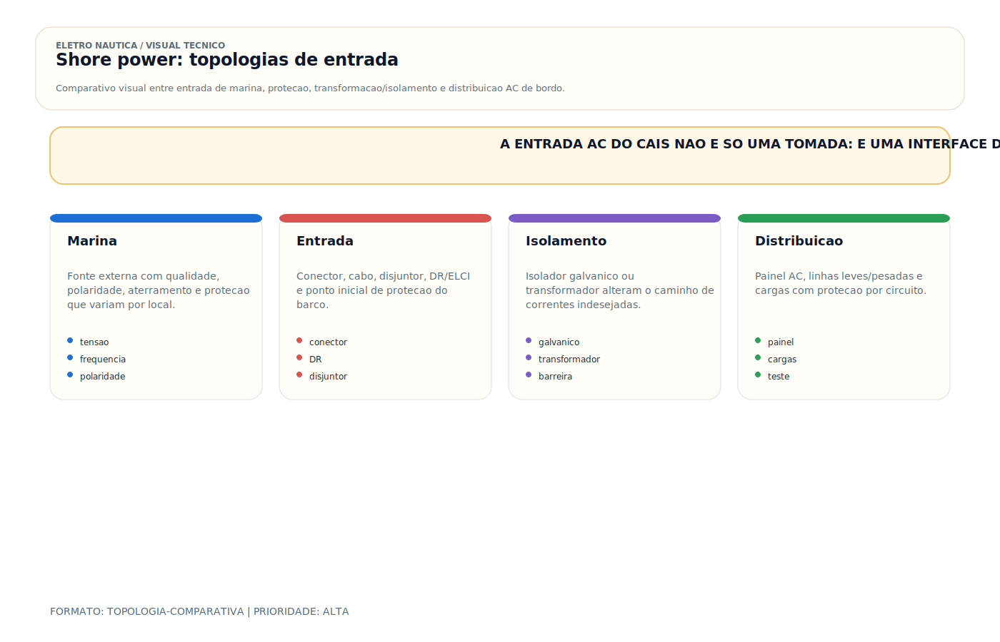

# CAIS (Pier) (AC)

> [!abstract] Resumo técnico
> Shore power é a interface elétrica entre a marina e o sistema AC da embarcação. Além de fornecer energia, ele introduz condicionantes de segurança, qualidade de energia, corrosão galvânica e compatibilidade de topologia que precisam ser tratados antes de simplesmente conectar o barco. No Brasil, isso inclui um problema recorrente: `220 V` pode chegar como `fase-neutro` ou como `fase-fase`.

## O que é

Shore power é o fornecimento de energia elétrica AC da marina (cais/pier) para a embarcação através de um cabo flexível com conectores específicos. Substitui o gerador interno e o banco de baterias como fonte principal de energia AC quando o barco está atracado.

O sistema envolve três elementos: o pedestal de marina (ponto fixo no cais com tomada e disjuntor), o cabo de pier (flexível, com plugue e receptáculo), e o inlet de bordo (tomada instalada no costado ou popa da embarcação conectada ao painel AC interno).

**Por que o shore power é crítico do ponto de vista elétrico:**

Ao conectar a embarcação ao cais, cria-se uma interface entre duas instalações: a da marina e a do barco. Dependendo da arquitetura adotada, isso pode introduzir compartilhamento de PE, diferenças de potencial, correntes galvânicas, fuga à terra e falhas de polaridade ou de tensão. O sistema de entrada precisa ser pensado como fronteira técnica, não como simples tomada externa.

## Função

| Função | Detalhe |
| --- | --- |
| Fonte de energia AC a bordo | Alimenta carregadores, ar-condicionado, tomadas 220V, inversores em modo carregador |
| Recarga do banco de baterias | Via carregador de bateria AC/DC integrado ou externo |
| Reduz consumo do gerador | Gerador desligado em marina — reduz horas de uso e manutenção |
| Ponto de entrada de problemas | Shore power mal instalado ou marina com falha é fonte de corrente parasita e risco de choque |

## Como aparece na prática

**Muito comum no Brasil:**

- Conectores Steck 2P+T ou Marinco adaptados, nem sempre com terra funcional
- Cabos de pier genéricos sem proteção UV adequada, extensões domésticas adaptadas
- Pedestais de marina com aterramento/PE inconsistente ou mal documentado
- Polaridade incorreta, tensão fora do esperado ou arranjos fase-neutro/fase-fase sem sinalização adequada

**Comum em barcos importados:**

- Conector Marinco 30A/125V (padrão americano) — incompatível com 220V brasileiro sem adaptador
- Conector Marinco 50A/125V para embarcações maiores com maior demanda
- Inlet de bordo com tampa articulada e vedação IP67
- Sistema de transferência automática entre shore power e gerador

**Mais presente em embarcações maiores/premium:**

- Conector trifásico ou alimentação de maior capacidade, quando a demanda do barco justifica
- Medidor de qualidade de energia no inlet (tensão, frequência, polaridade)
- Transformador de isolamento entre o shore power e o sistema interno — solução definitiva para corrosão e choque
- Proteção diferencial/leakage dedicada no circuito de entrada do shore power

## Fundamentos mínimos

**Os condutores e a topologia importam mais que o nome do cabo:**

Um sistema monofásico típico terá condutor ativo, neutro e PE. Em algumas aplicações, porém, a alimentação disponível pode ser fase-fase, 120/240 V split-phase, ou outra configuração compatível com o projeto da embarcação. Por isso, a checagem de tensão, frequência, polaridade e continuidade do PE deve preceder qualquer conexão.

**220 V brasileiro não é uma topologia única:**

Em marinas brasileiras, a embarcação pode encontrar `220 V fase-neutro` em um local e `220 V fase-fase` em outro. O erro de campo mais grave é assumir que todo `220 V` traz neutro e então prolongar essa premissa para barramento de neutro, DR, PE, negativo DC e bonding. Se o barco foi concebido para `L + N + PE` e recebe `L1 + L2 + PE`, um dos ativos não pode ser promovido a neutro por conveniência. Quando isso acontece, a entrada AC deixa de ser fronteira técnica e vira distribuidora de falhas para o resto do sistema.

**Polaridade:**

Conectar o cabo com polaridade incorreta (fase e neutro invertidos) não impede o funcionamento dos equipamentos — mas coloca tensão no condutor que deveria estar a zero, criando risco de choque. Verificar sempre com multímetro antes de usar o shore power em marina desconhecida.

**O problema do terra compartilhado:**

Ao conectar o shore power, o terra elétrico do barco se une ao terra da marina e ao terra de todos os outros barcos conectados. Barco vizinho com falha de isolação injeta corrente no terra compartilhado — resultado: corrosão galvânica acelerada no seu barco por um problema que não é seu.

**Solução:** Isolador galvânico reduz a circulação de potenciais galvânicos pelo PE; transformador de isolamento cria uma separação elétrica muito mais robusta entre a marina e o sistema interno do barco.

## Características

| Parâmetro | Padrão Brasil (comum) | Padrão Americano (importado) |
| --- | --- | --- |
| Tensão | 127/220V ou 220/380V, conforme a marina | 120V (30A) ou 120/240V (50A), entre outros |
| Topologia prática | 220 V pode ser `L + N` ou `L1 + L2` | 120/240 split-phase e outros arranjos definidos pelo padrão local |
| Frequência | 60Hz | 60Hz |
| Conector mais comum | Steck 2P+T ou Marinco adaptado | Marinco 30A/125V ou 50A/125V |
| Corrente típica | 16A–32A | 30A ou 50A |
| Número de condutores | Depende da topologia disponível | Depende da topologia disponível |
| Terra no pedestal | Frequentemente ausente | Obrigatório e fiscalizado |

## Configurações comuns

**Sistema básico (muito comum no Brasil):**

- Inlet de bordo simples → disjuntor geral AC → painel AC → cargas
- Sem GFCI, sem verificação de polaridade, sem isolador galvânico
- Risco alto — funciona, mas sem proteções adequadas

**Sistema recomendado (boas práticas):**

- Inlet de bordo → verificação de tensão/polaridade → proteção principal e diferencial/leakage conforme projeto → painel AC
- Isolador galvânico no condutor de terra entre o inlet e o barramento de terra
- Monitoramento de tensão e frequência no painel
- Diagrama explícito informando se a entrada aceita `L + N + PE`, `L1 + L2 + PE` ou fonte derivada por transformador
- Quando a embarcação circula entre regiões com topologias distintas, uso de [[Transformador Bivolt]] ou [[Isolador Galvânico / Transformador de Isolamento]] conforme o objetivo técnico

**Sistema seguro completo (premium):**

- Transformador de isolamento entre o inlet e o sistema interno
- Sistema com transformador reduz drasticamente a influência da marina sobre o sistema interno, mas não dispensa proteção diferencial/leakage, coordenação do PE e inspeção da instalação de bordo
- Automação: chaveamento automático entre shore power e gerador

## Marcas e referências

- **Marinco** — referência americana, conectores 30A e 50A, inlets com vedação IP66/67, disponível no Brasil via importação
- **Steck** — marca nacional, conectores industriais adaptados para marina, mais encontrados em pedestais brasileiros antigos
- **Hubbell Marine** — linha premium americana, conectores de alta durabilidade
- **Mastervolt / Victron** — transformadores de isolamento e monitores de shore power de alta qualidade
- **Promariner / Charles** — isoladores galvânicos homologados, solução intermediária entre sistema sem proteção e transformador completo
- **Palazzoli / ABB** — pedestais e conectores industriais usados em marinas maiores no Brasil

## Componentes relacionados

- Pedestal de marina (fornece energia, disjuntor e tomada)
- Cabo de pier (flexível, comprimento 10–15m, 4–6mm²)
- Inlet de bordo (receptáculo fixo no costado da embarcação)
- Disjuntor geral AC (proteção de entrada, 16A–50A)
- GFCI / DR (diferencial residual) — proteção contra fuga de corrente
- ELCI/RCD/RCBO, conforme a arquitetura e o referencial adotado
- Verificador de polaridade (indica polaridade correta antes de conectar)
- Isolador galvânico (proteção básica contra correntes galvânicas via terra)
- Transformador de isolamento (proteção completa — elimina conexão galvânica)
- Painel AC de distribuição

## Problemas mais frequentes

| Problema | Sintoma | Gravidade |
| --- | --- | --- |
| Terra ausente no pedestal | Choque ao tocar equipamentos, corrosão galvânica | Crítico |
| Polaridade invertida | Equipamentos funcionam mas condutor neutro está energizado | Alto |
| Conector oxidado (mau contato) | Aquecimento do plug, queda de tensão, arco elétrico | Alto |
| Cabo subdimensionado | Cabo aquece, queda de tensão nos equipamentos | Médio |
| Corrente parasita da marina | Corrosão acelerada em metais submersos | Alto |
| Frequência errada | Equipamentos com motor giram em RPM incorreto, relógio dessincroniza | Médio |
| Tensão alta/baixa no pedestal | Equipamentos sensíveis danificados | Médio |

## Causas raiz

**Terra ausente na marina:**

Infraestrutura antiga ou instalação incorreta do pedestal. No Brasil, muitas marinas construídas sem projeto elétrico adequado. O terra existe no padrão elétrico mas não está fisicamente conectado no pedestal — é um borne sem fio.

**Polaridade invertida:**

Erro de instalação no pedestal ou em extensões adaptadas. Quem fez o pedestal inverteu fase e neutro. Funcionou — ninguém percebeu. O risco fica invisível até o primeiro acidente.

**Conector oxidado:**

Conectores de shore power ficam expostos à maresia, spray, chuva. Sem manutenção periódica (limpeza e aplicação de lubrificante dielétrico), os contatos oxidam. Resistência de contato elevada = aquecimento = arco = incêndio.

**Corrente parasita de vizinhos:**

O barco vizinho tem falha elétrica que injeta corrente no terra da marina. O terra se propaga para todos os barcos conectados. Problema coletivo que exige solução coletiva (administrador da marina) ou individual (transformador de isolamento).

## Diagnóstico prático

**Verificar tensão, polaridade e coerência do pedestal:**

```jsx
Multímetro → modo VAC
Medir entre os condutores ativos e o PE
Confirmar a tensão nominal esperada pela embarcação
Medir neutro-PE apenas quando a topologia realmente previr neutro
Não deduzir "neutro" apenas por uma leitura condutor-PE
Valores anormais ou incompatíveis com o projeto impedem a conexão
```

**Verificar integridade do PE da marina:**

```jsx
Inspecionar continuidade do PE entre pedestal, cabo e inlet
Usar instrumento e procedimento compatíveis com a instalação
Quando houver suspeita de fuga para a água ou ESD, o diagnóstico deve ser ampliado com medição especializada
```

**Verificar aquecimento do conector:**

```jsx
Após 30 minutos com shore power conectado e cargas ligadas:
Tocar o plug e o receptáculo do cabo de pier (cuidado)
Levemente morno: normal para correntes médias
Quente: resistência de contato elevada → limpar ou substituir
Muito quente: desconectar imediatamente → risco de arco e fogo
```

**Medir corrente indevida no PE:**

```jsx
Amperímetro de alicate → no cabo de terra do shore power
Com tudo ligado e cargas normais:
< 30mA → normal (corrente de fuga residual)
30–100mA → verificar falha de isolação nos equipamentos
> 100mA → falha significativa → investigar antes de continuar usando
```

## Boas práticas profissionais

- Verificar polaridade e tensão em todo novo pedestal de marina antes de conectar
- Confirmar se o barco está recebendo `L + N + PE` ou `L1 + L2 + PE` antes de energizar o painel
- Nunca usar um dos condutores ativos como "neutro de adaptação" sem sistema derivado corretamente projetado
- Instalar isolador galvânico no condutor de terra (mínimo) ou transformador de isolamento (ideal)
- Usar cabo de pier com bitola adequada para a corrente máxima (6mm² para 32A, 10mm² para 50A)
- Aplicar lubrificante dielétrico nos contatos do plug após cada uso
- Inspecionar o cabo de pier antes de usar — rachadura na capa ou dobras agressivas indicam dano interno
- Documentar no manual do barco: tensão, corrente e padrão de conector instalado no inlet
- Padronizar qual topologia de entrada o barco aceita: fase-neutro, fase-fase, split-phase ou outra

## Cuidados de instalação

- Inlet de bordo em posição protegida de spray e chuva (popa ou lateral, nunca proa)
- Tampa do inlet com vedação IP67 — água no inlet causa curto com possível incêndio
- Cabo de shore power com suporte mecânico — não deixar o peso do cabo pender no conector
- Disjuntor geral AC dimensionado para 80% da capacidade do cabo de pier
- Isolador galvânico instalado no condutor de terra, o mais próximo possível do inlet
- Proteção diferencial/leakage na entrada ou no ponto exigido pela arquitetura

## Cuidados de uso

- Nunca usar extensão doméstica como cabo de pier — não suporta a umidade nem a corrente
- Conectar e desconectar o plug com o disjuntor do pedestal desligado — reduz arco nos contatos
- Não deixar o cabo de pier em posição que possa ser pisado ou esmagado pela embarcação
- Em marina desconhecida: medir antes de conectar — polaridade e terra
- Em suspeita de problema (cheiro de queimado, equipamento com comportamento estranho): desconectar o shore power e investigar

## Erros comuns

**Usar extensão doméstica como cabo de pier:**

Extensão de 10A com conector de 2 pinos não tem terra, não suporta umidade e não foi projetada para 16–32A contínuos. Derrete, pega fogo ou causa choque.

**Não verificar o terra da marina:**

"A marina é boa, terra deve estar ok." O terra pode estar ausente sem nenhum sinal externo. Medir é o único jeito de saber.

**Conectar sem verificar polaridade:**

Equipamentos funcionam com polaridade invertida — mas o neutro (que deveria estar a 0V) está energizado. Tocar o fio branco/azul "neutro" é tocar a fase.

**Não usar isolador galvânico ou transformador quando a operação pede isso:**

A corrosão galvânica e as correntes de marina nem sempre se anunciam cedo. O custo da interface correta costuma ser menor que o custo de ferragens atacadas e troubleshooting recorrente.

**Plug sujo e oxidado:**

Resistência de contato elevada → aquecimento progressivo → arco elétrico. O incêndio mais evitável da elétrica náutica.

## Relação com outros sistemas

- **Aterramento:** o terra do shore power é o ponto mais crítico do sistema de aterramento AC a bordo
- **Correntes parasitas:** shore power é a principal fonte externa de corrente parasita via terra compartilhado
- **Isolador galvânico:** protege o sistema de terra contra correntes galvânicas da marina
- **Transformador de isolamento:** elimina completamente a conexão galvânica entre marina e barco
- **Carregador de bateria:** principal carga de shore power — usa 220V AC para recarregar o banco DC
- **Painel AC:** recebe a energia do shore power e distribui para as cargas AC a bordo
- **Proteção Dr:** trata correntes residuais/fugas na interface AC e dentro da embarcação
- **Fase e Neutro:** define como interpretar a alimentação recebida e detectar topologias incompatíveis

## Brasil x Internacional

| Aspecto | Brasil | Internacional (ABYC / NEC) |
| --- | --- | --- |
| Terra nos pedestais | Frequentemente ausente | Obrigatório e fiscalizado |
| Padrão de conector | Variado (Steck, Marinco adaptado) | Marinco 30A/50A padrão (EUA) |
| Verificação de polaridade | Raramente feita | Prática padrão |
| Isolador galvânico | Raro em embarcações de recreio | Padrão em novas instalações |
| Transformador de isolamento | Apenas em premium | Comum em cruzeiros oceânicos |
| Fiscalização das marinas | Praticamente ausente | Inspeção periódica obrigatória |

**Realidade brasileira:** a qualidade dos pedestais de marina varia muito. Em ambientes com padrão heterogêneo, a embarcação precisa ter critérios claros de aceitação da energia recebida e proteção suficiente para não depender cegamente da infraestrutura externa.

## Normas aplicáveis

- **ABYC E-11** — AC and DC Electrical Systems on Boats (terra, GFCI, polaridade)
- **ABYC A-28** — Galvanic Isolators (isoladores galvânicos certificados)
- **NFPA 303** — Fire Protection for Marinas and Boatyards
- **ABNT NBR 5410** e família **ABNT/IEC** aplicável — referência complementar para princípios de baixa tensão e infraestrutura elétrica associada
- **NBR 5410** — Instalações elétricas de baixa tensão (base para pedestais de marina)
- **NORMAM-211** — referencial regulatório brasileiro a ser confirmado primeiro para amadores, embarcações de esporte e recreio e universo correlato

## Como ensinar este tópico

**Sequência recomendada:**

1. Mostrar fisicamente os três condutores do cabo de pier — fase, neutro, terra — e a função de cada um
2. Demonstrar medição de polaridade e terra em pedestal ao vivo — com multímetro no pedestal
3. Explicar o terra compartilhado e por que ele é perigoso — analogia com vasos comunicantes de eletricidade
4. Mostrar o isolador galvânico: o que bloqueia e o que não bloqueia
5. Apresentar o transformador de isolamento como solução definitiva — custo vs benefício

**Conceito-chave para fixar:**

"Shore power traz energia — e traz os problemas da marina junto. Terra ausente, polaridade invertida, corrente parasita de vizinho. Medir antes de conectar é obrigação profissional."

## Ideias de vídeos

- **"Como montar o cabo de pier correto"** — escolha do cabo, conectores, montagem passo a passo
- **"Como testar o pedestal da marina antes de conectar"** — multímetro, polaridade, terra, tensão
- **"Isolador galvânico vs transformador de isolamento"** — o que cada um faz e quando usar
- **"Por que sua marina está destruindo seu barco"** — terra ausente, corrente parasita, demonstração
- **"Shore power: a principal via de entrada de problemas elétricos a bordo"** — panorama completo

## Diagramas sugeridos

- Esquema do sistema de shore power: pedestal → cabo de pier → inlet → GFCI → disjuntor → painel AC
- Diagrama do terra compartilhado: como barcos vizinhos se conectam via terra da marina
- Comparação: sistema sem proteção vs com isolador galvânico vs com transformador de isolamento
- Diagrama de medição: posições do multímetro no pedestal (F-N, F-T, N-T)
- Esquema de polaridade correta vs invertida — onde cada condutor deveria estar

## FAQ

**Posso usar extensão doméstica de 10A como cabo de pier?**

Não. Extensão doméstica não tem terra, não suporta corrente contínua de 16–32A e a capa não resiste à umidade marinha. Risco de incêndio e choque.

**O isolador galvânico substitui o transformador de isolamento?**

Não completamente. O isolador galvânico atua sobre potenciais galvânicos no PE, mas não cria separação elétrica entre a marina e o barco. O transformador de isolamento estabelece uma barreira muito mais robusta entre os dois sistemas.

**Como saber se o terra da marina está funcionando?**

Medir Neutro-Terra no pedestal: deve ser < 3V. Medir entre terra do barco e um eletrodo na água: deve ser < 3V. Qualquer valor maior indica problema no terra da marina.

**A polaridade invertida danifica equipamentos?**

Imediatamente não. Mas coloca tensão de fase no condutor neutro — tocar o neutro "invertido" é o mesmo que tocar a fase. Risco de choque em manutenção. Alguns equipamentos com proteção por fase específica (motores, inversores) podem se comportar de forma incorreta.

**Qual a frequência correta no Brasil?**

60Hz. Equipamentos europeus são projetados para 50Hz — motores giram em velocidade ligeiramente diferente, relógios analógicos podem dessincronizar, transformadores podem aquecer mais.

## Visual didático



Mostrar que shore power e uma interface critica entre instalacao externa e sistema AC do barco.

**Cautela:** Este quadro nao define esquema normativo completo. Use projeto, NORMAM aplicavel, ABNT/IEC, manual dos fabricantes e vistoria.

Material de apoio: [Shore power: topologias de entrada](../_visuals/generated/shore-power-topologias.md)

## Integração com outras notas

- [[Aterramento]]
- [[Disjuntores (DC) e (AC)]]
- [[Fase e Neutro]]
- [[Gerador (AC)]]
- [[Inversora (DC To AC)]]
- [[Isolador Galvânico / Transformador de Isolamento]]
- [[Proteção Dr]]

## Perguntas que esta nota responde

- O que é CAIS (Pier) (AC) em instalações elétricas náuticas?
- Qual é a função de CAIS (Pier) (AC) na embarcação?

