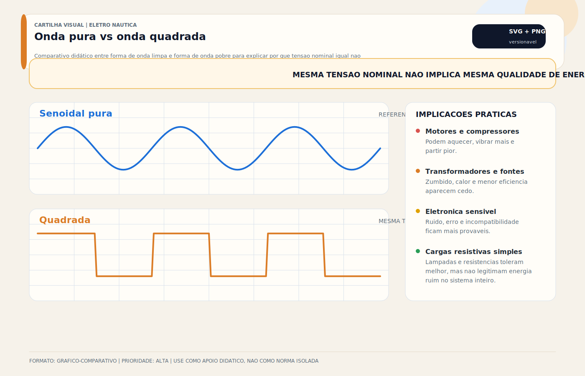

# Inversora (DC To AC)

> [!abstract] Resumo técnico
> INVERSORA (DC → AC) — Converte energia DC do banco de baterias em AC 220V para equipamentos a bordo sem shore power ou gerador. Permite operar ar-condicionado, micro-ondas, carregadores e tomadas com energia armazenada. A diferença entre onda senoidal pura e modificada, a eficiência real e o dimensionamento do cabo DC definem o sucesso ou o fracasso do sistema.

> [!tip] Regra de decisão em 30 segundos
> 1. **Onda senoidal pura é o padrão a bordo.** Onda modificada só se sobrou um orçamento para cargas puramente resistivas (TV antiga, iluminação). Motor AC, compressor, transformador, eletrônica sensível e equipamento médico **exigem** senoidal pura.
> 2. **Eficiência real não é 100%.** Para cada 100W AC entregues, o banco DC fornece 108–114W (eficiência 88–92%). Calcule a corrente DC pela **potência AC ÷ eficiência ÷ tensão DC**, nunca ignore o rendimento.
> 3. **Corrente DC cresce absurdamente em 12V.** Inversor de 2.000W em 12V = **~180A DC contínuos**. Em 24V cai para ~90A; em 48V para ~45A. Acima de 1.500W, pensar em 24V ou 48V é regra, não luxo.
> 4. **Inversor ≠ inversor/carregador.** Inversor simples só converte DC→AC. Inversor/carregador (MultiPlus, Quattro, Mass Combi) inverte, carrega e faz **transferência automática** (<20ms) entre shore power, gerador e banco. A escolha muda toda a arquitetura AC do barco.
> 5. **Transfer switch e neutro comutado são projeto, não opcional.** Shore power e saída do inversor **não podem coexistir** no mesmo barramento. O equipamento precisa comutar neutro e fase conforme a topologia L+N+PE e SPOG do país — erro aqui = ESD ou corrente de corrosão galvânica.
> 6. **Fusível DC de alta corrente próximo ao banco é obrigatório.** MRBF, ANL ou NH dimensionado para ~125% da corrente máxima do inversor, com AIC compatível com a Isc do banco. Comprimento máximo do cabo desprotegido: **178mm (7")** pela ABYC E-11.
> 7. **Cabo DC é o mais crítico do barco.** Dimensionar para corrente máxima contínua + pico, queda de tensão < 3%, comprimento mínimo. Torque nos terminais conforme fabricante. Cabo subdimensionado + inversor de 3kW = arco garantido.
> 8. **Ventilação não é decoração.** Inversor dissipa 8–15% como calor. Instalação em compartimento fechado sem circulação = derating + desligamento térmico + falha prematura de capacitores.
> 9. **Standby consome bateria silenciosamente.** Inversor em no-load consome 0,5–3W contínuos (~1–7Ah/dia em 12V). Em temporada longa sem uso, desligar fisicamente ou ativar ECO mode.

> [!danger] Quando chamar um especialista
> - **Retrofit de inversor/carregador em barco com banco existente:** transfer switch, neutro, PE, coordenação com shore power + gerador + BMS do lítio. Um erro aqui = ESD ou incêndio. Profissional com experiência ABYC/ISO, não eletricista residencial.
> - **Sistema com múltiplas fontes AC (shore power + gerador + inversor):** priorização, sincronismo, anti-paralelismo, commutação sem perda de neutro, AC coupling solar. Exige projeto integrado com Cerbo GX, CZone ou EmpirBus — não se resolve no manual do MultiPlus.
> - **Split-phase 120/240V americano ou europeu 230V trifásico:** barco importado com topologia AC diferente da brasileira. Decidir se mantém, converte ou faz conversão isolada exige análise caso a caso — conversões mal feitas destroem equipamentos em minutos.
> - **Thermal event em inversor (cheiro de queimado, desligamentos térmicos repetidos):** capacitores estufados, MOSFET comprometido, ventilador travado. Continuar a operar = risco de fogo. Retirar do barco, testar em bancada, avaliar reparo × substituição.
> - **Integração inversor/carregador com banco LiFePO4 e BMS:** CAN bus proprietário, setpoints de absorção, curva de carga, proteção contra disconnect abrupto do BMS. Exige configuração de parâmetros específicos do pack — profissional certificado pelo fabricante do BMS e do inversor.
> - **Corrosão galvânica associada a inversor/shore power mal aterrado:** zinco desaparecendo em semanas, ESD risk. Exige medição de corrente de fuga AC e DC, inspeção do isolador galvânico ou transformador de isolação, verificação do bond neutro-PE em marina. Perícia naval.
> - **Eletropropulsão com inversor AC auxiliar compartilhando banco de tração:** isolação entre barramentos de tração e auxiliares, proteção contra backfeed, coordenação com motor elétrico e chargers de alta potência. Projeto sob ISO 16315 + ABYC E-30 (draft).
> - **Sinistro com inversor envolvido (fogo, curto, descarga):** preservar o equipamento e os cabos, fotografar terminais, fusíveis, ponto de origem. Perícia elétrica precisa do produto íntegro para determinar causa (falha do inversor vs instalação vs carga).
> - **AC coupling de solar via inversor grid-tie + inversor/carregador em ilha:** configuração complexa exigindo frequency shift, anti-islanding, firmware compatível. Exige projetista com experiência em sistemas híbridos residenciais **e** portuário — não é plug-and-play.

## O que é

O inversor elétrico (inversora) é um conversor eletrônico que transforma energia DC (corrente contínua do banco de baterias — 12V, 24V ou 48V) em energia AC (corrente alternada — 220V/60Hz) para alimentar equipamentos que normalmente funcionariam na tomada doméstica.

É o componente que permite suprir cargas AC a partir do banco DC quando a arquitetura da embarcação, o banco e as fontes de recarga suportam isso. O grau de independência real depende da energia disponível, não apenas da potência nominal do inversor.

**Inversor vs Inversor/Carregador:**

- **Inversor simples:** apenas converte DC → AC. Sem função de carregamento.
- **Inversor/Carregador (Inverter/Charger):** converte DC → AC E carrega o banco quando há shore power ou gerador. Faz a transferência automática entre shore power e inversão. Exemplo: Victron MultiPlus, Mastervolt Mass Combi.

## Função

| Função | Detalhe |
| --- | --- |
| Conversão DC → AC | Banco de baterias → 220V/60Hz para cargas AC |
| Independência de marina | Operar equipamentos AC em fundeio, navegação, ancoragem |
| Transferência automática | Comuta entre shore power e inversão automaticamente (inversor/carregador) |
| Carregamento (inv./carregador) | Carrega o banco quando conectado ao shore power ou gerador |

## Como aparece na prática

**Muito comum no Brasil:**

- Inversor de onda senoidal modificada de 1.000–2.000W para alimentar TV, notebook e carregadores simples
- Victron Phoenix ou Xantrex instalado em embarcações que ficam em fundeio prolongado
- Inversor/carregador Victron MultiPlus como centro do sistema elétrico de veleiros e trawlers

**Comum em barcos importados:**

- Inversor/carregador de 2.500–5.000W com banco de LiFePO4 e painel solar — sistema autossuficiente
- Gerenciamento pelo Victron Cerbo GX + VRM com monitoramento remoto
- Transferência automática entre shore power, gerador e inversão

**Mais presente em embarcações maiores/premium:**

- Inversor/carregador de 8–15kW para alimentar ar-condicionado, fogão, aquecedor de água
- Banco de 48V com LiFePO4 de 400–800Ah para máxima eficiência e menor corrente DC
- Sistema híbrido: solar + eólico + alternador de alta potência + gerador de backup

## Fundamentos mínimos

**Onda senoidal pura vs onda modificada — a diferença mais crítica:**

| Tipo de onda | Custo | Equipamentos compatíveis | Equipamentos problemáticos |
| --- | --- | --- | --- |
| Senoidal pura | Maior | Todos os equipamentos AC | Nenhum |
| Senoidal modificada | Menor | TV, iluminação resistiva, carregadores simples | Motores AC, ar-condicionado, compressores, equipamentos com transformador, impressoras, aparelhos médicos |

**Por que a forma de onda importa:**

Motores, transformadores, fontes e eletrônica sensível podem apresentar aquecimento, ruído, menor eficiência ou mau funcionamento com formas de onda pobres. Para cargas críticas e sistemas permanentes de bordo, a forma senoidal pura é a referência preferencial.

## Visual didático — tensão nominal igual não significa energia equivalente



O objetivo deste comparativo é mostrar que dois inversores podem anunciar a mesma tensão nominal e ainda assim entregar qualidades de energia muito diferentes. Em campo, o efeito aparece como aquecimento extra, ruído, vibração, perda de rendimento ou incompatibilidade com determinadas cargas.

Use este visual para discutir:

- por que motores, compressores e transformadores sofrem mais com forma de onda ruim;
- por que eletrônica de potência e carregadores podem operar fora do esperado;
- por que inversor senoidal puro é a escolha prudente para instalações permanentes de bordo.

Material de apoio: [Onda pura vs onda quadrada](../_visuals/generated/onda-pura-vs-onda-quadrada.md)

**Eficiência e perdas:**

Um inversor de 12V com 2.000W de carga no output extrai do banco:

- Potência DC = Potência AC / eficiência = 2.000 / 0,92 = 2.174W
- Corrente DC = 2.174W / 12V = **181A** — corrente altíssima que exige banco e cabos dimensionados para isso

**Tensão mínima de operação (low battery cutoff):**

O inversor desliga automaticamente quando a tensão do banco cai abaixo do limite configurado ou suportado. Esse valor precisa ser compatível com a química do banco e com a estratégia de proteção adotada; não deve ser tratado como número universal.

## Características

| Parâmetro | Valor típico |
| --- | --- |
| Tensão de entrada | 12V DC ou 24V DC ou 48V DC |
| Tensão de saída | 220V AC / 60Hz |
| Potência contínua | 300W a 15.000W |
| Potência de pico | 2× a 3× a potência contínua (por 5–30s) |
| Eficiência | 88–96% (inversores de qualidade) |
| Distorção harmônica (THD) | < 3% (senoidal pura) |
| Frequência de saída | 60,0Hz ± 0,1Hz |
| Proteções integradas | Sobrecorrente, sobrecarga, alta temperatura, baixa tensão, curto-circuito |

## Configurações comuns

**Inversor simples (embarcações com uso ocasional de AC):**

- Victron Phoenix, Xantrex Freedom — instalado próximo ao banco
- Alimenta tomadas selecionadas (TV, notebook, carregadores)
- Não interfere com o shore power — sistemas separados

**Inversor/Carregador (sistema integrado — mais eficiente):**

- Victron MultiPlus, Mastervolt Mass Combi, Schneider XW+
- Um único equipamento: inverte, carrega e faz transferência automática
- Shore power presente: passa direto para as cargas + carrega o banco
- Shore power ausente: inverte o banco para as cargas
- Transferência em < 20ms — imperceptível para a maioria dos equipamentos

**Sistema com banco 48V (máxima eficiência):**

- Banco de 48V reduz a corrente DC a ¼ comparado com 12V — cabos mais finos, menos perdas
- Inversor/carregador de 48V/220V com LiFePO4
- Menor perda nos cabos DC, maior eficiência total do sistema

## Marcas e referências

- **Victron Energy** — referência mundial, linha completa (Phoenix inversor, MultiPlus inversor/carregador, Quattro para fontes duplas), melhor integração com o ecossistema GX/VRM
- **Mastervolt** — qualidade premium europeia, linha Mass Combi, excelente integração com outros produtos Mastervolt
- **Xantrex (Schneider Electric)** — americana, linha Freedom e XW+, robustos, muito presentes em embarcações americanas
- **Outback Power** — focado em sistemas off-grid maiores, qualidade reconhecida, menos comum no Brasil
- **Growatt / Epever** — marcas chinesas de qualidade crescente, custo menor, menos suporte pós-venda no Brasil
- **Cotek / Must Power** — intermediários, presentes no mercado nacional, qualidade variável

## Componentes relacionados

- Banco de baterias (fonte DC — deve ser dimensionado para a corrente de pico do inversor)
- Cabo DC de alimentação do inversor (alta corrente — 50–300A+, bitola mínima 35–95mm²)
- Fusível DC de alta corrente próximo ao banco (MRBF ou fusível NH — dimensionado para 125% da corrente máxima)
- Barramento DC (conexão do inversor ao banco)
- Painel AC secundário (alimentado pelo inversor — separado do circuito de shore power)
- Cerbo GX / Venus GX (Victron) — controle e monitoramento do inversor
- Banco de solar/eólico/alternador — fontes de recarga do banco usado pelo inversor

## Problemas mais frequentes

| Problema | Sintoma | Causa provável |
| --- | --- | --- |
| Inversor desliga sozinho | Corte silencioso durante uso | Banco com baixa tensão (cutoff), sobrecarga, sobretemperatura |
| Equipamento não funciona no inversor | Motor não parte, comportamento errático | Onda modificada × equipamento que exige senoidal pura |
| Banco descarrega muito rápido | Autonomia menor que o esperado | Carga superior à estimada, eficiência do inversor não considerada, banco subdimensionado |
| Inversor em standby consome muito | Banco descarrega mesmo sem cargas | Consumo no-load do inversor (0,5–3W em standby — somar ao balanço de energia) |
| Ruído nos equipamentos de áudio | Interferência sonora | Onda modificada, aterramento ruim, filtro de linha ausente |
| Inversor não liga | Silêncio total | Tensão do banco abaixo do mínimo, fusível queimado, cabo solto |

## Causas raiz

**Banco subdimensionado para o inversor:**

Cada 100W de carga AC extrai ~10A DC em sistema de 12V. Um inversor de 2.000W pode extrair 180–200A do banco. Banco de 100Ah esgota em menos de 30 minutos com esse consumo. Equação simples frequentemente ignorada no dimensionamento.

**Onda modificada usada com equipamento incompatível:**

Instalador compra o inversor mais barato (onda modificada) sem avisar o proprietário. Compressor da geladeira começa a falhar em 6 meses. Aquecimento anormal, consumo maior, vida útil reduzida.

**Cabo DC subdimensionado:**

A corrente DC de um inversor de alta potência em 12V chega a 200–300A. Cabo AWG 4 (25mm²) em um sistema de 3kW é cabo insuficiente — queda de tensão e aquecimento. O cabo do inversor precisa ser o mais curto e o mais grosso da embarcação.

**Fusível ausente ou distante da bateria:**

O inversor tem sua proteção interna — mas o cabo entre a bateria e o inversor é o trecho desprotegido. Curto nesse trecho + fusível distante = arco/incêndio.

## Diagnóstico prático

**Inversor desligando por baixa tensão:**

```
Multímetro → modo DCV
Medir tensão do banco com carga ligada no inversor
Se cai para 10,5V (sistema 12V) → banco descarregado ou com célula fraca
Testar banco sem carga: se tensão em repouso < 12,0V → banco com problema
Se tensão OK em repouso mas cai rápido sob carga → alta resistência interna (banco velho)
```

**Inversor desligando por sobrecarga:**

```
Somar potência de todas as cargas conectadas ao inversor
Comparar com potência nominal contínua do inversor
Se soma > 80% do nominal: risco de sobrecarga com partida de motores (corrente de pico)
Solução: inversor maior ou reduzir cargas simultâneas
```

**Verificar corrente DC do inversor em operação:**

```
Amperímetro de alicate → no cabo positivo de alimentação do inversor
Ligar carga AC conhecida (ex: chuveiro de 1.500W)
Corrente DC esperada: 1.500W / (12V × 0,92 eficiência) ≈ 136A
Se corrente muito maior → eficiência baixa (inversor com problema) ou carga maior que o declarado
```

## Boas práticas profissionais

- Preferir inversores de onda senoidal pura em instalações permanentes e cargas críticas
- Instalar o inversor o mais próximo possível do banco — minimizar comprimento do cabo DC
- Dimensionar o banco para a energia diária total, não apenas para a potência de pico
- Calcular o balanço de energia: Ah consumidos por dia vs Ah gerados por dia (solar + alternador + shore)
- Instalar fusível DC de alta corrente (MRBF, ANL ou NH) próximo ao banco, no cabo de alimentação do inversor
- Escolher entre inversor simples e inversor/carregador conforme a arquitetura da embarcação, o perfil de uso e a necessidade de transferência automática

## Cuidados de instalação

- Cabo DC de alimentação: dimensionado para a corrente máxima do inversor (ver tabela do fabricante)
- Comprimento máximo do cabo DC: reduzir ao mínimo possível (queda de tensão e perda de eficiência)
- Fixação mecânica: inversor em posição ventilada, nunca em espaço fechado sem circulação de ar
- Terminal de saída AC: circuito separado ou comutado corretamente em relação ao shore power, com proteção dedicada
- Aterramento/PE e bond neutro-PE: seguir rigorosamente a topologia prevista pelo fabricante e pelo projeto do sistema

## Cuidados de uso

- Não ligar cargas que somem mais de 80% da potência nominal — deixar margem para picos de partida
- Monitorar a tensão do banco durante uso prolongado do inversor
- Em parada longa: desligar o inversor fisicamente — o consumo em standby drena o banco ao longo do tempo
- Não cobrir o inversor durante operação — o calor danifica os componentes eletrônicos internos

## Erros comuns

**Comprar inversor de onda modificada para economizar:**

O preço inicial menor gera custo de reparo ou substituição de compressor de geladeira, micro-ondas ou equipamento de áudio. A economia inicial se paga negativamente em poucos meses.

**Subdimensionar o cabo DC:**

O cabo mais crítico da embarcação é o menos cuidado. Cabo fino para 200A = queda de tensão, aquecimento, risco de fogo.

**Calcular a autonomia pelo consumo AC sem considerar eficiência e perdas:**

"O inversor é de 2.000W e o banco tem 200Ah." Sem considerar a eficiência (≈92%) e a corrente extraída real, a autonomia calculada é 30–40% maior que a real.

**Inversor/carregador com shore power e banco simultaneamente:**

"O inversor está carregando o banco e alimentando o AC ao mesmo tempo pelo banco." O inversor/carregador faz isso corretamente — mas é importante entender o fluxo de energia para não criar expectativas incorretas de carregamento.

**Instalar sem fusível de alta corrente no cabo DC:**

O inversor tem proteção interna — mas o cabo entre o banco e o inversor não. Curto nesse trecho = arco garantido. O fusível vai no cabo, próximo ao banco.

## Relação com outros sistemas

- **Banco de baterias:** a fonte primária do inversor — capacidade e estado interno determinam a autonomia
- **BMS (em lítio):** pode limitar descarga, informar limites ao inversor ou provocar desligamento se o sistema estiver mal coordenado
- **Painel solar / Eólico:** recarregam o banco usado pelo inversor — necessários para uso autônomo prolongado
- **Alternador:** recarga o banco durante a navegação, compensando o consumo do inversor
- **Shore power:** com inversor/carregador, shore power recarrega o banco e alimenta cargas diretamente
- **Gerador AC:** com inversor/carregador, gerador recarrega o banco e alimenta cargas
- **Carregador de bateria:** em sistemas sem inversor/carregador, o carregador separa a função de recarga

## Brasil x Internacional

| Aspecto | Brasil | Internacional |
| --- | --- | --- |
| Tipo de onda mais vendida | Modificada (custo) | Senoidal pura (qualidade) |
| Inversor/carregador integrado | Crescendo, ainda pouco | Padrão em veleiros e trawlers |
| Banco 48V | Raro | Crescente em novos projetos |
| LiFePO4 + inversor | Muito raro | Padrão em sistemas modernos |
| Marca dominante | Victron | Victron (global) |

**Realidade brasileira:** O mercado nacional ainda vende muito inversor de onda modificada por questão de preço. O proprietário liga um aparelho de TV ou notebook e funciona. O problema aparece quando liga o compressor da geladeira, o ar-condicionado ou qualquer motor AC — que funcionam por meses com problemas crescentes antes de falhar definitivamente.

## Glossário rápido

- **Inversor (DC→AC):** conversor eletrônico que transforma corrente contínua do banco em corrente alternada para cargas AC.
- **Inversor/carregador (Inverter/Charger / Combi):** equipamento integrado que inverte, carrega o banco e faz transferência automática entre shore power/gerador e inversão. Exemplos: Victron MultiPlus/Quattro, Mastervolt Mass Combi, Schneider XW+.
- **Quattro:** linha Victron de inversor/carregador com **duas entradas AC** (shore power + gerador) para priorização automática.
- **Onda senoidal pura (PSW — Pure Sine Wave):** saída AC idêntica à rede elétrica ideal, com baixa distorção harmônica (THD < 3%). Compatível com **todas** as cargas AC.
- **Onda senoidal modificada (MSW — Modified Sine Wave):** aproximação por pulsos quadrados. Compatível só com cargas resistivas. Incompatível com motor AC, compressor, transformador, eletrônica sensível.
- **THD (Total Harmonic Distortion):** distorção harmônica total. Em inversor PSW de qualidade: < 3%. Em MSW pode chegar a 40%.
- **Potência contínua:** potência que o inversor entrega indefinidamente em temperatura ambiente normal. Não somar além de 80% para operação segura.
- **Potência de pico (surge):** potência instantânea (5–30s) para partida de motores. Tipicamente 2× a 3× a contínua.
- **Eficiência:** razão entre potência AC entregue e potência DC consumida. 88–96% em inversores modernos de qualidade; despreze abaixo disso.
- **No-load / Standby consumption:** consumo em watt que o inversor tira do banco quando está ligado mas sem carga útil. Entre 0,5W e 3W.
- **ECO mode / Search mode:** modo no qual o inversor envia pulsos de busca e só ativa a saída quando detecta carga > limiar. Economiza banco em instalações com cargas intermitentes.
- **Transfer switch:** chave de transferência entre shore power / gerador e inversão. Tempo típico de comutação: <20ms.
- **Neutro comutado:** em inversor/carregador bem projetado, o neutro é comutado junto com a fase para manter o bond neutro-PE adequado em cada modo (shore power vs inversão).
- **Low-voltage cutoff / disconnect (LVD):** corte automático da saída AC quando a tensão do banco cai abaixo do configurado. Protege o banco de descarga profunda.
- **High-voltage cutoff:** corte por sobretensão DC (ex.: alternador descontrolado, carregador com defeito).
- **Low/High temperature shutdown:** desligamento térmico para proteção dos MOSFETs e capacitores.
- **MOSFET / IGBT:** semicondutores de potência que fazem a comutação DC→AC. Falha mais comum em inversores submetidos a sobrecarga crônica.
- **H-bridge:** topologia clássica de saída com 4 MOSFETs formando a onda AC a partir de barramento DC.
- **LLC / Resonant converter:** topologia de alta eficiência usada em inversores modernos para reduzir perdas de comutação.
- **PWM (Pulse Width Modulation):** técnica de geração da senoide por pulsos de largura variável filtrados por indutores e capacitores.
- **Potência aparente (VA) × potência ativa (W):** cargas indutivas (motor, compressor) têm VA > W. Inversor precisa suprir a potência aparente de pico — não apenas a ativa.
- **Fator de potência (PF):** razão W/VA. Cargas resistivas PF=1; motores PF=0,7–0,85. Dimensionar inversor considerando PF da carga.
- **Low-frequency inverter:** inversor com transformador toroidal de baixa frequência. Mais pesado, mas com alta capacidade de surge (3–5× nominal). Preferido para cargas com alto inrush.
- **High-frequency inverter:** inversor sem transformador, mais leve e compacto. Surge menor (2× nominal). Típico em portáteis e baixa potência.
- **AC coupling:** arquitetura na qual um inversor grid-tie solar injeta na saída AC do inversor/carregador, que controla frequência para balancear produção/consumo.
- **Grid-tie vs off-grid:** inversor grid-tie só funciona com rede presente (desliga em falta). Off-grid (inversor/carregador) forma a rede.
- **Anti-islanding:** proteção obrigatória em grid-tie — inversor desconecta se a rede cair. Em sistema híbrido exige firmware compatível.
- **Frequency shift:** técnica usada por inversor/carregador para comandar o grid-tie solar a reduzir produção quando o banco está cheio.
- **Fusível DC 178mm / 7":** distância máxima permitida por ABYC E-11 entre o polo positivo do banco e o primeiro dispositivo de proteção.
- **MRBF / ANL / NH:** fusíveis de alta corrente DC usados em circuito de inversor. MRBF monta direto no terminal da bateria; ANL em base aberta; NH em porta-fusível industrial.
- **AIC (Ampere Interrupting Capacity):** capacidade do fusível de interromper corrente de curto sem arco sustentado. Deve ser ≥ Isc do banco.
- **Isc (Short-circuit current):** corrente máxima de curto do banco. Em LiFePO4 de 200Ah pode ultrapassar 3000A; exige fusível com AIC compatível.
- **Bond neutro-PE / SPOG (Single Point of Grounding):** topologia de aterramento na qual neutro e PE são ligados em **um único ponto** do sistema, evitando correntes parasitas.
- **ESD (Electric Shock Drowning):** choque elétrico em água causado por corrente de fuga AC. Risco direto associado a inversor/carregador mal aterrado ou com neutro não comutado.
- **Isolador galvânico / transformador de isolação:** dispositivos que bloqueiam correntes DC (zinco) ou correntes AC de fuga entre barcos na marina. Obrigatórios conforme ABYC A-28.
- **GFCI / DDR:** dispositivo diferencial residual. Proteção obrigatória em tomadas AC que podem ser tocadas em ambiente úmido.
- **Derating térmico:** redução da capacidade nominal em função de temperatura ambiente. Acima de 40°C, inversor perde 0,5–1% por °C.
- **VE.Bus / VE.Can / VE.Direct:** protocolos de comunicação Victron. VE.Bus liga inversor-carregador ao Cerbo GX; VE.Can conversa com BMS em 500 kbps.
- **Cerbo GX / Venus OS:** centro de controle Victron para monitoramento remoto e configuração de parâmetros.
- **VRM (Victron Remote Management):** portal cloud para supervisão remota do sistema.
- **48V vs 12V vs 24V:** tensão do banco. 48V reduz corrente DC a 1/4 de 12V para a mesma potência AC — cabos menores, perdas menores, sistema mais eficiente acima de 3kW.
- **Assistente (Victron):** scripts configuráveis no MultiPlus/Quattro para comportamentos customizados (ex.: limite de shore power, gerenciamento de gerador).
- **Hybrid mode:** modo no qual o inversor/carregador complementa shore power insuficiente extraindo a diferença do banco (power assist).

## Normas aplicáveis

- **ABYC E-11 (2023)** — *AC and DC Electrical Systems on Boats.* Instalação, proteção, aterramento, topologia neutro-PE, dimensionamento de cabos DC, distância máxima do fusível.
- **ABYC A-31 (2024)** — *Battery Chargers and Inverters.* Requisitos específicos de segurança elétrica, transferência de fontes, bond neutro comutado, proteção DC e AC integradas.
- **ABYC E-13 (2023)** — *Lithium Ion Batteries.* Interface entre inversor/carregador e banco lítio com BMS (setpoints, comunicação, proteção contra disconnect).
- **ABYC E-10 (2023)** — *Storage Batteries.* Referência para cargas DC e proteção do banco alimentador do inversor.
- **ABYC A-28 (2023)** — *Galvanic Isolators.* Exigido quando há conexão shore power em sistema com inversor/carregador.
- **ISO 13297:2020** — *Small craft — Electrical systems — AC and DC installations.* Referência europeia para topologia AC/DC em embarcações < 24m.
- **ISO 8846:2022** — *Small craft — Electrical devices — Protection against ignition of surrounding flammable gases.* Inversor em compartimento com risco de vapor combustível exige ignition protection.
- **ISO 16315:2016** — *Small craft — Electric propulsion system.* Quando o inversor divide banco com sistema de eletropropulsão.
- **UL 458** — *Power Converters/Inverters and Power Converter/Inverter Systems for Land Vehicles and Marine Crafts.* Referência para inversores marinizados (EUA).
- **UL 1741** — *Inverters, Converters, Controllers and Interconnection System Equipment for Use With Distributed Energy Resources.* Referência para inversor grid-tie híbrido em arquitetura AC coupling.
- **IEC 62040-1** — *Uninterruptible Power Systems (UPS) — Part 1: Safety requirements.* Base para inversores com função UPS/backup.
- **IEC 62109-1/-2** — *Safety of power converters for use in photovoltaic power systems.* Aplicável quando o inversor híbrido integra entrada solar DC.
- **NMEA 2000 (IEC 61162-3)** — *Digital interface for navigational devices.* Comunicação com displays e Cerbo GX quando inversor exporta PGN de status.
- **ABNT NBR 5410:2004 + emendas** — *Instalações elétricas de baixa tensão.* Referência nacional para princípios de baixa tensão, identificação, proteção, dimensionamento.
- **NORMAM-211/DPC** — *Embarcações de esporte e recreio.* Regulamentação brasileira aplicável à homologação e operação da embarcação.

## Como ensinar este tópico

**Sequência recomendada:**

1. Mostrar a diferença entre onda senoidal pura e modificada em osciloscópio (ou imagem) — impacto visual imediato
2. Calcular ao vivo: dado um inversor de 2.000W em 12V, qual a corrente DC? (~180A) — para que o aluno entenda a dimensão dos cabos
3. Demonstrar o inversor/carregador: ligar o shore power e mostrar a transferência automática
4. Exercício de dimensionamento: lista de cargas AC → potência total → banco necessário → autonomia
5. Mostrar o cálculo de balanço energético: Ah consumidos vs Ah gerados

**Conceito-chave para fixar:**

"Forma de onda ruim cobra a conta depois. Para sistema permanente e cargas reais de bordo, a senoidal pura é a referência prudente."

## Ideias de vídeos

- **"Onda senoidal pura vs modificada: o que você está destruindo sem saber"** — demonstração ao vivo
- **"Como dimensionar o inversor e o banco para o seu barco"** — cálculo prático passo a passo
- **"Inversor/carregador Victron MultiPlus: instalação e configuração"** — prático, muito procurado
- **"Por que seu banco descarrega tão rápido com o inversor ligado"** — cálculo de corrente DC vs potência AC
- **"Balanço de energia: quantos painéis solares preciso para usar o inversor?"** — conexão com solar

## Diagramas sugeridos

- Diagrama de fluxo de energia: banco DC → inversor → cargas AC (com setas de potência e corrente)
- Comparativo gráfico: onda senoidal pura vs onda modificada (forma visual da diferença)
- Esquema de inversor/carregador: shore power → primário → cargas AC + carregamento do banco
- Diagrama de dimensionamento: cargas AC → potência total → corrente DC → banco necessário → autonomia
- Esquema de instalação: banco → fusível DC → cabo DC grosso → inversor → disjuntor AC → painel AC

## FAQ

**Qual o inversor mínimo para operar um ar-condicionado de 12.000 BTU?**

Um AC de 12.000 BTU consome aproximadamente 1.200–1.500W. O pico de partida do compressor pode ser 2,5–3× isso (3.000–4.500W por 1–2 segundos). O inversor precisa de pelo menos 2.500W contínuos e pico de 4.500–5.000W para operar com margem segura.

**Inversor de 2.000W em 24V vs 12V — qual a diferença?**

Em 24V: corrente DC para 2.000W = ≈91A. Em 12V: ≈181A. Cabos de 24V têm metade da corrente e podem ser significativamente menores. Sistema de 24V é mais eficiente para potências acima de 1.000W.

**O inversor estraga a bateria?**

Não diretamente — mas usa a bateria. O que estraga é descarregar o banco abaixo do limite de DOD recomendado regularmente. O inversor tem cutoff de proteção, mas se o banco estiver subdimensionado, o cutoff ativa com frequência — estressando as baterias.

**Posso ligar o inversor direto na tomada 12V do barco (isqueiro)?**

Não para inversores acima de 150–200W. A tomada de 12V suporta geralmente 10–20A (120–240W). Para inversores maiores, é obrigatório conectar diretamente ao banco com cabo dimensionado.

**Inversor/carregador substitui o carregador de bateria separado?**

Sim — é exatamente o que faz. O inversor/carregador é um único equipamento que inverte quando não tem shore power e carrega quando tem. Elimina a necessidade de um carregador separado, mas dimensionar a função de carregamento é importante (corrente máxima de carga configurada no equipamento).

## Integração com outras notas

- [[Alternador (DC)]]
- [[Arranque]]
- [[Bancos de Bateria]]
- [[BMS — Battery Management System]]
- [[CAIS (Pier) (AC)]]
- [[Carregador Elétrico para Tender e Jet Ski]]
- [[Eólico (DC)]]
- [[Gerador (AC)]]
- [[Gerador (DC)]]
- [[Lítio LiFePO4 — Instalação e Cuidados Específicos]]
- [[Placa Solar (DC)]]

## Perguntas que esta nota responde

- O que é Inversora (DC To AC) em instalações elétricas náuticas?
- Qual é a função de Inversora (DC To AC) na embarcação?
