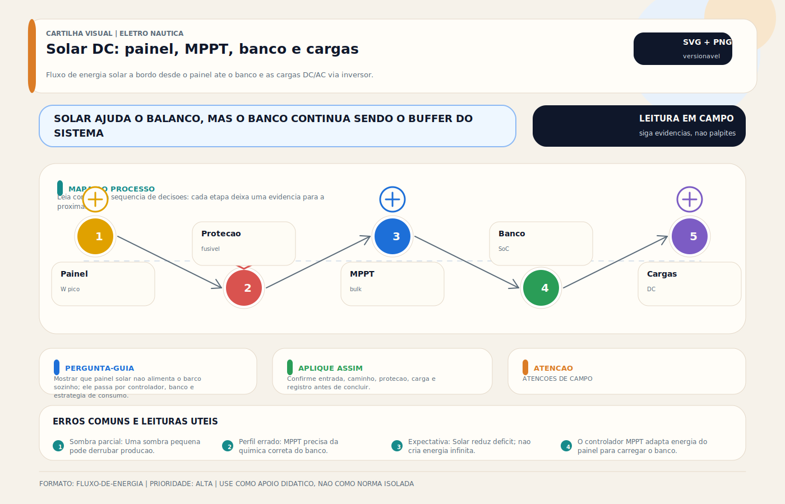

# Placa Solar (DC)

> [!abstract] Resumo técnico
> O sistema solar DC é, hoje, a fonte renovável mais racional para a maioria das embarcações de recreio. Ele é silencioso, modular e útil tanto para compensar consumos de repouso quanto para sustentar parte relevante do hotel load em fundeio. O ganho real, porém, depende muito mais do projeto e da integração do que do watt nominal impresso no painel.

> [!tip] Regra de decisão em 30 segundos
> 1. **Watt nominal ≠ produção diária.** Regra prática para latitude brasileira em embarcação: produção diária efetiva = **Wp × 3 a 4 horas úteis de sol pleno** (HSP), descontado sombreamento, temperatura e perdas. Um painel de 400Wp entrega 1,2–1,6kWh/dia em condição típica — não 9,6kWh (=400W × 24h).
> 2. **MPPT é padrão em projeto novo, PWM só em instalação muito simples.** MPPT ganha 20–30% de produção em janelas de irradiância variável e permite módulo de Vmp > Vbanco (string mais comprida, cabo mais fino).
> 3. **Sombreamento parcial é o inimigo principal a bordo.** Uma sombra de mastro ou antena sobre 5% da célula pode derrubar 30–50% da produção da string. Agrupar módulos eletricamente segundo orientação e sombra — **nunca misturar** um painel ensolarado com outro sombreado na mesma série.
> 4. **Tensão MPPT (Voc × temperatura) precisa caber na janela do controlador.** Voc do módulo em **−10°C** pode ultrapassar 125% do Voc STC. Controlador com Vmax 100V + módulo 24V (Voc STC ~40V) em série de 3 = **150V em dia frio** → queima imediata.
> 5. **Perfil do MPPT precisa conversar com a química do banco.** Setpoints de absorção/flutuação para chumbo (13,8V/14,4V em 12V), AGM (14,4V/13,6V), lítio (14,2V/13,5V ou conforme BMS). Perfil errado = banco subcarregado ou maltratado indefinidamente.
> 6. **Fusível DC próximo ao banco é obrigatório.** ABYC E-11 exige proteção a no máximo 178mm (7") do polo positivo. Fusível e disjuntor DC entre MPPT e banco, dimensionados para Isc do painel × 1,25 e AIC compatível.
> 7. **Módulo flexível é solução de integração, não superioridade técnica.** Flexível aquece mais (menor dissipação), degrada antes e exige fixação que preserve ventilação inferior. Rígido sobre frame em arco ou hardtop é preferível quando há espaço.
> 8. **Cabeamento solar exige cabo específico (fotovoltaico UV-resistente) e conectores MC4 originais.** Conector chinês genérico oxida em ambiente marinho e causa arco elétrico. Crimpagem correta com alicate específico — nunca improvisar.
> 9. **Produção sem armazenamento utilizável é perda.** Banco pequeno demais, BMS limitando corrente de entrada, ou banco já cheio = energia jogada fora. Dimensionar banco e MPPT juntos, nunca o painel isolado.

> [!danger] Quando chamar um especialista
> - **Retrofit solar em embarcação com banco lítio + BMS + inversor/carregador existente:** priorização de fontes, setpoints de absorção, coordenação com BMS (DVCC no Cerbo GX, por exemplo), AC coupling eventual. Exige profissional com experiência Victron/Mastervolt, não eletricista residencial.
> - **Sistema híbrido solar + eólico + alternador + gerador:** priorização, controle de produção, frequency shift em AC coupling, gerenciamento do Cerbo GX. Projeto integrado obrigatório — a soma das partes só funciona com controlador de energia configurado corretamente.
> - **Eletropropulsão com solar alimentando banco de tração:** tensões de 48V a 96V+, correntes altas, proteção diferenciada, isolação de barramentos, monitoramento da string contra sombra variável do próprio casco em movimento. Projeto sob ISO 16315.
> - **Arranjos com > 600V DC total (residencial grande aplicado em barco):** inédito em embarcação mas ocorre em megayacht. Risco de arco DC sustentado, proteção contra falha à terra (GFDI), desconexão em emergência exige certificação específica.
> - **Incêndio, arco ou fumaça em módulo, junction box, MC4 ou controlador:** documentar o ponto de origem antes de desmontar, preservar os cabos e o painel íntegros. Causa típica: conector oxidado ou módulo com delaminação. Perícia elétrica especializada — não descartar peças.
> - **Módulo flexível com degradação visível (microfissura, manchas marrons, delaminação):** avaliação do risco de arco interno e falha de isolação. Se ainda produz, pode estar com corrente de fuga para o casco = corrosão galvânica. Remover do circuito até diagnóstico.
> - **MPPT queimando sucessivamente:** diagnóstico de tensão de circuito aberto em baixa temperatura, surto por descarga atmosférica, dimensionamento do VOC. Possível falha de projeto — precisa laudo, não apenas substituição.
> - **Conexão de solar a barramento DC central com múltiplas fontes simultâneas sem coordenação:** risco de reverso para outras fontes, loop de controle em conflito, comportamento oscilatório. Precisa projeto de arquitetura de fontes e controlador mestre.
> - **Sinistro com paralelismo entre solar off-grid e shore power AC via inversor híbrido:** GFCI disparando, ilha elétrica, anti-islanding. Exige engenheiro eletricista com experiência em sistemas híbridos residenciais e marítimos.

## O que é

É a geração fotovoltaica integrada ao sistema DC da embarcação. Em arquitetura completa, inclui:

- módulos fotovoltaicos;
- cabeamento e conectores;
- proteção de entrada;
- controlador de carga;
- banco de baterias;
- monitoramento.

O painel sozinho não resolve. O conjunto precisa conversar com o banco e com o restante das fontes.

## Onde o solar realmente ajuda

Embarcações usam solar, principalmente, para:

- compensar consumos de standby quando ficam sem shore power;
- manter carga do banco em marina;
- sustentar consumo leve ou moderado em fundeio;
- reduzir horas de motor ou gerador;
- complementar outras fontes, como [[Alternador (DC)]] e [[Eólico (DC)]].

## O maior erro de expectativa

O erro mais comum é tratar potência nominal do painel como produção garantida.

A produção real depende de:

- irradiação disponível;
- temperatura da célula;
- orientação e inclinação;
- sombreamento parcial;
- perdas em cabos e conectores;
- eficiência do controlador;
- capacidade do banco de absorver a energia.

Em embarcação, sombreamento por radar, mastro, antena, hardtop, toldo e até pela tripulação pesa muito mais do que em telhado fixo.

## Painel, controlador e banco: um sistema só

### Painel

O painel define a janela elétrica de geração, mas não determina sozinho o resultado final.

### Controlador

O controlador, normalmente MPPT em projeto moderno, faz a interface entre módulo e banco. Em muitos casos, é ele que decide se a instalação vai ser mediana ou boa.

### Banco

O banco define quanto da energia disponível realmente será aproveitado. Banco saturado, mal configurado ou incompatível reduz o benefício prático do solar.

## Por que MPPT é o padrão racional

Em sistema náutico contemporâneo, MPPT é a referência porque:

- lida melhor com diferença entre tensão do módulo e tensão do banco;
- aproveita melhor as janelas de irradiância variável;
- integra melhor com bancos mais exigentes e telemetria.

PWM só continua defendável em aplicações muito simples, pequenas e com expectativa modesta.

## Projeto correto

### 1. Dimensionar pelo consumo e pela rotina

O sistema precisa responder:

- quanto a embarcação consome em repouso;
- quanto consome em fundeio;
- quanto tempo fica sem motor, gerador ou cais;
- quanto espaço físico realmente existe.

Dimensionar "porque coube o painel" produz sistema bonito e pouco útil.

### 2. Tratar sombreamento como variável central

Sombreamento parcial derruba rendimento de forma desproporcional. Em barco, isso é recorrente. Por isso, a disposição física e o agrupamento elétrico dos módulos merecem cuidado.

### 3. Cuidar da fixação

Instalação marítima precisa considerar:

- vibração;
- dilatação;
- maresia;
- limpeza e acesso;
- drenagem;
- interferência com circulação e operação.

### 4. Integrar com a química do banco

O perfil do controlador precisa conversar com:

- chumbo aberto;
- AGM;
- GEL;
- lítio com [[BMS — Battery Management System]].

Configuração errada de perfil ou tensão gera banco eternamente subcarregado ou maltratado.

## Tipos de módulo

Embarcações costumam usar:

- módulos rígidos, quando há superfície robusta e ventilada;
- módulos flexíveis, quando o projeto privilegia forma e baixo peso.

Painel flexível resolve alguns problemas de integração física, mas traz mais sensibilidade térmica, mecânica e de durabilidade. Não deve ser tratado como "sempre melhor porque é bonito".

## Falhas típicas

As mais frequentes são:

- produção abaixo do esperado por sombreamento;
- conector ou cabo com perda elevada;
- controlador configurado para química errada;
- painel flexível degradado por calor e instalação inadequada;
- sistema fotovoltaico que gera, mas o banco não absorve corretamente;
- falsa percepção de defeito quando o problema é falta de área útil ou balanço energético ruim.

## Diagnóstico profissional

Perguntas úteis:

1. O painel está vendo sol útil ou está sendo sombreado?
2. O controlador está realmente operando no regime esperado?
3. O banco aceita a energia disponível?
4. A produção cai por problema elétrico ou por limitação física?

Observar:

- tensão e corrente do lado do painel;
- tensão e corrente do lado do banco;
- histórico de produção;
- temperatura do controlador e dos módulos;
- comportamento do banco ao longo do dia.

## Boas práticas

- dimensionar o sistema pelo consumo real e não por marketing de placa;
- privilegiar MPPT em sistemas novos;
- documentar strings, fusíveis e trajetos de cabo;
- tratar sombreamento como critério de projeto;
- manter integração clara com banco, monitoramento e demais fontes;
- revisar periodicamente fixação, conectores e desempenho.

## Erros comuns

Os mais recorrentes são:

- confiar cegamente no watt nominal do módulo;
- instalar painel em área cronicamente sombreada;
- misturar módulos e topologias sem coerência;
- usar painel flexível sem respeitar limites de instalação térmica;
- esquecer que produção sem armazenamento utilizável também é perda.

## Visual didático

Mostrar que painel solar nao alimenta o barco sozinho; ele passa por controlador, banco e estrategia de consumo.

**Cautela:** Geracao solar real depende de area, orientacao, sombra, temperatura, eficiencia e perfil de uso.

Material de apoio: [Solar DC: painel, MPPT, banco e cargas](../_visuals/generated/solar-mppt-banco-cargas.md)

## Glossário rápido

- **Módulo fotovoltaico / painel solar:** conjunto de células que converte radiação solar em corrente contínua. Em embarcação, tipicamente 100–450Wp por módulo.
- **Célula fotovoltaica:** unidade elementar de conversão luz→eletricidade. Módulo típico tem 60 ou 72 células de silício cristalino em série.
- **Silício monocristalino (Mono-Si):** maior eficiência (19–22%), mais caro, melhor em espaço limitado — referência em náutica.
- **Silício policristalino (Poli-Si):** menor eficiência (15–17%), mais barato, menos comum em novos projetos.
- **Filme fino / thin film / CIGS:** módulos flexíveis de menor eficiência (10–13%) usados quando forma/peso importam mais que área.
- **Módulo rígido:** com moldura de alumínio e vidro temperado. Mais durável, mais eficiente, exige superfície robusta.
- **Módulo flexível / semi-flexível:** sem vidro, com polímero encapsulante. Permite curvatura leve, aquece mais, degrada antes.
- **Wp (watt-pico):** potência nominal em Standard Test Conditions (1000W/m², 25°C, AM1.5). Valor impresso no módulo.
- **STC (Standard Test Conditions):** condição laboratorial para especificação do módulo. Não reflete operação real (temperatura da célula em operação geralmente 45–60°C).
- **NOCT (Nominal Operating Cell Temperature):** temperatura típica de operação (~45°C). Produção em NOCT é ~80–85% da produção em STC.
- **HSP (Horas de Sol Pleno) / PSH (Peak Sun Hours):** equivalente em horas de irradiância padrão (1000W/m²) que cada local recebe. Brasil: 3,5–6 HSP/dia conforme região.
- **Irradiação / irradiância:** irradiância é potência instantânea (W/m²); irradiação é energia acumulada (kWh/m²/dia).
- **Voc (Open Circuit Voltage):** tensão do módulo sem carga. Cresce em temperatura baixa — crítico para dimensionamento do MPPT.
- **Vmp / Vmpp (Voltage at Maximum Power Point):** tensão na qual o módulo entrega máxima potência. Varia com irradiância e temperatura.
- **Isc (Short Circuit Current):** corrente máxima em curto. Base para dimensionamento de fusível e cabo.
- **Imp (Current at Maximum Power Point):** corrente no MPP. Usado para estimativa de produção.
- **MPPT (Maximum Power Point Tracker):** controlador que rastreia o ponto de máxima potência do módulo e converte para a tensão do banco. Padrão em projeto moderno.
- **PWM (Pulse Width Modulation — controller):** controlador simples que conecta o módulo ao banco com chaveamento. Só funciona bem quando Vmp ≈ Vbanco. Aceitável em instalação pequena.
- **String / série:** módulos ligados em série somam tensão, mantêm corrente. Reduz bitola do cabo, mas exige controlador com Vmax compatível.
- **Paralelo:** módulos ligados em paralelo mantêm tensão, somam corrente. Aumenta bitola do cabo, mas mais tolerante a sombreamento por módulo.
- **Array / arranjo fotovoltaico:** conjunto de módulos conectados (string ou paralelo) formando a fonte DC.
- **Bypass diode:** diodo interno no módulo que impede que uma célula sombreada bloqueie a corrente das demais. Essencial em barco (sombras frequentes).
- **Blocking diode:** diodo que impede corrente reversa do banco para o módulo durante a noite. Controlador moderno já inclui.
- **MC4:** conector padrão da indústria solar. Travamento mecânico, IP67, vedação por O-ring. Exige crimpagem correta com alicate específico.
- **Junction box / caixa de junção:** caixa na parte traseira do módulo com bypass diodes e saída para cabos MC4. Ponto fraco se molhar ou abrir.
- **Hotspot:** ponto quente em célula individual danificada ou sombreada, que queima o encapsulante. Causa de falhas graves em módulos envelhecidos.
- **PID (Potential Induced Degradation):** degradação do módulo por tensão em relação ao terra. Mais relevante em strings longas, raro em barco.
- **LID (Light Induced Degradation):** perda inicial de eficiência (~2%) nas primeiras horas de exposição solar.
- **Sombreamento parcial:** sombra sobre parte da string. Pode derrubar a produção em 30–70% dependendo da topologia e dos bypass diodes.
- **Tilt / inclinação:** ângulo do módulo em relação ao plano horizontal. Ótimo aproximado = latitude local. Em barco, tipicamente 0° (horizontal) por restrição de espaço.
- **Azimute:** orientação do módulo (N/S/L/O). Importante em embarcação atracada — em navegação muda constantemente.
- **AM (Air Mass):** espessura de atmosfera que a luz atravessa. AM1.5 é referência STC.
- **Eficiência do módulo:** razão entre potência entregue e irradiância × área. Mono-Si premium: 20–22%.
- **Tropicalização / marinização:** proteção IP67, resistência a UV, sal e corrosão. Módulo residencial genérico **não é** marinizado — junction box pode entrar água.
- **Controlador de carga:** dispositivo entre módulo e banco que regula corrente/tensão e aplica perfil de química. Pode ser MPPT ou PWM.
- **Victron SmartSolar MPPT / BlueSolar:** linha de controladores Victron com Bluetooth e integração VE.Direct/VE.Can.
- **DVCC (Distributed Voltage and Current Control):** recurso Victron que coordena múltiplos MPPTs + inversor/carregador + BMS em um único setpoint compartilhado.
- **AC coupling:** solar via inversor grid-tie injetando na saída do inversor/carregador off-grid. Alternativa ao MPPT DC em sistemas de alta potência.
- **GFDI (Ground Fault Detection/Interrupter) / AFDI (Arc Fault Detector):** proteção exigida em arranjos de alta tensão contra falha à terra e arco DC.
- **Disjuntor DC / fusível PV:** proteção específica para DC fotovoltaico. Disjuntor AC comum **não interrompe** corrente DC sustentada.
- **Seccionadora PV:** chave seccionadora DC para desconectar o arranjo fotovoltaico com segurança (manutenção, emergência).
- **Cabo solar / cabo PV:** cabo específico resistente a UV, ozônio e temperatura (-40°C a +120°C). Isolação dupla TÜV 2Pfg 1169 ou equivalente.
- **IEC 62109:** norma de segurança dos conversores de potência para sistemas fotovoltaicos (MPPT, inversor solar).
- **IEC 61215 / 61730:** qualificação de desempenho e segurança dos módulos fotovoltaicos.
- **NBR 16690:2019:** norma brasileira para projeto de arranjos fotovoltaicos.
- **Hotel load:** consumo total do "sistema hotel" da embarcação (iluminação, refrigeração, eletrônica, bombas) — referência para dimensionamento do banco e do solar.
- **Balanço energético diário (Ah/dia):** Ah gerados − Ah consumidos. Um sistema estável exige balanço ≥ 0 ao longo do ciclo de uso típico.

## Normas aplicáveis

- **ABYC E-11 (2023)** — *AC and DC Electrical Systems on Boats.* Instalação DC, proteção, fusíveis, aterramento, distância máxima do fusível (178mm), bitola de cabo.
- **ABYC A-31 (2024)** — *Battery Chargers and Inverters.* Aplica-se ao MPPT como dispositivo de carga; inclui requisitos de segurança elétrica e comunicação com banco.
- **ABYC E-10 (2023)** — *Storage Batteries.* Referência para o banco que armazena a energia fotovoltaica.
- **ABYC E-13 (2023)** — *Lithium Ion Batteries.* Interface entre MPPT e banco lítio com BMS (setpoints, comunicação, proteção contra disconnect).
- **ISO 13297:2020** — *Small craft — Electrical systems — AC and DC installations.* Referência europeia para instalação DC em embarcações < 24m.
- **ISO 8846:2022** — *Small craft — Electrical devices — Protection against ignition of surrounding flammable gases.* MPPT ou junction box em compartimento com vapor combustível exige ignition protection.
- **ISO 16315:2016** — *Small craft — Electric propulsion system.* Quando o solar alimenta banco de tração em eletropropulsão.
- **IEC 62109-1** — *Safety of power converters for use in photovoltaic power systems — Part 1: General requirements.* Base de segurança para MPPT.
- **IEC 62109-2** — *Part 2: Particular requirements for inverters.* Aplicável a inversor solar híbrido.
- **IEC 61215** — *Terrestrial photovoltaic (PV) modules — Design qualification and type approval.* Qualificação de desempenho e durabilidade dos módulos de Si cristalino.
- **IEC 61730-1/-2** — *Photovoltaic (PV) module safety qualification.* Requisitos construtivos e testes de segurança dos módulos.
- **IEC 62548** — *Photovoltaic (PV) arrays — Design requirements.* Diretrizes de projeto de arranjos, proteção, aterramento, seccionamento.
- **UL 1703** — *Flat-Plate Photovoltaic Modules and Panels.* Referência norte-americana de segurança para módulos.
- **NMEA 2000 (IEC 61162-3)** — *Digital interface for navigational devices.* Comunicação do MPPT com Cerbo GX e displays náuticos (PGN 127507 e equivalentes).
- **ABNT NBR 16690:2019** — *Instalações elétricas de arranjos fotovoltaicos — Requisitos de projeto.* Referência nacional para projeto FV.
- **ABNT NBR 5410:2004 + emendas** — *Instalações elétricas de baixa tensão.* Princípios gerais de baixa tensão, identificação, proteção e dimensionamento.
- **NORMAM-211/DPC** — *Embarcações de esporte e recreio.* Regulamentação brasileira aplicável à homologação e operação da embarcação.

## Integração com outras notas

- [[Bancos de Bateria]]
- [[BMS — Battery Management System]]
- [[CAIS (Pier) (AC)]]
- [[Carregador de Bateria (AC To DC)]]
- [[Eólico (DC)]]
- [[Inversora (DC To AC)]]
- [[Monitor de Bateria - BMV - Shunt]]
- [[Tipos de Bateria]]

## Perguntas que esta nota responde

- Como dimensionar solar para embarcação com critério técnico e não por impulso?
- Por que sombreamento e integração com o banco pesam tanto no resultado?
- Quando painel rígido ou flexível faz mais sentido a bordo?

