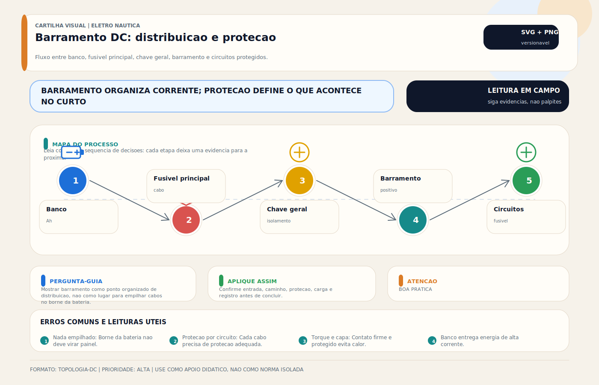

# Barramento DC / Bus Bar / Distribuição DC

> [!abstract] Resumo técnico
> Barramento DC é o elemento de distribuição que organiza múltiplos circuitos do sistema de corrente contínua. Em embarcações, ele não é apenas uma "barra para parafusos": sua capacidade de corrente, isolamento, posição na arquitetura, proteção a montante e relação com negativos, shunts e retornos determinam robustez, manutenibilidade e segurança.

## O que é

Barramento DC é um condutor coletivo, normalmente metálico, usado para concentrar conexões de um mesmo potencial elétrico. Em instalações náuticas aparecem, em geral:

- barramentos positivos de distribuição;
- barramentos negativos de retorno;
- barramentos dedicados por subsistema;
- módulos com proteção integrada.

O barramento reduz improviso no polo da bateria, melhora organização e facilita expansão e diagnóstico.

## Função na embarcação

- distribuir energia DC para vários circuitos;
- concentrar retornos negativos de forma organizada;
- criar pontos claros de medição e manutenção;
- sustentar arquitetura modular de proteção e expansão;
- permitir separação lógica entre bancos, cargas e subsistemas.

## Fundamentos mínimos

### Capacidade de corrente não depende só do metal

A capacidade real do barramento depende de:

- seção condutiva;
- material e acabamento;
- temperatura ambiente;
- ventilação;
- tipo de borne e área efetiva de contato;
- corrente contínua e simultaneidade real.

### Proteção não está "no barramento"

O barramento não substitui proteção. O circuito precisa ter:

- proteção principal a montante;
- proteção individual dos ramais, quando aplicável;
- coordenação com o cabo que o alimenta.

### Barramento negativo não é licença para misturar tudo

Negativo DC, PE de AC, bonding e referência de instrumentação têm relações próprias na arquitetura da embarcação. Em alguns sistemas existe interligação controlada; em outros, não. Tratar qualquer barra metálica como "terra universal" é erro conceitual.

### O shunt muda a topologia do negativo

Quando houver monitor de bateria por shunt, a posição do barramento negativo precisa respeitar o caminho de medição. Retornos ligados do lado errado falseiam corrente, consumo e estado do banco.

## Tipos e arquiteturas comuns

### Barramento simples

- barra condutiva com múltiplos pontos de conexão;
- útil para retorno negativo ou distribuição simples;
- exige disciplina de proteção nos ramais externos.

### Barramento com proteção integrada

- combina distribuição e fusíveis/disjuntores;
- melhora organização em sistemas compactos;
- não elimina necessidade de proteção principal do alimentador.

### Barramento modular de alta corrente

- usado em bancos, inversores, carregadores e sistemas mais densos;
- permite módulos dedicados para distribuição, fusíveis e medição.

## Projeto e instalação

### O que precisa ser definido

1. corrente contínua plausível do conjunto;
2. corrente de curto presumida e proteção a montante;
3. quantidade real de ramais e reserva de expansão;
4. ambiente de instalação;
5. necessidade de tampa, isolamento e segregação física;
6. posição relativa a bateria, chave geral, shunt e proteção principal.

### Diretrizes práticas

- evitar usar o borne da bateria como "barramento improvisado";
- instalar o barramento em local seco, acessível e protegido;
- usar módulo e terminais compatíveis com a corrente real do sistema;
- identificar entradas e saídas por função;
- manter caminho elétrico coerente entre banco, proteção, chave, barramento e carga.

## Onde costuma dar problema

| Problema | Causa provável |
| --- | --- |
| aquecimento anormal | subdimensionamento, mau aperto ou área de contato ruim |
| queda de tensão localizada | conexão degradada ou excesso de corrente |
| corrosão recorrente | ambiente agressivo, materiais inadequados ou proteção ruim |
| leitura errada do monitor de bateria | retorno ligado do lado errado do shunt |
| crescimento desordenado do sistema | falta de reserva e de documentação |

## Diagnóstico prático

1. Medir queda de tensão de um extremo ao outro sob carga.
2. Verificar aperto, oxidação e integridade dos terminais.
3. Usar inspeção visual e, quando útil, termografia.
4. Confirmar se os retornos passam pelo ponto correto de medição.
5. Validar se a proteção a montante é compatível com o alimentador do barramento.

## Boas práticas profissionais

- dimensionar com margem coerente para expansão e simultaneidade;
- proteger contra contato acidental e queda de ferramenta metálica;
- usar materiais e acabamento compatíveis com ambiente marinho;
- documentar função e destino de cada ponto relevante;
- revisar aperto e condição superficial como parte da manutenção periódica;
- separar barramentos por função quando a arquitetura exigir clareza e governança.

## Erros comuns

- concentrar múltiplos cabos grandes no polo da bateria em vez de usar barramento;
- tratar negativo DC, bonding e PE como se fossem a mesma barra sem critério;
- esquecer que o barramento precisa de proteção principal a montante;
- crescer o sistema sem rever capacidade, ventilação e identificação;
- passar retorno fora do shunt e depois culpar o monitor de bateria.

## Relação com outros sistemas

- **[[Quadro Elétrico e Painel de Distribuição AC-DC]]** — organização dos circuitos derivados.
- **[[Cabeamento Náutico]]** — alimentadores e ramais do barramento.
- **[[Fusíveis DC — Proteção Contra Sobrecorrente]]** e **[[Disjuntores (DC) e (AC)]]** — coordenação de proteção.
- **[[Aterramento]]** e **[[Bonding — Sistema de Interligação de Massas]]** — relação arquitetural entre referências e massas.
- **[[Monitor de Bateria / BMV / Shunt]]** — posição correta do barramento negativo em sistemas monitorados.

## Normas e referências

- documentação do barramento ou módulo de distribuição;
- critérios de proteção, cabeamento e instalação DC aplicáveis à embarcação;
- requisitos de isolamento, acessibilidade e identificação do projeto.

## FAQ

**Posso ligar todos os consumidores diretamente no polo da bateria?**

É fisicamente possível em sistemas muito pequenos, mas não é a prática profissional preferível. Barramento melhora organização, manutenção e segurança.

**Barramento negativo é sempre o mesmo ponto do bonding?**

Não como regra universal. A relação entre negativo, bonding e PE depende da arquitetura adotada e deve ser tratada de forma explícita.

**Se há espaço para mais um cabo, posso adicionar mais uma carga?**

Só depois de verificar corrente total, proteção, cabo alimentador, aquecimento e reserva funcional do sistema.

## Visual didático

Mostrar barramento como ponto organizado de distribuicao, nao como lugar para empilhar cabos no borne da bateria.

**Cautela:** Corrente nominal, material, isolacao, torque e protecao dependem de projeto e fabricante.

Material de apoio: [Barramento DC: distribuicao e protecao](../_visuals/generated/barramento-dc-distribuicao-protecao.md)

## Integração com outras notas

- [[Quadro Elétrico e Painel de Distribuição AC-DC]]
- [[Aterramento]]
- [[Bonding — Sistema de Interligação de Massas]]
- [[Cabeamento Náutico]]
- [[Chaves Gerais (DC)]]
- [[Fusíveis DC — Proteção Contra Sobrecorrente]]
- [[Disjuntores (DC) e (AC)]]
- [[Monitor de Bateria / BMV / Shunt]]

## Perguntas que esta nota responde

- O que é barramento DC em instalações elétricas náuticas?
- Como posicionar e dimensionar um bus bar com critério técnico?
- Quais erros de arquitetura e manutenção aparecem em barramentos de bordo?
