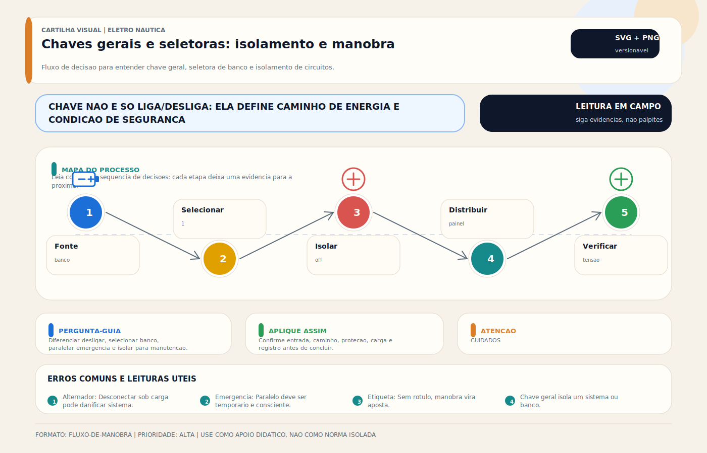

# Chaves Gerais (DC)

> [!abstract] Resumo técnico
> Chave geral DC é o dispositivo de seccionamento principal do sistema de corrente contínua ou de um banco específico. Em embarcações, ela precisa ser pensada como elemento de segurança, manutenção e governança elétrica, não como simples "liga/desliga" instalado perto da bateria sem critério.

## O que é

Chave geral DC é o dispositivo usado para conectar ou isolar um banco, um conjunto de cargas ou um subsistema. Dependendo da arquitetura, pode assumir papéis diferentes:

- chave de seccionamento do banco;
- chave de serviço;
- chave de arranque;
- chave seletora entre bancos;
- chave de emergência ou manutenção.

## Função na embarcação

- permitir isolamento elétrico seguro;
- facilitar manutenção e atendimento a emergência;
- separar bancos ou serviços conforme a arquitetura;
- reduzir dependência de desconexão direta no borne da bateria;
- organizar a operação do sistema DC.

## Fundamentos mínimos

### Chave geral não substitui proteção contra sobrecorrente

Ela secciona e isola. A proteção do cabo e do circuito continua dependendo de fusíveis, disjuntores ou solução equivalente na arquitetura correta.

### Nem tudo deve necessariamente morrer na mesma chave

Alguns circuitos podem exigir alimentação permanente ou rota dedicada, conforme a estratégia da embarcação. A arquitetura precisa deixar isso explícito.

### Corrente contínua e corrente de manobra importam

A chave deve suportar o serviço real do sistema, incluindo:

- corrente contínua plausível;
- corrente de pico de certas cargas;
- esforço de manobra;
- ambiente térmico e mecânico.

### Operação com fontes ativas exige disciplina

Troca de posição sob condição inadequada pode ser problemática. A forma correta de operar depende do tipo exato da chave, da topologia e das fontes ativas no sistema. Manual do fabricante e projeto valem mais que regra decorada de cais.

## Tipos e arquiteturas comuns

### Chave simples ON/OFF

- adequada para seccionamento claro de banco ou grupo de cargas;
- simples e robusta quando bem escolhida.

### Chave seletora de bancos

- permite escolher banco ou combinar bancos conforme a arquitetura;
- exige etiquetagem, documentação e operação consciente.

### Solução com gerenciamento automático

- usa ACR, VSR, DC-DC ou lógica equivalente;
- reduz dependência da operação manual, mas não elimina necessidade de seccionamento físico coerente.

## Projeto e instalação

### O que precisa ser definido

1. qual banco ou subsistema a chave secciona;
2. quais circuitos ficam a montante e a jusante;
3. corrente contínua e picos envolvidos;
4. ambiente de instalação e acessibilidade;
5. operação normal, manutenção e emergência;
6. interação com alternador, carregadores, inversores e combinações de banco.

### Diretrizes práticas

- instalar em local acessível e claramente identificado;
- escolher componente com rating coerente com o serviço real;
- evitar chicotes longos e desprotegidos entre bateria, proteção e chave;
- documentar exatamente o que a chave corta e o que não corta;
- tratar seletora manual com cuidado especial quando houver múltiplas fontes e bancos.

## Onde costuma dar problema

| Problema | Causa provável |
| --- | --- |
| aquecimento na chave | subdimensionamento, contato degradado ou terminação ruim |
| queda de tensão significativa | resistência de contato ou conexões deficientes |
| operador não entende a posição da chave | etiquetagem ruim ou arquitetura confusa |
| banco é descarregado indevidamente | lógica de separação e operação mal definidas |
| falha em manutenção | circuito supostamente isolado ainda permanece energizado |

## Diagnóstico prático

1. Medir queda de tensão através da chave sob carga.
2. Inspecionar terminais, aquecimento e integridade mecânica.
3. Confirmar a posição e a lógica real de cada polo ou seleção.
4. Verificar se a arquitetura documentada corresponde ao instalado.
5. Avaliar se a chave está sendo usada dentro do regime de corrente e operação para o qual foi selecionada.

## Boas práticas profissionais

- usar chave identificada e compatível com a corrente e o ambiente;
- posicionar a chave de modo acessível para operação e emergência;
- separar claramente banco de partida, banco de serviço e circuitos permanentes quando existirem;
- medir e registrar quedas de tensão em inspeções periódicas;
- treinar a operação correta conforme a topologia do barco, sem improviso.

## Erros comuns

- tratar chave geral como proteção contra curto-circuito;
- escolher componente pela aparência ou preço, não pelo rating;
- deixar a função real da chave ambígua para o operador;
- usar a seletora sem entender as consequências para bancos e fontes ativas;
- esquecer que circuitos permanentes e bypass precisam estar documentados.

## Relação com outros sistemas

- **[[Barramento DC / Bus Bar / Distribuição DC]]** — distribuição a jusante da chave.
- **[[Banco de Baterias]]** — banco ou bancos controlados pela chave.
- **[[Divisores de Carga (DC)]]** e soluções de gestão de banco — interação operacional.
- **[[Hotline (DC)]]** — circuitos que podem permanecer fora da chave.
- **[[Disjuntores (DC) e (AC)]]** — proteção coordenada do sistema.

## Normas e referências

- documentação do fabricante da chave e do sistema;
- critérios de seccionamento, proteção e instalação DC aplicáveis;
- diagrama elétrico real da embarcação.

## FAQ

**Toda carga deve passar pela chave geral?**

Não como dogma. Depende da arquitetura e dos circuitos que precisam permanecer alimentados ou ser isolados separadamente.

**Chave seletora manual ainda faz sentido?**

Pode fazer, mas exige projeto e operação claros. Em muitos casos, soluções automáticas de gerenciamento de banco trazem mais previsibilidade.

**Se a chave gira e parece funcionar, ela está boa?**

Não necessariamente. Queda de tensão, aquecimento e degradação de contato podem existir mesmo com sensação mecânica aparentemente normal.

## Visual didático

Diferenciar desligar, selecionar banco, paralelar emergencia e isolar para manutencao.

**Cautela:** Nunca manobre chaves de bateria ou AC sem entender carga, alternador, inversor e recomendacao do fabricante.

Material de apoio: [Chaves gerais e seletoras: isolamento e manobra](../_visuals/generated/chaves-gerais-seletoras-isolamento.md)

## Integração com outras notas

- [[Barramento DC / Bus Bar / Distribuição DC]]
- [[Chaves Seletoras (AC)]]
- [[Divisores de Carga (DC)]]
- [[Hotline (DC)]]
- [[Banco de Baterias]]
- [[Disjuntores (DC) e (AC)]]

## Perguntas que esta nota responde

- O que faz uma chave geral DC em embarcações?
- Como especificar e operar corretamente uma chave de bateria?
- Quais falhas aparecem em chaves gerais mal dimensionadas ou mal documentadas?
