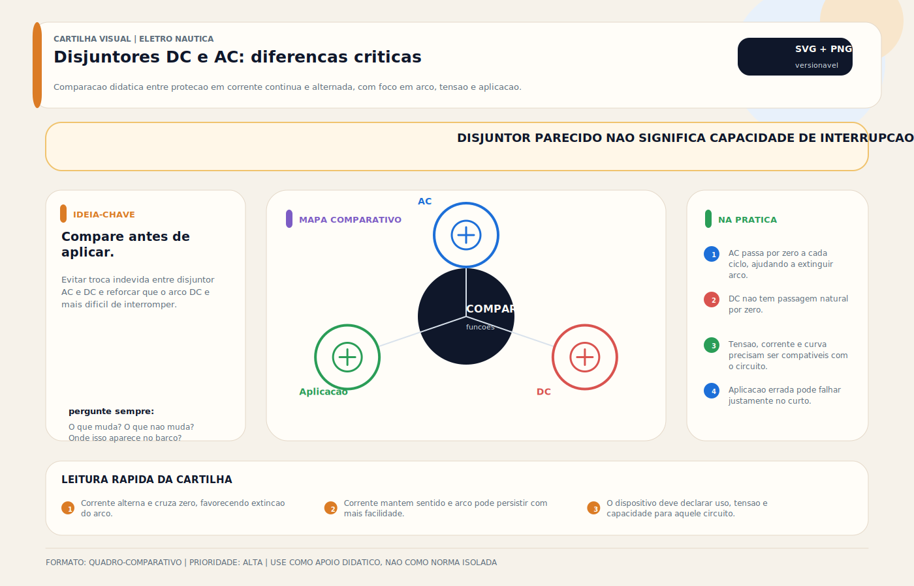

# Disjuntores (DC) e (AC)

> [!abstract] Resumo técnico
> Disjuntores AC e DC são dispositivos de proteção e seccionamento rearmáveis. Em ambiente náutico, o ponto decisivo não é apenas a corrente nominal: é a compatibilidade com a tensão, a capacidade de interrupção, a curva de disparo e a resistência do conjunto ao ambiente marinho.

## O que é

Disjuntor (circuit breaker) é um dispositivo eletromecânico de proteção que interrompe automaticamente um circuito quando a corrente excede o valor nominal por tempo suficiente (sobrecarga) ou quando ocorre curto-circuito. Diferente do fusível: o disjuntor é ressarcível — após o disparo, localiza-se o problema, resolve e religa. O fusível é descartável — precisa ser substituído.

**Por que essa diferença importa em náutica:**

No mar, longe de suprimentos, um fusível queimado pode ser insubstituível se não houver spare a bordo. Um disjuntor disparado pode ser religado (após resolver o problema) sem necessidade de peça adicional.

**Tipos em uso:**

- **Disjuntor térmico:** proteção por lâmina bimetálica — temperatura ambiente influencia o disparo
- **Disjuntor hidráulico-magnético:** dois mecanismos independentes — insensível à temperatura, superior para uso náutico
- **Disjuntor magnetotérmico:** mais comum em aplicações residenciais AC — presente em alguns painéis náuticos
- **RCBO (disjuntor + diferencial integrado):** combina proteção de sobrecorrente com proteção diferencial (ver tópico PROTEÇÃO DR)

## Função

Proteger cada circuito elétrico contra:

- **Sobrecarga:** corrente acima do nominal por tempo prolongado (aquece o cabo)
- **Curto-circuito:** corrente muito alta por falha de isolamento (risco imediato de incêndio)

E servir como **chave de controle individual** de cada circuito no painel — ligar e desligar equipamentos com segurança.

**Importante:** o disjuntor protege o CABO, não a carga. O dimensionamento é pela bitola do cabo, não pelo consumo do equipamento.

## Como aparece na prática

**Painel DC (muito comum no Brasil):**

Fileira de disjuntores térmicos de 10–30A no painel de distribuição DC — um para cada circuito (iluminação, bombas, eletrônicos, tomadas). Servem como chave e como proteção simultâneas. Marcas mais comuns: genéricos importados, Blue Sea Systems em instalações de qualidade.

**Painel AC:**

Disjuntores AC protegendo circuitos de shore power — ar-condicionado, tomadas 220V, carregador, aquecedor. Marcas: Schneider, ABB, WEG.

**Erro clássico:** disjuntor dispara repetidamente → operador substitui por um de amperagem maior "para parar de disparar" → o problema continua, o cabo começa a sobreaquecer → risco de incêndio. O disjuntor está sinalizando um problema — nunca esconder o sinal.

## Fundamentos mínimos

**Por que DC é mais difícil de interromper que AC:**

Corrente alternada (AC) cruza zero 120 vezes por segundo (60Hz) — o arco elétrico se extingue naturalmente a cada cruzamento de zero. Corrente contínua (DC) nunca cruza zero — o arco pode se sustentar indefinidamente após a abertura dos contatos.

Por isso: **disjuntor AC nunca deve ser usado em circuito DC**. A câmara de extinção de arco do disjuntor AC não é projetada para DC e pode não extinguir o arco em um curto-circuito — resultado: contatos fundidos, arco sustentado, incêndio.

**Disjuntor térmico vs hidráulico-magnético:**

| Aspecto | Térmico | Hidráulico-Magnético |
| --- | --- | --- |
| Mecanismo | Lâmina bimetálica aquece e dispara | Hidráulico (sobrecarga) + magnético (curto) |
| Sensibilidade à temperatura | Sim — ambiente quente = disparo mais cedo | Não — insensível à temperatura |
| Resposta a curto | Lenta (térmico só) | Muito rápida (magnético) |
| Custo | Baixo | Alto |
| Preferência náutica | Aceitável para circuitos simples | Recomendado para circuitos críticos |

## Características técnicas

**Parâmetros para seleção:**

- **Corrente nominal (In):** valor acima do qual o disjuntor dispara com tempo de retardo
- **Tensão nominal:** AC (220V, 240V) ou DC (12V, 24V, 48V) — especificação diferente!
- **Capacidade de interrupção (kA):** máxima corrente de curto-circuito que o disjuntor suporta interromper sem dano
- **Curva de disparo:** B (sensível, doméstico), C (padrão comercial), D (motores com alta inrush)

**Corrente de pico de inrush em motores:**

Bombas, compressores e thrusters têm corrente de partida 3–6× a corrente nominal. Um disjuntor de curva C ou D é necessário para não disparar durante a partida. Disjuntor de curva B dispararia a cada ligação do motor.

**Dimensionamento pelo circuito (regra fundamental):**

| Cabo (mm²) | Corrente máxima náutica | Disjuntor máximo |
| --- | --- | --- |
| Exemplo 1,5 | Depende de isolação, temperatura, agrupamento e percurso | Coordenar com a ampacidade real |
| Exemplo 2,5 | Depende de isolação, temperatura, agrupamento e percurso | Coordenar com a ampacidade real |
| Exemplo 4,0 | Depende de isolação, temperatura, agrupamento e percurso | Coordenar com a ampacidade real |
| Exemplo 6,0 | Depende de isolação, temperatura, agrupamento e percurso | Coordenar com a ampacidade real |
| Exemplo 10,0 | Depende de isolação, temperatura, agrupamento e percurso | Coordenar com a ampacidade real |

A tabela acima é apenas ilustrativa. Em embarcações, a ampacidade real varia com tipo de cabo, temperatura ambiente, agrupamento, ventilação, percurso e exigência de queda de tensão.

## Configurações comuns

**Configuração 1 — Painel DC com disjuntores térmicos (muito comum no Brasil):**

Fileira de disjuntores térmicos 10–30A no painel de distribuição DC. Cada circuito tem seu próprio disjuntor. Custo baixo, aceitável para circuitos simples de iluminação e eletrônicos.

**Configuração 2 — Painel DC com hidráulico-magnéticos (mais presente em embarcações maiores/premium):**

Blue Sea Systems ou Carlingswitch em todos os circuitos. Sem sensibilidade a temperatura, proteção mais confiável. Padrão em embarcações norte-americanas e europeias de qualidade.

**Configuração 3 — Painel AC com disjuntores magnetotérmicos:**

Schneider, ABB ou WEG no painel AC. DR no circuito principal de shore power + disjuntores individuais por circuito AC (ar-condicionado, tomadas, carregador).

**Configuração 4 — RCBO (disjuntor + diferencial integrado) por circuito AC:**

Um RCBO em cada circuito AC — proteção de sobrecorrente + diferencial individual. Mais prático que DR central + múltiplos disjuntores. Crescendo em embarcações modernas.

## Marcas e referências

**DC náutico (muito comum no Brasil e em barcos importados):**

- **Blue Sea Systems** — referência americana, linha DC específica com câmara de arco, 5–100A, manual e automático (reset)
- **Carlingswitch (Sensata)** — americana, qualidade reconhecida, hidráulico-magnético e térmico
- **Ancor** — linha náutica completa, boa qualidade

**AC (mais presente em embarcações maiores e instalações profissionais):**

- **Schneider Electric** (Acti9, iC60N) — muito presente no mercado náutico brasileiro
- **ABB** (S200) — qualidade europeia, presente em embarcações importadas
- **WEG** — nacional, qualidade adequada, boa disponibilidade de peças no Brasil
- **Hager** — europeu, presente em instalações de alta qualidade

**A evitar:**

- Disjuntores residenciais AC em circuitos DC
- Disjuntores sem especificação de tensão DC explícita para aplicações DC

## Componentes relacionados

- **Fusíveis ANL / Maxi-fuse:** proteção principal dos bancos de bateria e cabos de alta corrente — complementam os disjuntores de painel
- **Painel de distribuição DC / AC:** estrutura que abriga os disjuntores e distribui os circuitos
- **DR (Diferencial):** proteção complementar para sistemas AC — protege contra choque elétrico (diferente do disjuntor)
- **Barramento / Barra de distribuição:** ponto de conexão dos cabos de entrada e saída dos disjuntores
- **Cabos de circuito:** o que o disjuntor protege — dimensionamento deve ser consistente
- **Etiquetas de identificação:** cada disjuntor deve ser identificado com o circuito que protege

## Problemas mais frequentes

1. **Disjuntor dispara repetidamente no mesmo circuito** — sobrecarga real (carga aumentou), curto-circuito intermitente, disjuntor degradado (mola ou contato fraco)
2. **Disjuntor AC usado em circuito DC** — pode não extinguir arco em curto; risco de incêndio
3. **Disjuntor de amperagem errada** — muito alto: cabo pode sobreaquecer antes de disparar; muito baixo: nuisance tripping
4. **Disjuntor não desliga o circuito** — contatos soldados por arco ou oxidados — substituir imediatamente
5. **Disjuntor térmico disparando em casa de máquinas quente** — temperatura ambiente eleva a sensibilidade térmica — usar hidráulico-magnético nesses locais
6. **Disjuntor DC sem capacidade de interrupção adequada** — em sistemas 24V ou 48V, o arco DC é mais difícil de extinguir; usar disjuntor com capacidade de interrupção especificada

## Causas raiz

| Problema | Causa raiz real |
| --- | --- |
| Disjuntor dispara repetidamente | Carga cresceu além do projeto original OU cabo subdimensionado OU disjuntor degradado |
| Disjuntor DC não extingue arco | Disjuntor AC instalado em circuito DC — câmara de arco inadequada para DC |
| Incêndio no circuito apesar do disjuntor | Disjuntor de valor muito alto — cabo sobreaquecer antes de atingir corrente de disparo |
| Disjuntor dispara mais no verão | Disjuntor térmico em ambiente quente — temperatura eleva sensibilidade bimetálica |
| Circuito sempre "on" apesar de disjuntor "off" | Contatos soldados por arco — disjuntor precisa ser substituído |

## Diagnóstico prático

**Passo 1 — Disjuntor que dispara repetidamente:**

- Medir corrente real do circuito com alicate amperímetro AC ou DC
- Se corrente > nominal do disjuntor: carga excessiva ou curto intermitente — investigar carga
- Se corrente < nominal: disjuntor degradado (mola ou bimetálico fraco) — substituir o disjuntor

**Passo 2 — Verificar se é disjuntor térmico em ambiente quente:**

- Medir temperatura do local de instalação
- Acima de 45°C: disjuntor térmico pode disparar com corrente menor que o nominal — usar hidráulico-magnético

**Passo 3 — Verificar capacidade de interrupção:**

- Consultar placa do disjuntor: capacidade de interrupção em kA
- Comparar esse valor com a corrente de curto presumida no ponto de instalação
- Em bancos de baterias de baixa impedância, essa verificação é mandatória

**Passo 4 — Disjuntor que não desliga:**

- Com circuito desligado, medir resistência entre os terminais com multímetro
- Zero ohms com disjuntor na posição off: contatos soldados — substituir imediatamente

**Ferramenta mínima:** alicate amperímetro DC/AC e multímetro.

## Boas práticas profissionais

- **Dimensionar pelo cabo, não pela carga** — o cabo é o que se protege
- **Nunca usar disjuntor AC em circuito DC** — verificar especificação de tensão DC explícita
- Preferir disjuntores hidráulico-magnéticos em locais quentes (casa de máquinas) e em circuitos críticos (bombas, alarmes)
- Etiquetar cada disjuntor com o circuito que protege — painel não identificado é risco em emergência
- Manter spare de disjuntores nas amperagens mais usadas a bordo (especialmente 10A, 15A, 20A)
- Nunca substituir por amperagem maior "para parar de disparar" — investigar a causa sempre
- Testar abertura e fechamento de cada disjuntor anualmente — contatos podem oxidar em posição

## Cuidados de instalação

- Cabos de entrada e saída do disjuntor com identificação clara (fase/positivo, neutro/negativo)
- Parafusos de terminal do disjuntor com torque especificado pelo fabricante — aperto insuficiente = arco no terminal
- Disjuntores DC com câmara de arco na orientação correta — alguns modelos têm orientação específica para extinção de arco
- Espaçamento adequado entre disjuntores no painel — sem superaquecimento por concentração
- Fio de identificação em cada cabo antes de instalar no disjuntor — rastrear depois é muito mais difícil

## Cuidados de uso

- Quando um disjuntor dispara: identificar a causa antes de religar
- Religar e disparar novamente: não insistir — há problema real no circuito
- Verificar todos os disjuntores manualmente (on/off) na revisão anual — contatos que nunca operam oxidam e podem não abrir em emergência

## Erros comuns de instaladores

- **Disjuntor AC em circuito DC** — o mais perigoso; instalação incorreta em sistemas 24V/48V pode resultar em arco sustentado e incêndio
- **Disjuntor superdimensionado** — "na dúvida coloco um maior" — o cabo pode queimar antes de o disjuntor disparar
- **Disjuntor térmico em casa de máquinas quente** — dispara com corrente abaixo do nominal; operador aumenta o valor e cria risco real
- **Painel não identificado** — em emergência, ninguém sabe qual disjuntor desligar
- **Não substituir disjuntor com contatos soldados** — deixar um "falso off" no painel é perigoso

## Relação com outros sistemas

- **Fusíveis ANL / Maxi-fuse:** proteção de alta corrente nos bancos e cabos principais — trabalham em conjunto com os disjuntores de painel
- **DR (Diferencial):** proteção complementar para circuitos AC — protege contra choque (o disjuntor não faz isso)
- **Painel de Distribuição:** estrutura que organiza os disjuntores e distribui circuitos
- **Barra de distribuição / Barramento:** ponto de alimentação dos disjuntores
- **Cargas elétricas (bombas, iluminação, eletrônicos):** o que o disjuntor protege indiretamente
- **Cabos de circuito:** o que o disjuntor protege diretamente — dimensionamento deve ser consistente entre cabo e disjuntor

## Brasil x Internacional

| Aspecto | Brasil | Internacional (ABYC/Europa) |
| --- | --- | --- |
| Disjuntores DC mais usados | Genéricos térmicos AC/DC, Blue Sea Systems em instalações de qualidade | Blue Sea Systems, Carlingswitch hidráulico-magnético |
| Disjuntores residenciais em DC | Comum (prática de risco) | Não aceitável — especificação DC obrigatória |
| Dimensionamento | Frequentemente por carga, não por cabo | Por cabo — regra fundamental |
| Identificação de painel | Frequentemente ausente | Exigida por ABYC E-11 (2023) |
| Hidráulico-magnético | Raro | Padrão em instalações de qualidade |

**Realidade brasileira:** o uso de disjuntores residenciais ou de origem predial em circuitos DC ainda é comum, mas isso não o torna prática correta. Em qualquer circuito DC, sobretudo com baterias de baixa impedância, o disjuntor deve ter especificação explícita para tensão DC, orientação de montagem e capacidade de interrupção compatível com a energia disponível no ponto.

## Normas e referências técnicas

- **ABYC E-11 (2023)** — AC and DC Electrical Systems on Boats: requisitos de proteção de circuitos, capacidade de interrupção, identificação de painéis
- **ABYC E-10 (2023)** — Storage Batteries: proteção de cabos de bateria
- **ISO 13297:2020** — Electrical systems on recreational craft
- **IEC 60947-2** — Low-voltage switchgear: disjuntores industriais
- **ABNT NBR 5410 (2004 + emendas)** e família **ABNT/IEC** aplicável — referência complementar para princípios de baixa tensão, identificação e proteção
- **NBR 5410** — Instalações elétricas de baixa tensão: base para aplicação náutica de proteções AC

## Como ensinar este tópico

**Progressão recomendada:**

1. Diferença fusível vs disjuntor: por que o disjuntor é preferido em painel de distribuição
2. Por que DC ≠ AC: explicar o arco DC que não se extingue naturalmente — mostrar com diagrama
3. Regra fundamental: "o disjuntor protege o cabo, não a carga" — exercício de dimensionamento
4. Diferença térmico vs hidráulico-magnético: onde cada um se aplica
5. Prática: identificar em painel real quais disjuntores são DC e quais são AC — checagem de especificação
6. Diagnóstico: disjuntor que dispara repetidamente — sequência de investigação

**Onde inserir no material:**

- Após painel elétrico (os disjuntores compõem o painel)
- Junto com fusíveis (proteção de circuito — completar os dois)
- Antes de distribuição DC/AC (o disjuntor é parte da distribuição)

## Ideias de vídeos e aulas práticas

- **"Disjuntor DC vs AC: por que você não pode trocar um pelo outro"** — explicação do arco DC
- **"Como dimensionar o disjuntor certo para cada circuito"** — tabela prática de cabo × corrente × disjuntor
- **"Painel DC completo: do zero, com identificação e bitolas corretas"** — projeto e montagem
- **"Disjuntor dispara repetidamente: sequência de diagnóstico"** — passo a passo de campo
- **"Térmico vs Hidráulico-magnético: abrindo os dois e comparando"** — desmontagem didática

## Diagramas sugeridos

- **Diagrama de painel DC:** barramento positivo → disjuntores → circuitos; barramento negativo → retorno
- **Comparação AC vs DC:** cruzamento de zero em AC (extinção natural do arco) vs DC constante (arco sustentado)
- **Dimensionamento:** tabela visual cabo (mm²) × corrente máxima × disjuntor correspondente
- **Circuito de diagnóstico:** onde medir corrente para verificar se disjuntor ou carga é o problema
- **Layout típico de painel:** disjuntores DC 12V com identificação de circuito

## FAQ

**Posso usar disjuntor residencial no barco?**

Só depois de verificar se o dispositivo é adequado para a tensão, capacidade de interrupção, tipo de condutor e ambiente de instalação. Em circuitos DC, a exigência de especificação explícita para corrente contínua é obrigatória. Em circuitos AC, o fato de "funcionar" não dispensa avaliar corrosão, grau de proteção do painel, vibração e conformidade com o projeto.

**Qual a diferença entre fusível e disjuntor?**

Fusível: mais rápido, menor resistência de contato, descartável após disparo. Disjuntor: ressarcível, mais conveniente operacionalmente. Para proteção de banco principal (alta corrente): fusível ANL. Para painel de circuitos individuais: disjuntor.

**Disjuntor disparou — posso religar direto?**

Verificar a causa antes. Se religar e disparar imediatamente: curto-circuito no circuito — não insistir. Se religar e funcionar normalmente: pode ter sido sobrecarga temporária. Monitorar.

**Disjuntor de 20A protege carga de 5A em cabo de 2,5mm²?**

Depende da ampacidade real daquele circuito, do tipo de cabo, da temperatura, do agrupamento e da queda de tensão admissível. Não é seguro responder só pela seção nominal. Primeiro se determina a ampacidade do circuito; depois se escolhe o disjuntor.

## Visual didático

Evitar troca indevida entre disjuntor AC e DC e reforcar que o arco DC e mais dificil de interromper.

**Cautela:** Use somente dispositivos especificados para tensao, corrente, curva e capacidade de interrupcao do circuito.

Material de apoio: [Disjuntores DC e AC: diferencas criticas](../_visuals/generated/disjuntores-dc-ac-diferencas.md)

## Integração com outras notas

- [[Aterramento]]
- [[Barramento DC / Bus Bar / Distribuição DC]]
- [[Bonding — Sistema de Interligação de Massas]]
- [[CAIS (Pier) (AC)]]
- [[Cabeamento Náutico]]
- [[Chaves Gerais (DC)]]
- [[Chaves Seletoras (AC)]]
- [[Contatores (AC)]]
- [[Divisores de Carga (DC)]]
- [[Fusíveis DC — Proteção Contra Sobrecorrente]]
- [[Proteção Dr]]

## Perguntas que esta nota responde

- O que é Disjuntores (DC) e (AC) em instalações elétricas náuticas?
- Qual é a função de Disjuntores (DC) e (AC) na embarcação?
