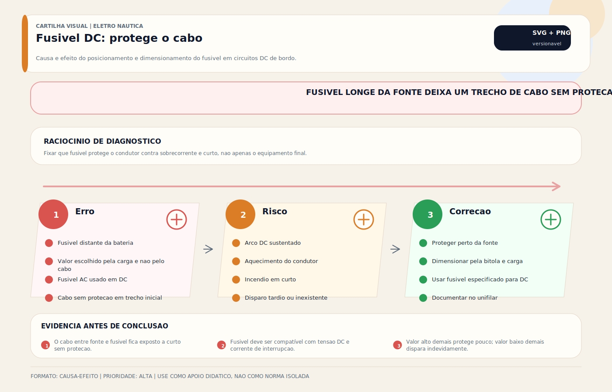

# Fusíveis DC — Proteção Contra Sobrecorrente

> [!abstract] Resumo técnico
> Fusíveis DC são elementos de proteção contra sobrecorrente usados para limitar a energia de falha e proteger condutores, barramentos e alguns equipamentos. Quase todo condutor energizado precisa de proteção próxima à fonte, salvo exceções definidas por norma ou pelo fabricante.

## O que é

Fusível DC é um dispositivo de proteção que interrompe um circuito elétrico quando a corrente supera o valor nominal por tempo suficiente para fundir o elemento interno. Seu papel principal é limitar a energia que pode circular em uma falha e proteger condutores, barramentos e conjuntos associados contra sobrecorrente e curto-circuito. Na prática de projeto, o fusível é escolhido primeiro para proteger o circuito e sua fiação; a carga pode exigir proteção adicional própria.

## Função

| Função | Mecanismo |
| --- | --- |
| Proteção do cabeamento | Funde antes que o cabo superaqueça e pegue fogo |
| Proteção em curto-circuito | Interrompe centenas de amperes em milissegundos |
| Isolação de falha | Isola o circuito com problema sem afetar os demais |
| Sinalização de problema | Fusível queimado indica sobrecarga ou curto — não apenas "trocar e seguir" |

**O fusível é selecionado para proteger o circuito, com foco principal no condutor.**

Esta é a regra mais importante. A corrente nominal e a curva do fusível precisam ser compatíveis com a ampacidade do cabo, o método de instalação, a temperatura, a carga e a corrente de partida. Escolher o fusível apenas pelo consumo do equipamento ou apenas "pela bitola" sem considerar a instalação é incompleto.

## Tipos de fusíveis DC

**ANL (ou fuso) — muito comum no Brasil para cabos grossos:**

- Uso: cabos principais (bateria → barramento, banco → inversor)
- Corrente: 100–500A
- Instalação: in-line, próximo à bateria (< 180mm do polo positivo)
- Tempo de fusão: tipicamente retardado, adequado a cargas com inrush, desde que a capacidade de interrupção seja compatível com a corrente de curto disponível

**Fusível de lâmina (blade fuse) — ATO, ATC, MINI, MAXI:**

- Uso: circuitos individuais de baixa e média corrente (até 30–40A)
- Corrente: 5, 7.5, 10, 15, 20, 25, 30A (ATO/ATC) / 40–80A (MAXI)
- Instalação: suporte porta-fusível in-line ou painel de fusíveis
- **Cor padrão:** cinza=1A, marrom=7.5A, vermelho=10A, azul=15A, amarelo=20A, branco=25A, verde=30A

**Fusível de vidro (glass fuse) — padrão AGC:**

- Uso: equipamentos antigos, eletrônicos específicos
- Pouco recomendado para instalações novas (sem proteção física, difícil identificar queimado)

**Fusível cerâmico (ceramic):**

- Maior capacidade de ruptura que o vidro
- Uso em circuitos de alta tensão DC (sistemas 48V, painéis solares)

**MRBF / terminal fuse / Class T:**

- Aplicações de alta energia próximas ao banco de baterias
- Muito relevantes em sistemas com lítio, inversores e correntes de curto elevadas
- A escolha deve considerar especialmente a capacidade de interrupção do dispositivo

**MIDI fuse:**

- Versão intermediária entre lâmina e ANL
- Corrente: 30–200A
- Mais compacto que ANL, mais robusto que lâmina MAXI

**Disjuntor (circuit breaker) — alternativa ao fusível:**

- Resetável — não precisa ser substituído
- Mais caro que fusível simples
- Usado em painéis principais onde rearme frequente é necessário
- Atenção: disjuntor DC é diferente de disjuntor AC — não são intercambiáveis

## Dimensionamento correto

**Regra principal:** a proteção contra sobrecorrente deve ser coordenada com a ampacidade do circuito e com o comportamento da carga.

```jsx
Ampacidade do circuito e temperatura de instalação → limite superior
Corrente contínua da carga + margens de partida/serviço → limite inferior
Escolher a família e o calibre do fusível dentro da série disponível e da capacidade de interrupção exigida
```

**Exemplo prático:**

- Equipamento: bilge pump, 10A nominal
- Cabo: AWG 14, run de 3m, suporta até 17A (ABYC)
- Fusível: não pode exceder 17A → usar fusível 15A

**Não usar fusível maior que a capacidade do cabo:**

Fusível de 30A em cabo AWG 18 (limite 10A) = o cabo queima antes do fusível fundir = incêndio.

## Posicionamento correto

**Princípio de projeto:** a proteção deve ficar o mais próximo possível da fonte de energia (bateria ou barramento positivo), para minimizar o trecho não protegido.

- Cabos não protegidos por fusível = risco de incêndio em toda a extensão não protegida
- Em muitos referenciais náuticos, a distância máxima do trecho não protegido é pequena e rigidamente controlada
- Exceções existem, mas devem ser justificadas por norma, pelo fabricante e pela função do circuito

**Não é aceitável:**

- Fusível no meio do cabo
- Fusível só na extremidade do cabo (longe da bateria)
- Circuito sem fusível algum ("o disjuntor do painel já protege")

## Características e especificações

| Parâmetro | O que significa |
| --- | --- |
| Amperagem nominal | Corrente em que funde em tempo prolongado |
| Tensão máxima | Deve ser ≥ tensão do sistema (12V, 24V, 48V) |
| Capacidade de ruptura (kA) | Corrente máxima de curto-circuito que suporta sem explodir |
| Tempo de fusão | Rápido (eletrônicos) vs lento (motores com inrush) |

**Atenção nos sistemas 24V e 48V:**

Fusíveis de lâmina automotivos são classificados para 12V ou 32V. Em sistemas 24V ou 48V, verificar especificação de tensão do fusível — usar fusíveis certificados para a tensão do sistema.

## Problemas mais frequentes

| Problema | Causa | Ação |
| --- | --- | --- |
| Fusível queimando repetidamente | Sobrecarga ou curto no circuito | NUNCA colocar fusível maior — diagnosticar a causa |
| Fusível queimado sem razão aparente | Pico de partida (inrush) ou fusível inadequado à curva da carga | Rever a família do fusível e o comportamento da carga |
| Fusível quente sem queimar | Corrente próxima ao nominal ou mau contato no suporte | Verificar corrente + inspecionar suporte |
| Suporte oxidado | Ambiente úmido sem proteção | Limpar com produto adequado para contato elétrico e substituir o suporte se necessário |
| Fusível correto, mas equip. queima | Corrente de falha do equip. é menor que a corrente do fusível | Adicionar proteção no equipamento |

## Diagnóstico de fusível

**Verificar sem multímetro:**

Fusível de vidro: verificar visualmente o elemento (filamento intacto ou rompido).

Fusível de lâmina: verificar visualmente a janelinha plástica.

**Com multímetro (mais confiável):**

```jsx
Modo de continuidade (buzzer) ou Ω
Pontas nos dois terminais do fusível
Buzzer contínuo ou < 1Ω → fusível OK
Sem buzzer ou OL → fusível queimado
```

**Com multímetro no circuito (sem retirar o fusível):**

```jsx
Modo DCV
Medir tensão em cada terminal do fusível vs negativo
Terminal de entrada: deve ter tensão (ex: 12,5V)
Terminal de saída: deve ter a mesma tensão (ex: 12,5V)
Se entrada tem tensão e saída não → fusível queimado ou mau contato no suporte
```

## Boas práticas profissionais

- Nunca substituir fusível queimado por valor maior sem investigar a causa
- Instalar proteção contra sobrecorrente em cada condutor energizado conforme a topologia do circuito e as exceções normativas
- Usar porta-fusível com tampa de proteção em ambientes com umidade
- Documentar no diagrama elétrico o valor do fusível de cada circuito
- Manter estoque de fusíveis de reposição a bordo (todos os valores instalados)
- Em circuitos de alta energia, verificar a capacidade de interrupção antes de escolher a família do fusível

## Erros comuns

**"O disjuntor do painel já protege."**

Não. O disjuntor no painel protege o circuito a partir do painel. O trecho entre a bateria e o painel ainda precisa de fusível próximo à bateria.

**Substituir por fusível de maior amperagem para "parar de queimar":**

O fusível está querendo proteger o cabo. Se você coloca um maior, o cabo vai queimar — literalmente. O resultado pode ser incêndio.

**Não instalar fusível por ser "circuito pequeno":**

Qualquer circuito DC pode fazer curto-circuito. Um cabo AWG 18 sem fusível conectado diretamente à bateria pode conduzir 200A em curto até queimar o isolamento.

**Usar fusível de lâmina automotivo em sistema 24V sem verificar:**

Muitos fusíveis automotivos são especificados para 12V ou 32V. Em sistema 24V, verificar a tensão de trabalho do fusível.

**Ignorar capacidade de interrupção em bancos de alta energia:**

Em bancos de lítio, grandes AGM ou conjuntos próximos à bateria, o problema não é só a corrente nominal. Se a capacidade de interrupção do fusível for insuficiente, ele pode falhar de forma perigosa durante um curto severo.

## Relação com outros sistemas

- **Cabeamento:** bitola do cabo define o limite máximo do fusível
- **Barramento DC:** cada ramal do barramento precisa de fusível próximo ao barramento
- **Banco de baterias:** cabo principal bateria → barramento precisa de ANL próximo à bateria
- **Inversor:** ANL dedicado na linha bateria → inversor (corrente pode ser > 100A)
- **Painel de distribuição:** cada disjuntor no painel é o fusível de seu circuito

## Normas aplicáveis

- **ABYC E-11** — seção de proteção de circuitos (referência primária)
- **ABNT NBR 5410** e família **ABNT/IEC** aplicável — referência complementar para coordenação de proteção e princípios de baixa tensão
- **SAE J1284** — blade type electric fuses (padrão para fusíveis de lâmina)

## Como ensinar este tópico

**Sequência recomendada:**

1. Analogia: fusível = elo fraco intencional — sacrifica-se para salvar o resto
2. Demonstrar: cabo AWG 18 sem fusível ligado direto em curto → quantos amperes passa? → quanto tempo leva para queimar?
3. Dimensionamento ao vivo: dado o cabo e o equipamento, qual fusível usar?
4. Mostrar o erro: fusível maior em cabo fino → cabo queima primeiro
5. Posicionamento correto: medir 180mm a partir da bateria em uma embarcação real

**Conceito-chave para fixar:**

"O fusível protege o CABO. O valor máximo do fusível é o que o cabo aguenta — não o que o equipamento consome."

## FAQ

**Por que o fusível protege o cabo e não o equipamento?**

Porque a primeira missão da proteção contra sobrecorrente é preservar a integridade do circuito alimentador. Alguns equipamentos possuem proteção interna; outros não. Quando a carga exigir proteção mais sensível, essa proteção precisa ser adicionada sem abandonar a proteção principal do circuito.

**Posso usar disjuntor no lugar de fusível?**

Sim, desde que seja disjuntor DC (não AC) com capacidade de ruptura adequada para o sistema. Disjuntor é preferível em posições que precisam de rearme frequente.

**Qual a diferença entre fusível rápido e fusível lento (retardado)?**

Fusível rápido funde imediatamente ao atingir a corrente nominal — indicado para proteção de eletrônicos. Fusível lento (slow-blow) aguenta picos curtos de corrente (inrush de motores) sem fundir — indicado para motores elétricos e bombas.

**Quanto tempo leva para um fusível de 15A fundir se a corrente for 16A?**

Muito tempo — pode levar horas. Fusíveis fundem rapidamente apenas com correntes muito acima do nominal (2–10×). Para sobrecarga leve, a proteção é lenta. Por isso, não usar fusíveis com valor muito próximo à corrente de operação.

## Visual didático



Fixar que fusivel protege o condutor contra sobrecorrente e curto, nao apenas o equipamento final.

**Cautela:** Distancias, classes de fusivel e capacidade de interrupcao devem seguir projeto, norma e fabricante.

Material de apoio: [Fusivel DC: protege o cabo](../_visuals/generated/fusivel-protege-cabo.md)

## Integração com outras notas

- [[Proteção Dr]]
- [[Aterramento]]
- [[BMS — Battery Management System]]
- [[Bancos de Bateria]]
- [[Barramento DC / Bus Bar / Distribuição DC]]
- [[Bonding — Sistema de Interligação de Massas]]
- [[Cabeamento Náutico]]
- [[Chaves Gerais (DC)]]
- [[Chaves Seletoras (AC)]]
- [[Contatores (AC)]]
- [[Inversora (DC To AC)]]

## Perguntas que esta nota responde

- O que é Fusíveis DC — Proteção Contra Sobrecorrente em instalações elétricas náuticas?
- Qual é a função de Fusíveis DC — Proteção Contra Sobrecorrente na embarcação?
