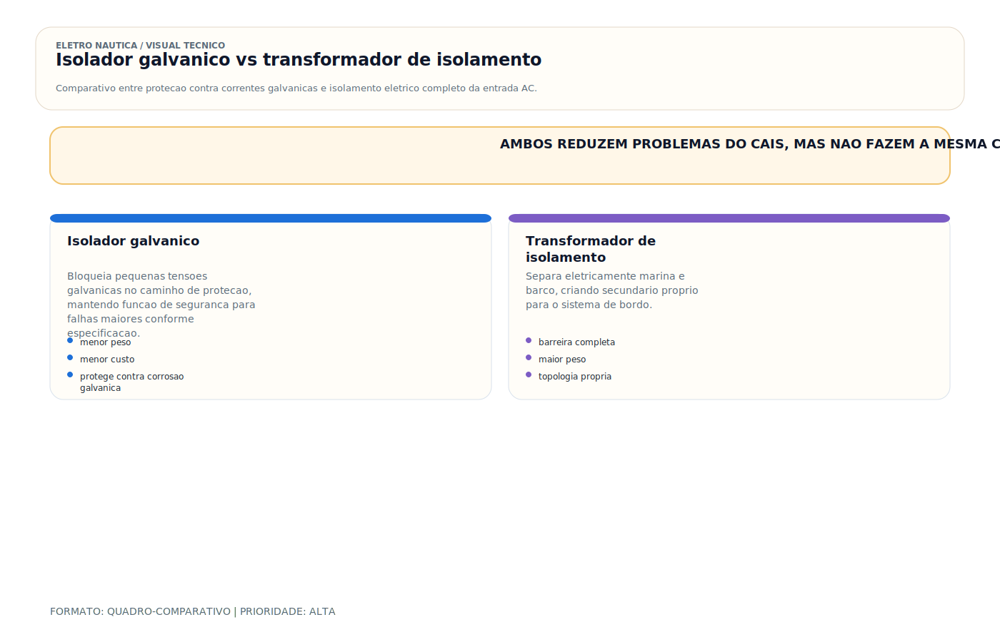

# Isolador Galvânico / Transformador de Isolamento

> [!abstract] Resumo técnico
> Isolador galvânico e transformador de isolamento tratam a interface com o shore power em níveis diferentes. O primeiro atua sobre potenciais galvânicos no condutor de proteção; o segundo cria separação elétrica entre marina e sistema interno. Nenhum dos dois substitui projeto correto de PE, proteção diferencial e coordenação das fontes AC.

## O que é

São dois componentes distintos com funções complementares para proteção do sistema de shore power:

**Isolador Galvânico (Galvanic Isolator):**

Dispositivo instalado em série no condutor de proteção do shore power, normalmente construído com arranjos de diodos de potência e recursos de monitoramento/fail-safe nos modelos certificados. Seu papel é reduzir a circulação de pequenos potenciais galvânicos pelo PE sem impedir a passagem de correntes de falha quando necessário.

**Transformador de Isolamento (Isolation Transformer):**

Transformador com primário e secundário separados eletricamente. A energia é transferida por acoplamento magnético, criando um sistema AC derivado a bordo quando corretamente instalado. Isso reduz drasticamente a influência elétrica direta da marina sobre o sistema interno, mas não substitui proteção diferencial, proteção contra sobrecorrente nem coordenação do PE do lado secundário.

## Função

| Componente | O que faz | O que NÃO faz |
| --- | --- | --- |
| Isolador galvânico | Reduz a circulação de pequenos potenciais galvânicos pelo PE | Não substitui isolamento do sistema, DR nem proteção contra falhas severas da marina |
| Transformador de isolamento | Cria separação elétrica entre shore power e sistema derivado do barco | Não dispensa DR/ELCI, aterramento interno correto nem inspeção da instalação |

**Por que os dois existem:**

O isolador galvânico é mais barato e mais compacto — útil quando a instalação do cais é razoavelmente íntegra e o objetivo principal é controlar potenciais galvânicos pelo PE. O transformador de isolamento é mais caro e pesado — oferece uma barreira muito mais robusta, mas ainda exige arquitetura correta do sistema AC de bordo.

## Como aparece na prática

**Muito comum no Brasil:**

- A maioria das embarcações de recreio sem nenhuma proteção — nem isolador, nem transformador
- Isolador galvânico em barcos importados dos EUA (Charles Industries, Promariner) — padrão lá fora, raridade aqui
- Zincos consumindo rápido como sintoma de ausência de proteção

**Comum em barcos importados:**

- Isolador galvânico certificado ABYC A-28 instalado no condutor de terra pelo fabricante
- Transformador de isolamento em veleiros de cruzeiro oceânico — independência total de infraestrutura de marina
- Monitoramento de corrente no terra para detectar falha do isolador

**Mais presente em embarcações maiores/premium:**

- Transformador de isolamento de 3–15kVA integrado ao sistema elétrico principal
- Transformador com taps ajustáveis (permite adaptar tensão e isolação simultaneamente)
- Monitores de qualidade de energia e corrente galvânica no painel principal

## Fundamentos mínimos

**Como o isolador galvânico funciona:**

Os modelos certificados criam um limiar equivalente de condução no PE para reduzir a circulação de pequenos potenciais galvânicos. Em condição de falha, o dispositivo deve continuar permitindo um caminho seguro para a corrente necessária à atuação das proteções, razão pela qual certificação e monitoramento importam.

**Por que o isolador galvânico não resolve tudo:**

Se a marina tiver falhas mais severas, correntes indevidas no PE, topologia errada ou problemas de fuga relevantes, o isolador galvânico não cria separação real entre os sistemas. Nesses cenários, o transformador de isolamento é tecnicamente superior.

Isso é especialmente importante quando o barco foi concebido para `220 V fase-neutro` e passa a receber `220 V fase-fase`. O isolador galvânico não cria neutro, não redefine topologia e não legitima amarrar um condutor ativo ao `PE`, ao negativo DC ou ao bonding. Para esse problema, a família correta de solução é a tratada em [[Transformador Bivolt]].

**Como o transformador de isolamento funciona:**

Primário: conectado ao shore power da marina (220V AC). Secundário: saída para o sistema interno do barco (220V AC). Os dois enrolamentos estão separados fisicamente — nenhum fio físico os conecta. A energia passa apenas por acoplamento magnético. O terra do barco é derivado do secundário — completamente independente do terra da marina.

**Sistema derivado com transformador de isolamento:**

No lado secundário, o projeto precisa definir explicitamente como serão tratados neutro, PE, ponto de referência e dispositivos diferenciais. O transformador não "resolve sozinho" esse arranjo; ele apenas cria a possibilidade de um sistema derivado corretamente controlado.

## Características

| Parâmetro | Isolador Galvânico | Transformador de Isolamento |
| --- | --- | --- |
| Princípio | Diodos em série no terra | Dois enrolamentos separados |
| Bloqueia corrente galvânica | Reduz a circulação de pequenos potenciais no PE | Sim, por separação elétrica entre os sistemas |
| Bloqueia corrente parasita | Parcialmente, com limitações intrínsecas ao conceito | Muito mais eficaz contra influências externas da marina |
| Preserva proteção de terra | Sim | Sim (terra derivado do secundário) |
| Peso | Leve (0,5–2kg) | Pesado (15–80kg) |
| Tamanho | Compacto | Grande |
| Custo | R$ 500–2.000 | R$ 3.000–20.000 |
| Eficiência | 99% (passivo) | 95–98% (perdas no núcleo) |
| Manutenção | Nenhuma | Mínima |

## Configurações comuns

**Isolador galvânico (proteção básica):**

- Instalado em série no condutor de terra do shore power, próximo ao inlet
- Modelo certificado ABYC A-28 com monitor de falha (LED ou alarme)
- Charles Industries, Promariner, Victron — modelos com teste integrado de continuidade

**Transformador de isolamento fixo (proteção completa):**

- Instalado entre o inlet de bordo e o painel AC principal
- Entrada: shore power da marina (primário)
- Saída: sistema AC interno do barco (secundário) com ponto de referência definido pelo projeto; se houver neutro derivado, o bond N-PE deve ser único e documentado
- Victron, Mastervolt, Charles — 3kVA a 15kVA conforme carga do barco

**Transformador de isolamento com step-up/down integrado:**

- Combina isolação galvânica com adaptação de tensão
- Ideal para barcos que viajam internacionalmente
- Entrada: 100–130V ou 200–240V (taps ajustáveis)
- Saída: 220V AC isolada para o sistema interno

## Marcas e referências

**Isoladores galvânicos:**

- **Promariner (ProSafe)** — americana, certificada ABYC A-28, com LED de status e monitor de corrente
- **Charles Industries (Guardian)** — referência americana, certificada, modelos com alarme integrado
- **Victron Energy (Galvanic Isolator VGI)** — qualidade premium, com monitoramento via GX
- **Yandina** — australiana, boa qualidade, menos encontrada no Brasil

**Transformadores de isolamento:**

- **Victron Energy (Isolation Transformer IT)** — linha completa 3,6–7kVA, integrada ao ecossistema Victron
- **Mastervolt (Mass Combi Ultra)** — linha premium com transformador de isolamento integrado ao inversor/carregador
- **Charles Industries** — transformadores marinhos de 1,5–30kVA, referência americana
- **Toroid Marine** — transformadores toroidais (menor peso, menor campo magnético), uso em espaços limitados

## Componentes relacionados

- Inlet de bordo (shore power entra antes do isolador/transformador)
- Condutor de terra do shore power (onde o isolador galvânico é instalado em série)
- SPOG (ponto único de aterramento — ponto de referência do sistema AC isolado)
- GFCI / DR (proteção contra falha de isolação — mantida mesmo com isolador/transformador)
- Painel AC de distribuição (recebe a saída do transformador)
- Monitor de corrente no terra (detecta falha do isolador galvânico)

## Problemas mais frequentes

| Problema | Sintoma | Causa provável |
| --- | --- | --- |
| Isolador galvânico com falha | Corrosão continua mesmo com isolador instalado | Diodos em curto (corrente > 1,4V passa), isolador certificação vencida |
| Transformador superaquecendo | Corpo quente, cheiro de queimado | Sobrecarregado além do nominal |
| Sem tensão no secundário | Sistema interno sem energia com shore power conectado | Fusível/disjuntor primário queimado, bobina com defeito |
| Zumbido excessivo | Ruído audível do transformador | Frequência do shore power incorreta, sobrecarga no núcleo |
| GFCI disparando com transformador | Desligamento ao ligar equipamentos | Falha de isolação interna no sistema do barco (o transformador expõe falhas ocultas) |

## Causas raiz

**Isolador galvânico com diodos em curto:**

Sobretensão (raio, surto de marina) pode queimar os diodos em curto — o isolador passa a conduzir normalmente em ambas as direções, sem bloquear nada. A carcaça continua intacta externamente — o problema é invisível sem teste.

**Transformador superaquecendo:**

Carga total excede o nominal. Ao ligar ar-condicionado + carregador + forno de micro-ondas + aquecedor simultaneamente, o transformador opera saturado.

**GFCI disparando após instalação do transformador:**

O transformador de isolamento elimina o terra da marina como referência — qualquer falha de isolação interna que antes "desaparecia" pelo terra da marina agora é detectada pelo GFCI. Na prática, o transformador expõe problemas elétricos preexistentes no barco. A solução é investigar e corrigir as falhas de isolação — não remover o GFCI.

## Diagnóstico prático

**Testar isolador galvânico:**

```
Desenergizar o sistema e seguir o procedimento do fabricante
Usar o circuito de monitoramento do próprio equipamento quando houver
Se necessário, aplicar ensaio em modo teste de diodo/continuidade compatível com o arranjo interno
Leitura ôhmica simples nem sempre valida o estado do isolador de forma conclusiva
```

**Verificar tensão de saída do transformador de isolamento:**

```
Com shore power conectado:
Medir tensão AC no secundário (saída do transformador)
Resultado esperado: 210–230V (para transformador 1:1)
Sem tensão: verificar disjuntor do primário, fusível, conexões
```

**Verificar temperatura do transformador:**

```
Após 1 hora em carga normal:
Comparar com a temperatura admissível e a elevação térmica do fabricante
Temperatura excessiva, odor anormal ou zumbido fora do padrão exigem investigação de carga, ventilação e tensão de alimentação
```

**Verificar corrente no terra (com isolador galvânico):**

```
Amperímetro de alicate → no cabo de terra do shore power
Com equipamentos ligados:
Corrente residual persistente deve ser interpretada junto com a topologia da instalação
Valor elevado pode indicar fuga real, falha no cais ou limitação do próprio conceito de isolador galvânico
```

## Boas práticas profissionais

- Instalar no mínimo um isolador galvânico certificado ABYC A-28 em todo barco com shore power
- Preferir transformador de isolamento em marinas com infraestrutura duvidosa (maioria das marinas brasileiras)
- Incluir monitor de corrente no terra junto com o isolador galvânico — detecta falha do componente
- Dimensionar o transformador de isolamento para 125% da carga máxima simultânea
- Manter GFCI no sistema mesmo com transformador de isolamento — são camadas de proteção diferentes
- Documentar a solução instalada (isolador ou transformador) no manual do barco
- Definir em diagrama como o sistema derivado do secundário trata neutro, PE e proteção diferencial

## Cuidados de instalação

**Isolador galvânico:**

- Instalar em série no condutor de terra do shore power — nunca no neutro ou na fase
- Posicionar próximo ao inlet, antes de qualquer ramificação do terra a bordo
- Identificar claramente a posição de instalação no diagrama elétrico

**Transformador de isolamento:**

- Instalado entre inlet de bordo e painel AC — o sistema AC interno nunca vê o terra da marina
- Aterrar o neutro do secundário ao SPOG do barco (cria o terra AC independente)
- Fixar mecanicamente com suportes antivibrantes — peso de 15–80kg em embarcação em movimento
- Ventilar o compartimento — transformador gera calor em operação

## Cuidados de uso

- Testar o isolador galvânico anualmente (verificação de resistência em DC)
- Monitorar o indicador de status do isolador galvânico (LED verde = OK, vermelho = falha)
- Verificar temperatura do transformador de isolamento após as primeiras horas de uso em cada marina
- Nunca conectar cargas que somem mais que 80% da capacidade nominal do transformador

## Erros comuns

**Instalar isolador galvânico no neutro ou na fase:**

O isolador vai no terra — apenas no terra. No neutro ou na fase, bloqueia a corrente de operação dos equipamentos e cria risco de choque.

**Confundir isolador galvânico com transformador de isolamento:**

"Tenho isolador, estou 100% protegido." Não. O isolador atua sobre um problema específico do PE; ele não cria um sistema isolado nem substitui DR, aterramento interno correto e verificação do cais.

**Remover GFCI após instalar transformador:**

"Com o transformador, não preciso do GFCI." Errado. O transformador elimina a conexão com a marina — mas falhas de isolação internas do barco continuam acontecendo. O GFCI protege contra falhas internas.

**Instalar isolador galvânico sem certificação ABYC A-28:**

Isoladores sem certificação podem ter diodos de especificação inferior, sem capacidade de suportar correntes de falha de alta amplitude — potencial risco de choque.

**Ignorar o monitor de status do isolador:**

O LED vermelho indica que o isolador está com falha — os diodos estão em curto ou com problema. Continuar usando sem investigar anula toda a proteção.

## Relação com outros sistemas

- **Shore power:** o isolador/transformador é instalado imediatamente na entrada do shore power
- **Aterramento AC:** com transformador de isolamento, o terra AC do barco é independente da marina
- **GFCI:** complementar ao transformador — camadas de proteção distintas
- **Correntes parasitas:** o transformador de isolamento é a solução definitiva para correntes parasitas externas
- **Bonding:** o sistema de bonding continua necessário mesmo com transformador — são sistemas independentes
- **SPOG:** com transformador de isolamento, o neutro do secundário é aterrado ao SPOG

## Brasil x Internacional

| Aspecto | Brasil | Internacional (ABYC A-28) |
| --- | --- | --- |
| Isolador galvânico instalado | Raramente | Padrão em novos barcos americanos |
| Transformador de isolamento | Apenas em premium | Comum em cruzeiros oceânicos |
| Conhecimento do instalador | Baixo | Treinamento específico disponível |
| Fiscalização | Ausente | ABYC certifica componentes |
| Marinas com terra adequado | Minoria | Maioria nos EUA e Europa |

**Realidade brasileira:** A maioria das embarcações de recreio no Brasil opera sem nenhuma proteção galvânica — sem isolador, sem transformador. A proteção mais eficaz disponível ao proprietário é o transformador de isolamento, pois não depende da marina estar funcionando corretamente. Dada a precariedade das marinas brasileiras, o transformador de isolamento é praticamente obrigatório para embarcações de longa permanência.

## Normas aplicáveis

- **ABYC A-28** — Galvanic Isolators (especificação e certificação de isoladores galvânicos)
- **ABYC E-11** — AC Electrical Systems (terra, GFCI, transformador de isolamento)
- **NFPA 303** — Fire Protection for Marinas
- **ABNT NBR 5410** e família **ABNT/IEC** aplicável — referência complementar para princípios de baixa tensão, identificação e proteção
- **ISO 13297** — Electrical systems — Alternating current installations

## Como ensinar este tópico

**Sequência recomendada:**

1. Explicar o problema que ambos resolvem: terra compartilhado da marina como veículo de corrosão e choque
2. Mostrar o isolador galvânico: onde vai (no terra), como funciona (dois diodos), o que bloqueia e o que não bloqueia
3. Mostrar o transformador de isolamento: separação física completa entre marina e barco
4. Comparar lado a lado: custo, eficácia, situações onde cada um é suficiente
5. Demonstrar teste do isolador galvânico com multímetro — confirmar que está funcionando

**Conceito-chave para fixar:**

"O isolador galvânico é o filtro. O transformador de isolamento é a barreira total. Em marinas brasileiras com terra ausente e infraestrutura precária, a barreira total é a escolha mais segura."

## Ideias de vídeos

- **"Isolador galvânico vs transformador de isolamento: qual protege de verdade?"** — comparação técnica clara
- **"Como instalar um isolador galvânico no cabo de pier"** — passo a passo prático
- **"Como testar se seu isolador galvânico está funcionando"** — multímetro, DC, resistência
- **"Por que o GFCI dispara ao instalar o transformador de isolamento"** — explicação do porquê e o que fazer
- **"A marina está destruindo seu barco: como se proteger"** — problema + solução completa

## Diagramas sugeridos

- Diagrama do isolador galvânico: shore power → inlet → isolador no terra → painel AC (com destaque ao condutor de terra)
- Diagrama do transformador de isolamento: shore power → inlet → primário do transformador → secundário (isolado) → painel AC → SPOG
- Comparativo de proteção: sem proteção vs com isolador galvânico vs com transformador de isolamento
- Circuito interno do isolador galvânico: dois diodos em antiparalelo no terra
- Esquema do SPOG com transformador de isolamento: como o neutro do secundário é aterrado internamente

## FAQ

**O isolador galvânico substitui o transformador de isolamento?**

Não completamente. O isolador galvânico atua sobre a circulação de potenciais galvânicos no PE. O transformador de isolamento cria separação elétrica entre marina e sistema interno. Em marinas críticas, estadias longas ou instalações mais complexas, o transformador oferece uma solução muito mais robusta.

**O transformador de isolamento protege contra raio?**

Não especificamente. O transformador reduz a probabilidade de dano por raio na marina chegar ao barco via shore power, mas não substitui um sistema de para-raios dedicado (ABYC A-31).

**Posso instalar o isolador galvânico eu mesmo?**

Sim — é instalado em série no condutor de terra. Atenção: fazer sempre com o shore power desconectado. A posição correta é entre o inlet e a primeira ramificação do terra no barco.

**O transformador de isolamento consome muita energia?**

As perdas em vazio (sem carga) são de 1–3% da potência nominal — em um transformador de 3kVA, isso representa 30–90W contínuos. Em operação normal com cargas, a eficiência total é de 95–98%.

**Com transformador de isolamento, ainda preciso de GFCI?**

Sim. O GFCI protege contra falhas de isolação internas do barco — problema elétrico em equipamento a bordo que leva corrente para a carcaça. O transformador elimina o problema externo (marina). São camadas complementares, não substitutas.

## Visual didático



Diferenciar mitigacao galvanica de barreira eletrica completa na interface com o cais.

**Cautela:** A aplicacao correta depende de norma, fabricante, aterramento, protecao diferencial e topologia de entrada.

Material de apoio: [Isolador galvanico vs transformador de isolamento](../_visuals/generated/isolador-galvanico-vs-transformador-isolamento.md)

## Integração com outras notas

- [[Aterramento]]
- [[Barramento DC / Bus Bar / Distribuição DC]]
- [[Bonding — Sistema de Interligação de Massas]]
- [[CAIS (Pier) (AC)]]
- [[Cabeamento Náutico]]
- [[Chaves Gerais (DC)]]
- [[Chaves Seletoras (AC)]]
- [[Contatores (AC)]]
- [[Disjuntores (DC) e (AC)]]
- [[Proteção Dr]]

## Perguntas que esta nota responde

- O que é Isolador Galvânico / Transformador de Isolamento em instalações elétricas náuticas?
- Qual é a função de Isolador Galvânico / Transformador de Isolamento na embarcação?

