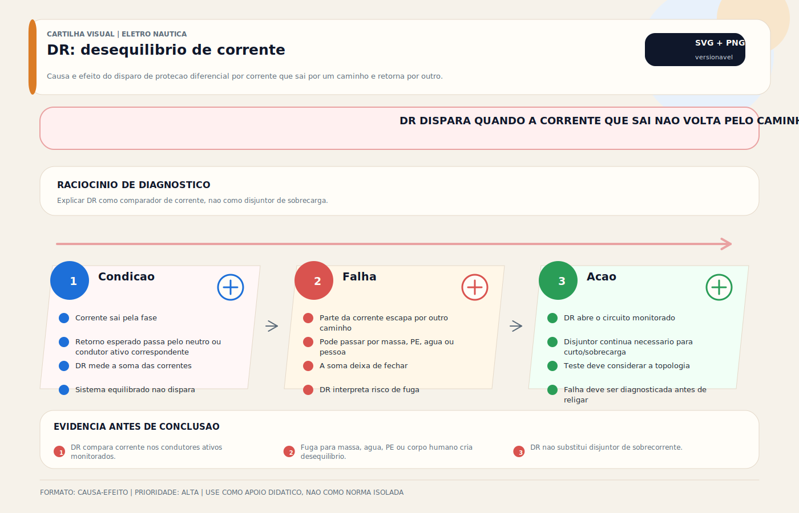

# Proteção DR

> [!abstract] Resumo técnico
> Proteção DR é a camada diferencial do sistema AC. Ela compara a corrente que sai pelos condutores ativos com a que retorna e atua quando a diferença indica fuga incompatível com a operação normal. Em embarcações, a seleção do tipo, do limiar e do ponto de instalação precisa respeitar a topologia do shore power e das fontes derivadas.

## O que é

O DR (Dispositivo de Proteção por Corrente Diferencial Residual) — também chamado de RCD, RCCB ou simplesmente diferencial — monitora a soma vetorial das correntes que passam pelos **condutores ativos monitorados**. Em um circuito saudável, essa soma é aproximadamente zero, seja em `fase-neutro`, `fase-fase` ou outra topologia para a qual o dispositivo tenha sido corretamente aplicado.

Quando há diferença — chamada de corrente residual ou diferencial — significa que parte da corrente está fluindo por um caminho não previsto: estrutura metálica do casco, água ao redor da embarcação, ou o corpo humano. O DR detecta essa diferença e desliga o circuito em milissegundos.

**A corrente diferencial precisa ser entendida com precisão:**

Os efeitos fisiológicos do choque dependem de corrente, tempo de exposição, trajetória pelo corpo, frequência e condição da pele. Por isso, não é tecnicamente correto resumir segurança humana a um único número solto. Em baixa tensão, dispositivos de 30 mA são usados como proteção adicional de pessoas em muitos referenciais; já em marinas e shore power também aparece a lógica de 30 mA para proteção de fuga do conjunto de entrada. Disjuntores e fusíveis **não substituem o DR** porque respondem à sobrecorrente, não à corrente residual.

## Função

Proteger pessoas e a instalação contra correntes residuais incompatíveis com a operação normal do sistema AC. O limiar e o tempo de atuação dependem do dispositivo, da classe e do nível de corrente diferencial aplicado no ensaio.

Funções secundárias:

- Detectar isolamento degradado em equipamentos AC antes que a falha evolua para curto franco
- Complementar a proteção contra incêndio por fuga à terra quando se usam dispositivos de limiar mais alto para essa finalidade específica

## Como aparece na prática

**Instalação correta:**

Shore power → conector Marinco/Steck → DR 30mA → painel AC de distribuição → circuitos individuais (ar-condicionado, tomadas, carregador). O DR no início protege todo o sistema AC quando conectado ao cais.

**Situação muito comum no Brasil:**

Shore power conectado diretamente ao painel AC sem DR. Risco real de vida — especialmente em marinas com aterramento inadequado onde corrente vagante pode tornar a estrutura do barco energizada.

**Situação com transformador de isolamento:**

Shore power → transformador de isolamento → DR → distribuição AC. O transformador isola galvanicamente do cais (proteção contra eletrólise e correntes vagantes); o DR protege contra choques internos na embarcação. Combinação ideal.

## Fundamentos mínimos

**Como o DR detecta a fuga:**

O DR tem um transformador toroidal (núcleo em anel) por onde passam os condutores ativos monitorados. Em circuito saudável, a soma vetorial das correntes é aproximadamente zero. Se parte da corrente retorna por caminho diferente do previsto, surge corrente residual e o mecanismo de disparo atua conforme a sensibilidade e o tempo próprios do dispositivo.

**DR não protege contra:**

- Toque simultâneo entre dois condutores ativos monitorados pelo próprio circuito (não há corrente residual suficiente para caracterizar fuga à terra nesse caso)
- Choque por barra DC (12V/24V — tensão insuficiente para atravessar pele seca)
- Eletrólise galvânica no casco (para isso: isolador galvânico ou transformador de isolamento)

Também não substitui coordenação correta de PE, proteção contra sobrecorrente, aterramento funcional e inspeção de isolamento.

## Características técnicas

| Parâmetro | DR proteção humana | DR proteção incêndio |
| --- | --- | --- |
| Corrente de disparo | 30mA | 300mA |
| Tempo de disparo | Conforme norma do dispositivo e corrente aplicada | Conforme norma do dispositivo e corrente aplicada |
| Aplicação | Proteção de pessoas | Proteção da instalação |

**Tipos de DR por classe:**

| Classe | Detecta | Aplicação náutica |
| --- | --- | --- |
| AC | Corrente AC residual | Suficiente para shore power simples |
| A | AC + DC pulsante | Recomendável com inversores e carregadores modernos |
| F | AC + DC pulsante + harmônicos | Sistemas com VFD ou inversores avançados |
| B | AC + DC puro | Grandes instalações industriais — raro em náutica |

**Para embarcações com eletrônica de potência moderna, Classe A tende a ser a escolha mínima prudente.** Carregadores, inversores e conversores podem gerar componentes residuais que tornam a Classe AC insuficiente ou menos adequada.

## Configurações comuns

**Configuração 1 — DR no início do sistema AC (muito comum em barcos importados):**

Um DR bipolar ou multipolar, instalado para monitorar todos os condutores ativos relevantes logo após o conector de shore power. Protege todo o sistema AC de bordo quando corretamente compatibilizado com a topologia de entrada. Simples, eficaz e muito melhor que operar sem proteção diferencial.

**Configuração 2 — DR por circuito (RCBO — disjuntor + diferencial integrado):**

Um RCBO em cada circuito AC — proteção de sobrecorrente + diferencial individual. Vantagem: se um circuito disparar o diferencial, os outros permanecem operacionais. Desvantagem: custo maior.

**Configuração 3 — DR com transformador de isolamento (mais presente em embarcações maiores/premium):**

Shore power → transformador de isolamento → DR → distribuição AC. Combinação ideal: o transformador isola galvanicamente (sem aterramento compartilhado com o cais), o DR protege contra falhas internas da embarcação.

**Configuração 4 — DR + isolador galvânico (solução intermediária):**

Shore power → isolador galvânico → DR → distribuição AC. O isolador galvânico bloqueia correntes DC (eletrólise) mas não isola completamente. DR mantém proteção de choque.

**Dispositivo apenas no verde/amarelo não é DR clássico:**

Se o componente atua somente no condutor de proteção e os condutores ativos não passam por ele, a hipótese mais provável é isolador galvânico, monitor/arranjo de terra ou outro dispositivo associado ao PE. DR/RCD precisa monitorar os condutores ativos do circuito.

## Marcas e referências

**AC (muito comum no Brasil e em instalações de qualidade):**

- **Schneider Electric** (Acti9, iID, ID) — muito presente no mercado náutico brasileiro; boa disponibilidade de peças
- **ABB** (F200, DS200) — qualidade europeia, popular em embarcações importadas de origem europeia
- **Hager** (CDA, CFA) — europeu, instalações de alta qualidade
- **WEG** — nacional, qualidade adequada para aplicações de cais
- **Legrand** — boa presença no mercado nacional

**GFCI (equivalente norte-americano do DR):**

- **Leviton, Hubbell** — tomadas GFCI e painéis com proteção GFCI 30mA — padrão em embarcações americanas
- **Blue Sea Systems** — painéis com GFCI integrado para sistemas de shore power americanos (120V/30A/60A)

## Componentes relacionados

- **Shore Power / Conector Marinco-Steck:** fonte AC que alimenta o sistema; DR deve ser o primeiro componente após o conector
- **Transformador de Isolamento:** elimina aterramento compartilhado com o cais — complementa o DR
- **Isolador Galvânico:** reduz correntes galvânicas — não substitui o DR
- **Disjuntores AC:** proteção de sobrecorrente nos circuitos individuais — trabalham em conjunto com o DR
- **Painel AC:** abriga o DR e distribui os circuitos
- **Condutor de proteção (PE):** essencial para controlar tensões de toque e oferecer caminho previsível de falha; o DR não elimina a necessidade de um PE íntegro

## Problemas mais frequentes

1. **DR dispara ao conectar shore power** — fuga de corrente no sistema da embarcação (equipamento com isolamento degradado) ou problema no aterramento do cais detectado pelo DR
2. **DR dispara ao ligar equipamento específico** — isolamento degradado naquele equipamento (motor, aquecedor, carregador antigo)
3. **DR não dispara no teste** — DR defeituoso (mecanismo de teste com falha ou componente queimado) — substituir imediatamente
4. **DR dispara sem causa aparente** — corrente de fuga distribuída entre vários equipamentos somando >30mA (não uma única fuga óbvia)
5. **Shore power instalado sem DR** — situação de risco — falta de proteção, não um problema do DR em si
6. **DR de Classe AC com inversores modernos** — pequena componente DC do inversor pode causar nuisance tripping ou não ser detectada corretamente — usar Classe A

## Causas raiz

| Problema | Causa raiz real |
| --- | --- |
| DR dispara ao conectar shore power | Fuga existente na embarcação que o cais "revela" ao fechar o circuito de terra |
| DR dispara ao ligar ar-condicionado | Isolamento do motor do compressor degradado — fuga >30mA para carcaça |
| DR não dispara no teste | Mecanismo de teste ou capacitor interno com falha — DR deve ser substituído |
| DR dispara espontaneamente | Acúmulo de fugas distribuídas: vários equipamentos com isolamento levemente degradado somando >30mA |
| DR de Classe AC disparando com inversor | Inversor gera componente DC residual — usar Classe A |

## Diagnóstico prático

**Passo 1 — Teste com botão de teste:**

- Pressionar o botão "TEST" do DR
- Deve disparar imediatamente
- Se não disparar: DR defeituoso — substituir antes de qualquer uso

**Passo 2 — DR dispara ao conectar shore power:**

- Desconectar todos os equipamentos AC (desligar disjuntores individuais)
- Religar o DR
- Ligar os equipamentos um a um, aguardando entre cada um
- O DR dispara ao ligar qual equipamento? → esse é o problema
- Se DR dispara mesmo sem nenhum equipamento ligado: fuga na fiação ou no condutor de terra do cais

**Passo 3 — Verificar condutor de terra:**

- Com a instalação desenergizada, medir continuidade entre o pino PE do conector shore power e o barramento de proteção / massas previstas
- Deve ser <1Ω
- Alta resistência: continuidade do terra interrompida — verificar todas as conexões de terra

**Passo 4 — Verificar isolamento dos equipamentos:**

- Com equipamento desconectado da rede, preferir megôhmetro/insulation tester para medir resistência de isolamento entre condutores ativos e carcaça
- Valores e tensão de ensaio devem seguir o tipo de equipamento
- Resistência baixa ou instável indica isolamento degradado — equipamento com fuga

**Ferramenta mínima:** multímetro digital e o próprio botão de teste do DR.

## Boas práticas profissionais

- Instalar proteção diferencial/leakage compatível com a topologia do sistema logo na entrada AC ou na posição exigida pela arquitetura adotada
- Testar o DR mensalmente com o botão de teste — em ambiente marinho, mecanismos podem travar por oxidação
- Usar DR de Classe A em embarcações com inversores e carregadores modernos
- **Nunca "burlar" o DR** por disparar com frequência — investigar a causa, nunca eliminar a proteção
- Combinar DR com transformador de isolamento para proteção completa (choque + eletrólise)
- Verificar continuidade do condutor de terra semestralmente
- Documentar a última data de teste do DR no painel

## Cuidados de instalação

- Posicionar o dispositivo diferencial/leakage conforme a topologia do sistema e a exigência normativa aplicável ao shore power
- Condutor de terra contínuo e de baixa resistência de ponta a ponta
- Seguir o esquema do fabricante para alimentação e carga, sem presumir que todo sistema terá um neutro funcional entregue pelo cais
- Para sistemas bifásicos (EUA 120/240V ou embarcações com dois circuitos): usar DR bipolar ou dois DRs
- Fixação segura no painel — vibração pode soltar terminais em ambiente marinho

## Cuidados de uso

- Sempre testar o DR com o botão de teste antes de uma temporada ou após longo período sem uso
- Ao conectar shore power em nova marina: testar polaridade e terra do cais antes de ligar o DR
- Se DR disparar ao conectar nova marina: pode ser problema do aterramento do cais — não usar o cais e notificar a administração da marina

## Erros comuns de instaladores

- **Não instalar proteção diferencial/leakage no shore power** — o mais grave; sistema AC de cais sem essa camada eleva o risco de choque
- **Instalar DR e não verificar a arquitetura do PE e do bond neutro-PE** — proteção existe no papel mas a topologia pode estar errada
- **Assumir que o pedestal 220 V sempre traz neutro** — em várias marinas brasileiras o barco recebe dois ativos; se o instalador criar neutro artificial, o DR passa a operar em arquitetura adulterada
- **Burlar o DR** com jumper ou substituir por disjuntor comum — perigoso e criminalmente responsabilizável
- **DR de 300mA para proteção de pessoas** — 300mA é para proteção de incêndio, não de pessoas (limiar de fibrilação é 30mA)
- **Não testar periodicamente** — DR defeituoso em posição "OK" é pior que ausência de DR (falsa segurança)

## Relação com outros sistemas

- **Shore Power:** fonte AC que alimenta o sistema — DR é o primeiro dispositivo de proteção após o conector
- **Transformador de Isolamento:** complemento ideal do DR — isola galvanicamente do cais enquanto o DR protege contra falhas internas
- **Isolador Galvânico:** complemento parcial — protege contra eletrólise mas não contra choque de pessoas
- **Disjuntores AC:** proteção de sobrecorrente nos circuitos — trabalham em conjunto com o DR, não o substituem
- **Aterramento da embarcação:** PE íntegro e bond neutro-PE corretamente tratados reduzem tensão de toque e ajudam a tornar a falha previsível
- **GFCI (equivalente americano):** mesma função, nomenclatura diferente — presente em embarcações americanas importadas

## Brasil x Internacional

| Aspecto | Brasil | Internacional (ABYC/Europa) |
| --- | --- | --- |
| DR em shore power | Frequentemente ausente em embarcações mais antigas | Presença de proteção diferencial/leakage na entrada é prática consolidada em referenciais internacionais |
| Consciência sobre DR | Baixa entre proprietários | Bem estabelecida |
| DR com transformador de isolamento | Raro, exceto embarcações premium | Comum em embarcações europeias >35 pés |
| Qualidade do aterramento de cais | Muito variável — marinas informais | Padronizado em marinas com certificação |
| Testes periódicos | Raramente realizados | Parte do check-list de segurança |

**Realidade brasileira:** o ambiente regulatório náutico costuma ser menos uniforme que o predial. Em marinas com infraestrutura heterogênea, a proteção diferencial/leakage fica ainda mais importante, mas ela só entrega o resultado esperado quando a topologia do sistema, o PE e a origem das fontes AC foram corretamente tratados.

## Normas e referências técnicas

- **ABYC E-11 (2023)** — AC and DC Electrical Systems on Boats: proteção diferencial, aterramento, shore power
- **IEC 61008** — Residual current operated circuit-breakers (RCCBs): norma de produto do DR
- **IEC 61009** — Residual current operated circuit-breakers with overcurrent protection (RCBOs)
- **ISO 13297:2020** — Electrical systems on recreational craft
- **NBR 5410** — Instalações elétricas de baixa tensão: referência complementar para proteção diferencial em baixa tensão
- **Documentação do fabricante do DR / RCBO aplicado** — obrigatória para classe, curva, sensibilidade e ensaio corretos

## Como ensinar este tópico

**Progressão recomendada:**

1. Problema: "por que preciso de DR se já tenho disjuntor?" — explicar que são proteções diferentes
2. Fisiologia do choque: mostrar tabela mA × efeito no corpo — impacto imediato no aluno
3. Como o DR funciona: transformador toroidal + sensor de diferença — diagrama simples
4. O que o DR não protege: toque fase+neutro, DC 12V, eletrólise
5. Teste obrigatório mensal: mostrar o botão de teste e fazer ao vivo
6. Caso clínico: DR disparando ao ligar ar-condicionado — sequência de diagnóstico

**Onde inserir no material:**

- Após Shore Power (o DR é o primeiro componente após o conector de shore power)
- Junto com disjuntores (proteções complementares — apresentar juntos)
- Antes do sistema AC de distribuição

## Ideias de vídeos e aulas práticas

- **"Por que o DR salva vidas: explicação com fisiologia do choque elétrico"** — impacto emocional e técnico
- **"Shore power sem DR: demonstrando o risco em simulação"** — usando equipamento de medição
- **"Como instalar DR no painel de shore power: passo a passo"** — tutorial prático
- **"DR disparou: como investigar a causa em 5 passos"** — sequência de diagnóstico
- **"DR vs GFCI: a mesma proteção, nomes diferentes"** — para barcos americanos importados

## Diagramas sugeridos

- **Funcionamento do DR:** transformador toroidal com fase e neutro passando — campo magnético diferencial
- **Instalação típica:** conector shore power → DR → painel AC → disjuntores → circuitos
- **Combinação com transformador de isolamento:** shore power → transformador de isolamento → DR → painel AC
- **Fisiologia do choque:** tabela visual mA × efeito corporal (0,5mA: percepção → 30mA: fibrilação → 100mA: morte)
- **Diagnóstico de fuga:** isolamento de circuitos um a um até identificar o equipamento com fuga

## FAQ

**DR e disjuntor são a mesma coisa?**

Não. Disjuntor protege contra sobrecorrente (sobrecarga e curto-circuito). DR protege contra corrente de fuga (choque elétrico). São proteções diferentes e complementares — ambas são necessárias. Um RCBO combina os dois em um único dispositivo.

**Preciso de DR em sistema 12V DC?**

Não para a arquitetura DC convencional de bordo. DR é proteção de corrente residual aplicada a sistemas AC. Isso não elimina outros riscos em DC, como arco, sobrecorrente e aquecimento.

**DR dispara quando ligo o ar-condicionado — é defeito do DR ou do ar-condicionado?**

O mais comum é fuga real no equipamento ou soma de fugas distribuídas no circuito. O diagnóstico correto é medir isolamento, corrente residual e topologia do circuito. Tratar o disparo como "defeito do DR" sem ensaio é erro.

**É possível operar sem DR?**

Operacionalmente sim — o barco funciona normalmente. Mas o risco de choque elétrico fatal aumenta significativamente, especialmente em marinas com aterramento inadequado. A proteção custa ~R$ 80–150 e pode salvar uma vida.

**Preciso de DR se já tenho transformador de isolamento?**

Sim. O transformador de isolamento isola galvanicamente do aterramento do cais (proteção contra eletrólise e correntes vagantes). O DR protege contra correntes de fuga internas à embarcação. São proteções para riscos diferentes e complementares.

**Vi um componente só no cabo verde-amarelo. Isso é DR europeu?**

Muito provavelmente não. Pela descrição, o mais provável é isolador galvânico ou outro dispositivo ligado ao PE. Para confirmar, é preciso ver a marca, o modelo, o diagrama e se existe botão de teste ou corrente residual nominal marcada em mA.

## Visual didático

Explicar DR como comparador de corrente, nao como disjuntor de sobrecarga.

**Cautela:** Corrente diferencial nominal, seletividade, ELCI/GFCI/DR e topologia variam conforme aplicacao e referencial adotado.

Material de apoio: [DR: desequilibrio de corrente](../_visuals/generated/dr-desequilibrio-corrente.md)

## Integração com outras notas

- [[Fusíveis DC — Proteção Contra Sobrecorrente]]
- [[Aterramento]]
- [[Barramento DC / Bus Bar / Distribuição DC]]
- [[Bonding — Sistema de Interligação de Massas]]
- [[CAIS (Pier) (AC)]]
- [[Cabeamento Náutico]]
- [[Chaves Gerais (DC)]]
- [[Chaves Seletoras (AC)]]
- [[Contatores (AC)]]
- [[Isolador Galvânico / Transformador de Isolamento]]

## Perguntas que esta nota responde

- O que é Proteção Dr em instalações elétricas náuticas?
- Qual é a função de Proteção Dr na embarcação?

