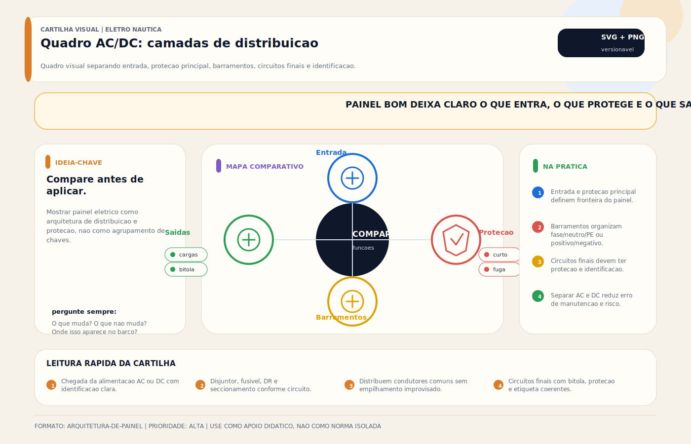

# Quadro Elétrico e Painel de Distribuição AC/DC

> [!abstract] Resumo técnico
> Quadro elétrico de bordo é o **ponto de organização, comando, proteção e supervisão** dos circuitos da embarcação. Um painel bom não é "estético e etiquetado" — ele **materializa a arquitetura elétrica** (separa fontes AC/DC, respeita prioridades operacionais, hospeda todas as proteções de ramal, concentra diagnóstico), segue IEC 61439-3 (quadros de distribuição BT) e ABYC E-11 §11.12 (identificação marine), com grau de proteção IP adequado ao local (mínimo IP44 em cabine seca, IP55 em compartimento técnico, IP65+ em exposição externa). As três dores clássicas de barcos mal projetados saem todas do quadro: (i) AC e DC misturados sem segregação (risco de manobra errada); (ii) sem reserva de corrente/espaço (crescimento improvisado degrada a base); (iii) bilge, alarmes e navegação tratados como "mais uma linha" sem hierarquia. Quadro é o **arquivo vivo** do sistema elétrico — se ele não conta a história correta, o barco inteiro é uma suposição.

> [!tip] TL;DR — Regra de decisão em 30 segundos
> 1. **AC e DC segregados**, nunca misturados no mesmo subquadro sem barreira — IEC 61439-3 exige separação física; mistura leva à manobra errada, choque AC com intenção DC, falha de diagnóstico.
> 2. **Identificação permanente e coerente** — etiqueta gravada/impressa em cada disjuntor + diagrama unifilar na porta do quadro + marcação nos cabos (heat-shrink printed); adesivo caseiro ≠ identificação definitiva.
> 3. **Reserva mínima de 25% de espaço e corrente** na montagem inicial — expansão previsível em refit; quadro lotado obriga retrabalho estrutural a cada nova carga.
> 4. **IP adequado ao local** — IP22 em salão seco; IP44 em cabine exposta a condensação; IP55 em compartimento técnico; IP65+ em cockpit ou área aberta. ABNT NBR IEC 60529.
> 5. **Proteção principal no polo da bateria** (MRBF ou ANL) ≤ 178 mm do polo (ABYC E-11.4.7) — nenhuma proteção "no quadro" substitui essa — o cabo entre bateria e quadro precisa de sua própria defesa.
> 6. **Circuito essencial tem prateleira própria** — bilge automática, detectores, alarmes, navegação crítica em barramento [[Hotline (DC)]] separado, com proteção individual e indicação visível.
> 7. **Dissipação térmica calculada** — quadro em compartimento fechado acumula calor dos disjuntores em carga; usar régua de DIN ventilada + borne superior/inferior distintos + ventilação natural ou forçada quando densidade > 500 W/m³.
> 8. **Acessibilidade frontal e traseira** obrigatórias para manutenção — painel "embutido em mobília sem acesso" = retrabalho a cada reparo; deixar ≥ 400 mm de recuo atrás para manejo de cabos.
> 9. **Documentação viva** — diagrama unifilar atualizado, lista de cargas com correntes medidas por ramal, histórico de ensaios de DR/ELCI, data de último aperto de bornes.
> 10. **Vibração, sal e umidade são a realidade** — parafuso solto no quadro é o maior gerador de falha em 5 anos; aperto de bornes com torque calibrado (1,5-4 N·m conforme tamanho) + inspeção anual são não-negociáveis.

> [!danger] Quando chamar um especialista
> Estes 9 cenários exigem engenheiro elétrico náutico ou integrador:
> 1. **Retrofit de embarcação antiga sem diagrama unifilar** — painel resultado de 20 anos de improvisos; antes de tocar, refazer levantamento (clamp ampermétrico ramal-a-ramal, mapeamento de cada disjuntor) e reconstruir o diagrama.
> 2. **Densidade de potência > 500 W no quadro** (soma de Ij²·R interna) em compartimento fechado — dissipação térmica excessiva exige cálculo IEC 61439-1 §10.10 (power dissipation) + ventilação forçada ou realocação.
> 3. **Integração shore-power duplo 120/240 V (EUA) com transformador isolador e ATS** — quadro precisa acomodar duas fases, transferência sincronizada e ELCI por perna; qualquer erro coloca tensão no casco.
> 4. **Barco com sistema híbrido DC (Li-Fe + chumbo + solar + DC-DC)** — painel DC precisa refletir barramentos independentes, BMS cutoff visível, isolação em manutenção; falha de arquitetura = BMS derruba shore-charger e barco desenergiza em operação.
> 5. **Quadro IP65+ em compartimento externo em navio comercial** — ensaios de estanqueidade IEC 60529, vedação de prensa-cabo, teste pressão-vácuo; certificação exige laboratório.
> 6. **Classificação CE/RCD, ABYC Certified ou DNV/Lloyd's** — dossiê técnico do quadro com memorial de cálculo, ensaio de rigidez dielétrica, ensaio térmico conforme IEC 61439-3.
> 7. **Painel vintage com barramento de cobre revestido exposto** em embarcação histórica — risco de arco flash se não houver barreira dedo-ao-vivo; retrofit para atender IEC 61439-3 mantendo estética original.
> 8. **Integração com digital switching (CZone, EmpirBus, Garmin PanelBus)** — quadro deixa de ser matriz de disjuntores e vira nó NMEA 2000; projeto precisa de BMS, comissionamento e treinamento.
> 9. **Investigação de falha recorrente com disparo de disjuntor geral** — coordenação de proteções (I²t, curva B/C/D, tempo de atuação) exige simulação e medição; cenário típico de barco que "desliga tudo" sem causa clara.

## O que é

Quadro ou painel elétrico é o **conjunto físico onde se concentram dispositivos de manobra, proteção, indicação e, em alguns casos, medição e controle**. Em embarcações, ele costuma existir em uma ou mais camadas, com funções distintas:

- **painel DC de serviços** (distribuição de circuitos 12/24/48 V — iluminação, eletrônica, bombas, navegação);
- **painel AC de entrada e distribuição** (shore/gerador/inversor + distribuição para linha leve e pesada);
- **painéis secundários por zona ou subsistema** (cockpit, mastro, sala de máquinas, camarote armador);
- **interfaces digitais complementares** (MFD com controle NMEA 2000, CZone, tela touch Victron Cerbo GX).

### Hierarquia típica em barco de 40-60 pés

```
 ┌────────────────────────────────────────────────┐
 │  PAINEL PRINCIPAL (salão / posto de comando)   │
 │                                                │
 │   [SEÇÃO AC]               [SEÇÃO DC]          │
 │   · Entrada shore          · Chave geral serv. │
 │   · Entrada gerador        · Chave geral moto  │
 │   · Chave seletora         · Barramento DC     │
 │   · ELCI 30 mA             · Disjuntores ramal │
 │   · DR 30 mA zonas         · Barramento HOTLINE│
 │   · Disjuntores ramal      · Monitor de bat.   │
 │                                                │
 │          [diagrama unifilar afixado]           │
 └────────────────────────────────────────────────┘
           │                        │
           ▼                        ▼
   PAINEL COCKPIT           PAINEL SALA DE MÁQUINAS
   (navegação, controles    (carregador, inversor,
    de equipamentos)         sensores de motor)
```

## Função na embarcação

- **distribuir circuitos** de forma organizada, por fonte e por prioridade;
- **permitir seccionamento e manobra** para operação normal e emergência;
- **concentrar proteção** por circuito e por fonte (disjuntores, RCBO, DR/GFCI/ELCI);
- **indicar estado** — LEDs de operação, voltímetro/amperímetro, ampermetros de fonte;
- **dar ao técnico um ponto racional de inspeção** — sem abrir console, sem desmontar mobília.

Um quadro bem projetado **antecipa as perguntas** que o técnico faz em diagnóstico: "qual fonte está ativa?", "quanto está consumindo essa zona?", "há disjuntor aberto por falha ou por operação?", "onde conecto meu multímetro para ver a tensão nominal?"

## Fundamentos mínimos

### O painel deve refletir a arquitetura, não escondê-la

Se a topologia real do sistema não fica clara no painel, a manutenção futura vira adivinhação. **Fonte, prioridade e circuito** precisam ser legíveis no arranjo físico e na documentação:

- fontes AC entram no alto do quadro, distribuição para baixo;
- fontes DC entram pelo lado (polo da bateria), distribuição para o centro;
- essenciais/hotline ocupam área separada, geralmente dedicada e identificada em vermelho;
- linha pesada fica em ramais próximos à seletora (cabo curto); linha leve distribuída.

### AC e DC exigem governança clara

Misturar circuitos, cores, dispositivos ou nomenclaturas de forma ambígua aumenta risco operacional e de manutenção. Mesmo quando coexistirem no mesmo conjunto físico, as funções devem ficar **claramente segregadas**:

- **barreira física** (divisória interna) entre seção AC e seção DC — IEC 61439-3 exige para evitar arcos cruzados;
- **cores distintas** — marrom/preto/cinza para fase AC (IEC 60445); vermelho para positivo DC; amarelo+verde para terra; azul para neutro AC;
- **disjuntores apropriados ao tipo de corrente** — disjuntor DC não é apenas um AC relabel; curva AC em DC derrete por falta de zero-crossing;
- **etiquetas com código de cor** — fundo vermelho para circuitos sempre energizados, fundo amarelo para AC, fundo branco para DC normal.

### Proteção não é só "um disjuntor por circuito"

É preciso pensar em:

- **proteção principal da fonte** — disjuntor geral AC, MRBF no polo, chave geral DC;
- **seletividade ou coordenação** entre dispositivos — disjuntor de ramal 16 A deve abrir antes do geral 63 A; I²t do ramal < I²t do geral;
- **seccionamento adequado** — chave não é disjuntor; disjuntor não é seccionador em todas as situações;
- **acessibilidade do operador** — manopla de emergência ao alcance, não escondida atrás de mobília;
- **coerência com a criticidade da carga** — bilge não pode estar atrás de 3 chaves em série; detector de CO não pode depender de "liga pela manhã".

### Circuitos essenciais merecem leitura própria

Bilge pump automática, alarmes de alta água, detector de CO/gás, navegação crítica (VHF, GPS de emergência, luzes de navegação) e outros circuitos relevantes **não podem ser tratados como mais uma linha** do painel sem lógica de prioridade e rastreabilidade.

O padrão correto é um **subpainel hotline** (ver [[Hotline (DC)]]) com:

- barramento dedicado, alimentado por MRBF separado do polo;
- disjuntores individuais por circuito;
- LEDs indicando status (bomba ativa, alarme em teste, detector em falha);
- etiqueta permanente "HOTLINE — ALWAYS LIVE — MRBF2 NO POLO";
- separação visual do resto do painel (cor, moldura, borda).

## Arquiteturas comuns

### Painel simples DC (embarcação pequena)

- barco até 30 pés, só DC, sem shore-power;
- chave geral de bateria → distribuição direta a 4-8 disjuntores ramais;
- bilge em hotline separada;
- **baixa complexidade**, mas ainda exige organização e identificação sérias.

### Painel misto AC/DC

- comum em embarcações 30-60 pés com shore, gerador ou inversor;
- **exige segregação clara** entre seções e fontes;
- típico: seção AC em cima (1/3 do quadro), seção DC embaixo (2/3);
- subpainel hotline em cor vermelha / moldura destacada.

### Painel modular e distribuído

- útil em embarcações > 50 pés;
- **reduz comprimentos** de certos ramais (painel secundário no cockpit, na sala de máquinas, no mastro);
- melhora expansão e manutenção quando bem documentado;
- exige barramento inteligente (NMEA 2000, CAN, Ethernet) ou muitos cabos paralelos.

### Painel com digital switching (CZone / EmpirBus / Garmin)

- módulos de potência distribuídos alimentam cargas;
- comando via MFD touch (Garmin, Raymarine, Simrad);
- **não elimina proteção física** — MRBF no polo, chave geral, disjuntores de alimentação dos módulos;
- exige comissionamento de software + programação de perfis + treinamento operacional.

## Projeto e instalação

### O que precisa ser definido

1. **Fontes de energia presentes** — número de shore inlets, potência de gerador, capacidade de inversor, potência de banco DC.
2. **Circuitos por prioridade e criticidade** — essenciais (hotline), conforto (linha leve AC/DC), pesada (ar-cond., boiler), especiais (bow-thruster, guincho).
3. **Dispositivos de proteção e seccionamento** adequados a cada lado — disjuntor UL 489 / UL 1077 / IEC 60947-2 / IEC 60898; DR tipo AC/A/B; ELCI 30 mA.
4. **Reserva para expansão** — 25% de espaço mínimo, 25% de corrente de barramento livre.
5. **Acessibilidade frontal e traseira** — frontal para operação, traseira para manutenção.
6. **Proteção contra umidade, vibração e contato acidental** — IP adequado, fixação rígida, portas com chave.

### Diretrizes práticas

- **separar lógica** de entrada, distribuição e cargas especiais — três zonas visuais, não um mar de disjuntores;
- **etiquetar de forma permanente e inteligível** — impressão em polyester laminado (Brady, Dymo Rhino, DataSignal) ou gravação em acrílico;
- **evitar sobrelotação** já na montagem inicial — deixar reserva para futuros equipamentos;
- **garantir acesso de manutenção** sem desmontagem destrutiva do ambiente (portas amplas, pivotamento do painel, trilho deslizante em barcos maiores);
- **manter coerência** entre painel, diagrama e nome dos circuitos na vault (doc técnica do proprietário).

### Dimensionamento por potência instalada

| Porte embarcação | Potência AC simultânea | Potência DC simultânea | Quadro típico |
| --- | --- | --- | --- |
| **< 25 pés, day-cruiser** | — (sem shore) | 500-1.500 W | painel 6-12 ramais DC |
| **25-35 pés, fim-de-semana** | 1.5-3 kW shore | 1-2 kW DC | painel 16-24 ramais mistos |
| **35-45 pés, cruzeiro curto** | 3-6 kW shore | 2-4 kW DC | painel 24-36 ramais + subpainel hotline |
| **45-60 pés, cruzeiro de permanência** | 6-12 kW shore+gerador | 4-8 kW DC | painel principal 36-60 ramais + subpainéis de zona |
| **60-80 pés, iate de luxo** | 12-30 kW shore 240V | 8-15 kW DC 24-48V | painel em rack 19", módulos seletivos |
| **> 80 pés, classificado** | 30-100+ kW trifásico | 15-50+ kW DC 48V | switchboard industrial IEC 61439-3 |

### Grau de proteção IP por localização

| Local | IP mínimo | Justificativa |
| --- | --- | --- |
| Salão coberto e seco | IP22 | poeira e gotas ocasionais |
| Cabine com ventilação | IP44 | spray ocasional, condensação |
| Banheiro | IP44 | respingo direto |
| Sala de máquinas fechada | IP55 | névoa de óleo, vibração alta |
| Cockpit coberto | IP55 | spray salino, chuva direta |
| Área externa exposta | IP65+ | chuva, sol, imersão leve |
| Compartimento do motor aberto | IP55 + ignition protection | atmosfera inflamável |
| Convés aberto / flybridge | IP66 + UV | imersão e radiação solar |

### Dissipação térmica dentro do quadro

Cada disjuntor em carga dissipa **I² × R** (entre 1-8 W típico para disjuntores 10-63 A). Painel densamente populado em compartimento fechado pode acumular temperaturas que degradam os componentes.

**Regra IEC 61439-1 §10.10**: temperatura interna não deve ultrapassar 25 °C acima da ambiente. Em prática:

- até 150 W dissipado em caixa < 20 L: ventilação natural basta;
- 150-400 W: grelhas superiores/inferiores + altura livre;
- > 400 W: ventilação forçada (cooler 12 V DC 80-120 mm);
- > 1 kW: ar-condicionado do compartimento.

**Medição prática**: termopar ou termômetro infravermelho no borne de cada disjuntor após 30 min de carga nominal — esperar ≤ 60 °C no borne, ≤ 70 °C na manopla.

## Onde costuma dar problema

| Problema | Causa provável | Mitigação |
| --- | --- | --- |
| **desarme recorrente mal interpretado** | diagnóstico ruim de carga, cabo ou dispositivo | clamp em cada ramal, medir I real |
| **painel confuso** | ausência de hierarquia e identificação | refazer etiquetagem, diagrama |
| **aquecimento interno** | sobrecarga, ventilação ruim, montagem | ventilação, redistribuir ramais |
| **operação insegura** | AC e DC pouco segregados ou mal sinalizados | barreira física + cores padrão |
| **manutenção difícil** | ausência de acesso traseiro e documentação | painel pivotante + diagrama |
| **borne solto** | aperto inicial insuficiente ou vibração | torque calibrado + reaperto anual |
| **corrosão de barramento** | umidade + sal em caixa mal vedada | IP adequado, recuperar com inibidor |
| **etiqueta ilegível** | marcador permanente que não aguenta UV | polyester impresso (Brady, Dymo) |
| **disjuntor inadequado** | AC em DC ou vice-versa | substituir por UL 489/IEC 60947 marine |

## Diagnóstico prático

1. **Confirmar a arquitetura real** das fontes e alimentadores — diagrama bate com instalação?
2. **Verificar coerência** entre identificação, diagrama e circuito físico — cada disjuntor alimenta o que diz?
3. **Medir tensão e, quando pertinente, corrente** nos pontos principais — barramento, entrada de ramal, saída;
4. **Inspecionar aquecimento, aperto, corrosão** e organização interna — termografia + torque + visual;
5. **Validar se a proteção instalada corresponde ao circuito** que pretende proteger — curva, corrente nominal, capacidade de interrupção.

### Ferramentas do diagnóstico de painel

- **clamp ampermétrico AC/DC** (Fluke 376, Amprobe AMP-330) — medir corrente por ramal em regime;
- **multímetro CAT III 600 V** — tensão e continuidade;
- **megômetro 500-1000 V** — resistência de isolação (≥ 1 MΩ entre ativos e terra);
- **termômetro infravermelho** (Fluke 62 Max+) ou **termocâmera** (FLIR C5, Hikmicro B20) — pontos quentes;
- **torquímetro** (3-10 N·m) — reaperto de bornes conforme fabricante;
- **testador de DR** (MRT-12, Fluke 1652) — disparo em 5, 10, 30, 100 mA;
- **simulador de carga** — lâmpada halógena de 500-2000 W para validar disjuntor sob corrente nominal.

## Boas práticas profissionais

- **organizar por fonte, função e prioridade** — AC em cima, DC em baixo, hotline destacado;
- **manter identificação permanente e consistente** — etiqueta laminada, não adesivo de escritório;
- **prever espaço para crescimento** do sistema — reserva 25% para novos equipamentos;
- **permitir acesso técnico frontal e traseiro** — painel pivotante, recuo ≥ 400 mm atrás;
- **usar layout que reduza erro humano** — disjuntor de emergência em vermelho e destacado; código de cores rigoroso;
- **revisar o painel como parte central** do projeto elétrico, não como acabamento final;
- **manter lista de torque** de bornes afixada no quadro (manual do integrador);
- **ensaio anual de DR/ELCI** com botão TEST — registrar data + assinatura;
- **termografia a cada 2 anos** com barco em carga nominal simulada (shore + ar-cond. + cozinha);
- **atualizar diagrama unifilar** após cada intervenção — fotografar antes/depois, arquivar no dossiê.

## Erros que fragilizam a base técnica

- **painel bonito por fora e caótico por trás** — cabos emaranhados, emendas de fita, borne sem torque;
- **dispositivos inadequados ao tipo de corrente ou tensão** — disjuntor AC num circuito DC 24 V;
- **todos os circuitos como equivalentes**, sem prioridade operacional — bilge junto com som e luz ambiente;
- **painel sem acesso técnico razoável** — encostado na parede sem pivotamento;
- **adesivo provisório como identificação definitiva** — "escrito à caneta na fita isolante";
- **fio positivo e negativo trocados** em DC por falta de padronização de cor;
- **ausência de diagrama unifilar** — cada técnico refaz o raciocínio desde o zero;
- **reserva de espaço e corrente < 25%** — próximo refit exige desmontar e substituir quadro;
- **nenhum teste de dispositivo de proteção** desde a instalação — DR pode estar travado, ELCI pode não disparar;
- **mistura AC/DC no mesmo borne** ou na mesma calha — risco de arco e acidente em manutenção.

## Relação com outros sistemas

- **[[Barramento DC / Bus Bar / Distribuição DC]]** — base física da distribuição DC que vive dentro do quadro.
- **[[Chaves Gerais (DC)]]** e **[[Chaves Seletoras (AC)]]** — seccionamento e seleção de fonte no topo do quadro.
- **[[Disjuntores (DC) e (AC)]]** — elementos de proteção da grade de ramais.
- **[[Proteção Dr]]** — detalhe de DR/GFCI/ELCI.
- **[[Cabeamento Náutico]]** — integridade dos alimentadores e ramais que saem do quadro.
- **[[Terminais Conectores e Emendas]]** — pontos de conexão dentro do quadro.
- **[[Projeto Elétrico de Embarcação — Passo a Passo]]** — lógica de projeto que o painel deve refletir.
- **[[Hotline (DC)]]** — subpainel de cargas sempre-energizadas.
- **[[Linha Leve (AC)]]** e **[[Linha Pesada (AC)]]** — cargas AC alimentadas a partir do quadro.
- **[[Aterramento]]** — malha de terra e barramento PE.

## Normas e referências

### Por família e jurisdição

| Família | Norma | Escopo |
| --- | --- | --- |
| **ABYC (EUA)** | E-11 §11.4 | proteção (≤ 178 mm do polo) |
| ABYC | E-11 §11.5 | branch circuits |
| ABYC | E-11 §11.11.1.6 | ELCI 30 mA |
| ABYC | E-11 §11.12 | identificação do painel |
| ABYC | H-22 | bilge pumps (unswitched) |
| **USCG (EUA)** | 33 CFR 183.410 | ignition protection |
| USCG | 33 CFR 183.460 | conductors |
| **NFPA (EUA)** | NFPA 70 art. 110, 408 | switchboards e panelboards |
| NFPA | NFPA 70 art. 312 | cabinets, cutout boxes |
| NFPA | NFPA 70 art. 555 | marinas |
| NFPA | NFPA 302 | pleasure craft |
| **UL (EUA)** | UL 50 | enclosures |
| UL | UL 67 | panelboards |
| UL | UL 489 | molded-case CB |
| UL | UL 1077 | supplementary protectors |
| UL | UL 1500 | marine ignition |
| **ISO (internacional)** | ISO 13297:2020 | AC electrical systems |
| ISO | ISO 10133:2012 | DC electrical systems |
| ISO | ISO 8846:1990 | ignition protection |
| **IEC (internacional)** | IEC 61439-1/-3 | distribution boards |
| IEC | IEC 60364-4/-5 | protection + installation |
| IEC | IEC 60947-1/-2/-3 | LV switchgear |
| IEC | IEC 60529 | IP code |
| IEC | IEC 60068-2 | vibration and shock |
| **ABNT (Brasil)** | NBR IEC 61439-3 | quadros de distribuição |
| ABNT | NBR 5410:2004 | instalações BT |
| ABNT | NBR IEC 60947-2 | disjuntores BT |
| ABNT | NBR IEC 60529 | IP |
| **SAE (EUA)** | SAE J1171 | marine ignition |
| **NORMAM (Brasil)** | NORMAM-05 / 01 | recreio / marítimo |
| **SOLAS** | Ch. II-1 Part D | electrical (navios classificados) |

### Comparação prática entre jurisdições

- **EUA (ABYC + NFPA + UL)**: quadro em conformidade ABYC E-11 + dispositivos UL 489 / UL 1077; ELCI 30 mA obrigatório na entrada AC; MRBF ≤ 178 mm do polo.
- **Internacional (ISO + IEC)**: IEC 61439-3 define ensaios de ligação, temperatura, curto e rigidez dielétrica; ISO 13297/10133 detalham AC/DC em pequenas embarcações.
- **Brasil (ABNT + NORMAM)**: NBR IEC 61439-3 é tradução direta da IEC; NORMAM-05 remete a ABYC/ISO; NBR 5410 aplica-se no que cabe a embarcação (área, zoneamento, DR).
- **Europa (CE/RCD)**: Diretiva 2013/53/UE exige conformidade com ISO 13297 + certificação CE; RCBO tipo A/B padrão; quadro em conformidade IEC 61439.
- **Navio classificado (SOLAS / DNV / Lloyd's / BV / ABS / RBNA)**: switchboard industrial, ensaio IEC 61439-3, ensaio de vibração IEC 60068-2-6, grau IP conforme localização, redundância dupla de alimentação crítica.

## Glossário rápido

1. **Arco flash** — descarga elétrica entre condutores ou ao terra em falta.
2. **ATS (Automatic Transfer Switch)** — chave de transferência automática.
3. **Barramento (busbar)** — barra condutora de cobre ou alumínio.
4. **Barreira dedo-ao-vivo** — proteção contra contato acidental (IP2X).
5. **CAT II / III / IV** — categorias de medição em instalação elétrica (IEC 61010).
6. **Cabinete / Cutout box** — caixa que aloja o painel (NEC art. 312).
7. **Code de cor** — padrão IEC 60446 / NBR 5410 para fios e etiquetas.
8. **Cortina de barramento** — placa isolante sobre barra energizada.
9. **Curva B/C/D** — curvas de disparo magnético do disjuntor (MCB).
10. **Densidade de potência** — W dissipados / volume do quadro.
11. **Diagrama unifilar** — representação simplificada do sistema elétrico.
12. **DIN rail (trilho)** — perfil padronizado IEC 60715 para montagem.
13. **Digital switching** — comando de cargas via módulos de potência + bus de dados.
14. **Distribution board** — quadro de distribuição (sinônimo).
15. **Dissipação térmica** — calor gerado por resistência elétrica.
16. **ELCI** — Equipment Leakage Circuit Interrupter (30 mA).
17. **Entrada / Saída de cabo** — prensa-cabo, bucha, cable gland.
18. **Força de aperto** — torque nominal do parafuso (em N·m).
19. **GFCI** — Ground-Fault Circuit Interrupter (5 mA).
20. **Grau IP** — IEC 60529 (água + poeira).
21. **Grelha de ventilação** — abertura com labirinto anti-poeira.
22. **Hotline bus** — barramento de cargas sempre energizadas.
23. **I²t** — integral da corrente ao quadrado (capacidade térmica).
24. **Identificação (labeling)** — etiqueta permanente do circuito.
25. **Impedância de curto** — resistência do sistema em curto (calcula Icc).
26. **Interrupting capacity (Icu / Ics)** — capacidade máxima de interrupção.
27. **Keyed disconnect** — chave com travamento (padlock / lockout).
28. **Linha de fuga** — distância entre partes energizadas diferentes.
29. **Lockout / Tagout (LOTO)** — procedimento de bloqueio para manutenção.
30. **MCB / MCCB** — Miniature / Molded-Case Circuit Breaker.
31. **Modular (formato)** — painel em módulos DIN (1, 2, 4, 6 polos).
32. **MRBF** — Marine Rated Battery Fuse (polo da bateria).
33. **Neutro de referência / aterrado** — neutro conectado à terra no gerador.
34. **NEMA enclosure** — padrão americano de caixa (NEMA 1, 3R, 4, 4X, 6, 7).
35. **Panel board** — painel com barramento e disjuntores plug-in.
36. **Perdas em vazio** — dissipação mesmo sem carga (residual).
37. **PE (Protective Earth)** — condutor de proteção / terra.
38. **Polo (pole)** — elemento de chaveamento (1P, 2P, 3P, 4P).
39. **Polaridade (DC)** — identificação positivo/negativo.
40. **RCBO / RCCB / RCD / DR** — residual current devices.
41. **Reserva de espaço/corrente** — capacidade sobressalente para expansão.
42. **Rigidez dielétrica** — tensão de ensaio (2 kV AC 1 min típico).
43. **Seccionador** — chave para manobra sem carga (disjunção).
44. **Seletividade / coordenação** — proteção próxima atua antes da distante.
45. **Switchboard** — quadro em gabinete grande (industrial).
46. **Termografia** — inspeção por câmera infravermelha.
47. **Torque calibrado** — aperto com ferramenta ajustada a N·m nominais.
48. **Trilho ventilado** — DIN rail com rasgos para dissipação térmica.
49. **UL 489 / UL 1077** — disjuntores branch vs. supplementary.
50. **VAC / VDC** — tensão em AC ou DC.

## FAQ

**Todo barco precisa de painel separado para AC e DC?**

Nem sempre em gabinetes distintos, mas a **segregação funcional** e a leitura clara entre AC e DC são indispensáveis. Em embarcação pequena (< 30 pés) com shore simples, um único quadro com duas seções (AC acima, DC abaixo) com **barreira física interna** resolve. Em embarcação maior, separar em dois quadros (ou dois gabinetes dentro do mesmo móvel) é mais prático para manutenção e atende IEC 61439-3 com menos esforço.

**Painel touchscreen substitui quadro elétrico tradicional?**

Não necessariamente. Interface digital (CZone, EmpirBus, Garmin, Raymarine) pode **complementar** comando e monitoramento, mas não elimina as exigências elétricas de proteção, seccionamento e manutenção: MRBF no polo da bateria, disjuntor de ramal UL 489 ou IEC 60947-2, chave de desconexão física, barramento de distribuição, aterramento. O touchscreen comanda relés ou MOSFETs, mas a proteção de sobrecorrente e curto permanece em hardware dedicado.

**Posso ampliar o painel sem rever a arquitetura?**

Só quando houver **reserva real** de espaço, corrente de barramento, proteção disponível e coerência documental. Crescimento sem revisão costuma degradar a confiabilidade: disjuntor adicionado em barramento já saturado gera aquecimento e queda de tensão; ramal adicionado sem etiqueta nova quebra o diagrama; nova fonte sem seletora vira backfeed. Regra prática: a cada 3 novos circuitos OU uma nova fonte, refazer memorial + diagrama + ensaio.

**Qual IP é adequado para quadro elétrico em barco?**

Depende do local: IP22 em salão coberto e seco; **IP44 em cabine com ventilação** (condensação/spray ocasional); **IP55 em compartimento técnico** (sala de máquinas, paiol); **IP65+ em cockpit coberto exposto a spray**; IP66+ em área externa diretamente exposta. ABNT NBR IEC 60529 define os ensaios; verifique também ignition protection (UL 1500 / SAE J1171) em compartimento do motor.

**Como dimensionar a reserva de espaço e corrente?**

Regra de engenharia: **25% mínimo** em ambas as dimensões no momento da instalação inicial. Isso acomoda: (a) equipamento novo comprado ao longo da vida do barco; (b) divisão de ramal muito carregado (um 16 A virando dois 10 A); (c) substituição por tecnologia mais consumidora (câmera → câmera IP + NVR); (d) demanda de refit sem rebuild do quadro. Barco comercial (charter, turismo) pede 40% de reserva.

**O que é seletividade entre disjuntores e por que importa?**

Seletividade (ou coordenação) significa que **o disjuntor mais próximo da falha atua primeiro**, isolando só o ramal defeituoso — o geral permanece fechado e o resto do barco continua funcionando. Em quadro mal coordenado, uma falha num ramal 10 A derruba o geral 63 A e apaga o barco inteiro. Garantir seletividade exige: (a) curva de ramal mais rápida que a do geral (B vs. C); (b) I²t do ramal muito menor que do geral; (c) corrente de curto-circuito esperada compatível com ambos. Fabricantes publicam tabelas de coordenação (Schneider, ABB, Siemens, Eaton).

**Quando passar para digital switching (CZone / EmpirBus)?**

Faz sentido em embarcação **> 45 pés, com cargas distribuídas e 40+ circuitos**, onde o cabeamento convencional se torna complexo. Benefícios: (a) comando remoto via MFD; (b) cenários ("modo noite", "modo reboque") pré-programados; (c) diagnóstico em tempo real por NMEA 2000; (d) redução de cabos longos (módulo local comandado por bus). Limitações: (a) custo inicial alto; (b) dependência de atualização de firmware; (c) exige integrador treinado; (d) manutenção em alto-mar depende de laptop e técnico especializado. Para barco até 40 pés, painel convencional bem projetado costuma ser mais resiliente.

## Visual didático



Mostrar painel elétrico como arquitetura de distribuição e proteção, não como agrupamento de chaves.

**Cautela:** Layout físico, separação, cores e proteções dependem de projeto, norma e fabricante dos componentes.

Material de apoio: [Quadro AC/DC: camadas de distribuicao](../_visuals/generated/quadro-ac-dc-camadas.md)

## Integração com outras notas

- [[Barramento DC / Bus Bar / Distribuição DC]]
- [[Aterramento]]
- [[Cabeamento Náutico]]
- [[Chaves Gerais (DC)]]
- [[Chaves Seletoras (AC)]]
- [[Disjuntores (DC) e (AC)]]
- [[Proteção Dr]]
- [[Projeto Elétrico de Embarcação — Passo a Passo]]
- [[Hotline (DC)]]
- [[Linha Leve (AC)]]
- [[Linha Pesada (AC)]]
- [[Terminais Conectores e Emendas]]

## Perguntas que esta nota responde

- O que é quadro elétrico de bordo?
- Como organizar um painel AC/DC de forma profissional?
- Quais erros estruturais aparecem em painéis elétricos de embarcações?
- Qual IP é adequado para quadro elétrico em barco?
- Como dimensionar a reserva de espaço e corrente?
- O que é seletividade entre disjuntores e por que importa?
- Quando passar para digital switching (CZone / EmpirBus)?
