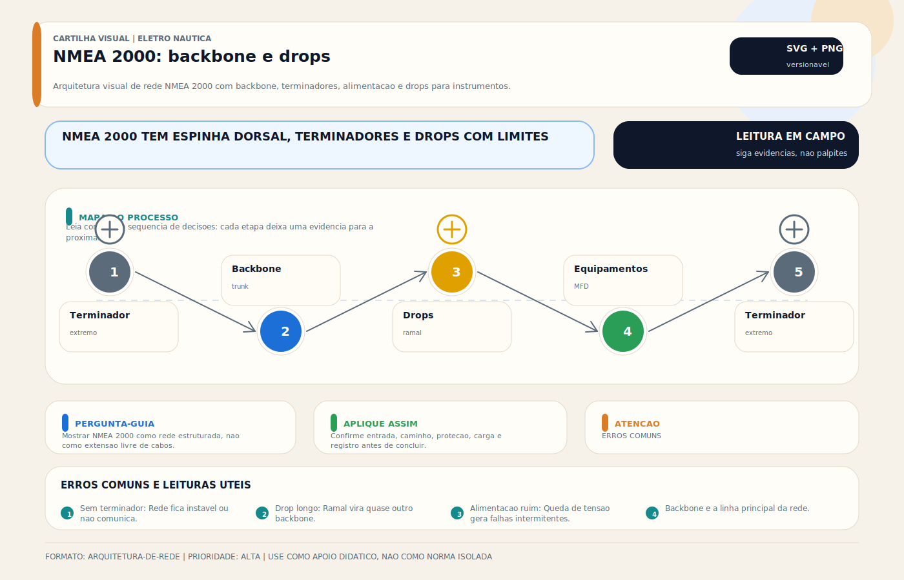

# NMEA 2000 / NMEA 0183 — Rede de Instrumentos

> [!abstract] Resumo técnico
> NMEA 2000 / NMEA 0183 — REDE DE INSTRUMENTOS — Protocolos padrão de comunicação entre instrumentos náuticos. NMEA 0183 é serial ponto a ponto, ainda muito presente em retrofit e integrações legadas. NMEA 2000 é rede em barramento CAN com compartilhamento estruturado de dados, mas exige topologia, alimentação e terminação corretas.

## O que é

**NMEA** = National Marine Electronics Association — organização americana que define os padrões de comunicação entre eletrônicos náuticos.

**NMEA 0183:**

- Protocolo serial assíncrono, definido originalmente sobre interface diferencial do tipo RS-422; na prática, há equipamentos com implementação single-ended ou adaptações proprietárias
- Ponto a ponto: 1 talker (transmissor) → múltiplos listeners (receptores)
- Velocidade padrão: 4800 baud (v2.x) ou 38400 baud (v3.x/HS)
- Dados em texto ASCII: sentences como $GPGGA, $IIMWV, $VDVTG

**NMEA 2000:**

- Protocolo de rede em barramento CAN bus (Controller Area Network)
- Múltiplos talkers e listeners no mesmo cabo (backbone)
- Velocidade: 250 kbps (50x mais rápido que NMEA 0183)
- Dados em binary PGNs (Parameter Group Numbers)
- Plug-and-play com conectores padronizados (Micro-C)

## Função

- Integrar todos os instrumentos da embarcação em uma rede única
- Compartilhar dados de GPS, profundidade, vento, velocidade, heading com múltiplos displays
- Permitir que o piloto automático receba dados de todos os sensores
- Enviar posição GPS para o VHF/DSC automaticamente
- Exibir dados de motor (NMEA 2000) no chartplotter

## Como aparece na prática

**NMEA 0183 (situação típica no Brasil):**

- Fio azul + fio marrom saindo do GPS → entrada NMEA IN do chartplotter
- GPS envia $GPGGA, $GPRMB ao VHF DSC → VHF sabe a posição
- Anemômetro envia $IIMWV → instrumento de vento → piloto automático
- Múltiplos cabos soltos, conectores DB-9 e bornes de parafuso

**NMEA 2000 (moderno):**

- Um único backbone de 5 fios (2 dados + 2 energia + shield)
- Drops de 6 pol saindo do backbone para cada equipamento
- Tee-connectors Micro-C plugados em sequência
- GPS, sonda, radar, piloto, chartplotter todos no mesmo barramento

## Fundamentos mínimos

| Parâmetro | NMEA 0183 | NMEA 2000 |
| --- | --- | --- |
| Velocidade | 4800 / 38400 baud | 250 kbps |
| Topologia | Ponto a ponto | Barramento (bus) |
| Cabos | Par trançado / coaxial | Cabo Micro-C 5 fios |
| Alimentação | Separada | Pelo backbone (LEN) |
| Máx. dispositivos | 1 talker / múltiplos listeners, conforme carga e interface | limitado por LEN, alimentação, backbone e topologia |
| Endereçamento | Não (identificado por conector) | Sim (NAME automático) |
| Padrão elétrico | RS-422 / RS-232 | CAN bus ISO 11898 |
| Conector padrão | Sem padrão (borne, DB-9, RJ45) | Micro-C (padronizado) |

## Sentences NMEA 0183 mais comuns

| Sentence | Significado | Fonte típica |
| --- | --- | --- |
| $GPGGA | Posição GPS + qualidade | GPS |
| $GPRMC | Posição + velocidade + data | GPS |
| $GPVTG | COG + SOG | GPS |
| $IIMWV | Velocidade/direção vento aparente | Anemômetro |
| $IIMWD | Direção vento verdadeiro | Instrumento |
| $IIVHW | Velocidade através da água | Log de água |
| $IIHDG | Heading magnético | Bússola/fluxgate |
| $SDDBT | Profundidade | Sonda |
| $VDVTG | Course Over Ground | GPS/AIS |
| $AIVDM | Mensagem AIS recebida | Transponder AIS |

## PGNs NMEA 2000 mais relevantes

| PGN | Dado | Fonte |
| --- | --- | --- |
| 126992 | System Time | GPS |
| 127250 | Vessel Heading | Compass/HDG |
| 127251 | Rate of Turn | IMU |
| 127258 | Magnetic Variation | GPS |
| 127488 | Engine Parameters (rapid) | Motor gateway |
| 127489 | Engine Parameters (dynamic) | Motor gateway |
| 128259 | Speed Through Water | Log |
| 128267 | Water Depth | Sonda |
| 129025 | Position, Rapid Update | GPS |
| 129026 | COG + SOG | GPS |
| 130306 | Wind Data | Anemômetro |
| 130310 | Environmental Parameters | Múltiplos |

## Configurações e topologias

**NMEA 0183 básica:**

```jsx
GPS ──TX+/TX──► Chartplotter RX+/RX
GPS ──TX+/TX──► VHF NMEA IN
Anemômetro ──► Instrumento de vento
Instrumento ──► Piloto automático
```

**NMEA 2000 completa:**

```jsx
[Terminador] ─── [Backbone] ─── [Terminador]
                    │
        ┌───────────┼───────────┐
      [GPS]    [Chartplotter]  [Piloto]
        │
      [Sonda]──[Anemômetro]──[AIS]──[Motor GW]
```

**Conversores e gateways:**

- **Actisense NGT-1:** converte NMEA 0183 ↔ NMEA 2000 (mais usado no mundo)
- **Garmin GND 10:** bridge NMEA 0183/2000 para equipamentos Garmin
- **Maretron USB100:** interface para computador (monitoramento e diagnóstico)
- **Digital Yacht iKonvert:** NMEA 0183 → NMEA 2000

## Marcas e componentes

| Componente | Fabricante | Observação |
| --- | --- | --- |
| Backbone cable | Garmin, Maretron, Actisense | Usar cabo certificado N2K |
| Tee connectors | Garmin, Maretron, Lowrance | Micro-C padrão |
| Power tap | Garmin, Maretron | Alimenta o backbone (fusível 3A) |
| Terminadores | Qualquer fabricante certificado | Resistor 120Ω em cada ponta |
| NGT-1 gateway | Actisense | Referência para conversão |
| USB100 | Maretron | Monitoramento avançado |
| SeaTalkNG | Raymarine | Proprietário mas compatível N2K |
| SimNet | Simrad | Proprietário mas compatível N2K |

**Importante:** SeaTalkNG (Raymarine) e SimNet (Simrad) compartilham base CAN compatível com o ecossistema NMEA 2000 em muitos cenários, mas a interoperabilidade depende de conectorização, pinagem, alimentação do backbone e suporte do fabricante. Adaptadores físicos não garantem interoperabilidade plena por si só.

## Problemas mais frequentes

| Problema | Causa raiz |
| --- | --- |
| GPS não aparece no chartplotter | TX/RX invertido, baud rate errado, fio partido |
| Todos os dispositivos N2K somem | Terminador faltando ou backbone em curto |
| Leitura errática no N2K | Drop muito longo (>6m), conector Micro-C mal travado |
| VHF não recebe posição | Sentence errada (precisa $GPRMC ou $GPGGA), baud 4800 |
| Piloto não recebe heading | PGN 127250 não presente, sensor não configurado |
| Conflito de endereços N2K | Dois dispositivos com mesmo NAME — reiniciar o que tem problema |

## Causas raiz detalhadas

**TX/RX invertido (NMEA 0183):** Erro clássico. O fio TX do transmissor deve ir ao RX do receptor. Em RS-422 diferencial, TX+ vai a RX+ e TX- vai a RX-. Instaladores amadores frequentemente invertem e o sistema não funciona.

**Baud rate errado:** NMEA 0183 v2 usa 4800 baud. Versão HS (High Speed) usa 38400. Misturar baud rates = sem comunicação. Sempre confirmar no manual do equipamento.

**Terminadores faltando (N2K):** A rede NMEA 2000 exige terminadores de 120Ω em cada extremidade do backbone. Sem eles, reflexões de sinal corrompem os dados. Sintoma: todos os dispositivos somem ou apresentam dados erráticos.

**Drop longo demais (N2K):** Especificação limita drops a 6m. Drops longos causam reflexão de sinal. Na prática, manter abaixo de 3m.

## Diagnóstico prático

```jsx
NMEA 0183:
Passo 1: Confirmar baud rate nos dois equipamentos (manual)
Passo 2: Confirmar atividade serial no transmissor com interface apropriada, analisador ou equipamento de teste compatível
Passo 3: Conectar laptop com Putty (4800 8N1) no RX do receptor
Passo 4: Verificar se chegam sentences legíveis ($GPGGA, etc.)
Passo 5: Se não chega nada → verificar TX/RX invertido
Passo 6: Se chega mas não decodifica → verificar baud rate

NMEA 2000:
Passo 1: Verificar tensão no backbone (deve ser 9–16V DC entre +12V e GND)
Passo 2: Confirmar que ambos os terminadores estão instalados
Passo 3: Medir resistência do backbone (com rede desligada) → deve ser ~60Ω (dois 120Ω em paralelo)
Passo 4: Usar software de diagnóstico (Maretron N2KAnalyzer ou Actisense NMEAReader)
Passo 5: Verificar se o dispositivo problemático aparece na lista de devices
```

## Boas práticas profissionais

- Documentar todo o wiring NMEA 0183: qual sentence vai a qual pino de qual equipamento
- Usar cabo blindado para NMEA 0183 (reduz EMI de inversor e carregador)
- Manter drops N2K tão curtos quanto a instalação permitir e dentro dos limites de comprimento previstos para a topologia adotada
- Alimentar o backbone N2K com fusível de 3A próximo à fonte
- Usar apenas componentes certificados NMEA 2000 no backbone (evitar imitações)
- Testar a rede com software de diagnóstico após qualquer modificação

## Cuidados de instalação

- Não usar conector macho Micro-C com fita isolante como "terminador" — usar terminadores reais
- Rotular cada fio NMEA 0183 na instalação (TX+, TX-, RX+, RX- de cada instrumento)
- Não misturar N2K certificado com cabo genérico no mesmo backbone
- Observar a polaridade em NMEA 0183 RS-422 (diferencial — ambos os fios importam)
- Instalar power tap do backbone próximo ao painel, com fusível 3A

## Cuidados de uso

- Ao trocar um instrumento, verificar se o novo usa o mesmo baud rate do antigo
- Não tratar "50 dispositivos" como regra universal: verificar LEN total, corrente disponível, extensão do backbone e limites da topologia real
- Manter os conectores Micro-C travados (têm anel de travamento)
- Verificar periodicamente se os terminadores N2K estão presentes (podem ser retirados acidentalmente)

## Erros comuns de instaladores

- Inverter TX e RX no NMEA 0183 (o mais comum de todos)
- Esquecer os terminadores no backbone NMEA 2000
- Usar cabo de alarme ou telefônico comum como cabo de rede N2K
- Não documentar o wiring → próxima manutenção é um pesadelo
- Ligar múltiplos talkers no mesmo par RX sem multiplexer (sinal corrompido)
- Confundir SeaTalkNG / SimNet com NMEA 2000 puro (precisam adaptadores)

## Relação com outros sistemas

- **GPS:** principal talker NMEA (fornece posição, velocidade, tempo)
- **VHF/DSC:** precisa receber posição GPS via NMEA para funcionar no DSC
- **Piloto automático:** recebe COG, SOG, HDG, vento via NMEA
- **Chartplotter/MFD:** hub central que recebe tudo
- **AIS:** transmite e recebe sentences NMEA AIS ($AIVDM, $AIVDO)
- **Motor (gateway):** converte J1939 (diesel) para N2K PGNs de motor
- **Instrumentos de bordo:** speed, depth, wind — todos na rede

## Brasil x Internacional

| Aspecto | Brasil | Internacional |
| --- | --- | --- |
| Protocolo dominante | NMEA 0183 ainda muito presente | NMEA 2000 já é padrão |
| Instalações mistas | Muito comum | Ainda presente em barcos antigos |
| Conhecimento técnico | Baixo na maioria dos instaladores | Maior base técnica |
| Gateways e conversores | Pouco usados | Actisense NGT-1 é comum |
| Diagnóstico | Feito "às cegas" | Software de diagnóstico disponível |

**Muito comum no Brasil:** NMEA 0183 com fiação exposta, baud rate errado, sem documentação.

**Mais presente em embarcações maiores/premium:** backbone NMEA 2000 completo com Maretron ou Garmin.

## Normas e referências

- **NMEA 0183 Standard:** verificar a edição oficial aplicável junto à NMEA ([NMEA.org](http://NMEA.org))
- **NMEA 2000 Standard:** verificar a edição oficial e requisitos de certificação/licenciamento junto à NMEA ([NMEA.org](http://NMEA.org))
- **IEC 61162-1:** NMEA 0183 (versão ISO)
- **IEC 61162-3:** NMEA 2000 (versão ISO)
- **CAN bus ISO 11898:** Base elétrica do NMEA 2000

## Como ensinar este tópico

**Sequência recomendada:**

1. Analogia: NMEA 0183 é como telefone fixo (discado, ponto a ponto). NMEA 2000 é como Wi-Fi (todos conectados ao mesmo roteador)
2. Mostrar sentences NMEA 0183 em tela (Putty / NMEAReader)
3. Demonstrar backbone NMEA 2000 montado fisicamente
4. Exercício: montar mini-backbone com 3 dispositivos e identificar no software
5. Troubleshooting: retirar terminador e mostrar o que acontece

## Ideias de vídeos

- "NMEA 0183 na prática: conectando GPS ao chartplotter e VHF"
- "NMEA 2000: montando o backbone do zero em uma lancha"
- "Por que meu GPS não aparece no chartplotter? TX/RX invertido!"
- "Diferença entre NMEA 0183 e NMEA 2000: quando usar cada um"
- "Diagnosticando rede NMEA 2000 com software Actisense"
- "SeaTalkNG, SimNet e NMEA 2000: são compatíveis?"

## Diagramas sugeridos

- Diagrama de wiring completo NMEA 0183: GPS → Chart → VHF → Piloto (com TX+/TX-/RX+/RX-)
- Diagrama de backbone NMEA 2000: backbone + drops + power tap + terminadores
- Tabela comparativa: NMEA 0183 vs NMEA 2000 vs SeaTalkNG vs SimNet
- Fluxograma de diagnóstico para "GPS não aparece no chartplotter"
- Mapa de PGNs NMEA 2000 por tipo de dado (posição, vento, profundidade, motor)

## FAQ

**Posso misturar NMEA 0183 e NMEA 2000 na mesma embarcação?**

Sim, e é a situação mais comum. Use um gateway/conversor (Actisense NGT-1) para integrar os dois mundos.

**Preciso de multiplexer para NMEA 0183?**

Se tiver mais de um talker querendo transmitir para o mesmo receptor, sim. Sem multiplexer, os sinais se sobrepõem e corrompem.

**SeaTalkNG da Raymarine é igual a NMEA 2000?**

Frequentemente é interoperável na camada física, mas não deve ser tratado como equivalência automática. Adaptadores mecânicos resolvem a conexão; a integração final ainda depende de alimentação correta, pinagem, topologia e compatibilidade entre os equipamentos envolvidos.

**Posso usar cabo Ethernet Cat5 como backbone NMEA 2000?**

Tecnicamente funciona em bancada, mas NÃO recomendado a bordo. O cabo certificado N2K tem blindagem específica e resistência a ambiente marinho.

**Qual a velocidade máxima de update no NMEA 0183?**

A 4800 baud, uma sentence $GPGGA leva ~200ms — atualização máxima ~5Hz. A 38400 baud (High Speed), até 20Hz. NMEA 2000 suporta até 100Hz em alguns PGNs.

**Como saber se meu backbone N2K está com problema?**

Com um multímetro: medir resistência entre CAN+ e CAN- (rede desligada) → deve ser ~60Ω. Se for 120Ω falta um terminador. Se for <60Ω tem curto ou dispositivo com problema.

## Visual didático



Mostrar NMEA 2000 como rede estruturada, nao como extensao livre de cabos.

**Cautela:** Comprimentos, topologia e carga de rede devem seguir especificacoes NMEA e manuais dos fabricantes.

Material de apoio: [NMEA 2000: backbone e drops](../_visuals/generated/nmea-backbone-drops.md)

## Integração com outras notas

- [[AIS (Automatic Identification System)]]
- [[Buzina]]
- [[Bússola Eletrônica (Compass / HDG Sensor)]]
- [[Chartplotter / GPS / MFD]]
- [[Dsc — Chamada Seletiva Digital]]
- [[EPIRB / Beacon de Emergência]]
- [[Estação de Vento / Anemômetro]]
- [[Mob — Man Overboard — Sistema de Detecção]]

## Perguntas que esta nota responde

- O que é NMEA 2000 / NMEA 0183 — Rede de Instrumentos em instalações elétricas náuticas?
- Qual é a função de NMEA 2000 / NMEA 0183 — Rede de Instrumentos na embarcação?

