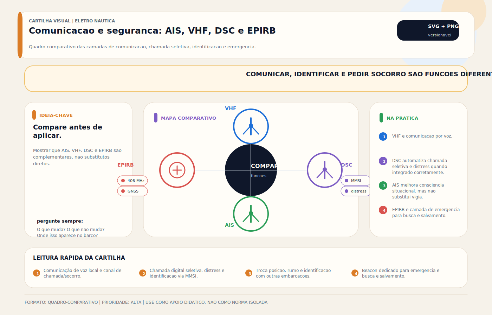

# VHF

> [!abstract] Resumo técnico
> VHF MARINO — Rádio de comunicação marítima na faixa VHF (156–174 MHz). Equipamento central de comunicação e socorro a bordo. Requisitos regulatórios, obrigação de porte e rotinas de escuta dependem da classe da embarcação, área de navegação e enquadramento aplicável.

## O que é

O rádio VHF (Very High Frequency) marino opera na faixa de 156–174 MHz e é o sistema de comunicação voz padrão entre embarcações e entre embarcações e estações costeiras. É o equipamento de socorro e comunicação mais importante a bordo — antecede o telefone celular em cobertura em mar aberto e em reconhecimento pelas autoridades marítimas.

O VHF com DSC (Digital Selective Calling) integra dados de GPS e permite chamada de emergência com posição automática — é o equivalente ao "9-1-1 náutico".

## Função na embarcação

- Comunicação voz entre embarcações e com estações costeiras
- Solicitação de socorro e emergência (Canal 16, DSC)
- Recepção de previsão meteorológica marinha (serviço Meteomar)
- Coordenação de manobras em porto e marina
- Identificação de embarcações e tráfego marítimo
- Integração com AIS para identificação de alvos

## Como aparece na prática

**Muito comum no Brasil:**

- VHF fixo Standard Horizon ou Icom na console de comando
- Antena de fibra de vidro no T-top ou mastro
- Rotina operacional de escuta no Canal 16, conforme o enquadramento operacional e regulatório da embarcação
- VHF portátil como backup em embarcações menores

**Comum em barcos importados:**

- VHF com DSC integrado ao GPS do chartplotter (Standard Horizon Matrix, Icom IC-M506)
- Conexão NMEA 0183 entre GPS e VHF para envio automático de posição
- Antena de alto ganho em mastro ou fly bridge

**Mais presente em embarcações maiores/premium:**

- VHF com AIS integrado (recepção de alvos AIS no mesmo display)
- Duas antenas (principal + backup) com seletor
- MMSI programado de acordo com o processo regulatório vigente e com a configuração DSC adotada

## Fundamentos mínimos

**MMSI (Maritime Mobile Service Identity):** Número de 9 dígitos que identifica a estação marítima/embarcação no ecossistema de radiocomunicação. É indispensável para o uso correto do DSC. O processo de obtenção, licenciamento e registro deve ser confirmado conforme a regulamentação brasileira vigente e a categoria da estação.

**Canal 16:** Canal internacional de emergência e chamada. É o canal de escuta e acionamento inicial mais relevante na rotina marítima, mas a obrigação prática de monitoramento deve ser lida à luz das regras operacionais e regulatórias aplicáveis a cada embarcação e contexto de navegação.

**DSC (Digital Selective Calling):** Sistema digital que permite enviar um sinal de Mayday com posição GPS automaticamente, identificando a embarcação pelo MMSI. Alcance: até 30–40 milhas náuticas. Estações costeiras e outras embarcações com DSC recebem e alertam.

**Potência e alcance:**

- 25W (potência máxima): alcance de 25–40 milhas náuticas (linha de visada + curvatura)
- 1W (potência reduzida): para comunicações locais em marina/porto — preserva bateria e reduz interferência

**Antena:** A antena é determinante para o alcance. Antena de 3dB (1/4 de onda) em T-top vs. antena de 6dB em mastro = diferença significativa de alcance.

## Características principais

| Parâmetro | VHF fixo | VHF portátil |
| --- | --- | --- |
| Potência máxima | 25W | 5–6W |
| Alcance típico | 25–40 mn | 3–8 mn |
| Corrente TX | 4–6A | 1,5–2A |
| Corrente RX | 0,5–1A | 0,2–0,5A |
| DSC | Sim (maioria) | Sim (maioria) |
| IP | IP55–IP67 | IPX7 (flutuante) |
| Conexão GPS | NMEA 0183 ou 2000 | Interna ou externa |

## Configurações e variações comuns

**VHF fixo com DSC (configuração padrão)**

- Standard Horizon GX1850, Icom IC-M330G, Cobra MR F77
- DSC programado com MMSI
- Conexão NMEA com GPS para posição automática

**VHF com AIS integrado**

- Recepção de alvos AIS no display do VHF
- Standard Horizon GX2400, Icom IC-M510
- Exibe embarcações ao redor sem necessidade de display separado

**VHF portátil como backup**

- Icom IC-M25, Standard Horizon HX890
- Flutuante e resistente à imersão
- Para uso em bote, emergência ou quando o fixo falhar

**VHF de cabine (segunda estação)**

- Montado na nav station, fly bridge ou popa
- Conectado à mesma antena do principal (seletor de antena)
- Em iates com múltiplos postos de comando

## Principais marcas

- **Standard Horizon** — líder no Brasil, ampla linha, excelente reputação
- **Icom** — japonesa, qualidade premium, presente em embarcações profissionais
- **Cobra** — acessível, boa relação custo/benefício
- **Uniden** — americana, popular em embarcações de recreio
- **Garmin** — VHF com integração total ao ecossistema Garmin (GHS 10, GMR VHF)

## Componentes e sistemas relacionados

- **Antena VHF** — 3dB ou 6dB, fibra de vidro, SO-239 conector
- **Cabo coaxial** — RG-8X ou RG-8 (baixa perda para VHF), comprimento minimizado
- **GPS/chartplotter** — integração NMEA para posição no DSC
- **MMSI** — número de registro obrigatório para DSC
- **AIS** — complementar ao VHF (identificação de embarcações)
- **Disjuntor dedicado** — no painel, protegendo o circuito do VHF

## Onde costuma dar problema

| Problema | Sintoma | Causa |
| --- | --- | --- |
| Alcance muito curto | Só ouve/transmite a poucos km | Antena com defeito, cabo ruim, conexões oxidadas |
| Áudio distorcido | Voz incompreensível na transmissão | Microfone defeituoso, modulação mal ajustada |
| DSC sem posição | "No position data" na tela | NMEA não conectado ou GPS sem fix |
| Sem áudio na recepção | Canal 16 silencioso | Volume, squelch fechado demais, antena |
| Interferência | Ruído em outros instrumentos | Cabo de alimentação do VHF causando EMI |
| VHF não liga | Sem display | Fusível queimado, cabo de alimentação |

## Causas raiz

**Alcance curto:**

- Conector PL-259 (SO-239) oxidado na antena — principal causa de perda de alcance
- Cabo coaxial de baixa qualidade ou muito longo (perda de sinal)
- Antena danificada (fibra trincada deixa entrar água no radome)

**DSC sem posição:**

- NMEA 0183 não conectado ao VHF (verificar pinos TX e RX no conector)
- GPS com fix mas outputting em NMEA 2000 (VHF lê NMEA 0183 — verificar protocolo)

**Causa raiz mais comum:** Conector de antena oxidado. A maioria dos problemas de alcance no VHF é resolvida simplesmente limpando ou substituindo o conector PL-259 na base da antena.

## Diagnóstico prático

**Passo 1:** Alcance curto → inspecionar conector na base da antena. Oxidação verde = problema. Substituir ou limpar com contato elétrico.

**Passo 2:** Verificar continuidade do cabo coaxial do VHF à antena. Qualquer resistência no centro (além do resistor de terminação) indica problema.

**Passo 3:** DSC sem posição → verificar cabo NMEA entre GPS e VHF. Testar com NMEA viewer no chartplotter para confirmar que o GPS está enviando dados.

**Passo 4:** Verificar transmissão → pedir a outra embarcação ou rádio para confirmar qualidade de áudio e alcance.

## Boas práticas

- Programar o MMSI somente após confirmar o dado oficial correto e o procedimento do fabricante, pois muitos equipamentos limitam reprogramação sem assistência técnica
- Conectar o GPS ao VHF via NMEA 0183 — posição automática no DSC é essencial para emergências
- Manter rotina de escuta e disciplina operacional compatíveis com o uso seguro do VHF e com a regulamentação aplicável ao tipo de operação
- Usar cabo coaxial RG-8X ou RG-8 (não RG-58 — perda excessiva no VHF)
- Limpar e inspecionar conector da antena anualmente
- Ter redundância de comunicação portátil é altamente recomendável, sobretudo em navegação costeira mais longa, travessias e embarcações com dependência crítica do posto principal

## Erros comuns

❌ **VHF sem MMSI programado** — DSC inoperante, emergência sem identificação

❌ **Sem conexão GPS-VHF** — no Mayday, posição não é enviada automaticamente

❌ **Cabo coaxial RG-58** — perda de 3dB+ em comprimentos de 10m — prejudica significativamente o alcance

❌ **Conector PL-259 mal feito** — perda de sinal na junção, alcance reduzido

❌ **Volume e squelch mal ajustados** — não ouve chamadas no canal 16

❌ **Canal 16 ignorado sem critério operacional** — perda de consciência situacional e pior resposta em chamadas de socorro ou segurança

## Relação com outros sistemas

- **GPS/chartplotter** — integração NMEA para posição no DSC
- **AIS** — complementar: VHF comunica, AIS identifica
- **Antena** — componente crítico para desempenho
- **Banco de bateria** — corrente de TX considerável em uso intenso
- **EPIRB** — backup de emergência quando VHF não tem alcance

## Brasil x referências internacionais

### Prática comum no Brasil

VHF instalado mas sem MMSI, sem conexão GPS, Canal 16 não monitorado. VHF portátil sem bateria carregada.

### Referência internacional

MMSI obrigatório, DSC com GPS integrado, Canal 16 sempre monitorado, VHF portátil como backup padrão de segurança.

### Ponto de conflito

No Brasil, a NORMAM exige VHF mas não detalha o requisito de MMSI com o mesmo rigor dos países do hemisfério norte. Na prática, muitos VHFs instalados são "decoração" sem função real de emergência.

### Leitura equilibrada

O VHF é mais útil que o celular em mar por cobertura, reconhecimento pelas autoridades e função DSC. Em emergência: VHF com MMSI programado e posição GPS integrada vale mais que qualquer celular.

## Normas e referências aplicáveis

- **NORMAM / DPC / Marinha do Brasil** — verificar o requisito aplicável conforme tipo de embarcação, área de navegação e enquadramento atualizado
- **GMDSS (Global Maritime Distress and Safety System)** — sistema global de socorro que o DSC integra
- **ITU Radio Regulations** — alocação de canais VHF marítimos
- **ANATEL (edição a verificar) e demais órgãos competentes** — verificar licenciamento, indicativo e processo vigente para MMSI/estação

## Destaques para ensino

- Canal 16: o que é, por que deve ser monitorado e o que fazer quando alguém chama Mayday
- DSC: como funciona o sistema, por que o MMSI é obrigatório
- Alcance VHF: linha de visada, curvatura da Terra, efeito da antena
- Cabos coaxiais: RG-8X vs RG-58 — a diferença no alcance
- Procedimento de Mayday: como chamar corretamente

## Ideias de vídeo, aula prática ou demonstração

- Demonstração de chamada DSC: procedimento passo a passo
- Teste de alcance real: VHF vs. celular em mar aberto
- Limpeza de conector PL-259: antes e depois do alcance
- Como programar MMSI no VHF (Standard Horizon e Icom)
- Procedimento de Mayday: treinamento prático a bordo

## FAQ

**O celular substitui o VHF?**

Não para emergências marítimas. O VHF tem cobertura em mar aberto onde não há sinal celular, é reconhecido pelo Salvamento Marítimo e pelo MRCC (Maritime Rescue Coordination Center), e tem alcance de 25–40 milhas (vs. 2–5 do celular em condições normais).

**O que é o MMSI e onde obter?**

Maritime Mobile Service Identity — número de 9 dígitos usado na identificação digital da estação marítima/embarcação. O caminho exato para obtenção e registro deve ser confirmado conforme a regulamentação vigente; o ponto importante aqui é não programar um número informal ou não autorizado.

**Canal 16 sempre ligado não gasta muita bateria?**

No modo de recepção (RX), o VHF consome ~0,5–1A. Em 10 horas: 5–10Ah — aceitável para qualquer banco de bateria de embarcação. Vale o consumo pelo que representa em segurança.

**Posso usar o VHF portátil como sistema principal?**

Temporariamente sim. Como sistema permanente: potência de 5W vs. 25W do fixo = alcance muito menor. Portátil é backup, não primário.

## Visual didático

Mostrar que AIS, VHF, DSC e EPIRB sao complementares, nao substitutos diretos.

**Cautela:** Requisitos de licenciamento, MMSI, programacao e uso variam por jurisdicao e equipamento.

Material de apoio: [Comunicacao e seguranca: AIS, VHF, DSC e EPIRB](../_visuals/generated/ais-vhf-dsc-epirb-camadas.md)

## Integração com outras notas

- [[AIS (Automatic Identification System)]]
- [[Buzina]]
- [[Bússola Eletrônica (Compass / HDG Sensor)]]
- [[Chartplotter / GPS / MFD]]
- [[Dsc — Chamada Seletiva Digital]]
- [[EPIRB / Beacon de Emergência]]
- [[Estação de Vento / Anemômetro]]
- [[Mob — Man Overboard — Sistema de Detecção]]

## Perguntas que esta nota responde

- O que é VHF em instalações elétricas náuticas?
- Qual é a função de VHF na embarcação?
