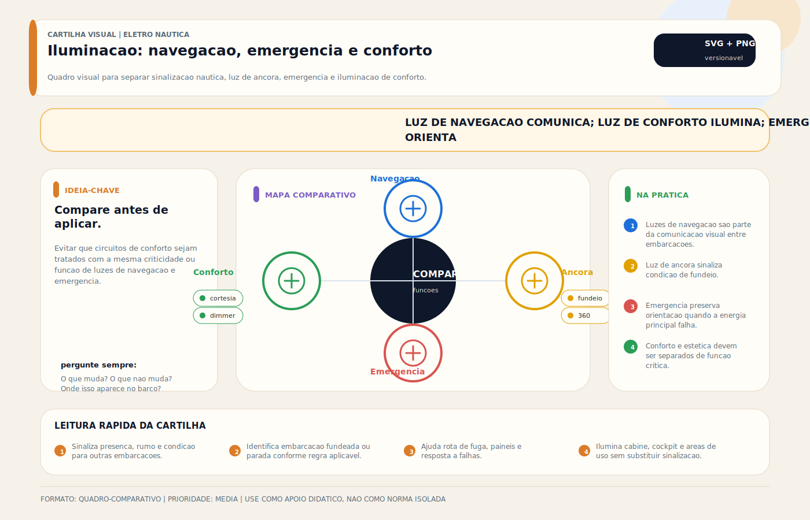

# Luz de Tope

> [!abstract] Resumo técnico
> LUZ DE TOPE (MASTHEAD LIGHT) — Luz branca de 225° usada no arranjo de luzes de embarcações a motor em movimento, conforme porte e regra aplicável. Não se confunde com luz de âncora, embora ambas sejam brancas.

> [!tip] Regra de decisão em 30 segundos
> - **Tope = branca, 225°, centrada no plano longitudinal** (112,5° de cada lado da proa).
> - **Embarcação a motor em movimento → liga tope.** Veleiro a vela pura → NÃO usa tope (usa tricolor de mastro ou bordo+popa).
> - **Alcance mínimo:** 2 NM (< 12 m), 3 NM (12–50 m), 5 NM (≥ 50 m) — COLREGS Anexo I §8.
> - **> 50 m exige dois topes** (proa mais alto, popa mais baixo).
> - **Tope deve estar acima das luzes de bordo** — visibilidade superior é o princípio.
> - **Não improvisar com lanterna LED** — fotometria/arco devem ser conformes ISO 16180:2011 / USCG 33 CFR 183.
> - **Conector no topo é a falha #1** — vibração + UV + spray → exigir IP67 ou crimp-seal.

## O que é

A luz de tope (masthead light em inglês) é uma luz branca com arco de visibilidade de 225°, colocada no ponto mais alto da embarcação a motor ou na proa acima da linha de visão das luzes de bordo. É obrigatória para embarcações a motor em movimento e define, em conjunto com as luzes de bordo, o tipo e o estado da embarcação.

"Tope" vem de "topo" — a posição mais elevada. Em lanchas, é geralmente montada no fly bridge ou no topo da estrutura de hardtop. Em veleiros à motor, pode ser colocada no mastro ou em posição intermediária.

## Função na embarcação

- Identificar que a embarcação está em movimento sob propulsão a motor
- Ampliar o alcance visual do sinal luminoso (posição elevada = maior visibilidade)
- Complementar as luzes de bordo para identificação completa do rumo e tipo
- Obrigatória por COLREGS Regra 23 para embarcações a motor

Uma embarcação a motor visto à frente: luz de tope branca (centro) + verde (boreste) + vermelho (bombordo). Visto de ré: somente luz de alcançado branca. Visto de lado: tope branca + uma das cores laterais.

## Como aparece na prática

**Muito comum no Brasil:**

- Lancha com luz de tope no topo do T-top ou hardtop
- LED branco 225° em luminária compacta Hella ou Perko
- Às vezes chamada erroneamente de "luz de mastro" mesmo sem mastro

**Comum em barcos importados:**

- Posicionamento preciso conforme COLREGS (acima das luzes de bordo por distância mínima)
- Integrada ao suporte de antenas no fly bridge
- Luzes de dois topes em embarcações maiores (frente e ré)

**Mais presente em embarcações maiores/premium:**

- Embarcações > 50m: dois mastros, luz de tope em cada um
- Alcance mínimo: 6 milhas náuticas
- Controle via sistema de automação

## Fundamentos mínimos

**COLREGS Regra 21(a):** Luz de tope = branca, 225° de arco (112,5° de cada lado da proa), visível da proa até 22,5° além do través de cada bordo. Deve estar na linha de cruzamento do plano longitudinal e transversal da embarcação — centrada.

**Posicionamento relativo:** A luz de tope deve ser posicionada **acima e à frente** das luzes de bordo. Para lanchas pequenas < 20m, a distância mínima é menor — mas o princípio de visibilidade superior deve ser mantido.

**Dois topes:** Embarcações > 50m devem ter dois mastros com luzes de tope — um à frente (mais alto) e um à ré (mais baixo). Permite identificar o rumo com mais precisão à distância.

**Veleiro a motor:** Ao usar motor, o veleiro deve exibir luz de tope + luzes de bordo. A vela pode estar ou não içada — o que determina o sistema de luzes é o uso ou não do motor.

## Características principais

| Parâmetro | Valor típico |
| --- | --- |
| Cor | Branco |
| Arco | 225° |
| Alcance mínimo (< 12m) | 2 milhas náuticas |
| Alcance mínimo (12–50m) | 3 milhas náuticas |
| Corrente (LED) | 0,5–1,5A |
| Corrente (incandescente) | 3–8A |
| Posição | Topo da estrutura, centrada longitudinalmente |

## Configurações e variações comuns

**Luz de tope simples (< 50m)**

- Uma única luminária no ponto mais alto
- Mais comum em lanchas, veleiros a motor e motonautas

**Dois mastros (> 50m)**

- Mastro de proa (tope mais alto) + mastro de popa (tope mais baixo)
- Diferença mínima de altura entre os dois definida pelo comprimento da embarcação

**Combinada com antenas**

- Muitas lanchas montam a luz de tope no mesmo suporte das antenas VHF/GPS no fly bridge
- Funciona tecnicamente, mas verificar que nenhuma antena bloqueia o arco de visibilidade

**Veleiro — luz tricolor no mastro**

- Substitui tope + luzes de bordo com um único conjunto de três setores no topo do mastro
- Somente em modo vela pura — não pode ser usada junto com propulsão a motor

## Principais marcas

- **Hella Marine** — 2NM e 3NM, homologação USCG, LED de longa duração
- **Aqua Signal** — alemã, qualidade premium, boa presença em iates europeus
- **Perko** — americana, boa reputação, disponível no Brasil
- **Navisafe** — sistemas alternativos para uso portátil e veleiros pequenos

## Componentes e sistemas relacionados

- **Chave de navlights** — aciona todo o sistema junto (tope + bordo + popa)
- **Fusível ou disjuntor** — proteção do circuito
- **Cabo de longa extensão** — do painel ao topo da estrutura pode ser 5–10m
- **Conector vedado no topo** — exposição extrema a UV, spray e vibração
- **Luzes de bordo** — complemento obrigatório do sistema
- **Luz de alcançado (popa)** — complemento obrigatório

## Onde costuma dar problema

| Problema | Sintoma | Causa |
| --- | --- | --- |
| Luz apagada | Não acende | LED queimado, conector oxidado, cabo rompido |
| Intermitência | Pisca sem ser strobo | Oxidação de conector no topo da estrutura |
| Arco incorreto | Visível fora dos 225° | Luminária girada ou mal posicionada |
| Condensação interna | LED embaçado | Vedação comprometida por UV |
| Cabo rompido | Sem continuidade | Vibração ou fixação inadequada |

## Causas raiz

**Conector oxidado no topo:**

- Posição mais exposta da embarcação — vento, spray e UV constantes
- Conexão aberta (não vedada) oxidando progressivamente
- Vibração por motor ou marola soltando a conexão

**Cabo rompido por vibração:**

- Cabo não fixado corretamente ao longo da estrutura — vibração fatiga o cabo
- Ponto de entrada na luminária sem abraçadeira de alívio de tração

## Diagnóstico prático

**Passo 1:** Não acende → verificar fusível e tensão no painel.

**Passo 2:** Tensão no painel, sem luz → medir tensão no terminal da luminária (subir ao topo ou usar extensão de prova).

**Passo 3:** Sem tensão no terminal → cabo rompido ou conector oxidado. Verificar com continuidade ao longo de todo o cabo.

**Passo 4:** Tensão no terminal mas sem luz → LED queimado. Substituir a luminária.

**Passo 5:** Verificar o arco visível: bloquear os 67,5° traseiros e confirmar que a luz desaparece.

## Boas práticas

- Usar LED homologado USCG ou ISO 16180:2011 — não adaptar LED de outra aplicação
- Proteger o conector no topo com conector marinizado IP67 ou conector crimp-seal
- Fixar o cabo ao longo de toda a estrutura com braçadeiras a cada 30–40cm
- Inspecionar e limpar conector anualmente (início de temporada)
- Substituir preventivamente se a luminária tiver > 8–10 anos (degradação do policarbonato e vedação)

## Cuidados de instalação

- Centrar longitudinalmente (não deslocada para o lado)
- Verificar que a luminária está acima das luzes de bordo
- Cabo com proteção UV ao longo da estrutura externa
- Alívio de tração na entrada da luminária (evita que o peso do cabo puxe o conector)
- Nenhuma antena ou estrutura bloqueando os 225° de arco

## Cuidados de uso

- Testar no checklist pré-saída junto com as demais luzes
- Verificar visualmente da água (cais ou outro barco) — confirmar que a luz está acesa e visível

> [!danger] Quando chamar especialista
> Erros em luzes de navegação têm consequência regulatória direta — em colisão noturna, a investigação começa pela conformidade COLREGS. Pare e procure profissional/eletricista naval certificado quando:
> - **Embarcação ≥ 20 m** — exigências de altura, separação entre topes e ângulos passam a ter cálculo geométrico (COLREGS Anexo I §2-§5).
> - **Dois topes** (embarcação > 50 m) com diferença de altura na faixa-limite — precisa medição precisa (Anexo I §2(a)(ii)).
> - **Veleiro com instrumentação no topo do mastro** — escolher entre tricolor + tope auxiliar quando a motor pode exigir cálculo de potencial bloqueio mútuo de arcos.
> - **Substituir incandescente por LED em luminária antiga** sem certificação USCG/ISO específica para LED — o policarbonato e o refletor podem alterar o padrão fotométrico.
> - **Inspeção AT (autoridade marítima) ou seguradora pediu laudo de conformidade** — assinatura técnica protege em caso de sinistro.
> - **Antena de radar ou VHF compartilha o suporte** e há suspeita de bloqueio de arco — medição com fotômetro de campo, não estimativa visual.
> - **Embarcação SOLAS / classificada** — entra em jogo IMO COLREGS + sociedade classificadora (ABS, DNV, BV) com requisitos próprios.
>
> Custo de uma medição certificada é inferior a uma multa de capitania ou agravamento de seguro em caso de colisão noturna.

## Erros comuns

❌ **Luz de tope deslocada para o lado** — não está centrada, arco incorreto

❌ **Antena VHF bloqueando parcialmente os 225°** — setor morto que outro navegante não enxerga

❌ **Usar em veleiro sob vela** — veleiro a vela pura NÃO usa luz de tope (usaria tricolor de mastro)

❌ **Conector aberto no topo da estrutura** — dura uma temporada antes de oxidar

❌ **Confundir luz de tope com luz de âncora** — arcos diferentes, usos diferentes

## Relação com outros sistemas

- **Luzes de bordo** — BB + BE + tope = sistema completo para embarcação a motor em movimento
- **Luz de alcançado** — complemento obrigatório na popa
- **Chave de navlights** — controle centralizado de todo o sistema
- **VHF/GPS** — frequentemente compartilham suporte de instalação

## Brasil x referências internacionais

### Prática comum no Brasil

Luz de tope frequentemente ausente em lanchas pequenas (< 12m), ou instalada em posição incorreta (descentrada, bloqueada). Verificação de conformidade ausente.

### Referência COLREGS / NORMAM-01 (edição a verificar)

O uso, a altura de instalação e o alcance fotométrico devem ser lidos conforme o porte e a configuração da embarcação. O ponto técnico central é respeitar setor, posicionamento e conjunto correto com luzes de bordo e alcançado.

### Leitura equilibrada

Para lanchas < 7m, a COLREGS permite alguma simplificação — mas a luz de tope, quando instalada, deve estar correta. Investir em conjunto LED homologado elimina dúvidas de conformidade.

## Normas e referências aplicáveis

- **COLREGS Regra 21, 23 e 25** — definição, posicionamento e obrigações
- **NORMAM-01 (edição a verificar)** — aplicação nacional das COLREGS para embarcações miúdas
- **ISO 16180:2011** — requisitos fotométricos
- **USCG 33 CFR (edição a verificar) 183** — homologação americana

## Destaques para ensino

- Por que a luz de tope é BRANCA (diferente das laterais coloridas) — identifica que está em movimento, não o lado
- A lógica dos arcos: 225° à frente (visível de qualquer ângulo de abordagem frontal) + 135° na popa (alcançado) = 360° de cobertura total
- Veleiro x lancha: quando cada sistema de luzes se aplica
- Verificação de posicionamento correto: como confirmar no cais antes de sair

## Ideias de vídeo, aula prática ou demonstração

- Demonstração noturna: o que outra embarcação enxerga de cada ângulo
- Checklist de verificação: ligar todas as luzes e confirmar cada uma
- Instalação de luz de tope LED no T-top de uma lancha: passo a passo

## Ideias de diagramas, circuitos, simulações ou imagens

- Diagrama de topo: arcos de visibilidade de todas as luzes sobrepostos
- Perspectiva de outra embarcação: o que ela vê de frente, de lado e de ré
- Circuito: painel → fusível → chave navlights → tope + bordo + popa → massa comum

## FAQ

**Veleiro precisa de luz de tope?**

Somente quando estiver usando o motor. Sob vela pura: usa tricolor de mastro (ou luzes de bordo inferiores + luz de alcançado, sem tope). Ao motor: tope + bordo + popa.

**A luz de tope pode ficar no fly bridge lateral?**

Deve estar centrada no plano longitudinal. Deslocar para o lado cria arco assimétrico incorreto — conformidade COLREGS exige posição central.

**Posso usar um LED de lanterna branca adaptada?**

Não. A fotometria, o arco de emissão e o alcance devem ser conformes à ISO 16180:2011. Lanterna adaptada não garante os 2 milhas de alcance mínimo.

**Qual a diferença entre luz de tope e luz de âncora?**

Mesmo que ambas sejam brancas: tope = 225°, usado em movimento. Âncora = 360°, usado fundeado. São funções e arcos completamente diferentes.

## Glossário rápido

| Termo | Significado |
| --- | --- |
| **Luz de tope** | Branca, 225°, embarcação a motor em movimento (COLREGS Regra 23) |
| **Luz de bordo** | Verde 112,5° (boreste/BE) + Vermelha 112,5° (bombordo/BB) (Regra 21(b)) |
| **Luz de alcançado** | Branca 135° na popa (Regra 21(c)) |
| **Luz de âncora** | Branca 360°, fundeado (Regra 30) |
| **Tricolor de mastro** | Combina tope + bordo num único conjunto no topo do mastro — só sob vela |
| **Arco / setor** | Ângulo horizontal de visibilidade da luz (medido em graus) |
| **NM (milha náutica)** | Unidade de distância: 1 NM = 1.852 m |
| **Alcance fotométrico** | Distância em que a luz é detectável por observador padrão (varia com porte) |
| **Anexo I COLREGS** | Detalha posicionamento, altura, intensidade luminosa e setores |
| **Sector cut-off** | Transição angular entre o setor visível e o invisível (deve ser nítida) |
| **MASTHEAD** | Tradução literal de "topo do mastro"; nome em inglês para luz de tope |
| **NUC (Not Under Command)** | Embarcação sem governo — usa luzes específicas (Regra 27) |
| **RAM (Restricted Ability to Maneuver)** | Capacidade restrita de manobra — luzes especiais (Regra 27) |
| **CBDR** | Constant Bearing, Decreasing Range — risco de colisão (Regra 7) |

## Visual didático

Evitar que circuitos de conforto sejam tratados com a mesma criticidade ou funcao de luzes de navegacao e emergencia.

**Cautela:** Requisitos formais dependem de regras de navegacao, porte, tipo e area de operacao.

Material de apoio: [Iluminacao: navegacao, emergencia e conforto](../_visuals/generated/iluminacao-navegacao-emergencia-camadas.md)

## Integração com outras notas

- [[Luz de Cortesia]]
- [[Luz de Âncora]]
- [[Luz Subaquática]]
- [[Dimmer — Controle de Intensidade Luminosa]]
- [[Farol de Busca]]
- [[Fitas Led / Iluminação Led]]
- [[Iluminação de Emergência a Bordo]]
- [[Luzes Internas Teto]]

## Perguntas que esta nota responde

- O que é Luz de Tope em instalações elétricas náuticas?
- Qual é a função de Luz de Tope na embarcação?
