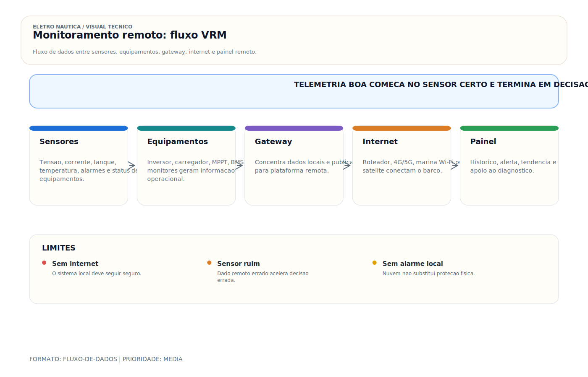

# Monitoramento Remoto — VRM / Telemetria

> [!abstract] Resumo técnico
> MONITORAMENTO REMOTO — VRM / TELEMETRIA — Plataforma de monitoramento remoto da Victron para sistemas conectados a um GX device com internet. Permite monitorar, alertar, diagnosticar e, em certos casos, controlar dispositivos compatíveis remotamente.

> [!tldr] TL;DR — 4 regras
> 1. **VRM (Victron) é referência** mas não-exclusivo — alternativas: Maretron N2KView Cloud, Garmin ActiveCaptain, Yacht Devices YDNG, Siren Marine MTC.
> 2. **Cybersecurity é crítica:** IEC 62443 + ISO 27001 + senha forte + 2FA + firmware atualizado. Sistema crítico (bomba, alarme) deve ter override OFFLINE.
> 3. **Conectividade necessária:** Wi-Fi marina, celular 4G/5G (CAT-M IoT), ou Starlink — escolha por área de operação. Vide [[Wi-Fi a Bordo — Roteador Marine e Conectividade]] + [[Starlink - Internet a Bordo]].
> 4. **Privacidade regulada:** GDPR (UE) + LGPD Lei 13.709/2018 (BR) — dados pessoais (localização GPS, identificação) precisam consentimento + retenção limitada.

> [!info] Glossário rápido
> - **VRM (Victron Remote Management):** plataforma cloud Victron.
> - **GX device:** Cerbo GX, Color Control, Venus GX (gateway Victron).
> - **N2KView Cloud:** plataforma Maretron.
> - **CAT-M / NB-IoT:** celular para IoT (baixo consumo).
> - **2FA:** Two-Factor Authentication.
> - **Telemetria:** transmissão automática de dados a distância.

## O que é

VRM (Victron Remote Monitoring) é a plataforma remota da Victron Energy para supervisão, diagnóstico e gestão de sistemas conectados. Segundo a documentação oficial, o VRM é gratuito e funciona com um GX device com acesso à internet; em sistemas menores, também pode operar com GlobalLink 520.

O ponto técnico importante é que o VRM não é "mais um display". Ele é a camada remota de um ecossistema que inclui:

- equipamentos Victron ou integrados;
- um dispositivo GX;
- conectividade com internet;
- regras de alarme e acesso de usuários.

## O que está confirmado em fonte oficial

Segundo o manual oficial do VRM:

- o portal oferece monitoramento remoto, alertas, controle, gestão e otimização;
- o dashboard e o app exibem estado da instalação e dados históricos;
- o VRM oferece **Remote Console**;
- o VRM permite **remote firmware update** em equipamentos compatíveis;
- o VRM oferece **Remote VEConfigure** para Multi/Quattro compatíveis;
- o VRM pode oferecer controles remotos para ESS, inverter/charger, relés GX, gerador e EV charging, quando suportados e com conexão em tempo real.

## Função na embarcação

- acompanhar estado energético e eventos críticos sem estar a bordo;
- receber alarmes e detectar problemas cedo;
- apoiar diagnóstico remoto antes de visita técnica;
- registrar histórico de operação;
- viabilizar gestão técnica mais madura da embarcação.

## Requisitos mínimos

1. Equipamentos compatíveis ou parcialmente integrados.
2. Dispositivo GX adequadamente alimentado e conectado.
3. Conexão com internet.
4. Cadastro e configuração correta da instalação no portal.

## Limites reais

**Sem internet:** o sistema local continua operando, mas o VRM não recebe dados em tempo real até a conectividade voltar.

**Sem ecossistema compatível:** a visibilidade e o nível de controle podem ser limitados.

**Sem parametrização correta:** alerta demais vira ruído; alerta de menos vira falsa sensação de segurança.

## Problemas mais frequentes

| Problema | Causa provável |
| --- | --- |
| VRM offline | perda de internet, GX desligado ou falha local |
| dados ausentes ou incompletos | integração parcial ou configuração incorreta |
| alarmes inúteis | parametrização ruim e histerese mal definida |
| falsa confiança no remoto | ausência de rotina local e de verificação operacional |

## Diagnóstico prático

1. Confirmar se o GX está alimentado e operacional localmente.
2. Verificar se a instalação tem internet funcional.
3. Conferir cadastro e acesso à instalação.
4. Validar se os equipamentos aparecem corretamente no ecossistema GX.
5. Revisar regras de alarme, histerese e perfis de notificação.

## Boas práticas

- configurar alarmes com critério técnico e histerese coerente;
- separar alerta crítico de evento meramente informativo;
- revisar o portal periodicamente, mesmo sem alarme;
- documentar usuários, permissões e responsabilidades;
- usar o histórico para manutenção preditiva, não só para reação a falhas.

## Erros comuns

- instalar VRM e nunca ajustar regras de alarme;
- achar que telemetria substitui inspeção e rotina operacional;
- abrir acesso excessivo a usuários sem governança;
- depender de internet frágil sem estratégia de redundância.

## Relação com outros sistemas

- **Banco de baterias / monitor de bateria** — telemetria energética.
- **Inversor/carregador** — estado, modos e eventos.
- **Gerador / relés / cargas controladas** — quando a arquitetura suportar controle remoto.
- **Starlink / Wi-Fi / 4G** — base de conectividade para o portal remoto.

## Normas e referências

- **Manual oficial VRM Portal**: [victronenergy.com/media/pg/VRM_Portal_manual/en/index-en.html](https://www.victronenergy.com/media/pg/VRM_Portal_manual/en/index-en.html)
- **Introdução oficial VRM**: [victronenergy.com/media/pg/VRM_Portal_manual/en/introduction.html](https://www.victronenergy.com/media/pg/VRM_Portal_manual/en/introduction.html)
- **Controles no VRM**: [victronenergy.com/media/pg/VRM_Portal_manual/en/control-your-devices-in-vrm.html](https://www.victronenergy.com/media/pg/VRM_Portal_manual/en/control-your-devices-in-vrm.html)

## FAQ

**VRM funciona sem internet?**

O sistema local pode continuar operando, mas o portal remoto depende de conectividade.

**VRM é pago?**

A documentação oficial informa que o VRM é gratuito; recursos e serviços específicos devem sempre ser conferidos na documentação vigente.

**VRM substitui display local?**

Não. Ele complementa a operação local com camada remota, histórica e de gestão.

## Visual didático

Mostrar que monitoramento remoto depende de medicao local confiavel, gateway e conectividade estavel.

**Cautela:** Monitoramento remoto nao substitui protecoes locais, alarmes criticos e comissionamento presencial.

Material de apoio: [Monitoramento remoto: fluxo VRM](../_visuals/generated/monitoramento-remoto-vrm-fluxo.md)

## Integração com outras notas

- [[Atuador Linear]]
- [[Automação de Bordo — Sistemas Domoticos]]
- [[Câmeras de Bordo / Sistema CFTV]]
- [[Interfone / Intercomunicador de Bordo]]
- [[Sensor de Nível Diesel]]
- [[Sistema de Alarme Geral / Painel de Alarmes]]
- [[Som]]
- [[Starlink / Internet a Bordo]]

## Perguntas que esta nota responde

- O que é Monitoramento Remoto — VRM / Telemetria em instalações elétricas náuticas?
- Qual é a função de Monitoramento Remoto — VRM / Telemetria na embarcação?

