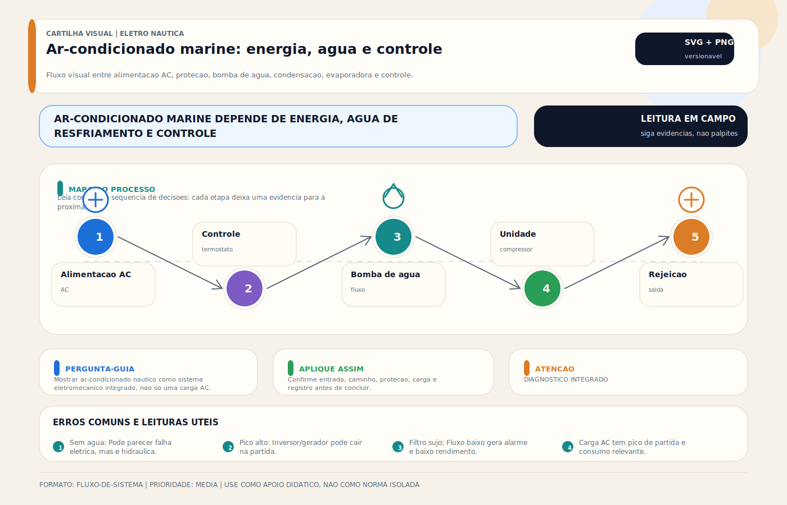

# Ar-Condicionado Marine — Sistema Completo

> [!tip] TL;DR — Regra de decisão em 30 segundos
> 1. **AC marine ≠ split residencial.** Ambiente salino, condensação a água do mar, embalagem marine-grade, alimentação instável e corrosão contínua tornam qualquer retrofit de equipamento residencial um erro estrutural.
> 2. **Quatro subsistemas em paralelo:** frigorífico, água do mar, ar, elétrico/comando. Diagnóstico que olha só o refrigerante erra na maioria dos casos.
> 3. **Vazão de água do mar é a variável mais crítica.** Incrustação, filtro sujo, mangueira dobrada, bomba com rotor gasto ou tomada de mar mal posicionada matam mais AC no mundo real do que qualquer falha frigorífica.
> 4. **Dimensionamento não é BTU/m².** Entram insolação, envidraçamento, isolação, ocupação, renovação de ar, temperatura da água do mar e perfil operacional. Regra de bolso só serve como estimativa inicial.
> 5. **Dimensionamento elétrico é por MCA + MOCP da plaqueta**, não por "watts". NEC Art. 440 é a referência obrigatória. MCA dimensiona o cabo; MOCP define o disjuntor máximo.
> 6. **Inrush de compressor ≈ 6–8× FLA** em partida direta. Soft starter reduz para 2–3× FLA e frequentemente é o que viabiliza shore 30 A ou gerador pequeno.
> 7. **Queda de tensão > 3% compromete partida e vida do compressor.** Cabo subdimensionado destrói compressor mesmo com disjuntor "certo".
> 8. **Refrigerante é item regulado.** HFC (R-410A, R-32, R-134a) sob Kigali/AIM Act/F-gas/CONAMA 267; manuseio exige técnico certificado (EPA 608 nos EUA, CTF/MAPA/IBAMA no Brasil). Recolher e recarregar não é tarefa de leigo.
> 9. **Manutenção anual é mandatória:** filtro de ar, filtro de água do mar, anodo do trocador, limpeza do condensador, verificação de isolação elétrica, teste de pressões e de consumo.

> [!danger] Quando chamar um especialista
> 1. **AC desarmando por alta pressão toda vez que sai do cais** — vazão de água do mar comprometida em navegação (tomada de mar aerando, filtro com detrito, bomba cavitando). Operar assim danifica compressor.
> 2. **Cheiro de refrigerante a bordo** — vazamento de HFC não é só eficiência; em ambiente fechado pode deslocar O₂ e, em contato com chama ou superfície quente, gera subprodutos tóxicos (HF). Evacuar, ventilar e chamar técnico certificado.
> 3. **Compressor batendo/golpeando na partida** — subtensão crônica, inrush não tratado, líquido no compressor (líquido no cárter) ou falha mecânica. Continuar operando = quebra iminente.
> 4. **Água de condensado invadindo porão ou bilge** — dreno obstruído ou projeto hidráulico errado. Pode virar alagamento silencioso; bomba de porão começa a ciclar sem razão aparente (ver [[Alarme de Alagamento - Sensor de Porão]]).
> 5. **Corrosão perfurante no gabinete, no trocador ou no condensador** — perda de estanqueidade do lado água do mar pode afundar o barco no cais. Inspeção visual obrigatória e registro fotográfico.
> 6. **Retrofit de split residencial "adaptado"** — componentes não marine-grade, corrosão em meses, risco elétrico (classe de isolação, GFPE), refrigerante incompatível, conformidade nula. Erro que a perícia cobra caro.
> 7. **Bomba de água do mar como causa raiz escondida** — AC parece problema frigorífico mas é hidráulico; troca de compressor nesses casos é desperdício técnico e financeiro.
> 8. **Charter, passageiros ou comercial com AC mal dimensionado** — conforto comprometido gera contestação, cancelamento e, em casos extremos, risco térmico (idosos, crianças, enfermos). Exposição regulatória em NORMAM/USCG.
> 9. **Vazamento de refrigerante HFC em carga total** — além do impacto climático (GWP R-410A ≈ 2088), exposição regulatória (EU F-gas, AIM Act, CONAMA 267). Perícia ambiental em caso de descarte inadequado.

> [!abstract] Resumo técnico
> Ar-condicionado marine é um sistema HVAC adaptado ao ambiente náutico, normalmente com condensação a água do mar e exigências fortes de integração hidráulica, elétrica e de automação. O sistema não se resume ao compressor: desempenho e confiabilidade dependem tanto da bomba de água do mar, da circulação de ar e da alimentação AC quanto do circuito frigorífico em si.

## O que é

É o sistema responsável por climatizar e desumidificar ambientes da embarcação. Em barcos de recreio, aparecem principalmente duas arquiteturas:

- unidades self-contained ou direct expansion;
- sistemas centrais com água gelada e fan-coils.

Ambas podem usar água do mar como rejeição de calor, o que diferencia fortemente o sistema náutico do residencial comum.

## Os quatro subsistemas que precisam funcionar juntos

### 1. Circuito frigorífico

Inclui compressor, condensador, evaporador, dispositivo de expansão e controles de proteção.

### 2. Circuito de água do mar

Inclui tomada de mar, registro, filtro, [[Bomba Ar Condicionado]] e tubulação de condensação/rejeição.

### 3. Circuito de ar

Inclui retorno, filtro, ventilador, dutos e distribuição no ambiente.

### 4. Circuito elétrico e de comando

Inclui alimentação AC, proteção, [[Contatores (AC)]], termostatos, controladores, permissivos e alarmes.

Quando o diagnóstico não enxerga os quatro subsistemas, a chance de troca errada de peça sobe muito.

## Tipos de arquitetura

### Self-contained

É a solução mais comum em lanchas e barcos médios. A unidade concentra refrigeração e ventilação localmente. Tem instalação mais simples, mas multiplica equipamentos quando há muitos ambientes.

### Chilled water (chiller)

Mais comum em embarcações maiores (>55-60 ft). Centraliza a refrigeração em uma central frigorífica (chiller) e distribui **água gelada com glicol propilênico (chilled water)** para **fan-coils** em cada ambiente. É mais sofisticado, exige projeto melhor e facilita setorização, manutenção, redundância (N+1) e acústica quando bem executado.

> [!info] Nota dedicada
> O tratamento técnico completo (loops primário/secundário/terciário, dimensionamento de bomba de glicol, refrigerantes pós-Kigali, marcas Cruisair Vector / Webasto BlueCool / Climma / Frigomar, comissionamento e manutenção) está em **[[Ar-Condicionado Chiller - Chilled Water Marine]]**. Esta seção apenas resume a arquitetura no contexto comparativo com self-contained.

## O que mais derruba desempenho no mundo real

Os fatores de campo mais críticos são:

- vazão insuficiente de água do mar;
- filtro/coador sujo;
- incrustação em condensador;
- fluxo de ar deficiente;
- alimentação elétrica ruim;
- subdimensionamento;
- ambiente com grande carga térmica e desumidificação insuficiente.

Em muitas embarcações, o defeito parece "falta de gás", mas a causa raiz está em água do mar, ar ou alimentação.

## Dimensionamento correto

Dimensionamento sério não deve ser feito só por área do ambiente. Entram:

- insolação;
- área envidraçada;
- isolamento térmico;
- volume do ambiente;
- ocupação;
- renovação de ar;
- temperatura da água do mar;
- perfil operacional da embarcação.

BTU por metro quadrado funciona como aproximação grosseira, não como critério final.

## Integração elétrica

Ar-condicionado costuma entrar em [[Linha Pesada (AC)]]. O projeto precisa considerar:

- capacidade real do [[CAIS (Pier) (AC)]];
- capacidade do [[Gerador (AC)]];
- corrente de partida do compressor;
- seletividade do circuito;
- uso ou não de soft start;
- coordenação com [[Contatores (AC)]] e proteções.

É frequente o sistema de climatização revelar que o problema verdadeiro é a arquitetura elétrica do barco.

## Integração hidráulica

No trecho de água do mar, importam muito:

- posição da tomada de mar;
- acesso ao filtro/coador;
- escorva e posicionamento da bomba;
- diâmetro das mangueiras;
- altura manométrica;
- descarte visível ou verificável da água.

Sem vazão adequada, o sistema perde capacidade, pode entrar em proteção e pode sofrer danos.

## Falhas típicas

As mais recorrentes são:

- liga e desliga por alta pressão;
- funciona, mas resfria pouco;
- compressor não parte;
- água do mar não circula adequadamente;
- retorno de ar obstruído;
- ruído, vibração ou vazamento de condensado;
- corrosão ou incrustação em componentes da água do mar.

## Diagnóstico profissional

O diagnóstico precisa separar:

1. falha de alimentação ou comando;
2. falha de circulação de água do mar;
3. falha de circulação de ar;
4. falha real do circuito frigorífico.

Perguntas úteis:

- há vazão de água suficiente?
- há troca de calor adequada?
- o evaporador está com fluxo de ar correto?
- a alimentação AC está dentro do esperado?
- o sistema foi dimensionado para essa carga térmica?

## Boas práticas

- tratar água do mar, elétrica e refrigeração como partes do mesmo sistema;
- garantir acesso fácil a filtro, bomba e pontos de manutenção;
- documentar circuito elétrico e hidráulico;
- controlar vibração e drenagem de condensado;
- revisar vazão e limpeza do circuito antes de condenar compressor ou carga de refrigerante.

## Erros comuns

Os mais frequentes são:

- adaptar split residencial sem discutir consequências de ambiente marinho, corrosão e integração;
- culpar refrigerante antes de verificar água do mar e fluxo de ar;
- esquecer corrente de partida e seletividade do circuito;
- esconder componentes críticos em locais sem acesso;
- subdimensionar o sistema porque o critério foi apenas "metragem".

## Visual didático

Mostrar ar-condicionado nautico como sistema eletromecanico integrado, nao so uma carga AC.

**Cautela:** Arquiteturas variam entre self-contained, chiller e sistemas maiores. Consulte manual e projeto hidraulico/eletrico.

Material de apoio: [Ar-condicionado marine: energia, agua e controle](../_visuals/generated/ar-condicionado-marine-fluxo.md)

## Normas aplicáveis

Ar-condicionado marine é o ponto onde **instalação elétrica**, **equipamento de refrigeração**, **sistema hidráulico de água do mar** e **regulação ambiental de refrigerante** se cruzam. Quatro camadas normativas precisam ser consideradas simultaneamente.

### Recreio / Small craft (foco principal)

- **ABYC E-11 (2023) — AC & DC Electrical Systems on Boats**: alimentação AC do equipamento, bonding, proteção, cabos, conectores.
- **ABYC A-6 — Ground Fault Protection**: DR/ELCI aplicável ao ramal do AC.
- **ABYC A-26 — Heating systems**: referência cruzada para sistemas reversíveis (bomba de calor).
- **ABYC H-2 — Ventilation**: renovação de ar e integração com HVAC.
- **ABYC H-27 — Seacocks, Thru-Hull Connections and Drain Plugs**: tomada de mar da condensação.
- **ISO 13297:2020 — Electrical systems — AC and DC**: norma internacional para embarcação de recreio (base do CE-RCD).
- **ISO 9093:2022 — Seacocks and through-hull fittings**: passe-casco e válvulas.
- **ISO 8846:2020 — Protection against ignition**: equipamentos elétricos em compartimento com gasolina (quando aplicável).
- **CE-RCD Directive 2013/53/EU — Recreational Craft Directive**: exigência europeia.

### Instalação elétrica aplicável

- **NEC Art. 440 — Air-conditioning and refrigerating equipment**: a norma central para dimensionamento elétrico do AC marine nos EUA; define MCA, MOCP, RLA, LRA e sua interpretação.
- **NEC Art. 430 — Motors, motor circuits and controllers**: base para motores AC (bombas de água do mar, ventiladores).
- **NEC Art. 555 — Marinas**: interface shore power.
- **NEC Art. 240 — Overcurrent protection** e **Art. 310 — Conductors**: proteção e cabos.
- **NFPA 70 (NEC)** e **NFPA 302 — Pleasure and Commercial Motor Craft**: aplicáveis aos EUA.
- **UL 489** (disjuntor de ramal) e **UL 484** (room AC) / **UL 1995** (HVAC equipment): certificação do equipamento e da proteção.
- **NBR 5410:2004 + emendas**: norma brasileira de baixa tensão.
- **NBR IEC 60364-4-41, 4-43, 5-52**: proteção contra choque, proteção contra sobrecorrente e seleção de cabos.
- **IEC 60364-7-709**: interface shore power (marinas).

### Refrigeração, HVAC e qualidade do ar

- **ASHRAE 15 — Safety Standard for Refrigeration Systems**: projeto seguro, limites de concentração em ambiente fechado, pressão.
- **ASHRAE 34 — Designation and Safety Classification of Refrigerants**: classificação A1/A2L/A3, B1/B2L/B3 (toxicidade + flamabilidade).
- **ASHRAE 62.1 — Ventilation for Acceptable Indoor Air Quality**: renovação mínima.
- **AHRI 210/240 — Performance Rating**: certificação de capacidade e eficiência.
- **NBR 16401-1/-2/-3 — Instalações de ar-condicionado centrais e unitárias**: referência brasileira.
- **NBR 16655 — Instalações de refrigeração**: aplicável.
- **NBR 13971 — Manutenção programada de sistemas de refrigeração e AC**: baseline de manutenção.
- **NBR 15960 — Refrigerantes inflamáveis**: importante para R-32 e sucessores A2L.

### Refrigerantes e regulação ambiental

- **Protocolo de Montreal** (1987) e emendas: phase-out de CFCs e HCFCs.
- **Emenda de Kigali (2016)**: phase-down de HFCs (R-410A, R-134a).
- **EPA SNAP Program (40 CFR Part 82)** e **AIM Act (2020)** nos EUA.
- **EU F-gas Regulation (UE) 517/2014**: restrição de HFCs na Europa.
- **Section 608 Technician Certification (EPA, 40 CFR Part 82 Subpart F)**: obrigatória para manuseio de refrigerante nos EUA.
- **Resolução CONAMA 267/2000**: substâncias que destroem a camada de ozônio no Brasil.
- **Portaria INMETRO 20/2006**: certificação de condicionadores de ar.

### Embarcações comerciais / classificadas

- **IEC 60092-101 / 201 / 202 / 352**: instalações elétricas em navios.
- **DNV-RU-SHIP Pt 4 Ch 8**, **Lloyd's Register Rules Pt 6**: sociedades classificadoras.
- **NORMAM-201/204/DPC** (comercial) e **NORMAM-211/DPC** (recreio): exigências brasileiras.

### Comparação rápida por jurisdição

| Tema | EUA (ABYC + NFPA/NEC + EPA) | Brasil (NBR + CONAMA + INMETRO) | Internacional/Comercial (IEC + Classificadoras) | Europa (CE-RCD + F-gas) |
|---|---|---|---|---|
| Dimensionamento elétrico | NEC 440 (MCA/MOCP) | NBR 5410 + plaqueta | IEC 60092 + plaqueta | ISO 13297 + plaqueta |
| Refrigerante regulado | EPA SNAP + AIM Act + Section 608 | CONAMA 267 + MAPA/IBAMA | Montreal + Kigali | EU F-gas 517/2014 |
| Qualidade do ar interior | ASHRAE 62.1 | NBR 16401 | — | EN 13779/16798 |
| Segurança de refrigeração | ASHRAE 15 + 34 | NBR 16655 + 15960 | ISO 5149 | EN 378 |
| Passe-casco / seacock | ABYC H-27 | NBR 5410 (geral) | IEC 60092 | ISO 9093 |
| Técnico certificado | EPA Section 608 | CTF/MAPA + capacitação | varia | EU F-gas certificate |

## Glossário rápido

- **HVAC (Heating, Ventilation, Air Conditioning)**: sigla que cobre climatização + ventilação.
- **Self-contained**: unidade com compressor, condensador, evaporador e controle em um único gabinete; comum em lanchas e barcos médios.
- **Split**: unidade com condensadora separada da evaporadora; incomum no marine puro por questão de corrosão e tubulação de refrigerante.
- **Chilled water / chiller**: sistema central com água gelada (água + glicol propilênico) distribuída a fan-coils; típico de embarcações grandes (>55 ft). Vide nota dedicada **[[Ar-Condicionado Chiller - Chilled Water Marine]]**.
- **Fan-coil (FCU)**: unidade terminal com serpentina de água gelada, ventilador, válvula modulante e termostato individual; em chiller é o que substitui a unidade self-contained nos ambientes.
- **DX (Direct Expansion)**: expansão direta do refrigerante no evaporador (sem loop intermediário de água).
- **Condensação a água do mar / SW-cooled (Seawater-cooled)**: rejeição de calor ao mar via bomba; padrão em AC marine.
- **Condensação a ar / air-cooled**: rejeita calor ao ar (raro em marine por tamanho e corrosão).
- **Tomada de mar / seacock / thru-hull**: passe-casco com válvula para admissão da água do mar.
- **Strainer / filtro de água do mar**: filtra detritos antes da bomba; manutenção mais frequente do sistema.
- **Bomba de circulação SW**: tipicamente magnetica ou centrífuga; dimensionada por vazão e altura manométrica.
- **Condensador (marine)**: trocador de calor cúprico-níquel ou titânio; troca calor entre refrigerante e água do mar.
- **Evaporador / coil**: trocador interno onde o refrigerante evapora e retira calor do ar.
- **Compressor**: rotativo, scroll ou recíproco; coração do circuito frigorífico.
- **Capilar / válvula de expansão (TXV / EXV)**: dispositivo de expansão; TXV é termostática, EXV é eletrônica (mais precisa).
- **Refrigerante**: fluido de trabalho; tipicamente R-410A (HFC, GWP 2088), R-32 (HFC, GWP 675, A2L) ou R-134a (HFC, GWP 1430); R-22 (HCFC) em phase-out.
- **GWP (Global Warming Potential)**: potencial de aquecimento global relativo ao CO₂ (GWP = 1).
- **ODP (Ozone Depletion Potential)**: potencial de destruição da camada de ozônio; zero para HFCs.
- **A1 / A2L / A3**: classificação de flamabilidade ASHRAE 34 (A1 não inflamável; A2L baixa; A3 alta — propano).
- **B1 / B2 / B3**: classificação de toxicidade (B = mais tóxico).
- **BTU/h (British Thermal Unit per hour)**: unidade de capacidade frigorífica; base do catálogo marine.
- **TR (Ton of Refrigeration)**: 1 TR = 12 000 BTU/h = 3,517 kW.
- **COP (Coefficient of Performance)**: razão entre capacidade e potência elétrica (SI).
- **EER (Energy Efficiency Ratio)**: COP em BTU/h por W.
- **SEER (Seasonal EER)**: eficiência média sazonal; pouco usado em marine por operação não sazonal.
- **Capacidade nominal**: capacidade declarada em condições-padrão (tipicamente 35 °C água do mar em catálogo marine).
- **De-rating em água quente**: perda de capacidade conforme a temperatura da água do mar sobe (efeito real em águas tropicais).
- **MCA (Minimum Circuit Ampacity)**: ampacidade mínima do ramal; dimensiona o cabo (NEC Art. 440).
- **MOCP (Maximum Overcurrent Protection)**: disjuntor máximo; define o valor do dispositivo de proteção.
- **RLA (Rated Load Amps)**: corrente nominal do compressor em condição de catálogo.
- **LRA (Locked Rotor Amps)**: corrente com rotor bloqueado (pico de partida de referência).
- **FLA (Full Load Amps)**: corrente plena do motor.
- **Soft starter**: dispositivo eletrônico que reduz o inrush de partida para 2–3× FLA.
- **Compressor inverter**: com VFD integrado, modula continuamente e tem inrush baixo.
- **Anodo de sacrifício (trocador SW)**: zinco/alumínio sacrificado para proteger o cobre-níquel/titânio do trocador.
- **Bond / bonding**: conexão equipotencial dos componentes metálicos que tocam água do mar.
- **ELCI / DR**: proteção diferencial residual; obrigatória no AC do barco.
- **Dreno de condensado**: tubulação que descarta a água condensada do evaporador.
- **Ciclo reverso (bomba de calor)**: sistema reversível que aquece no inverno.
- **Psicrometria**: ciência da relação entre temperatura, umidade e entalpia do ar úmido.
- **Ponto de orvalho**: temperatura em que o ar saturado condensa; define capacidade de desumidificação.
- **Sensível vs. latente**: parcela de calor ligada à temperatura (sensível) vs. à umidade (latente).
- **Carga térmica**: soma de ganhos de calor do ambiente (insolação, ocupação, equipamentos, infiltração, transmissão).
- **Renovação de ar**: volume de ar externo introduzido para manter qualidade interna (ASHRAE 62.1).
- **Permissivo / interlock**: condição obrigatória para a unidade partir (p.ex. fluxo de água comprovado, temperatura de descarga ok).
- **Alarme de alta / baixa pressão**: proteção do circuito frigorífico; evita dano ao compressor.
- **EEV / EXV**: válvula de expansão eletrônica, permite controle fino e melhor eficiência.
- **Recolhimento / recovery**: operação de remover o refrigerante do sistema para manutenção (exige equipamento e técnico certificado).
- **Recarga (charge)**: reposição de refrigerante; deve ser feita por peso, não por pressão.
- **Vácuo / evacuação**: remoção de umidade e ar do circuito antes da carga; essencial para vida do sistema.

## Integração com outras notas

- [[Ar-Condicionado Chiller - Chilled Water Marine]] — arquitetura central de água gelada (>55-60 ft).
- [[Ar-Condicionado Marine 12V DC]] — alternativa 12V DC para barcos pequenos.
- [[Bomba Ar Condicionado]] — bomba de água do mar (loop terciário) tanto para self-contained quanto para chiller.
- [[Aquecedor de Bordo - Cabin Heater]] — quando AC reversível não atende, sistema diesel/elétrico complementa.
- [[CAIS (Pier) (AC)]]
- [[Contatores (AC)]]
- [[Gerador (AC)]]
- [[Linha Pesada (AC)]]
- soft starter
- [[Proteção Dr]]
- [[Quadro Elétrico e Painel de Distribuição AC-DC]]
- [[Troubleshooting — Diagnóstico de Falhas Elétricas]]

## Perguntas que esta nota responde

- Quais subsistemas definem o funcionamento do ar-condicionado marine?
- Por que tanta falha de AC começa fora do circuito frigorífico?
- Como o sistema de climatização se encaixa na arquitetura elétrica e hidráulica do barco?

