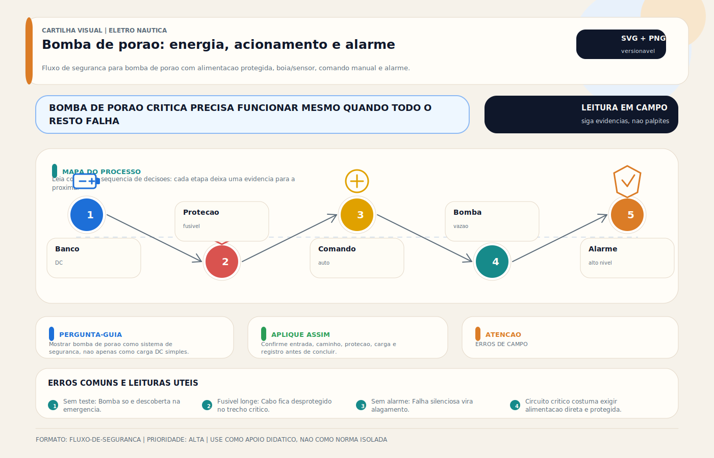

# Bomba de Porão

> [!tip] TL;DR — Regra de decisão em 30 segundos
> 1. **Bomba de porão é sistema de segurança, não acessório.** O critério de projeto muda inteiramente quando se aceita isso.
> 2. **Função automática DEVE estar em [[Hotline (DC)]]** — circuito sempre energizado, independente da chave geral. Se a proteção morre quando o usuário "desliga o barco", a arquitetura falhou.
> 3. **Bomba ≠ alarme de alta água.** São dois sistemas em série lógica: a bomba tenta resolver; o alarme avisa quando a bomba não consegue. Ambos são obrigatórios em projeto sério (ver [[Alarme de Alagamento - Sensor de Porão]]).
> 4. **Capacidade real ≠ capacidade de catálogo.** A vazão cai com altura de recalque, diâmetro da mangueira, sifonagem, filtro obstruído e tensão de alimentação. Em uso real, espere 40–60% da vazão nominal.
> 5. **Posicionamento importa mais que marca.** Bomba no ponto mais baixo útil, sem obstrução por detritos, óleo, cabos ou forro solto. Uma bomba cara mal posicionada é pior que uma bomba simples bem instalada.
> 6. **Redundância é regra, não luxo.** Embarcações de navegação ou com ocupação prolongada devem ter segunda bomba em nível superior, bomba manual e alarme de alta água.
> 7. **Válvula de retenção (check valve) não é solução universal.** Adiciona perda de carga, retém detritos, trava e reduz confiabilidade. Use somente quando a arquitetura realmente justificar (altura de recalque alta, múltiplos pontos).
> 8. **Alimentação é tão crítica quanto a bomba.** Cabo estanhado marine-grade (UL 1426 / ABYC E-11), fusível na bateria, proteção ignition-protected (UL 1500) em compartimento de gasolina, conexões torqueadas e protegidas contra corrosão.
> 9. **Família normativa primária:** ABYC H-22 + ISO 15083 + USCG 33 CFR 183 (recreio); IEC 60092 + DNV/Lloyd's/BV + SOLAS II-1 Reg 21/35-1 (comercial); NORMAM-211/201/204 no Brasil.

> [!danger] Quando chamar um especialista
> 1. **Bomba automática desliga quando o barco fica sem ninguém a bordo** — arquitetura errada (bomba atrás da chave geral); é o modo de falha mais grave e mais comum. Barco afundado no cais por chuva prolongada tem causa quase sempre elétrica.
> 2. **Bomba liga mas não drena** — sifonagem, mangueira quebrada, check valve travada, filtro/ralo obstruído, impeller desgastado. Leitura de corrente nominal com vazão zero = motor girando sem trabalho hidráulico.
> 3. **Bomba ciclando sozinha sem motivo aparente** — sensor mal posicionado, vazamento do seacock, infiltração de shaft/gland, condensado de AC (ver [[Ar-Condicionado Marine — Sistema Completo]]) ou entrada real de água. Nunca "ignorar".
> 4. **Porão com camada de óleo, combustível ou gasolina** — bomba não-ignition-protected é fonte de ignição em ambiente classificado. ISO 8846 + UL 1500 obrigatórios. Risco de explosão.
> 5. **Bomba "tamanho único" em embarcação de navegação** — única bomba pequena contra entrada real de água (mangueira estourada, junta perdida) é ficção. Embarcações maiores ou de passageiros precisam de cascata: primária, secundária, alarme, manual, emergência.
> 6. **Charter, passageiros ou comercial sem plano de manutenção + teste documentado** — responsabilidade civil e regulatória (NORMAM, USCG Subchapter K/T, SOLAS) ampliadas em caso de sinistro.
> 7. **Alarme de alta água desarmado ou desconectado "porque incomoda"** — segurança vital removida por comodidade. Reinstalar com diferenciação clara de bomba e separação de circuitos é tarefa técnica.
> 8. **Após retrofit de casco, motor ou AC** — tudo que acrescenta risco de entrada de água (novo seacock, novo trocador SW, nova vedação de eixo) exige reanálise do sistema de porão.
> 9. **Perícia pós-afundamento ou contestação de seguro** — laudo técnico exige rastrear projeto, componentes instalados, circuito elétrico (hotline vs. chave geral), capacidade real vs. catálogo, manutenção e histórico de testes.

> [!abstract] Resumo técnico
> Bomba de porão é sistema de mitigação e resposta inicial à água acumulada no porão. Ela não substitui estanqueidade do casco, inspeção nem capacidade de salvatagem. Seu valor real está em funcionar automaticamente, de forma previsível, quando o barco está sem ninguém a bordo.

## O que ela é e o que ela não é

Ela é uma bomba de drenagem de baixo head, projetada para retirar água acumulada do porão em cenários rotineiros ou em anomalias limitadas.

Ela não é:

- solução para falha estrutural séria de casco;
- substituta de bomba de emergência manual ou sistema de combate a alagamento;
- garantia de que o barco está seguro só porque "tem uma bomba instalada".

## Por que é sistema crítico

Falha silenciosa de bomba de porão costuma aparecer quando:

- o barco está parado;
- a chave geral foi desligada;
- houve chuva, infiltração, mangueira rompida ou vazamento;
- ninguém está presente para reagir.

Por isso, a arquitetura elétrica da bomba importa tanto quanto a bomba em si.

## Alimentação correta

Em projeto sério, a função automática da bomba de porão precisa estar em [[Hotline (DC)]], ou seja, em circuito sempre energizado. Se a proteção automática morre quando o usuário "desliga o barco", a arquitetura falhou.

O comando manual pode coexistir no painel, mas a função automática não deve depender dele.

## Papel do sensor e do alarme

A bomba e o sensor formam um conjunto. O ideal é separar:

- acionamento automático da bomba;
- condição de alta água/alarmística.

[[Alarme de Alagamento - Sensor de Porão]] não é redundância cosmética. Ele cobre o cenário em que:

- a entrada de água supera a capacidade da bomba;
- a bomba falha;
- o porão volta a encher rapidamente.

## Critérios técnicos de projeto

### 1. Capacidade real, não de catálogo

Capacidade nominal sem considerar altura de recalque, perdas e instalação induz erro. Em uso real, a vazão efetiva quase sempre é menor do que a anunciada.

### 2. Posicionamento

A bomba precisa estar no ponto mais baixo útil do porão e em local onde não seja bloqueada por detritos, óleo ou cabos soltos.

### 3. Tubulação de descarga

Entram:

- diâmetro adequado;
- trajeto curto e limpo;
- proteção contra sifonagem, quando necessário;
- posição correta da saída.

Válvula de retenção, embora tentadora, não é solução universal e frequentemente piora a confiabilidade por adicionar perda de carga, sujeira e travamento. Deve ser usada só quando a arquitetura realmente justificar e com plena consciência dos trade-offs.

### 4. Redundância

Embarcações maiores ou com operação mais crítica podem justificar:

- segunda bomba;
- bomba de maior capacidade em nível superior;
- bomba manual independente;
- alarme de alta água.

## Falhas típicas

As mais comuns são:

- alimentação automática ligada depois da chave geral;
- sensor travado ou contaminado;
- bomba operando, mas sem vazão útil;
- mangueira de descarga mal instalada;
- conexão elétrica oxidada;
- bomba subdimensionada para a realidade do porão;
- operador confiando em bomba única sem alarme.

## Diagnóstico profissional

Perguntas úteis:

1. A bomba automática funciona com a chave geral desligada?
2. O sensor aciona no nível correto?
3. Há vazão real na saída?
4. A água retorna ou sifona de volta?
5. A taxa de entrada de água é compatível com a capacidade do sistema?

Os testes mais úteis são:

- ensaio funcional da parte automática;
- ensaio funcional da parte manual;
- observação de vazão real;
- inspeção da linha de descarga;
- verificação de conexões e consumo elétrico;
- conferência do alarme de alta água, quando houver.

## Boas práticas

- manter a função automática em [[Hotline (DC)]];
- separar bomba automática de alarme de alta água;
- inspecionar porão, sensor, cabos e descarga periodicamente;
- evitar soluções que reduzam confiabilidade por conveniência aparente;
- tratar bomba de porão como sistema de segurança e não como acessório.

## Erros comuns

Os mais perigosos são:

- ligar tudo na chave geral;
- confiar na vazão de catálogo sem olhar a instalação real;
- usar válvula de retenção como solução padrão sem avaliar prejuízo de desempenho;
- considerar o problema resolvido porque a bomba "liga";
- não testar o sistema completo em rotina de manutenção.

## Visual didático

Mostrar bomba de porao como sistema de seguranca, nao apenas como carga DC simples.

**Cautela:** A topologia exata deve seguir projeto, manual da bomba, capacidade de vazao, protecao e requisitos da embarcacao.

Material de apoio: [Bomba de porao: energia, acionamento e alarme](../_visuals/generated/bomba-porao-fluxo-alarme.md)

## Normas aplicáveis

Bomba de porão é item de **segurança náutica** sob múltiplas jurisdições. Regulação mais intensa que equipamento comum — especialmente em embarcações comerciais, de passageiros e classificadas.

### Recreio / Small craft

- **ABYC H-22 (2023) — Electric Bilge Pump Systems**: **documento central**; define capacidade mínima por tamanho de embarcação, tipo de bomba, alimentação, comando, sensor, cabeamento e teste.
- **ABYC E-11 (2023) — AC & DC Electrical Systems**: arquitetura DC da bomba, fusível, cabo, hotline.
- **ABYC H-27 — Seacocks, Thru-Hull Connections**: descarga overboard.
- **ABYC A-25 — Main and Auxiliary Fuel Distribution**: compartimento com gasolina (cross-ref).
- **ISO 15083:2020 — Bilge-pumping systems**: documento internacional equivalente; base de CE-RCD.
- **ISO 10133:2020 — Electrical systems — Extra-low voltage DC**: arquitetura DC da embarcação.
- **ISO 8846:2020 — Protection against ignition**: em compartimento com gasolina.
- **ISO 9094:2022 — Fire protection** e **ISO 11812:2001 — Watertight cockpits**: cross-ref.
- **CE-RCD Directive 2013/53/EU**: exigência europeia.

### Jurisdição EUA

- **USCG 33 CFR 183 — Boats and Associated Equipment**: exigências federais para embarcações até 20 m (construção, elétrica, ventilação).
- **USCG 46 CFR Subchapter K** (pequenos passageiros, 100+ passageiros) e **Subchapter T** (< 100 GT): exigências de bombeamento para passageiros.
- **USCG NVIC 7-82 — Electric bilge pumps**: guia de navegação (navigation and vessel inspection circular).
- **NFPA 302 — Pleasure and Commercial Motor Craft**: norma de instalação em embarcação.
- **UL 1500 — Ignition-Protected Marine Products**: certificação para compartimento com gasolina.
- **UL 1426 — Electrical Cables for Boats**: cabo marine estanhado.
- **NEC Art. 250 + Art. 555**: grounding/bonding e marina.

### Jurisdição Brasil

- **NORMAM-211/DPC — Esporte e recreio**: exigências da Marinha do Brasil para recreio.
- **NORMAM-201/204/DPC — Comercial / SMM**: exigências para embarcação mercante / SMM (Sistema de Segurança do Tráfego Aquaviário).
- **NBR 5410:2004 + emendas — Instalações elétricas de baixa tensão**: referência geral para parte elétrica.
- **NBR IEC 60364-4-41 — Proteção contra choques elétricos**.
- **NBR 15808 — Coletes salva-vidas** (referência cruzada — cadeia de segurança).

### Embarcações comerciais / classificadas

- **SOLAS Chapter II-1 Reg 21 — Bilge pumping arrangements**: exigências obrigatórias para navios sob convenção SOLAS (passageiros > 36, carga > 500 GT, etc.).
- **SOLAS Chapter II-1 Reg 35-1 — Bilge pumping**: capacidade, redundância, independência das bombas.
- **IEC 60092-101 / 201 / 202 / 352 — Electrical installations in ships**.
- **DNV-RU-SHIP Pt 4 Ch 6 — Piping systems** e **Pt 4 Ch 8 — Electrical**: sociedade classificadora DNV.
- **Lloyd's Register Rules Pt 5 — Main and Auxiliary Machinery**.
- **Bureau Veritas NR 467 — Rules for the Classification of Steel Ships**.

### Integração e monitoramento

- **NMEA 2000 PGN 130310/130311/130316 — Environmental parameters**: integração de sensor de nível com rede do barco (MFD, alarme geral).

### Comparação rápida por jurisdição

| Tema | EUA (ABYC + USCG + NFPA) | Brasil (NBR + NORMAM) | Internacional / Comercial (ISO + IEC + SOLAS + Classificadoras) | Europa (CE-RCD + ISO) |
|---|---|---|---|---|
| Referência primária | ABYC H-22 + 33 CFR 183 | NORMAM-211/201 + NBR 5410 | ISO 15083 + SOLAS II-1 + IEC 60092 | ISO 15083 + CE-RCD |
| Capacidade mínima | ABYC H-22 (por LOA) | NORMAM + projeto | SOLAS II-1 Reg 21 + classificadora | ISO 15083 (por LOA) |
| Hotline / sempre energizada | ABYC E-11 + H-22 | NBR + boa prática | IEC 60092-201 | ISO 10133 + 15083 |
| Ignition protection (gasolina) | ABYC + UL 1500 + 33 CFR 183 | NBR (geral) + NORMAM | ISO 8846 + IEC 60079 | ISO 8846 |
| Redundância | ABYC H-22 (por embarcação) | NORMAM-201 (comercial) | SOLAS II-1 Reg 35-1 + classificadora | ISO 15083 |
| Alarme de alta água | ABYC A-16 + H-22 (recomendado) | NORMAM (comercial) | SOLAS II-1 + classificadora | ISO 15083 |
| Cabo marine | UL 1426 + ABYC E-11 | NBR (geral) | IEC 60092-352 | ISO 10133 + IEC 60092-352 |

## Glossário rápido

- **Bilge / porão**: região mais baixa do casco onde água acumulada se aloja.
- **Bilge pump / bomba de porão**: bomba centrífuga ou diafragma de baixo head projetada para drenagem do porão.
- **Head / altura manométrica**: altura total que a bomba precisa vencer; impacta diretamente a vazão real.
- **Vazão nominal vs. real**: nominal é catálogo em condição ideal; real é 40–60% em instalação típica.
- **GPH (Gallons Per Hour)**: unidade comum em catálogos americanos (1 GPH ≈ 3,785 L/h).
- **LPH / L/min**: unidade métrica.
- **Impeller / rotor**: parte girante da bomba centrífuga.
- **Diaphragm pump / bomba de diafragma**: auto-escorvante, pode operar a seco brevemente; usado em rotas secundárias.
- **Submersible centrifugal**: bomba centrífuga submersa no porão; não pode operar a seco por muito tempo.
- **Sensor / float switch / interruptor de boia**: acionamento automático por flutuador mecânico.
- **Sensor eletrônico / field-effect / capacitivo**: sensor sem partes móveis, menos propenso a travamento.
- **Sensor ultrassônico**: mede nível por tempo de eco; usado em alarmes de alta água.
- **Alarme de alta água / high water alarm**: sistema separado que avisa quando a bomba não dá conta.
- **Hotline / sempre-viva / always-on**: circuito DC permanentemente energizado, atrás da bateria e do fusível, mas antes da chave geral.
- **Chave geral / battery switch**: chave que isola baterias da maior parte do barco; bomba automática NÃO pode depender dela.
- **Fusível ANL / MRBF / Class T**: proteção de alta capacidade próxima à bateria; obrigatória.
- **Disjuntor ou fusível do ramal**: proteção próxima à bomba.
- **Cabo marine / tinned copper**: cobre estanhado com isolação adequada; UL 1426 + ABYC E-11.
- **Ignition protection**: característica obrigatória de equipamento elétrico em compartimento com gasolina (UL 1500 + ISO 8846).
- **Check valve / válvula de retenção**: evita retorno da coluna de água, mas adiciona perda e risco de travamento.
- **Sifonagem / anti-siphon loop**: arco na mangueira acima da linha d'água para evitar retorno por sifão.
- **Descarga overboard / thru-hull**: saída da mangueira para fora do casco, acima da linha d'água.
- **Seacock / thru-hull**: passe-casco com válvula; quando da bomba, deve estar livre e acessível.
- **Loop alto / vented loop**: laço com respiro para quebrar sifão.
- **Gland / sealing / caixa de gaxeta**: selagem do eixo do motor (inboard); fonte crônica de infiltração.
- **Stuffing box**: vedação tradicional do eixo; exige gotejamento controlado.
- **Dripless seal / vedação seca**: selagem mecânica moderna, sem gotejamento.
- **Hull leak / infiltração de casco**: entrada lenta e contínua de água; bomba deve dar conta.
- **Flooding event / alagamento agudo**: entrada rápida; exige bomba primária + secundária + manual.
- **Capacidade mínima (ABYC H-22)**: varia por LOA (comprimento); ex. 2 000 GPH para barcos > 12 m.
- **Redundância N+1**: bomba primária + secundária + manual + alarme.
- **Bomba manual / Edson / Whale**: bomba mecânica acionada pelo tripulante em emergência.
- **Bomba de combate / emergency dewatering**: bomba de alta capacidade, acionamento independente.
- **Eductor / venturi de motor**: bomba por sucção de escapamento (recurso de emergência).
- **Ciclo on/off / run time**: tempo de operação da bomba por ciclo; log útil em monitoramento.
- **Current draw / consumo de corrente**: medida indireta de estado da bomba (rotor preso, operação a seco, carga normal).
- **NMEA 2000 / N2K**: protocolo de rede a bordo; permite integrar sensor de alta água a MFD.
- **SOLAS (Safety of Life at Sea)**: convenção internacional para navios comerciais.
- **NORMAM**: Normas da Autoridade Marítima (Brasil, Marinha do Brasil, DPC).
- **DPC**: Diretoria de Portos e Costas (Marinha do Brasil).
- **USCG**: United States Coast Guard.
- **33 CFR 183**: regulamento federal americano para embarcações.
- **46 CFR Subchapter K/T**: regulamentos para pequenas embarcações de passageiros.
- **LOA (Length Over All)**: comprimento total; base para dimensionar capacidade de porão.
- **Perfil operacional**: padrão de uso (cais prolongado vs. navegação contínua); afeta dimensionamento.

## Integração com outras notas

- [[Alarme de Alagamento - Sensor de Porão]]
- [[Chaves Gerais (DC)]]
- [[Hotline (DC)]]
- [[Inspeção de Cabos Terminais e Conexões]]
- [[Sistema de Alarme Geral - Painel de Alarmes]]
- [[Troubleshooting — Diagnóstico de Falhas Elétricas]]
- [[Sensor de Nível de Água]]

## Perguntas que esta nota responde

- Por que a bomba de porão automática deve continuar viva com o barco "desligado"?
- Quando uma instalação perde eficiência mesmo com bomba boa?
- Por que bomba, sensor e alarme precisam ser pensados como sistema?

