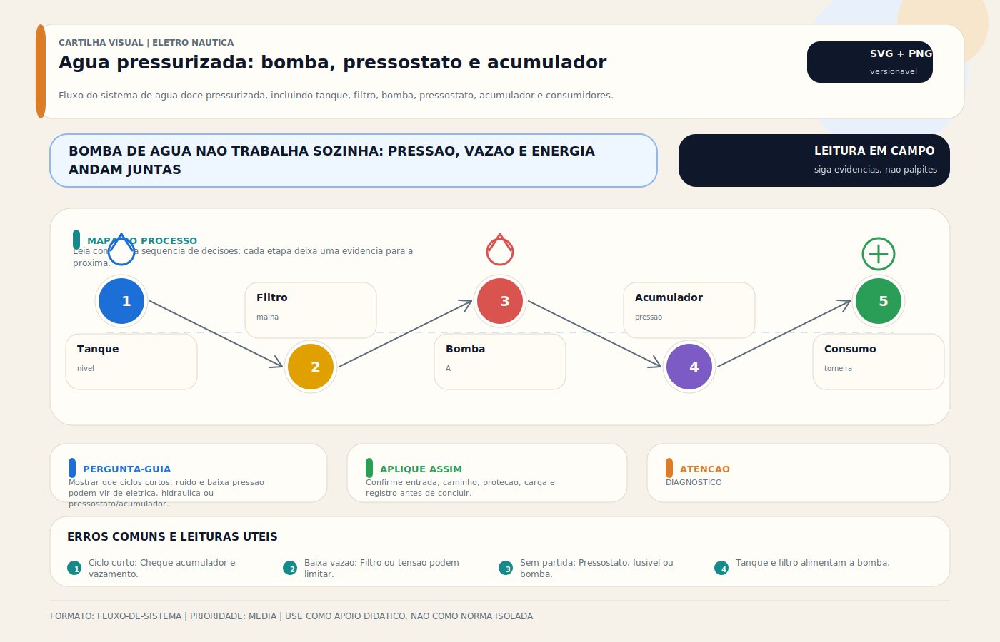

# Bomba de Água Pressurizada

> [!abstract] Resumo técnico
> A bomba de água pressurizada é o componente que transforma o tanque de água doce em rede hidráulica utilizável a bordo. O componente parece simples, mas a confiabilidade do conjunto depende de **sete elementos integrados**: tanque potável (NSF/ANSI 61), filtro de entrada (mesh 50-100), bomba de diafragma (Shurflo / Jabsco / FloJet / Whale / Headhunter), pressostato calibrado (cut-in 30-40 psi / cut-out 45-55 psi), acumulador hidropneumático (0,5-2 L), tubulação potável (PEX-A potable / silicone / EPDM atóxico) e proteção elétrica DC (fusível ANL/MIDI + DR/ELCI 30 mA quando alimentação AC). Operação a seco mata diafragma em **15-30 minutos**; ciclo curto sem acumulador degrada pressostato em **6-12 meses**. Esta nota cobre **ABYC H-23 + ISO 15748 + NSF/ANSI 61/372 + ANVISA Portaria 888/2021** com tabela de jurisdição e procedimento de comissionamento.

> [!tldr] TL;DR — 10 regras inegociáveis
> 1. **Toda mangueira, tanque, bomba e conexão em contato com água doce DEVE ser certificada NSF/ANSI 61** (saúde) **e NSF/ANSI 372 lead-free** (chumbo <0,25%). Componente de PVC industrial migra plastificantes — proibido na linha potável.
> 2. **Filtro de entrada (strainer, mesh 50-100) é obrigatório antes da bomba.** ABYC H-23.5.4 — protege diafragma contra detritos. Inspeção mensal; substituição da cesta a cada 12 meses.
> 3. **Pressostato calibrado: cut-in 30-40 psi (2,1-2,8 bar) / cut-out 45-55 psi (3,1-3,8 bar).** Pressão >60 psi rompe conexões push-fit; <25 psi não atende chuveiro confortavelmente.
> 4. **Acumulador hidropneumático (0,5 L mínimo, 1-2 L recomendado) reduz ciclos curtos em 70-85%.** Ar pré-carregado a **70% do cut-in** (≈25 psi para sistema 30-50 psi). Sem acumulador → diafragma falha em 18-36 meses.
> 5. **NUNCA opere a seco.** ABYC H-23.6 exige **proteção contra dry-run** (sensor de fluxo, termistor ou pressão). Bombas Shurflo Aqua King Premium têm proteção integrada; modelos básicos NÃO.
> 6. **Fusível DC dimensionado a 125% da corrente máxima** (ABYC E-11.5.4). Bomba 12V 4 GPM consumindo 6-8A nominal → fusível 10-15A ANL ou MIDI no terminal positivo da bateria, **<7 polegadas** do conector da bomba.
> 7. **Para alimentação AC (raro mas existente em iates >50 ft):** disjuntor + **DR/ELCI 30 mA** (ABYC E-11 / IEC 60364-7-709) — ambiente úmido em ponto de consumo é zona 2 (chuveiro = zona 1).
> 8. **Desacoplamento mecânico obrigatório:** coxins de borracha entre bomba e estrutura + mangueira flexível (15-30 cm) na entrada e saída. Acoplamento rígido transmite pulsação como ruído estrutural.
> 9. **Ligar a bomba conforme polaridade correta** (vermelho +, preto −). Inversão queima placa eletrônica do pressostato em modelos com sensor (Sensor Max, Aqua King). Modelos puramente mecânicos toleram inversão mas giram ao contrário.
> 10. **Antes de inverno / longa parada:** despressurize linha, drene tanque, sopre ar comprimido <30 psi pelos pontos de consumo OU encha com glicol propilênico potável (RV antifreeze, NSF/ANSI 61) — congelamento estoura cabeçote da bomba.

> [!danger] Cenários de risco
> - **Contaminação por componente não-potável (PVC industrial, mangueira de carro, tinta epóxi industrial):** migração de **ftalatos, BPA, chumbo, antimônio** para água — exposição crônica → distúrbios endócrinos, neurotoxicidade, câncer. **Rastreio:** odor químico ("plástico"), gosto adstringente, sabor metálico. Trocar TODO componente afetado por NSF/ANSI 61 + 372.
> - **Operação a seco prolongada:** diafragma de Santoprene/EPDM atinge **>110°C em 15-30 min**, derrete e libera vapor químico. Risco secundário: motor DC sobreaquece, isolamento esmaltado falha → curto interno → fumaça → incêndio elétrico no compartimento. **Rastreio:** ruído seco/chiado da bomba, ausência de fluxo, cheiro de plástico queimado.
> - **Pressostato travado fechado (cut-out falha):** bomba não desliga após atingir pressão; mangueira/conector mais fraco rompe a 60-90 psi → inundação. Em 30 min com fluxo livre: tanque de 200 L vazio + porão alagado. **Rastreio:** bomba zumbindo continuamente; manômetro >55 psi.
> - **Pressostato travado aberto (cut-in falha):** bomba liga e nunca desliga. Bateria 100 Ah descarrega em **8-12 horas** com bomba 7A. Em barco abandonado por fim de semana: bateria abaixo de 10,5V → sulfatação irreversível.
> - **Cavitação por estrangulamento na sucção** (mangueira longa, dobrada, filtro entupido, altura de sucção >2 m): bolhas implodem dentro do cabeçote, erodem diafragma e válvulas, ruído tipo "cascalho". Diafragma falha em 3-6 meses.
> - **Vazamento oculto na linha pressurizada** com bomba ligada o tempo todo: bomba cicla 200-500 vezes/dia, pressostato falha em <6 meses, tanque esvazia silenciosamente. Em arquitetura sem volta automática para o tanque, água perdida vai para o porão → bomba de porão ciclando → segunda falha.
> - **Inversão de polaridade DC em bomba com placa eletrônica (Sensor Max, Aqua King Premium):** queima imediata da MOSFET de potência. Reparo = trocar bomba inteira (R$ 800-2.500). Modelos sem placa (Shurflo 4008 básico) toleram inversão mas giram em vácuo.
> - **Mistura de água do mar com água doce** por failure de Y-valve, dessanilizador mal instalado ou retorno de boiler com calorifier furado: sal corroe diafragma de poliuretano + contaminação biológica. Rastreio: gosto salgado, condutividade >800 µS/cm.
> - **Congelamento (lat ≥30° em inverno):** água em diafragma expande 9% ao congelar → cabeçote racha em ferro fundido / bronze; diafragma fica permanentemente deformado mesmo após descongelar. Reparo: bomba nova. Prevenção: drenar + ar comprimido OU glicol propilênico potável.
> - **Refluxo (backflow) entre rede pressurizada e fonte externa** (mangueira do dock conectada com pressão da marina superior à do barco): contaminação cruzada → norma ABYC H-23.7 + EPA SDWA exige **válvula de retenção (check valve) + air gap** na conexão de bunker.

## O que é (definição rigorosa)

**Bomba de água pressurizada (Pressurized Fresh Water Pump, PFWP)** é a bomba que mantém pressão em rede de água doce a bordo, operando por demanda — pressostato (mecânico ou eletrônico) inicia o motor quando a pressão cai abaixo do **cut-in (set-on, ligamento)** e desliga quando atinge **cut-out (set-off, desligamento)**.

Em embarcações de recreio, a tipologia dominante é **bomba de diafragma de 3-5 câmaras (multichamber diaphragm pump)** com motor DC 12V/24V de imã permanente, pressostato integrado e auto-priming até 1,5-3 m de coluna negativa. Bombas centrífugas (impeller pumps) são raras em água doce (predominam em circulação de boiler ou ar-condicionado) por não auto-aspirarem.

A norma **ABYC H-23 (Pressurized Fresh Water Systems)** define o sistema completo, **não apenas a bomba**: tanque + bomba + filtro + pressostato + acumulador + tubulação + air gap + check valve + conexão de bunker.

## Arquiteturas — quatro topologias

### 1. Demand pump simples (bomba de demanda básica)

```
[Tanque potável] → [Filtro mesh 80] → [Bomba diafragma 3-câm. c/ pressostato] → [Linha pressurizada] → [Pontos de consumo]
```

**Aplicação:** barcos pequenos (<35 ft), 1-2 pontos de consumo, **sem acumulador**.
**Modelos típicos:** Shurflo 2088-403 (3 GPM), Jabsco Par-Max 1 (1.1 GPM), Whale Watermaster (2.6 GPM).
**Limitação:** ciclo curto agressivo, ruído elevado, vida útil 18-36 meses.
**Custo:** R$ 350-700.

### 2. Demand pump + acumulador (arquitetura recomendada)

```
[Tanque] → [Filtro] → [Bomba] → [Acumulador 0.5-2 L pré-carga 25 psi] → [Linha] → [Consumo]
```

**Aplicação:** barcos 35-55 ft, 3-5 pontos de consumo (galley + 1-2 banheiros + chuveiro de popa).
**Modelos típicos:** Shurflo 4008-101 (3.0 GPM, 45 psi), Shurflo Aqua King Premium Plus 4948 (5.3 GPM, 55 psi), Jabsco Par-Max 4 (4.3 GPM, 40 psi), FloJet Quad Series 4406 (3.3 GPM).
**Acumulador:** Shurflo Pre-Pressurized 0.75 L, Jabsco 30573, Whale Aquaflow Sport.
**Vida útil:** 4-8 anos.
**Custo:** R$ 800-2.500 (bomba + acumulador).

### 3. Variable-speed / soft-start pump (bomba de velocidade variável)

```
[Tanque] → [Filtro] → [Bomba VS c/ controlador eletrônico] → [Linha] → [Consumo]
```

**Aplicação:** iates premium 50+ ft, 5+ pontos simultâneos, conforto residencial.
**Modelos típicos:** Shurflo Aqua King Premium Plus 5.3 (com soft-start), Headhunter Mach 5 (variável 1-5 GPM, 35-65 psi), Headhunter X-Caliber.
**Diferencial:** modula RPM conforme demanda; pressão constante; ruído mínimo; sem necessidade de acumulador grande.
**Vida útil:** 8-15 anos.
**Custo:** R$ 4.000-15.000.

### 4. Bomba centralizada com tanque hidropneumático grande

```
[Tanque potável] → [Filtro duplo paralelo c/ valv. 3-vias] → [Bomba centrífuga 1.5-3 HP AC 220V] → [Tanque hidropneumático 20-80 L] → [Linha] → [Consumo]
```

**Aplicação:** mega-iates >70 ft, 8+ pontos, lavanderia, jacuzzi.
**Modelos típicos:** Headhunter SeaBridge HEX, Grundfos CR 1-5 (industrial adaptado), Webasto BlueCool Aquamarine.
**Diferencial:** operação por horas em pressão constante; alimentação AC 220V com DR/ELCI 30 mA; redundância (2 bombas paralelas).
**Custo:** R$ 25.000-80.000.

## Pressostato — calibração e modos de falha

| Parâmetro | Valor padrão | Faixa aceitável | Observação |
|-----------|--------------|-----------------|------------|
| **Cut-in (liga)** | 30 psi (2,1 bar) | 25-40 psi | <25 psi = chuveiro fraco |
| **Cut-out (desliga)** | 45 psi (3,1 bar) | 40-55 psi | >60 psi rompe conexão push-fit |
| **Diferencial (Δp)** | 15 psi | 10-20 psi | Δp baixo = ciclo curto |
| **Corrente máxima do contato** | 10-20 A DC | conforme modelo | excedido = solda do contato |
| **Pré-carga acumulador** | 70% do cut-in | 17-28 psi | medir só com sistema despressurizado |

**Modos de falha do pressostato:**

- **Contato soldado fechado:** bomba não desliga; mangueira mais fraca rompe a 60-90 psi → inundação. Frequência: 1 a cada 3-5 anos sem acumulador; muito mais raro com acumulador.
- **Contato soldado aberto:** bomba não liga; ausência de água. Detectado rapidamente pelo usuário.
- **Diafragma do sensor furado:** pressão real e medida divergem; bomba cicla aleatoriamente. Substituição do conjunto pressostato (não componente isolado).
- **Membrana do sensor calcificada (água dura, sal):** histerese aumenta; cut-in cai e cut-out sobe. Calibração não corrige; trocar.

## Acumulador (vaso de expansão hidropneumático)

> [!info] Função do acumulador
> Acumulador é **vaso fechado** com membrana que separa **câmara de ar pré-pressurizado** de **câmara de água**. Quando a bomba sobe pressão, comprime o ar; quando consumidor abre torneira, o ar empurra a água ANTES da bomba ligar. Reduz o número de ciclos da bomba em 70-85% para o mesmo volume entregue.

**Dimensionamento:**

| Vazão da bomba | Acumulador mínimo | Acumulador recomendado | Pré-carga ar |
|----------------|-------------------|-----------------------|--------------|
| 1-2 GPM (4-8 L/min) | 0,5 L | 0,75 L | 21 psi |
| 3-4 GPM (11-15 L/min) | 0,75 L | 1,0-1,5 L | 25 psi |
| 5-6 GPM (19-23 L/min) | 1,5 L | 2,0 L | 28 psi |
| Variable-speed | dispensável | 0,5 L (residual) | 25 psi |

**Manutenção:** verificar pré-carga **anualmente** com manômetro de pneu (rosca Schrader). Pressão zero = membrana rompida → trocar acumulador (não tem como recarregar com membrana furada). Pressão correta apenas com sistema **despressurizado** (abrir torneira, esperar bomba parar de tentar).

## Modelos típicos por classe

### Classe econômica (barcos <30 ft, uso esporádico)

- **Shurflo 2088-403-144** — 3 GPM, 45 psi, 12V/8A, R$ 380. Diafragma de Santoprene; sem proteção dry-run.
- **Jabsco Par-Max 1.1** — 1,1 GPM, 30 psi, 12V/3A, R$ 320. Para 1 ponto.
- **Whale Watermaster** — 2,6 GPM, 30 psi, 12V/6A, R$ 550.
- **FloJet R3826** — 2,9 GPM, 40 psi, 12V/7A, R$ 480.

### Classe intermediária (barcos 30-50 ft, uso regular)

- **Shurflo 4008-101-A65** — 3,0 GPM, 45 psi, 12V/7A, R$ 850. Padrão da indústria. Auto-priming 6 ft.
- **Shurflo Aqua King Junior 4138** — 3,0 GPM, 45 psi, 12V/7A, R$ 950. Versão "premium" do 4008 com motor mais silencioso.
- **Jabsco Par-Max 4 31705** — 4,3 GPM, 40 psi, 12V/13A, R$ 1.200. Maior vazão; ideal para 3-4 pontos simultâneos.
- **FloJet Quad Series 4406-143** — 3,3 GPM, 45 psi, 12V/10A, R$ 1.100.

### Classe premium (barcos 50+ ft, conforto residencial)

- **Shurflo Aqua King Premium Plus 4948-2300** — 5,3 GPM, 55 psi, 12V/14A, R$ 2.400. **Soft-start eletrônico**, dry-run protection, ciclo silencioso.
- **Headhunter Mach 5 V** — variável 1-5 GPM, 35-65 psi, 24V/15A, R$ 6.500. Velocidade variável, controle PID.
- **Headhunter X-Caliber 25** — 6,5 GPM constante, 50 psi, 110V AC, R$ 12.000. Projeto industrial naval.
- **Jabsco V-FLO 5.0** — 5 GPM variável, 12V, R$ 4.800.

### Classe mega-iate (>70 ft, redundância)

- **Headhunter SeaBridge HEX-1500** — 15 GPM, 60 psi, 220V AC, R$ 35.000. Centralizado.
- **Grundfos CR 1-5** (industrial adaptado) — 5,8 GPM, 70 psi, 220V trifásico, R$ 18.000.

## Tabela jurisdição — comparação normativa

| Aspecto | EUA (ABYC + EPA) | Internacional (ISO + IMO) | Brasil (ABNT + ANVISA + DPC) | Europa (CE + EU) |
|---------|------------------|---------------------------|------------------------------|------------------|
| **Norma de sistema** | ABYC H-23 | ISO 15748-1/-2 | ABNT NBR ISO 15748 (adoção) | EN ISO 15748 |
| **Potabilidade da água** | EPA SDWA 40 CFR 141 | OMS Guidelines for Drinking-Water Quality | Portaria GM/MS 888/2021 + PRC 5/2017 anexo XX | Directive (EU) 2020/2184 |
| **Componente em contato** | NSF/ANSI 61 | ISO 15748-2 + WRAS (UK) | ANVISA RDC 91/2016 + INMETRO | EN 12873-1 (migration) + KTW (DE) + ACS (FR) |
| **Lead-free (chumbo <0,25%)** | NSF/ANSI 372 + Safe Drinking Water Act | ISO 15748-2 | ABNT NBR + ANVISA | EU Drinking Water Directive |
| **Bomba — segurança elétrica** | UL 778 | IEC 60335-2-41 | ABNT NBR 14728 + NBR 5410 | EN 60335-2-41 |
| **Marina — DR/ELCI** | ABYC E-11 (ELCI 30 mA) | IEC 60364-7-709 | ABNT NBR 5410 (DR 30 mA banheiro) | EN 60364-7-709 |
| **Air gap conexão de bunker** | ABYC H-23.7 + ASSE 1001 | ISO 15748-1 | ABNT NBR 5626 (back-flow) | EN 1717 |
| **Homologação local** | USCG (não regula PFWP) | flag state | NORMAM-05/DPC | RCD 2013/53/EU |
| **Materiais aceitáveis (mangueira)** | PEX-A (NSF 61), silicone, EPDM | ISO 15748 | NBR 5648 (PVC potável), PEX | EN 12502 |

## Esquema hidráulico ASCII

```
                 ┌─────────────────────────────┐
                 │     TANQUE POTÁVEL          │  PEX-A NSF 61
                 │   (polietileno alim.)       │  ou inox 304/316
                 │   ventilação + nível        │
                 └────────────┬────────────────┘
                              │ tubo Ø19 mm
                 ┌────────────▼────────────────┐
                 │  STRAINER (mesh 50-100)     │  ABYC H-23.5.4
                 │  inspecionável; isolável    │
                 └────────────┬────────────────┘
                              │
                 ┌────────────▼────────────────┐
                 │  BOMBA DIAFRAGMA            │  desacoplamento:
                 │  Shurflo 4008 / Jabsco Par  │  mangueira flex
                 │  c/ pressostato integrado   │  + coxim borracha
                 │  + check valve interna      │
                 └────────────┬────────────────┘
                              │ saída pressurizada
                 ┌────────────▼────────────────┐
                 │  ACUMULADOR 0,5-2 L         │  pré-carga 70% cut-in
                 │  (membrana EPDM atóxica)    │  Shurflo / Jabsco
                 └────────────┬────────────────┘
                              │
                 ┌────────────▼────────────────┐
                 │  CHECK VALVE (back-flow)    │  ABYC H-23.7
                 │  + AIR GAP em bunker        │  ASSE 1001
                 └────────────┬────────────────┘
                              │
                 ┌────────────▼────────────────┐
                 │  Manifold + linhas para:    │
                 │  galley | banheiro | boiler │
                 │  | chuveiro popa | bunker   │
                 └─────────────────────────────┘

ELÉTRICO:
[Bateria DC] → [Fusível 10-15A ANL <7"] → [Disjuntor painel] → [Bomba]
                                                                      │
                                                       Ø6 AWG (4 mm²) │ ≤3 m
                                                       Ø8 AWG (2.5 mm²)│ ≤6 m
```

## Procedimento de comissionamento (start-up)

1. **Antes de ligar:** confirmar tanque cheio, todas torneiras fechadas, filtro limpo, polaridade DC correta (vermelho +, preto −), fusível certo (≤125% da corrente nominal).
2. **Pré-carga do acumulador:** com sistema despressurizado, medir pressão do ar no Schrader. Ajustar com bomba de pneu para 70% do cut-in (21-28 psi conforme bomba).
3. **Primeira partida:** abrir torneira mais alta para purgar ar. Ligar bomba; aguardar ela ferrar (priming 30-90 s); fechar torneira quando sair água sem espuma.
4. **Verificar pressostato:** abrir torneira, observar a pressão cair; verificar se a bomba liga em 30-40 psi e desliga em 45-55 psi; usar manômetro 0-100 psi rosqueado em ponto de teste.
5. **Teste de estanqueidade:** com sistema pressurizado, fechar tanque (válvula de bunker se houver); aguardar 30 min. Pressão NÃO deve cair >5 psi. Cair = vazamento. Inspecionar conexões com folha de papel/sabão.
6. **Teste de proteção contra dry-run:** se bomba tiver — fechar válvula de saída do tanque; deixar bomba rodar; verificar se desliga sozinha em 30-90 s. Se rodar continuamente, NÃO TEM proteção (Shurflo 4008 básico, Par-Max 4 sem versão Premium).
7. **Teste de DR/ELCI (se aplicável):** apertar botão de teste do DR/ELCI; verificar disparo. Religar.
8. **Documentar:** modelo, número de série, data, pressões cut-in/cut-out, pré-carga acumulador, fusível instalado, bitola do cabo, comprimento.

## Falhas e diagnóstico estruturado

| Sintoma | Causa provável | Como confirmar | Correção |
|---------|---------------|----------------|----------|
| Bomba não liga | Fusível queimado / cabo solto | Testar continuidade fusível; multímetro nos terminais da bomba | Trocar fusível; refazer terminação |
| Bomba não pressuriza | Operação a seco / cavitação / ar na sucção | Abrir filtro; conferir nível tanque; ouvir cavitação | Purgar ar; trocar filtro; conferir altura sucção |
| Bomba liga e desliga sozinha (curto-ciclo) | Vazamento na linha / acumulador descarregado / pré-carga errada | Despressurizar e medir pré-carga; inspeção visual de conexões | Recarregar ou trocar acumulador; corrigir vazamento |
| Bomba não desliga | Pressostato travado / vazamento massivo / cut-out >55 psi | Manômetro; inspeção de conexões | Trocar pressostato/bomba; corrigir vazamento |
| Pressão baixa (chuveiro fraco) | Cut-in/cut-out baixos / filtro entupido / acumulador sem ar | Manômetro; abrir filtro | Recalibrar pressostato; limpar filtro; recarregar acumulador |
| Ruído estrutural | Acoplamento rígido / mangueiras sem flex | Tocar carcaça vibrando direto na estrutura | Coxins + mangueira flex 15-30 cm |
| Pulsação forte na água | Ausência de acumulador / acumulador descarregado | Observar fluxo na torneira | Instalar/recarregar acumulador |
| Bomba super-aquece | Operação a seco / fusível subdimensionado vai e volta / motor obstruído | Toque na carcaça (>60°C anormal) | Corrigir suprimento; trocar bomba se motor falhou |
| Cheiro/gosto químico na água | Componente não-NSF | Cheirar tanque, mangueiras, conexões | Trocar por NSF/ANSI 61 + 372 |
| Gosto salgado | Calorifier furado / Y-valve aberto | Condutividade >800 µS/cm | Inspecionar boiler; verificar válvulas |
| Bomba congelada (rachadura) | Sem winterização | Inspeção visual cabeçote | Bomba nova; aprender a winterizar |

## Manutenção programada

| Periodicidade | Tarefa |
|---------------|--------|
| **Mensal** | Inspeção visual filtro de entrada |
| **Trimestral** | Verificação de vazamentos sob pressão (30 min) |
| **Anual** | Limpeza do filtro; verificação pré-carga acumulador; teste DR/ELCI; aperto de braçadeiras |
| **Bianual** | Sanitização do tanque (cloro 50 ppm por 2h, depois drenar e enxaguar 3×); inspeção de mangueiras (rachaduras, ressecamento) |
| **A cada 3-5 anos** | Trocar diafragma (kit de reparo Shurflo/Jabsco ≈ R$ 250) ou substituir bomba |
| **A cada 5-10 anos** | Trocar acumulador (membrana endurece) |
| **Antes do inverno (lat ≥30°)** | Drenar + ar comprimido OU glicol propilênico potável (RV antifreeze NSF 61) |

## Boas práticas de instalação

- **Posição:** acima do nível mínimo do tanque para autoaspiração; nunca em local que possa alagar (porão); ventilação em volta para dissipação térmica do motor.
- **Mangueira flexível** entre tanque-bomba e bomba-acumulador (15-30 cm de comprimento) para absorver vibração.
- **Conexões push-fit (John Guest, SeaTech, Whale Quick Connect)** apenas com tubo PEX-A NSF 61. Conexões NPT roscadas com fita teflon **potável** (não amarela industrial).
- **Cabo DC dimensionado pela queda de tensão ≤3% em 25 ft (≈8 m):** consultar tabela ABYC E-11.5 (4 GPM @ 12V → 8 AWG até 3 m, 6 AWG até 6 m, 4 AWG até 10 m).
- **Fusível ANL/MIDI/MRBF** no terminal positivo da bateria, **<7 polegadas** do conector da bomba (ABYC E-11.5.4).
- **Aterramento DC** ao bus comum de aterramento do casco quando bomba metálica (Headhunter SeaBridge); bombas plásticas Shurflo/Jabsco não exigem.
- **Sinalização:** etiquetar disjuntor "WATER PUMP / BOMBA ÁGUA"; etiquetar válvulas de isolamento.
- **Sanitização inicial:** antes do primeiro uso, encher tanque com solução cloro 50 ppm (50 mL hipoclorito 12% por 100 L), abrir torneiras até cheirar cloro, deixar 2h, drenar, enxaguar 3×.

## Erros comuns

- Usar **mangueira de jardim ou PVC industrial** em linha potável → migração de plastificantes.
- **Ignorar o filtro de entrada** → diafragma falha em meses.
- **Acumulador sem pré-carga** ou com pré-carga errada → ciclo curto idêntico a sistema sem acumulador.
- **Cut-out >55 psi** → vazamento em conexão push-fit fraca.
- **Cabo subdimensionado** → queda de tensão >5% → motor fraco, cavitação, vida curta.
- **Bomba acoplada rigidamente ao casco** → toda casa vibra quando bomba liga.
- **Não winterizar** em lat ≥30° → cabeçote racha em uma noite a -3°C.
- **Não trocar diafragma a cada 3-5 anos** preventivamente → falha catastrófica em viagem.
- **Confiar em pressostato sem manômetro** → calibração desconhecida.
- **Não testar DR/ELCI** mensalmente (ABYC E-11) → proteção pode estar inoperante há anos.
- **Polaridade invertida em modelo eletrônico** (Shurflo Aqua King, Jabsco Sensor Max) → queima placa.
- **Confundir glicol etilênico (radiador automotivo, tóxico)** com **glicol propilênico potável (RV antifreeze)** na winterização → contaminação grave.

## Glossário

- **ABYC H-23** — Pressurized Fresh Water Systems; padrão americano referência para projeto.
- **ABYC E-11** — AC and DC Electrical Systems on Boats; trata fusíveis, bitolas, DR/ELCI.
- **Acumulador hidropneumático** — vaso de expansão com membrana que armazena água sob pressão de ar pré-carregado.
- **AIM Act** — American Innovation and Manufacturing Act (refrigerantes); referência cruzada com climatização.
- **Air gap** — separação física entre saída de água potável e qualquer recipiente — previne back-siphoning.
- **ANSI** — American National Standards Institute; padroniza NSF, ASSE, ASHRAE.
- **Auto-priming** — capacidade da bomba ferrar (puxar água) sem necessidade de escorvamento manual.
- **Back-flow** — refluxo de água potencialmente contaminada para dentro da rede potável.
- **Back-siphoning** — sucção de água contaminada por queda de pressão a montante (e.g., vácuo após desligar bomba).
- **Bunker** — operação de abastecimento de água doce no porto.
- **Cavitação** — formação e implosão de bolhas de vapor no cabeçote por baixa pressão de sucção.
- **Calorifier** — boiler aquecido por trocador de calor com água do motor (vide nota Boiler).
- **Check valve (válvula de retenção)** — permite fluxo em uma direção apenas.
- **Ciclo curto (short-cycling)** — ligar/desligar muito frequente da bomba.
- **CONAMA** — Conselho Nacional do Meio Ambiente.
- **Cut-in (set-on)** — pressão na qual o pressostato liga a bomba.
- **Cut-out (set-off)** — pressão na qual o pressostato desliga a bomba.
- **Diafragma (membrana)** — elemento elastomérico que comprime e descomprime câmaras na bomba.
- **DR/ELCI** — Dispositivo Diferencial Residual (BR) / Equipment Leakage Circuit Interrupter (US); 30 mA marina.
- **Dry-run protection** — circuito que desliga bomba ao detectar ausência de água.
- **EPDM** — Ethylene Propylene Diene Monomer; elastômero potável quando certificado NSF 61.
- **Histerese** — diferença entre cut-in e cut-out (Δp).
- **Holding tank** — tanque de retenção de águas negras (vide nota dedicada).
- **IEC 60364-7-709** — instalações elétricas em marinas e similares.
- **IEC 60335-2-41** — segurança específica para bombas residenciais e similares.
- **Manômetro** — instrumento para medir pressão; calibração 0-100 psi para água doce de barco.
- **NSF/ANSI 14** — sistema de tubulação plástica.
- **NSF/ANSI 61** — Drinking Water System Components — Health Effects (saúde).
- **NSF/ANSI 372** — Drinking Water System Components — Lead Content (chumbo <0,25%).
- **Pre-pressurization (pré-carga)** — pressão de ar carregada na câmara seca do acumulador.
- **Pressostato (pressure switch)** — chave acionada por pressão; mecânica (Shurflo padrão) ou eletrônica (Sensor Max, Aqua King Premium).
- **PEX-A** — polietileno reticulado tipo A; tubo flexível potável quando NSF 61.
- **PFWP** — Pressurized Fresh Water Pump.
- **Polietileno alim. (food-grade PE)** — material do tanque potável.
- **Polipropileno random (PP-R)** — alternativa ao PEX para água quente.
- **Portaria 888/2021** — define padrão de potabilidade no Brasil (atualização da PRC 5/2017 anexo XX).
- **Push-fit** — conexão de empurrar (John Guest, SeaTech, Whale Quick Connect); rápida, NSF 61.
- **Santoprene** — termoplástico vulcanizado; diafragma de bomba potável.
- **Self-priming** — sinônimo de auto-priming.
- **Soft-start** — partida progressiva (eletrônica) para reduzir corrente de partida e ruído.
- **Strainer (filtro de cesta)** — filtro de malha removível na sucção da bomba.
- **TDS** — Total Dissolved Solids; medido em ppm; >500 ppm = água dura/desagradável.
- **UL 778** — Standard for Motor-Operated Water Pumps.
- **Variable-speed pump** — bomba com controle eletrônico de velocidade (PWM ou inversor).
- **Vazão (GPM, L/min)** — fluxo entregue pela bomba; 1 GPM ≈ 3,785 L/min.
- **Winterização** — processo de proteger sistema contra congelamento; drenar + ar comprimido OU glicol propilênico potável (RV antifreeze NSF 61).

## Integração com outras notas

- [[Boiler]] — bomba pressuriza alimentação fria do boiler; pressão excessiva pode danificar trocador.
- [[Caixa de Água Cinza]] — destino do efluente; arquitetura geral do sistema hídrico.
- [[Sensor de Nível de Água]] — leitura do tanque que alimenta a bomba; protege contra dry-run quando integrado.
- [[Quadro Elétrico e Painel de Distribuição AC-DC]] — alimentação DC e proteção do circuito.
- [[Disjuntores e Fusíveis]] — dimensionamento ABYC E-11.5.4 (≤125% da corrente nominal, <7" da bateria).
- [[DR (Dispositivo Diferencial Residual)]] — quando bomba é AC, ELCI 30 mA obrigatório.
- [[Terminais Conectores e Emendas]] — terminação correta evita queda de tensão.
- [[Troubleshooting — Diagnóstico de Falhas Elétricas]] — procedimentos sistemáticos.
- [[Bomba de Banheiro]] e [[Bomba de Porão]] — bombas correlatas com tipologias diferentes.
- [[Dessanilizador]] — fonte alternativa de água doce; integra-se ao tanque potável.
- [[Holding Tank - Y-Valve - Sistema de Esgoto]] — saída do sistema; evitar contaminação cruzada.

## Visual didático



Mostrar que ciclos curtos, ruido e baixa pressao podem vir de eletrica, hidraulica ou pressostato/acumulador.

**Cautela:** Pressao, vazao, fusivel, bitola e acumulador devem seguir especificacao da bomba e layout hidraulico, e os componentes em contato com agua devem ser certificados NSF/ANSI 61 + 372 ou equivalente brasileiro (ANVISA Portaria 888/2021).

Material de apoio: [Agua pressurizada: bomba, pressostato e acumulador](../_visuals/generated/agua-pressurizada-bomba-acumulador.md)

## Perguntas que esta nota responde

- Por que a bomba de água pressurizada cicla sozinha mesmo sem abrir torneira?
- Quais elementos além da bomba definem a confiabilidade do sistema de água doce?
- Como diferenciar falha de bomba de vazamento, ar na linha ou filtro obstruído?
- Qual a pressão correta para o pressostato em sistema marítimo (cut-in 30-40 psi / cut-out 45-55 psi)?
- Como dimensionar o acumulador hidropneumático em função da vazão?
- Que norma garante que a mangueira e o tanque não contaminem a água potável (NSF/ANSI 61 + 372)?
- Como a Portaria GM/MS 888/2021 + PRC 5/2017 anexo XX se aplica em embarcação?
- Qual a diferença entre Shurflo 4008 padrão e Aqua King Premium Plus?
- Por que a bomba cavita mesmo com tanque cheio (altura de sucção, mangueira dobrada, filtro entupido)?
- Como winterizar corretamente o sistema (glicol propilênico potável vs etilênico tóxico)?
- Quando usar bomba de velocidade variável (Headhunter Mach 5) em vez de demand pump tradicional?
- Como proteger a linha contra back-flow e back-siphoning em conexão de bunker (ABYC H-23.7)?
