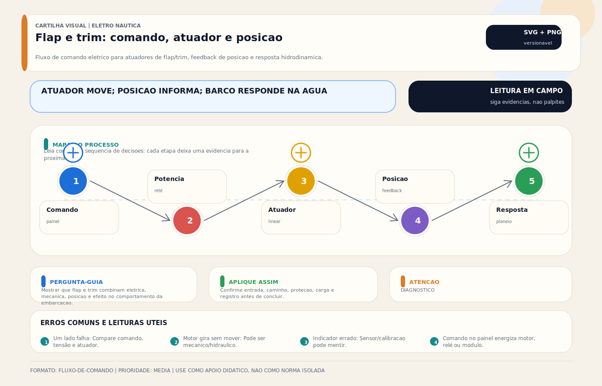

# Flap

> [!abstract] Resumo técnico
> O flap, ou `trim tab`, corrige atitude longitudinal e transversal da embarcação. Seu desempenho depende da superfície hidrodinâmica, do atuador, do comando e da simetria do sistema. Muitos problemas de flap são interpretados como defeito do casco ou do motor, quando a origem está no controle ou no atuador. Em sistemas eletro-hidráulicos, fluido correto e sangria adequada também determinam resposta e vida útil.

> [!tip] TL;DR — Regra de decisão em 30 segundos
> 1. **Flap ≠ interceptor ≠ trim do motor** — confundir destrói diagnóstico. Flap é superfície em ângulo; interceptor é lâmina vertical rápida; trim do motor muda ângulo do propulsor.
> 2. **Três arquiteturas dominantes** — (a) elétrico com atuador linear (Lenco Electromechanical, Volvo Penta PowerTrim); (b) eletro-hidráulico com HPU dedicado (Bennett Hydraulic); (c) interceptor eletromecânico (Humphree, Zipwake, Lenco EdgeMount).
> 3. **Em sistema eletro-hidráulico, fluido importa** — Bennett Hydraulic usa ATF Dexron III/VI ou HPU Oil proprietário; usar óleo industrial errado reduz vida útil e pode atacar vedação.
> 4. **Simetria é requisito, não desejo** — diferença de curso > 5-10% entre bombordo/boreste muda comportamento de planeio e vira risco de segurança em mar agitado.
> 5. **Popa é ambiente classe IP67/IP68** — atuadores precisam de selagem marine; atuador "industrial" barato sobrevive uma temporada.
> 6. **Corrosão galvânica é inimigo #1** — anodos, bonding (ABYC H-3), e material compatível (Inox 316L, bronze naval) são mandatórios.
> 7. **Queda de tensão no atuador é a causa mais subestimada** — popa fica longe do banco; calibre correto e conexões estanques mudam o diagnóstico de "atuador fraco".
> 8. **Interceptor responde mais rápido que flap clássico** — Humphree/Zipwake operam em décimos de segundo; viram sistema de estabilização dinâmica, não só trim.
> 9. **Sistema automático exige IMU/sensor + lógica** — não confundir `auto trim` com `stabilization`; primeiro corrige atitude média, segundo corrige rolagem dinâmica.

> [!danger] Quando chamar um especialista (9 cenários)
> 1. **Flap sobe de um lado só em mar agitado** — risco de adernamento em planeio; parar de usar o sistema, reduzir velocidade e investigar (atuador, relé, cabo ou comando).
> 2. **Óleo leitoso/branco em HPU Bennett** — água entrou no circuito; não operar, risco de corrosão interna e falha do atuador em minutos.
> 3. **Atuador hidráulico cedendo posição com motor parado** — vedação do cilindro comprometida; flap pode descer por gravidade em marcha, alterando comportamento sem comando.
> 4. **Corrosão visível no atuador ou chicote de popa** — especialmente em atuadores "elétricos residenciais" não-marine; risco de curto com motor em 12/24V e entrada de água.
> 5. **Interceptor Humphree/Zipwake com erro de calibração persistente** — sistema com IMU pode operar em modo degradado sem indicação clara; revisão por técnico certificado é mandatória.
> 6. **Soft-start/fim de curso não atuando** — motor continua forçando ao final do curso; pode queimar motor, quebrar fuso ou rasgar vedação em horas de operação.
> 7. **Adernamento de regime + flap "chegando ao limite" continuamente** — indica problema maior (distribuição de carga, casco, propulsão); flap compensando sempre é sintoma, não solução.
> 8. **Retrofit de flap em casco que não foi projetado para receber** — estrutura de popa pode ser insuficiente; análise por engenheiro naval antes de perfurar.
> 9. **Perícia pós-incidente (virada, abalroamento)** — não tocar no sistema; fotografar posição dos flaps, estado de conexões e HPU; evidência crítica para investigação.

## O que é

Flap é a superfície ativa instalada normalmente na popa para influenciar a atitude da embarcação em navegação.

O sistema pode ser:

- elétrico (atuador linear com fuso/motor DC);
- eletro-hidráulico (HPU central + cilindros);
- baseado em interceptores eletromecânicos (lâmina vertical de curso curto, alta velocidade).

## O que ele faz de fato

O flap ajuda a:

- corrigir adernamento (roll);
- ajustar atitude longitudinal (pitch/trim);
- melhorar transição para planeio em determinadas condições;
- otimizar conforto, estabilidade e, em alguns casos, eficiência operacional (consumo).

Ele não substitui:

- distribuição correta de carga;
- trim do propulsor;
- escolha adequada de hélice;
- projeto hidrodinâmico do casco;
- em mar agitado grave, estabilizador ativo (giroscópio ou aletas).

## Flap, interceptor e trim do motor

Esses sistemas são relacionados, mas não iguais.

- `flap` clássico (Bennett, Lenco, Volvo Penta QL) — placa angulada que projeta superfície horizontal abaixo do fluxo;
- `interceptor` (Humphree, Zipwake, Lenco EdgeMount) — lâmina vertical que penetra brevemente no fluxo; reage em décimos de segundo;
- [[Motor de Trim - Tilt]] — atua no ângulo do propulsor, não na atitude hidrodinâmica do casco.

Misturar os conceitos atrapalha diagnóstico e projeto.

## Arquitetura do sistema

Os elementos principais costumam ser:

- superfície hidrodinâmica (placa de flap ou lâmina de interceptor);
- atuador ou unidade hidráulica (atuador linear elétrico, cilindro hidráulico, ou atuador de interceptor);
- HPU (Hydraulic Power Unit) em sistemas hidráulicos;
- comando no painel (switch simples, joystick, ou controle automático com IMU);
- alimentação, proteção (fusível ou disjuntor DC) e bonding;
- eventualmente indicação de posição, sensor de curso, ou controle automático integrado.

## Atuador e controle

O atuador precisa:

- gerar curso suficiente (tipicamente 6-14 polegadas para flap clássico);
- resistir ao ambiente de popa (IP67/IP68, material marine-grade);
- manter simetria funcional entre bombordo e boreste (≤ 5-10% de desvio de curso);
- trabalhar dentro do `duty cycle` (intermitente, raramente contínuo);
- ter proteção coerente de circuito (fusível calibrado ao stall current do motor).

Falha de um lado muda a leitura de pilotagem e pode ser confundida com problema de casco ou distribuição.

## Fluido hidráulico e manutenção (quando aplicável)

Para sistemas eletro-hidráulicos tipo Bennett Hydraulic:

- **Fluido recomendado pelo fabricante** — Bennett HPU Oil (proprietário), OU ATF Dexron III/VI como alternativa aprovada;
- **NÃO usar** — óleo de motor (SAE 15W-40), óleo hidráulico industrial genérico (HLP 32 pode divergir em aditivação anti-espuma e compatibilidade de vedação), ou fluidos de freio;
- **Volume típico** — reservatório de 200-500 ml no HPU;
- **Inspeção** — nível a cada 6-12 meses; aparência (transparente, âmbar claro) e ausência de contaminação visível;
- **Troca** — conforme manual do fabricante (Bennett recomenda a cada 3-5 anos ou quando contaminado);
- **Sangria** — necessária após troca de fluido ou após vazamento significativo para evitar ar no sistema.

Para sistemas puramente elétricos (Lenco Electromechanical, Volvo Penta PowerTrim):

- não há fluido hidráulico a considerar;
- lubrificação do fuso é interna, selada, geralmente não demanda intervenção;
- manutenção elétrica (conexões, cabo, fusível, chicote) é o foco.

Ver também:

- [[Óleos Hidráulicos Marine — Guia Completo]]

## Ambiente severo

Popa é região agressiva por:

- imersão e spray (salinidade, umidade constante);
- vibração (motor, passagem do fluxo);
- corrosão galvânica e química;
- eletrólise (quando bonding e anodos falham);
- incrustação (cracas, algas);
- exposição UV (em componentes acima da linha d'água).

Logo, flap exige boa instalação e inspeção periódica.

## Falhas mais comuns

As falhas recorrentes são:

- um lado operando e o outro não (atuador, relé ou cabo);
- movimento lento (queda de tensão, atuador fatigado, contaminação hidráulica);
- assimetria de curso progressiva (fins de curso ou atuador degradado);
- travamento mecânico (corrosão no fuso, sal cristalizado);
- corrosão em chicote e conexões (falta de vedação);
- perda de resposta por atuador degradado (desgaste, perda de torque);
- confusão entre problema de flap e problema de trim do propulsor;
- vazamento em sistema hidráulico (vedação de cilindro, conexão do HPU);
- falha de fim de curso permitindo motor forçar além do curso mecânico.

## Diagnóstico profissional

Perguntas certas:

1. O atuador recebe comando e alimentação corretos (tensão medida sob carga, não em repouso)?
2. O curso é simétrico entre os lados (medir fisicamente, não só pela resposta visual)?
3. O problema é elétrico, hidráulico ou mecânico?
4. O efeito na navegação corresponde ao movimento observado?
5. O fluido hidráulico (se aplicável) está em nível, limpo e sem contaminação?
6. As conexões elétricas, fusíveis e relés estão íntegros?

Ensaios úteis:

- observar curso real dos dois lados com régua ou paquímetro;
- medir tensão e corrente durante acionamento (`stall current` vs corrente nominal);
- inspecionar fixações, vedações e chicote;
- verificar se o comando está reversível e coerente;
- comparar resposta em navegação com resposta mecânica em repouso;
- em sistema hidráulico: verificar nível, cor, odor e presença de espuma no reservatório.

## Boas práticas

- inspecionar ambos os lados como sistema pareado;
- proteger chicote e conexões de popa (grau IP adequado, termo-retrátil, vaseline náutica);
- manter comando claro e sem ambiguidade (indicador de posição quando possível);
- separar, no diagnóstico, flap de trim do motor e de estabilização ativa;
- revisar periodicamente fixações e sinais de corrosão;
- seguir manual do fabricante para fluido, sangria e fim de curso;
- integrar flap ao plano de bonding e anodos (ABYC H-3).

## Erros comuns

- achar que qualquer adernamento é "só flap";
- substituir atuador sem testar comando e alimentação;
- ignorar corrosão de popa;
- operar com um lado claramente fora de curso;
- tratar sistema automático e sistema manual como se fossem equivalentes;
- usar fluido errado em sistema hidráulico (óleo de motor, fluido de freio, HLP industrial);
- instalar atuador não-marine em substituição ao original;
- ignorar bonding e anodos na instalação de novo conjunto.

## Normas aplicáveis

### 1. Padrão primário de recreio (EUA/ABYC)

- **ABYC A-16** — Electrical Safety (low-voltage DC circuits, proteção de circuito de flap);
- **ABYC E-11** — AC and DC Electrical Systems on Boats (dimensionamento de cabo, proteção por fusível/breaker);
- **ABYC H-3** — Boat Hull Maintenance (bonding de apêndices de popa incluindo flaps);
- **ABYC P-24** — Electric Propulsion Systems (quando flap/interceptor integra com sistema de direção eletrônica).

### 2. Padrão internacional (ISO)

- **ISO 10133:2017** — Extra-low-voltage DC installations (circuito de alimentação);
- **ISO 13297:2020** — AC installations (quando componentes compartilham infra AC);
- **ISO 16315:2016** — Electric propulsion system (referência para sistemas integrados);
- **ISO 12215** — Hull construction and scantlings (reforço estrutural para apêndices).

### 3. Proteção ambiental e ignição (contexto)

- **IEC 60529:2013** — Degrees of protection (IP Code): tipicamente IP67/IP68 para atuadores expostos;
- **IEC 60068-2-11** — Salt mist testing;
- **ISO 8846:1990** — Small craft — Electrical devices — Protection against ignition of surrounding flammable gases;
- **UL 1500** — Ignition-Protected Marine Products;
- **SAE J1171** — Marine Ignition Protection.

### 4. Fluidos hidráulicos (sistema eletro-hidráulico)

- **ISO 3448:1992** — ISO viscosity classification;
- **ISO 11158:2023** — Hydraulic fluids Family H;
- **Dexron III/VI** — GM ATF specification (uso Bennett Hydraulic);
- **Mercon V** — Ford ATF specification;
- **NBR 11213:2020** — Óleos hidráulicos — classificação.

### 5. Brasil (Marinha/ABNT)

- **NORMAM-01/DPC** — Embarcações em mar aberto;
- **NORMAM-03/DPC** — Embarcações em navegação interior;
- **NBR 14134:2015** — Óleos lubrificantes — Terminologia.

### Tabela comparativa por jurisdição

| Aspecto | EUA (ABYC/NMMA) | Internacional (ISO) | Brasil (Marinha/ABNT) |
|---|---|---|---|
| Circuito DC | ABYC E-11, ABYC A-16 | ISO 10133:2017 | NORMAM (referencia ABYC) |
| Bonding/anodos | ABYC H-3 | ISO 13297 | NORMAM |
| Grau IP | — | IEC 60529 (IP67/IP68) | NBR adota IEC |
| Ignition protection | UL 1500, SAE J1171 | ISO 8846 | NORMAM (referencia) |
| Fluido hidráulico (HPU) | Dexron/Mercon (OEM) | ISO 11158 | NBR 11213 |

## Glossário rápido

- **Flap / Trim tab** — placa horizontal articulada na popa que modifica fluxo e atitude da embarcação.
- **Interceptor** — lâmina vertical de curso curto, alta velocidade (Humphree, Zipwake, Lenco Edge).
- **Trim do motor** — ângulo do propulsor (outboard/stern drive); afeta atitude mas é diferente de flap.
- **HPU (Hydraulic Power Unit)** — unidade de potência hidráulica: bomba + motor + reservatório + válvulas.
- **Atuador linear** — conjunto motor DC + fuso + tubo que converte rotação em movimento linear.
- **Fuso / lead screw** — elemento rosqueado que converte rotação em translação.
- **Cilindro hidráulico** — pistão com pressão hidráulica; dupla ação (pressão nos dois sentidos) ou simples ação.
- **Curso (stroke)** — deslocamento total do atuador (tipicamente 6-14 polegadas / 150-350 mm).
- **Fim de curso (limit switch)** — sensor que desarma o motor ao final do curso mecânico.
- **Duty cycle** — tempo ligado / tempo total; atuadores de flap são tipicamente intermitentes.
- **Stall current** — corrente máxima quando motor está bloqueado; base para dimensionamento de fusível.
- **Queda de tensão** — redução de tensão entre banco e carga devido à resistência do cabo (ABYC recomenda ≤ 3%).
- **Simetria** — igualdade de curso entre bombordo e boreste; essencial para navegação.
- **IMU (Inertial Measurement Unit)** — sensor de atitude (acelerômetro + giroscópio); usado em flap automático e interceptor.
- **Roll** — rolagem (adernamento lateral).
- **Pitch / Trim** — atitude longitudinal (proa para cima ou para baixo).
- **Planeio** — regime hidrodinâmico em que a embarcação "pula" sobre a água, reduzindo resistência.
- **ATF (Automatic Transmission Fluid)** — fluido específico (Dexron, Mercon); usado em Bennett Hydraulic e em reversores.
- **Dexron III/VI** — especificações GM de ATF (III obsoleta, VI atual).
- **HLP** — óleo hidráulico industrial anti-wear (DIN 51524-2); NÃO é equivalente direto de ATF em Bennett.
- **Sangria (bleeding)** — remoção de ar do circuito hidráulico após troca de fluido.
- **Vedação NBR / Viton** — elastômeros de vedação; NBR é padrão em hidráulica mineral, Viton resiste a temperaturas maiores.
- **Bonding** — interligação elétrica de metais submersos para evitar corrosão galvânica (ABYC H-3).
- **Anodo sacrificial** — zinco/alumínio/magnésio que corrói preferencialmente, protegendo outros metais.
- **Corrosão galvânica** — processo eletroquímico em metais dissimilares em contato com eletrólito.
- **Eletrólise** — corrosão acelerada por corrente elétrica parasita no meio.
- **IP67/IP68** — grau de proteção contra poeira e imersão (IEC 60529); padrão marine para atuadores.
- **Inox 316L** — aço inoxidável austenítico com molibdênio; alta resistência em água salgada.
- **Bronze naval** — liga de cobre + estanho (+ zinco em algumas), resistente à corrosão marine.
- **Fusível ignition-protected** — fusível testado para não gerar centelha capaz de inflamar gases (UL 1500, ISO 8846).
- **Auto Trim** — modo automático que corrige atitude longitudinal média.
- **Stabilization dinâmica** — correção ativa de rolagem em tempo real (interceptor rápido, estabilizador).
- **Interceptor Humphree** — sistema com IMU e controle automático de atitude/estabilização.
- **Zipwake** — sistema de interceptores dinâmicos com IMU integrada.
- **Bennett Hydraulic** — fabricante tradicional de trim tabs eletro-hidráulicos.
- **Lenco** — fabricante de trim tabs eletromecânicos (mais comuns nas últimas décadas).
- **Retrofit de flap** — instalação em embarcação que não veio de fábrica com o sistema; requer avaliação estrutural.

## Visual didático

Mostrar que flap e trim combinam eletrica, mecanica, posicao e efeito no comportamento da embarcacao.

**Cautela:** Procedimentos e limites dependem do sistema instalado, fabricante e tipo de casco/motor.

Material de apoio: [Flap e trim: comando, atuador e posicao](../_visuals/generated/flap-trim-atuadores-posicao.md)

## Integração com outras notas

- [[Óleos Hidráulicos Marine — Guia Completo]]
- [[Motor de Trim - Tilt]]
- [[Estabilizador]]
- [[Plataforma de Popa Elétrica - Hidráulica]]
- [[Atuador Linear]]
- [[Relés e Relés de Estado Sólido]]
- [[Fusíveis DC — Proteção Contra Sobrecorrente]]
- [[Troubleshooting — Diagnóstico de Falhas Elétricas]]

## Perguntas que esta nota responde

- Como flap difere de trim do motor e de estabilizador?
- Onde nasce a assimetria de resposta do sistema?
- Como diagnosticar flap com rigor técnico?
- Qual fluido usar em Bennett Hydraulic ou equivalente eletro-hidráulico?
- Quando preferir interceptor em vez de flap clássico?
