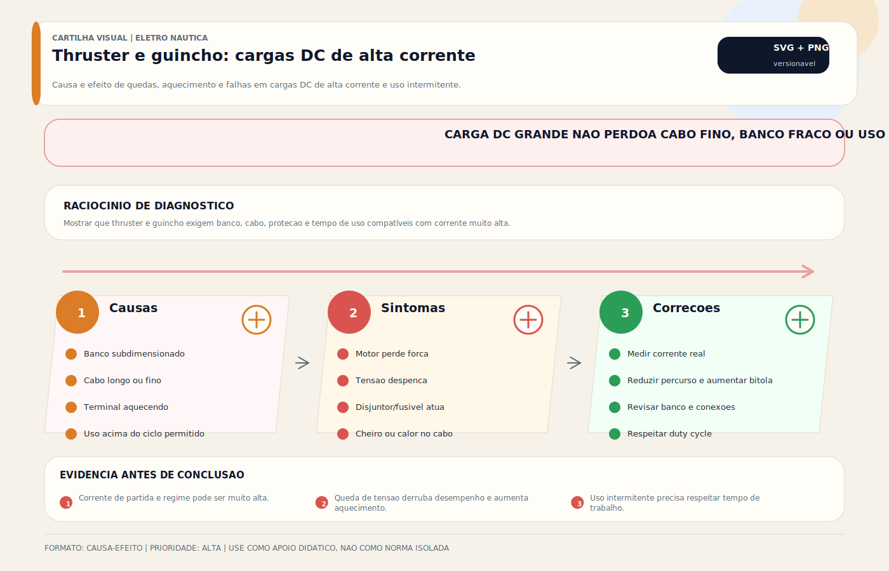

# Thruster

> [!tip] TL;DR — Regra de decisão em 30 segundos
> 1. **Thruster é carga transitória de altíssima corrente**, não propulsão contínua. Pensa em 500 A a 1.200 A de pico em sistemas de 12/24 V por 3 a 10 segundos por manobra.
> 2. **Queda de tensão no circuito é o inimigo número 1**: 0,3 V de queda em 24 V já degrada empuxo em 5–8%. Alvo realista: menos de 3% de queda do banco ao motor do thruster na corrente de pico.
> 3. **Banco dedicado na proa resolve 80% dos problemas** de thruster "fraco" ou "que corta". Cabo curto, dedicado, de seção generosa — tipicamente 2/0 AWG (70 mm²) a 4/0 AWG (120 mm²) para thrusters de 3–10 kW.
> 4. **Duty cycle do fabricante não é sugestão**: tipicamente S2 de 3–4 minutos **ou** 10% de ciclo. Exceder isso derrete solenoide, queima enrolamento e funde o eixo.
> 5. **Thruster elétrico (banho de óleo) × thruster hidráulico (HPU central) × thruster AC (PMAC com variador)** resolvem problemas diferentes. Abaixo de ~25 m, DC elétrico domina. Acima, hidráulico ou AC com variador ganham escala.
> 6. **Óleo da caixa de engrenagem submersa** é gear oil SAE 75W-90 GL-4 ou GL-5 **ou fluido proprietário do fabricante** (Sleipner, Vetus, Lewmar, Quick têm recomendações distintas). Nunca usar ATF ou óleo de motor.
> 7. **Thruster hidráulico opera com ISO VG 32 HLP/HVLP** (clima temperado) ou **ISO VG 46 HVLP** (clima tropical) no reservatório central. Ver [[Óleos Hidráulicos Marine — Guia Completo]].
> 8. **Contator (solenoide reversor) é o ponto mais frágil** do sistema elétrico. Solda dos contatos pode deixar o thruster ligado sozinho — cenário de colisão.
> 9. **Empuxo (kgf) tem que casar com porte e vento/maré da região operacional**. Comprar o thruster mais potente não substitui projeto; pode destruir o cabeçote e o túnel.

> [!danger] Quando chamar um especialista — 9 cenários
> 1. **Thruster liga sozinho** (sem acionamento) — contator com contatos soldados. Manobra de emergência: desligar a chave geral do thruster. **Risco de colisão iminente**. Trocar contator antes de reativar.
> 2. **Banco do thruster faz o BMS de lítio cortar** no primeiro acionamento do dia — pico de corrente excede limite de descarga do BMS. Pode ser subdimensionamento do banco, BMS mal parametrizado, ou thruster tentando partir com capacitância morta. Engenharia.
> 3. **Thruster aquece, cheira queimado ou fumaça sai do cabeçote** — enrolamento ou solenoide degradados. **NÃO religar**. Desenergizar, medir resistência de isolamento, abrir cabeçote.
> 4. **Óleo na caixa submersa está leitoso** (emulsionado) — selo do eixo falhando, água entrou. Trocar selo e óleo antes de próxima temporada. Continuar operando destrói rolamento e eixo.
> 5. **Thruster hidráulico com PCU/HPU superaquecendo ou ruído anormal** — pode ser cavitação, óleo contaminado, filtro saturado, válvula proporcional com deriva. Parar e analisar óleo (ISO 4406), trocar filtro, inspecionar válvulas.
> 6. **Queda de tensão medida no thruster > 10% da nominal** durante acionamento — cabo subdimensionado, conexões oxidadas ou terminal mal crimpado. Risco de incêndio por aquecimento concentrado. Inspeção térmica e refazer conexões.
> 7. **Thruster retrátil (retractable) não desce ou não sobe completamente** — atuador hidráulico ou sinfim elétrico com falha; sensor fim-de-curso degradado. Nunca forçar; risco de arrancar o suporte.
> 8. **Hélice do thruster danificada** (pá partida, rotor empenado) — desbalanceamento gera vibração que destrói rolamentos e selos em poucas manobras. Troca imediata de hélice.
> 9. **Perícia em avaria de manobra** (batida em marina, colisão com cais) envolvendo thruster — laudo técnico deve reconstituir tempo de uso, tensão no pico, histórico de manutenção do contator e da hélice. Documentação completa é essencial para seguro e responsabilização.

## O que é

`Thruster` é o propulsor auxiliar destinado a gerar **empuxo lateral** para manobras em velocidade baixa ou nula, onde o leme não tem fluxo suficiente para governar a embarcação. Substitui o uso da hélice principal e do leme em atracações, desatracações, marina crowded, esclusa e manobras em espaço confinado.

**Arquiteturas fundamentais:**

- **Localização:** `bow thruster` (proa), `stern thruster` (popa), `dual thruster` (proa + popa para rotação em torno do centro).
- **Instalação:** em `túnel transversal` (tunnel thruster), `externo retrátil` (retractable, drop-down), `externo pod` (para barcos sem túnel possível).
- **Acionamento:** elétrico DC (12 V/24 V/48 V), elétrico AC (trifásico com variador), ou hidráulico (HPU central alimentando motor hidráulico).
- **Controle:** botão simples momentâneo, joystick proporcional, integração com sistema de manobra assistida (DPS — Dynamic Positioning System em escala leve, iAnchor, SkyHook).

**Tipologia por potência:**

| Porte | Empuxo típico | Tecnologia dominante |
|---|---|---|
| Embarcação 8–12 m | 25–55 kgf | DC 12 V elétrico tunnel |
| Iate 12–18 m | 55–110 kgf | DC 24 V elétrico tunnel |
| Iate 18–25 m | 110–220 kgf | DC 24/48 V ou AC elétrico |
| Iate 25–40 m | 220–500 kgf | AC com variador ou hidráulico |
| Mega-yacht 40 m+ | 500 kgf a 2.500 kgf | Hidráulico com HPU dedicada |

## Famílias e fabricantes

### Elétricos DC — mercado de lazer e semipro

- **Sleipner / Side-Power (Noruega)** — referência mundial em tunnel thrusters DC e AC. Linhas SE, SX, SEP, S-link.
- **Vetus (Holanda)** — BOW PRO, Rimdrive (sem túnel), retrátil. Óleo proprietário Vetus Marine Gear Oil para a caixa submersa.
- **Lewmar (Reino Unido)** — linha TT (Tunnel Thruster) 140, 185, 250 TT. Muito comum em veleiros.
- **Quick (Itália)** — BTQ, BTR (retrátil), BTRH (hidráulico). Forte no mercado italiano e europeu de barco a motor.
- **Max Power (França)** — CT35, CT60, CT100 e séries profissionais.
- **Yacht Controller / Dockmate** — controle remoto do thruster (integram com qualquer marca).

### Elétricos AC / Hidráulicos — mercado pro e mega-yacht

- **American Bow Thruster (ABT) — TRAC** — linha profissional, hidráulico e elétrico AC.
- **Wesmar** — thrusters pro hidráulicos e comerciais.
- **Schottel** — azimutais e de túnel comerciais (offshore, passageiros).
- **Jastram** — thruster hidráulico profissional, inclusive de alta potência.
- **Kongsberg / Rolls-Royce Marine** — de classe comercial e naval, para navios.

### Nota sobre retráteis e pods externos

Thrusters retráteis (Sleipner SEP, Max Power retrátil, Vetus Rimdrive não-retrátil mas externo) são obrigatórios quando não há espaço estrutural para túnel. Atuador de descida/subida pode ser hidráulico ou eletromecânico (sinfim). Este é um **segundo subsistema** — com fluido, sensores, rolamentos e falhas próprias — que duplica a superfície de manutenção.

## O que realmente define o desempenho

O desempenho final do thruster **não depende só do motor**. Depende da pilha completa:

1. **Compatibilidade empuxo × porte × condições operacionais** — thruster subdimensionado para vento de través não resolve; superdimensionado para o banco disponível queima o BMS.
2. **Qualidade da instalação hidrodinâmica** — túnel com bordas afiadas perde 15–25% de empuxo por cavitação. Bocais arredondados e grade hidrodinâmica são críticos.
3. **Capacidade do banco ou fonte de energia** — banco precisa fornecer pico de corrente sem afundar a tensão.
4. **Queda de tensão no circuito** — cabo, conexão, contator, interconexão entre baterias.
5. **Condição dos contatores e comandos** — oxidação, arco voltaico, desgaste dos contatos.
6. **Respeito ao regime de uso** — duty cycle do fabricante, limite térmico do motor.
7. **Estado do conjunto mecânico** — hélice, eixo, rolamento, selo, óleo da caixa.
8. **Estado do túnel** — incrustação, objetos presos, corrosão do material.

É um erro comum discutir thruster apenas em termos de "kgf" ou potência nominal.

## Arquitetura elétrica (versões DC)

### Dimensionamento típico por porte

| Empuxo | Potência ~ | Tensão | Corrente de pico | Seção cabo típica (banco→thruster, 3 m ida+volta) |
|---|---|---|---|---|
| 55 kgf | 4 kW | 12 V | 450–550 A | 2/0 AWG (70 mm²) |
| 75 kgf | 5,5 kW | 12 V | 600–700 A | 3/0 AWG (85 mm²) |
| 110 kgf | 6 kW | 24 V | 400–500 A | 1/0 AWG (50 mm²) |
| 220 kgf | 10 kW | 24 V | 700–850 A | 4/0 AWG (120 mm²) |
| 220 kgf | 10 kW | 48 V | 350–450 A | 1/0 AWG (50 mm²) |

> **Regra prática:** cada 1 metro adicional de percurso ida+volta exige ~10% a mais de seção de cabo para manter a mesma queda de tensão. Banco na popa alimentando thruster na proa de um barco de 15 m significa 30+ metros de cabo — inviável em DC 12 V ou 24 V sem perdas brutais.

### Princípio do banco dedicado

A razão técnica para banco dedicado próximo ao thruster não é comercial; é física:

- Reduz o percurso de corrente alta (cabo mais curto = menos queda de tensão e menos custo).
- Protege o restante da arquitetura (outros consumidores sensíveis não sofrem o afundamento transitório de tensão).
- Simplifica proteção (fusível Class T ou MRBF dedicado próximo ao banco).
- Isola falhas — curto no thruster não afeta o banco principal.

Quando compartilhar banco é aceitável? Apenas se:

- Corrente de pico for pequena frente à capacidade do banco (tipicamente pico ≤ 2C).
- BMS (se lítio) aceitar o pico sem derating agressivo.
- Cabos principais suportarem o somatório de correntes (thruster + outros consumidores).
- Outros equipamentos sensíveis (navegação, ECU) estejam em barramento estabilizado.

### Contator (solenoide reversor)

O **contator bipolar de inversão** é o componente mais estressado do sistema:

- Chaveia correntes de 500+ A sob carga indutiva.
- Gera arco voltaico a cada abertura.
- Sofre desgaste mecânico dos polos.
- Pode **soldar** os contatos (thruster fica ligado sozinho).
- Pode **corroer** os contatos (thruster não liga ou liga intermitente).

Contator queimado é a causa de falha #1 em thrusters elétricos após 5–10 anos de uso. Substituição periódica preventiva (a cada 5 anos ou 1.000 ciclos, o que vier primeiro) é boa prática.

### Proteção

- **Fusível Class T** ou **MRBF** no positivo, dimensionado para 125–150% da corrente de pico.
- **Chave geral dedicada** no banco do thruster (desligamento manual para manutenção e emergência).
- **Proteção térmica** do motor (integrada ao cabeçote) — corta em sobretemperatura.
- **Fim-de-curso** em thrusters retráteis — evita arrancar o suporte na descida/subida.

Ver também:

- [[Bancos de Bateria]]
- [[BMS — Battery Management System]]
- [[Dimensionamento de Cabos DC — Cálculo Prático]]
- [[Fusíveis DC — Proteção Contra Sobrecorrente]]

## Arquitetura hidráulica (mega-yacht e comercial)

### Quando faz sentido ir para hidráulico

- Thrusters de **potência > 15 kW contínuo** (empuxo > 300 kgf).
- Embarcações onde **já existe HPU central** para outras cargas (flap, estabilizador, guincho, plataforma, passarela).
- Necessidade de **duty cycle alto** (DPS, posicionamento dinâmico leve).
- Instalações onde o **peso do cabo DC** seria proibitivo.

### Circuito típico

1. **HPU (Hydraulic Power Unit)** central, geralmente no motor room ou em compartimento dedicado — eletroválvula ou motor diesel dedicado acionando bomba de pistão variável (load-sensing).
2. **Reservatório de óleo hidráulico** com capacidade 1,5–2× o volume do sistema em circulação; respiro com filtro, visor de nível, temperatura.
3. **Linhas de pressão e retorno** com mangueiras flexíveis certificadas (SAE 100R13 ou R15 para altas pressões) ou tubulação de aço inox.
4. **Válvula proporcional direcional** (controle de vazão + direção) no túnel, próxima ao motor hidráulico.
5. **Motor hidráulico** (tipicamente motor de pistão axial ou gerotor) acionando a hélice via caixa de engrenagem reduzida.
6. **Filtros** em sucção, pressão e retorno (β ≥ 200 para 10 μm).

### Óleo hidráulico recomendado

Ver [[Óleos Hidráulicos Marine — Guia Completo]] para detalhamento completo. Em síntese para thruster hidráulico:

| Condição | Óleo recomendado | Troca |
|---|---|---|
| Clima temperado, uso moderado | ISO VG 32 HLP (DIN 51524-2) | 2.000 h ou 2 anos |
| Clima tropical (Brasil, Caribe) | ISO VG 46 HVLP (DIN 51524-3) | 1.500 h ou 2 anos |
| Uso comercial intenso (charter) | ISO VG 46 HVLP premium + análise a cada 500 h | Análise-based |
| Risco de incêndio (área naval/comercial) | HFC ou HFDU (água-glicol ou éster fosfato) | Conforme ISO 12922 |

**Parâmetros críticos:**

- Viscosidade cinemática a 40 °C: 32 ou 46 cSt conforme seleção.
- VI ≥ 140 (HVLP) para ampliar faixa térmica.
- Nível de limpeza ISO 4406: **21/19/16 mínimo, alvo 18/16/13** para servo-válvulas proporcionais.
- Desaeração rápida (≤ 5 min por ISO 9120).
- Resistência à oxidação (TOST ≥ 2.500 h por ASTM D943).

### Óleo da caixa de engrenagem submersa (também em versões elétricas)

Quase todos os thrusters (elétricos ou hidráulicos) têm uma **caixa de engrenagem reduzida submersa** que converte rotação alta do motor em rotação baixa da hélice com alto torque. Essa caixa é banhada em óleo gear separado do sistema hidráulico principal:

| Fabricante | Óleo recomendado | Capacidade aprox. | Troca |
|---|---|---|---|
| Sleipner / Side-Power | Fluido proprietário Sleipner Gear Oil (ou SAE 80W-90 GL-5 equivalente) | 0,3–1,5 L (por modelo) | 200 h ou 1 ano |
| Vetus | Vetus Marine Gear Oil (SAE 75W-90 GL-5 equivalente) | 0,5–2,0 L | 200 h ou 1 ano |
| Lewmar TT | SAE 90 GL-5 ou fluido recomendado no manual | 0,5–1,5 L | 200 h ou 1 ano |
| Quick BTQ | Óleo ATF + GL-5 conforme modelo (ver manual) | 0,4–1,8 L | 200 h ou 1 ano |
| ABT-TRAC hidráulico | Gear oil SAE 90 GL-5 ou gear oil ISO VG 220 industrial | 2–8 L | 500 h ou 2 anos |

> [!warning] Nunca use ATF (Dexron) em caixa de thruster que pede GL-5
> ATF não tem extrema pressão para engrenagem hipóide. Em 100–200 h ocorre desgaste catastrófico do dentado. Use exclusivamente o fluido do fabricante ou gear oil GL-5 SAE 75W-90 ou SAE 80W-90.

## Duty cycle e limite térmico

Thruster **não é propulsão contínua**. Os fabricantes especificam duty cycle em duas formas:

- **S2 (operação de curta duração)** — tempo máximo contínuo antes de resfriamento obrigatório. Tipicamente 3 a 4 minutos.
- **S3 (operação intermitente)** — percentual de tempo ligado em um ciclo de 10 minutos. Tipicamente 10%, ou seja, 1 minuto ligado / 9 minutos parado.

O uso além do permitido causa:

- **Aquecimento do motor** — enrolamento perde isolação (classe F tipicamente, tolera 155 °C).
- **Aquecimento do solenoide/contator** — descarbonização, soldagem.
- **Queda de desempenho progressiva** (motor quente tem rendimento pior).
- **Desgaste elétrico e mecânico acelerado**.
- **Aumento de risco de falha catastrófica** (queima de enrolamento, incêndio).

Thrusters com **proteção térmica integrada** desligam automaticamente em sobretemperatura. Thrusters sem proteção (versões antigas ou econômicas) dependem inteiramente da disciplina do operador.

## Interface mecânica e hidrodinâmica

Mesmo com circuito elétrico impecável, o desempenho cai se houver:

- **Incrustação biológica no túnel** (cracas, algas) — reduz a área hidrodinâmica efetiva. Inspeção e limpeza semestral.
- **Incrustação na hélice** — reduz empuxo drasticamente.
- **Túnel mal dimensionado** — comprimento ideal L/D ≈ 1,5 a 2,0 (L = comprimento do túnel, D = diâmetro). Fora desse range, há perdas por cavitação ou recirculação.
- **Bordas do túnel não arredondadas** — geram cavitação e ruído.
- **Grade (grating) excessivamente restritiva** — perda de 10–20% de empuxo.
- **Folga excessiva entre hélice e parede** — recirculação, perda de eficiência.
- **Hélice ou conjunto danificados** — desbalanceamento, vibração, destruição de rolamento.
- **Entrada de água no cabeçote** — selo do eixo comprometido; leva a corrosão do eixo, rolamento e enrolamento.

## Falhas mais comuns

1. **Queda de tensão excessiva** no pico — thruster gira devagar, empuxo fraco. Causa: cabo subdimensionado, banco fraco, conexões oxidadas.
2. **Banco incapaz de sustentar o pico** — tensão cai abaixo de 10,5 V (12 V) ou 21 V (24 V), thruster entra em low-voltage shutdown.
3. **BMS de lítio limitando descarga** — pico de corrente excede o limite programado.
4. **Contator fatigado** — não liga, liga intermitente, ou soldou e fica ligado.
5. **Degradação mecânica no conjunto propulsor** — hélice danificada, rolamento gasto, selo com vazamento.
6. **Uso acima do duty cycle** — queima de solenoide ou enrolamento.
7. **Óleo da caixa emulsionado** — água entrou pelo selo, destruição da engrenagem.
8. **Túnel obstruído** — saco plástico, corda, incrustação pesada.
9. **Falsa expectativa de desempenho** — thruster subdimensionado para o porte ou para a condição de vento/maré.

## Diagnóstico profissional

### Perguntas essenciais

1. A tensão **medida no thruster** durante a manobra permanece aceitável (≥ 11 V em 12 V, ≥ 22 V em 24 V)?
2. O banco ou fonte de energia suporta o pico real sem afundar?
3. Os contatores e conexões estão íntegros (sem oxidação, aquecimento, ruído de arco)?
4. O óleo da caixa submersa está limpo (âmbar, sem emulsão)?
5. O problema é elétrico, mecânico ou de dimensionamento?

### Ensaios úteis

- **Medir tensão diretamente no thruster** durante acionamento com voltímetro True RMS ou osciloscópio (registrar transient).
- **Medir corrente real** com alicate DC (Hall effect) — comparar com spec do fabricante.
- **Inspeção termográfica** de cabos, conexões e contatores após acionamento.
- **Verificar histórico de corte de BMS** ou fusível queimado (loggar eventos).
- **Inspeção subaquática do túnel** — limpeza e estado da hélice.
- **Análise de óleo da caixa submersa** (a cada troca) — presença de água, partículas metálicas, coloração.

## Boas práticas

- **Projetar o sistema completo**, não apenas comprar o equipamento. Dimensionar banco, cabo, proteção, contator, óleo — como um conjunto.
- **Encurtar ao máximo o percurso de alta corrente** — banco dedicado próximo ao thruster quase sempre compensa em material e desempenho.
- **Validar banco e BMS com margem realista** — pico de thruster + margem de 30%.
- **Respeitar o duty cycle** — treinar operador, considerar delay-timer entre acionamentos em sistemas críticos.
- **Incluir o thruster no plano de manutenção e inspeção subaquática** — semestral em água salgada tropical.
- **Trocar óleo da caixa submersa anualmente** ou a cada 200 h, o que vier primeiro.
- **Preventivamente substituir contator** a cada 5 anos ou 1.000 ciclos.
- **Instalar chave geral dedicada** e sinalização de sistema armado.
- **Registrar todos acionamentos com duração > 10 s** em embarcações comerciais.

## Erros comuns

- Escolher thruster sem validar arquitetura elétrica.
- Confiar em cabo "aproximado" para corrente muito alta.
- Compartilhar banco sem análise de pico.
- Culpar o thruster por problema de contatores ou tensão.
- Usar o equipamento como se fosse propulsão contínua.
- Não trocar óleo da caixa submersa (esquecimento clássico).
- Usar ATF em caixa que pede GL-5.
- Não inspecionar túnel por safras inteiras.
- Especificar fusível genérico (não Class T / MRBF) para thruster de alta corrente.
- Desconsiderar retrofit elétrico-hidráulico em embarcações crescidas (banco velho não sustenta thruster novo maior).

## Normas aplicáveis

### Normas gerais de sistemas elétricos marinhos

- **ABYC E-11** — AC and DC Electrical Systems on Boats (EUA). Dimensionamento de cabos, proteção, terminação.
- **ISO 10133** — Small craft — Electrical systems — Extra-low-voltage DC installations (internacional).
- **ISO 13297** — Small craft — Electrical systems — AC installations (quando thruster AC).
- **ISO 8846** — Small craft — Electrical devices — Protection against ignition of surrounding flammable gases (ignição de combustível em sala de motor).
- **USCG 33 CFR 183 Subpart I** — Electrical Systems (obrigatório para embarcações americanas certificadas).
- **NORMAM-05/DPC** — Marinha do Brasil, homologação de embarcações de esporte e recreio.

### Normas de óleo e hidráulica

- **ISO 6743-4** — Classificação de lubrificantes família H (hidráulica).
- **ISO 3448** — ISO viscosity classification (VG).
- **ISO 11158** — Especificações HH/HL/HM/HV/HS.
- **ISO 4406** — Código de contaminação particulada.
- **DIN 51524-2/-3** — HLP e HVLP (europeu).
- **SAE J306** — Gear oil viscosity classification.
- **SAE J2360** — Gear oil para automotivo e industrial.
- **API GL-4 / GL-5** — Classes de serviço de gear oil.

### Normas de máquinas e segurança

- **CE 2006/42/EC** — Diretiva de Máquinas (Europa).
- **EN ISO 12100** — Princípios gerais de segurança de máquinas.
- **EN ISO 13849-1** — Partes de comando relacionadas à segurança.
- **IEC 60529** — IP Code (grau de proteção).
- **NR-12** — Segurança em máquinas (Brasil, aplicação adaptada).

### Normas específicas por escala

- **IMO MSC.1/Circ.1417** — Guidelines on the design, installation and maintenance of manoeuvring thrusters (navios comerciais — referência para escala reduzida).
- **NMEA 2000** — Integração com sistema de manobra e joystick.

### Tabela comparativa por jurisdição

| Aspecto | EUA | Brasil | Internacional | Europa |
|---|---|---|---|---|
| Fiação DC | ABYC E-11 | NORMAM-05 (+ ABYC como referência) | ISO 10133 | ISO 10133 + EN 28846 |
| Fiação AC | ABYC E-11 / NEC 555 | NBR 5410 + NORMAM | ISO 13297 | ISO 13297 + EN 60092 |
| Segurança máquina | OSHA 1910 (ocupacional) | NR-12 (adaptado) | ISO 12100 | CE 2006/42/EC + EN ISO 12100 |
| Óleo hidráulico | SAE / Mil-Spec | ANP + NBR 14134 | ISO 6743-4 / 11158 | DIN 51524 |
| Gear oil caixa | SAE J306 / API GL | ANP + SAE | SAE J306 / ISO 3448 | SAE J306 + DIN 51517-3 |
| Homologação | USCG 33 CFR 183 | NORMAM-05/DPC | ISO 8666 (geral) | RCD 2013/53/EU |

## Glossário rápido

- **Thruster** — propulsor auxiliar lateral; não é propulsor principal.
- **Bow thruster** — thruster na proa.
- **Stern thruster** — thruster na popa.
- **Tunnel thruster** — thruster instalado em túnel transversal ao casco.
- **Retractable thruster** — thruster que se recolhe para dentro do casco quando não usado.
- **Pod thruster** — thruster externo tipo pod, para quando não há túnel possível.
- **Empuxo (kgf / N)** — força lateral gerada pelo thruster.
- **Kgf** — kilograma-força; 1 kgf ≈ 9,81 N. Unidade comum de empuxo de thruster.
- **Duty cycle** — ciclo de trabalho admissível (S2, S3).
- **S2** — operação de curta duração; tempo máximo contínuo.
- **S3** — operação intermitente; percentual ligado em um ciclo.
- **Pico de corrente (inrush)** — corrente instantânea no start-up, tipicamente 2–3× a corrente nominal.
- **Corrente nominal (stall)** — corrente em operação contínua com carga plena.
- **Banco dedicado** — banco de baterias exclusivo do thruster, próximo a ele.
- **Banco compartilhado** — thruster conectado ao banco de serviço ou principal.
- **Queda de tensão** — diferença de tensão entre o banco e o equipamento em carga.
- **Contator (solenoide reversor)** — relê bipolar de inversão para alternar sentido de rotação.
- **Solenoide** — sinônimo prático de contator em contexto de thruster.
- **Class T** — tipo de fusível DC de alta capacidade de ruptura (200 kAIC) para correntes muito altas.
- **MRBF** — Marine Rated Battery Fuse; fusível próximo ao polo da bateria.
- **BMS (Battery Management System)** — gerenciador de bateria, especialmente em lítio; limita descarga se pico exceder.
- **Túnel** — canal cilíndrico transversal no casco onde fica a hélice do thruster.
- **L/D do túnel** — relação comprimento/diâmetro, crítica para eficiência (ideal 1,5–2,0).
- **Grating (grade)** — grade na boca do túnel, evita sucção de objetos.
- **Hélice (impeller)** — rotor do thruster.
- **Cabeçote** — corpo do motor acima da linha d'água.
- **Caixa de engrenagem submersa** — caixa reduzida abaixo da linha d'água, banhada em óleo.
- **Engrenagem hipóide** — engrenagem de ângulos cruzados, comum em transmissão final de thrusters; exige óleo GL-5.
- **Eixo** — transmite torque do motor para a hélice.
- **Selo do eixo (lip seal)** — veda óleo interno e água externa; peça de desgaste.
- **Óleo da caixa** — gear oil SAE 75W-90 ou SAE 80W-90 GL-5 (ou fluido proprietário).
- **Óleo emulsionado (leitoso)** — óleo com água; indica falha do selo.
- **GL-5** — classe de serviço de gear oil com aditivação EP (Extra Pressão) para engrenagem hipóide.
- **HPU (Hydraulic Power Unit)** — central hidráulica com reservatório, bomba, motor, filtros, válvulas.
- **ISO VG 32 / VG 46** — graus de viscosidade de óleo hidráulico industrial.
- **HLP / HVLP** — classes DIN de óleo hidráulico (HVLP tem VI alto, amplo range térmico).
- **ISO 4406** — código de contaminação particulada do óleo.
- **Válvula proporcional** — válvula de controle contínuo de vazão/direção.
- **Filtro em β ≥ 200** — filtro com eficiência de captura ≥ 200 vezes para o tamanho especificado.
- **Cavitação** — formação de bolhas de vapor na hélice por baixa pressão; destrói a hélice.
- **Incrustação (fouling)** — crescimento biológico no casco e túnel; reduz eficiência.
- **kgf/kW** — empuxo específico por kW de potência; métrica de comparação entre modelos.
- **PMAC** — Permanent Magnet AC; motores AC com ímãs permanentes, alta densidade de potência.
- **Variador (VFD / Inverter)** — converte DC em AC com frequência variável para controle proporcional de velocidade.
- **Joystick proporcional** — controle combinado de thruster + motor principal + leme; empuxo proporcional à deflexão.
- **DPS (Dynamic Positioning)** — sistema que mantém a embarcação em posição GPS automaticamente via thrusters.
- **Low-voltage shutdown** — proteção contra subtensão; thruster desliga se V < threshold.
- **Derating térmico** — redução automática de potência em sobretemperatura.
- **Terminal crimpado** — conexão de cabo por compressão mecânica (não solda).
- **Par de binário** — efeito de rotação da hélice sobre o casco, compensado por desenho do thruster.
- **SkyHook / iAnchor** — funções comerciais de manobra assistida que usam thrusters em alto duty cycle.

## Integração com outras notas

- [[Óleos Hidráulicos Marine — Guia Completo]] — referência central para óleos VG/HLP/HVLP e gear oil.
- [[Bancos de Bateria]]
- [[BMS — Battery Management System]]
- [[Dimensionamento de Cabos DC — Cálculo Prático]]
- [[Fusíveis DC — Proteção Contra Sobrecorrente]]
- [[Monitor de Bateria - BMV - Shunt]]
- [[Troubleshooting — Diagnóstico de Falhas Elétricas]]
- [[Plataforma de Popa Elétrica - Hidráulica]] — caso de uso paralelo de HPU compartilhada.
- [[Guincho]] — outro ponto crítico de alta corrente na proa.
- [[Flap]] — caso de uso de atuador hidráulico/elétrico.
- [[Estabilizador]] — hidráulica central compartilhada em mega-yacht.

## Visual didático

Mostrar que thruster e guincho exigem banco, cabo, proteção e tempo de uso compatíveis com corrente muito alta.

**Cautela:** Dimensionamento real deve seguir fabricante, corrente nominal/pico, comprimento de cabo e estratégia de banco.

Material de apoio: [Thruster e guincho: cargas DC de alta corrente](../_visuals/generated/thruster-guincho-cargas-alta-corrente.md)

## Perguntas que esta nota responde

- Por que o thruster perde força ou faz a eletrônica sofrer?
- Quando vale usar banco dedicado?
- Como diferenciar falha elétrica de falha mecânica em thruster?
- Qual óleo usar na caixa de engrenagem submersa?
- Thruster DC ou hidráulico: quando migrar?
- Quanto tempo posso acionar o thruster em sequência?
- Por que o BMS de lítio corta quando aciono o thruster?
- Como dimensionar o banco dedicado do thruster?
- Qual a diferença entre S2 e S3 no duty cycle?
- Quando substituir preventivamente o contator?
