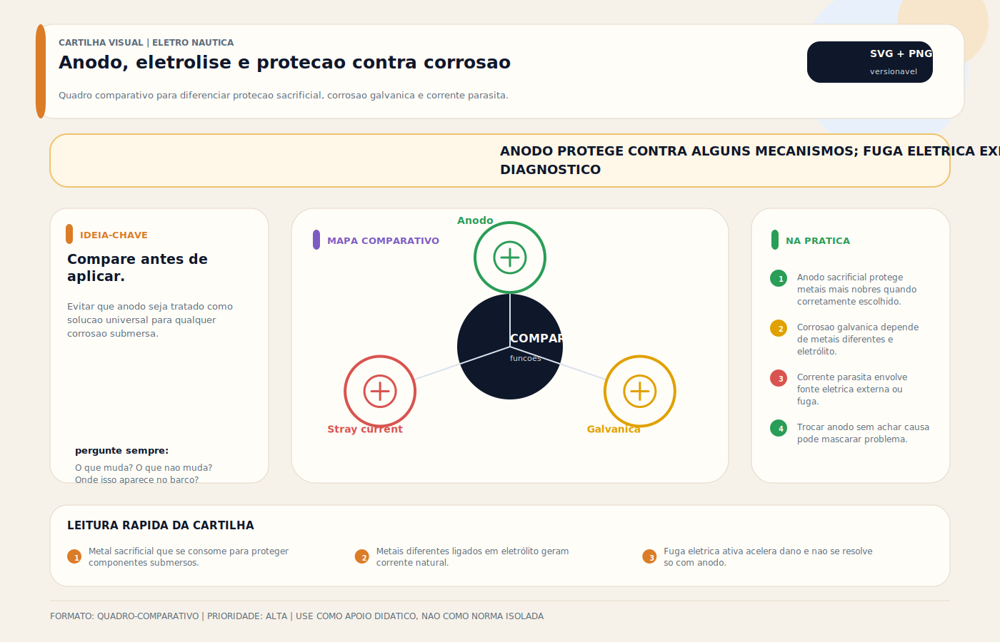

# Anôdo

> [!abstract] Resumo técnico
> Ânodo sacrificial é o elemento de proteção catódica que se consome para preservar metais mais nobres ou estruturalmente importantes da embarcação. Ele só funciona bem quando a liga é correta para o eletrólito, o contato elétrico é efetivo e a arquitetura de bonding e shore power não está levando corrente indevida ao sistema.

## O que é

Ânodo sacrificial é uma peça de liga metálica mais ativa instalada para se corroer preferencialmente e proteger outros metais ligados eletricamente ao mesmo sistema.

Não é acessório estético nem "peça de troca por hábito". É parte do sistema de proteção catódica.

## O que ele protege

Dependendo da embarcação e da arquitetura, o anodo pode proteger:

- hélice e eixo;
- rabeta, pé de motor e trim tabs;
- ferragens submersas ligadas ao bonding;
- casco metálico ou partes metálicas específicas;
- trocadores de calor, motores e [[Boiler]]s com anodos internos.

## Materiais mais usados

Os três grupos mais comuns são:

- zinco;
- alumínio em liga apropriada para uso sacrificial;
- magnésio.

A escolha depende da condutividade da água, da liga do anodo e da aplicação. De forma geral:

- água salgada costuma aceitar bem zinco ou alumínio adequado;
- água salobra normalmente favorece alumínio sacrificial;
- água doce pede magnésio em muitas aplicações.

Isso não substitui recomendação do fabricante do equipamento nem levantamento de potencial quando a aplicação é crítica.

## O erro mais comum de seleção

O maior erro de campo é tratar o material do anodo como item universal. Não é.

Também é erro supor que "mais anodo sempre é melhor". Excesso de proteção pode ser indesejável em alguns conjuntos, especialmente quando há revestimentos, alumínio e geometrias sensíveis. Projeto sério busca proteção suficiente, não superproteção cega.

## Instalação correta

O ponto central é simples: sem continuidade elétrica adequada, o anodo não protege.

Isso exige:

- superfície de contato limpa e metálica;
- fixação firme;
- ausência de tinta, primer ou isolamento no ponto de contato;
- integração coerente com o sistema que se pretende proteger.

Pintar o anodo ou montá-lo sobre superfície isolada anula sua função prática.

## Como interpretar o consumo

O consumo do anodo é informação diagnóstica, não só critério de troca.

### Consumo compatível

Indica que há atividade de proteção, mas não garante sozinho que o sistema está perfeito.

### Consumo muito baixo ou inexistente

Pode significar:

- falta de contato elétrico;
- anodo inadequado para o eletrólito;
- área protegida pequena demais ou mal conectada;
- leitura visual enganosa por incrustação superficial.

### Consumo excessivamente rápido

Pode indicar:

- ambiente agressivo;
- anodo subdimensionado;
- problema sério de [[Correntes Parasitas — Stray Currents]];
- falha de isolamento ou problema vindo do shore power.

Trocar o anodo sem investigar a causa, nesse caso, é só mascarar o problema.

## Dimensionamento

O dimensionamento depende de:

- área metálica exposta;
- material protegido;
- qualidade do revestimento;
- ambiente de operação;
- tempo esperado entre inspeções;
- corrente de proteção requerida.

Regras simplificadas de "x kg por y metros quadrados" podem servir como aproximação preliminar, mas não substituem recomendação do fabricante nem medição de potencial em aplicações relevantes.

## Anodos internos

Muita instalação falha por focar só nos anodos externos. Também existem anodos internos em:

- trocadores de calor;
- blocos e circuitos de refrigeração de motores;
- [[Boiler]]s e reservatórios específicos.

Eles são críticos e frequentemente esquecidos em manutenção.

## Diagnóstico profissional

Verificar:

- integridade física;
- continuidade elétrica com o conjunto protegido;
- padrão de consumo ao longo do tempo;
- histórico por marina ou ambiente;
- potencial do sistema com eletrodo de referência, quando a aplicação justificar.

O método mais confiável para avaliar a qualidade da proteção não é só olhar o anodo, mas correlacionar:

- consumo;
- condição do metal protegido;
- medição de potencial;
- presença de correntes parasitas.

## Boas práticas

- usar anodo de liga correta e procedência confiável;
- registrar data de instalação e histórico de consumo;
- inspecionar sempre que a embarcação sair do seco ou em intervalos programados;
- trocar antes de perder área útil demais, conforme a criticidade da aplicação;
- revisar ponto de contato, não apenas trocar a peça;
- incluir anodos internos no plano de manutenção.

## Erros comuns

Os mais frequentes são:

- instalar sobre tinta;
- comprar anodo genérico sem liga confiável;
- usar o mesmo material em qualquer ambiente;
- tratar consumo alto como sinal de "anodo bom";
- ignorar anodos internos;
- esquecer que o anodo responde à qualidade do sistema elétrico ao redor.

## Relação com outras notas

[[Eletrólise]] e [[Correntes Parasitas — Stray Currents]] explicam por que um anodo pode acabar rápido demais. [[Bonding — Sistema de Interligação de Massas]] define como os metais estão eletricamente conectados. [[Isolador Galvânico - Transformador de Isolamento]] entra quando o shore power participa do problema.

## Visual didático

Evitar que anodo seja tratado como solucao universal para qualquer corrosao submersa.

**Cautela:** Diagnostico de corrosao exige inspecao, historico, medicao e avaliacao do ambiente de marina.

Material de apoio: [Anodo, eletrolise e protecao contra corrosao](../_visuals/generated/anodo-eletrolise-protecao.md)

## Integração com outras notas

- [[Bonding — Sistema de Interligação de Massas]]
- [[Boiler]]
- [[Correntes Parasitas — Stray Currents]]
- [[Eletrólise]]
- [[Isolador Galvânico - Transformador de Isolamento]]

## Perguntas que esta nota responde

- Como escolher o anodo certo para o ambiente da embarcação?
- Como diferenciar anodo sem contato de anodo consumindo por problema elétrico?
- Quando trocar o anodo e quando investigar a arquitetura elétrica antes disso?
