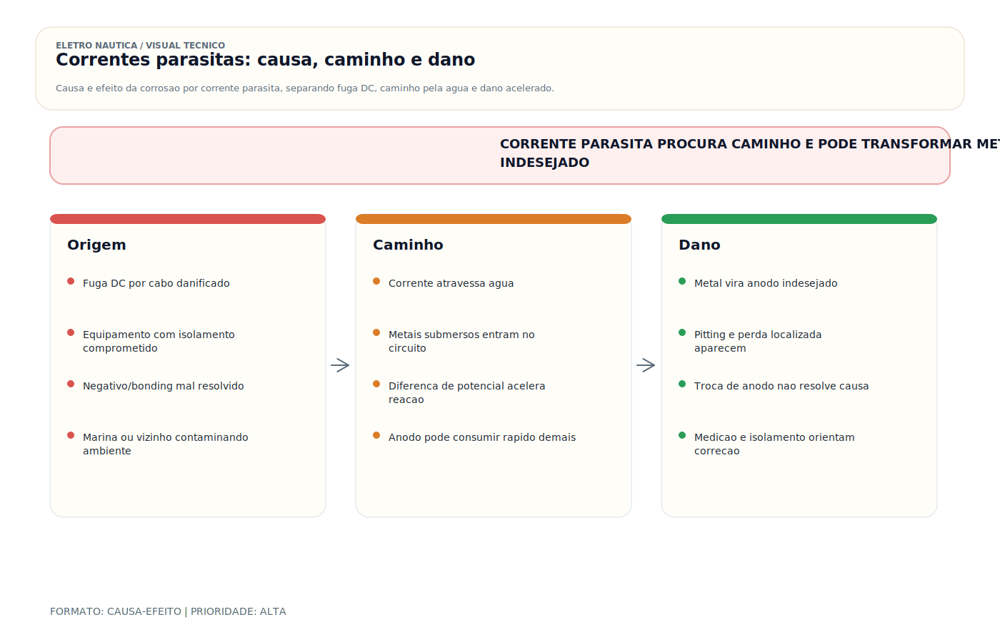

# Correntes Parasitas — Stray Currents

> [!abstract] Resumo técnico
> Corrente parasita é corrente elétrica que percorre caminhos não previstos e produz perda de metal em pontos de saída de corrente para a água ou para estruturas condutivas. Em linguagem de oficina, muita gente chama tudo de "eletrólise"; tecnicamente, isso é impreciso. Corrente parasita é uma forma específica e muito mais agressiva de corrosão eletroquímica.

> [!tip] Regra de decisão em 30 segundos
> 1. **Três fenômenos distintos, três diagnósticos:** corrosão galvânica ≠ corrente parasita DC ≠ vazamento AC para a água. Tratá-los como sinônimos leva ao erro de arquitetura.
> 2. **"Eletrólise" não é termo técnico neutro.** No vocabulário de oficina ele esconde todos os três. Em diagnóstico sério, nomear o mecanismo é o primeiro passo.
> 3. **Anodo sumindo rápido é sinal, não diagnóstico.** Pode ser marina, barco vizinho, falha interna ou liga errada. Não trocar sem investigar.
> 4. **Multímetro na água não é diagnóstico.** Eletrodo de referência Ag/AgCl é o instrumento padrão. Sem ele, qualquer leitura é orientativa.
> 5. **Ao desconectar shore power, o sintoma muda?** Se sim, a origem é externa (marina, barco vizinho) ou interface AC. Se não, a origem é interna DC.
> 6. **Ordem de grandeza importa:** corrosão galvânica trabalha em meses/anos; corrente parasita severa pode destruir hélice em dias. Velocidade do dano orienta a hipótese.

## O que são correntes parasitas

Em termos práticos, há corrente parasita quando parte da corrente elétrica de um sistema DC ou de uma falha AC encontra um caminho indevido por:

- água;
- eixo;
- ferragens submersas;
- casco metálico;
- sistema de bonding;
- terra de shore power.

Quando a corrente sai do metal para o eletrólito, esse ponto sofre perda acelerada de material.

## O que esta nota não deve confundir

É fundamental separar três fenômenos:

### 1. Corrosão galvânica

Ocorre sem alimentação elétrica externa, por diferença natural de potencial entre metais em um eletrólito.

### 2. Corrente parasita DC

É o caso mais destrutivo para perda de metal. Normalmente decorre de fuga, aterramento incorreto, cabo danificado, equipamento defeituoso ou arquitetura ruim.

### 3. Vazamento AC para a água

É gravíssimo do ponto de vista de segurança de pessoas e pode coexistir com problemas de corrosão, mas seu principal risco imediato é choque elétrico em ambiente aquático. Não deve ser tratado como se fosse idêntico ao mecanismo clássico de corrosão por corrente parasita DC.

### Quadro comparativo dos três fenômenos

| Aspecto | Corrosão galvânica | Corrente parasita DC | Vazamento AC |
| --- | --- | --- | --- |
| **Força motriz** | diferença natural de potencial entre metais no eletrólito | fuga de corrente DC externa imposta ao sistema | fuga AC por PE, casco ou bonding |
| **Fonte** | par galvânico (bronze + alumínio, aço + inox, etc.) | cabo DC danificado, arquitetura errada, barco vizinho | shore power com PE comprometido, equipamento AC defeituoso |
| **Velocidade do dano** | meses a anos (com anodo ativo) | dias a semanas em casos severos | não é o risco primário — é segurança de pessoas |
| **Risco principal** | perda progressiva de metal nobre | destruição rápida de hélice, eixo, rabeta | **choque elétrico em nadadores (ESD — Electric Shock Drowning)** |
| **Diagnóstico** | eletrodo de referência Ag/AgCl + tabela galvânica | medir corrente em PE, bonding, derivações; observar ao desconectar shore | clamp meter de fuga AC no PE; DR/ELCI dispara |
| **Mitigação** | anodo apropriado + par galvânico compatível | corrigir arquitetura, isolamento, bonding; isolador galvânico ou transformador de isolamento | corrigir o defeito na fonte + ELCI a montante + DR em cada circuito |
| **Bonding ajuda?** | sim (equaliza metais protegidos) | sim se arquitetura certa; piora se errada | não resolve — ELCI/DR é a proteção correta |
| **Shore power envolvido?** | indireta (via PE e bonding) | frequente (via PE comprometido) | direto |

## Fontes típicas

As origens mais comuns são:

- cabo DC com isolamento danificado;
- retorno indevido por estrutura metálica;
- ligação incorreta entre negativo DC, PE e bonding;
- equipamento com falha interna;
- shore power com problema de aterramento, polaridade ou isolamento;
- barco vizinho injetando corrente na água da marina.

Em marinas, uma embarcação pode sofrer o problema gerado por outra.

## Onde o dano costuma aparecer

Os pontos mais vulneráveis são:

- hélices;
- eixos;
- trim tabs;
- rabetas e pés de motor;
- cascos de alumínio;
- passa-cascos metálicos;
- trocadores de calor e ferragens submersas conectadas ao bonding.

Consumo anormalmente rápido de [[Anôdo]] é sinal de alerta, mas não basta para fechar diagnóstico sozinho.

## Sinais de campo que merecem investigação

Desconfie fortemente quando houver:

- pitting severo em pouco tempo;
- corrosão localizada e agressiva em componente específico;
- anodos acabando cedo demais em marina ou período específico;
- dano muito maior após conexão prolongada ao [[CAIS (Pier) (AC)]];
- comportamento diferente ao mudar de marina;
- aquecimento, odores ou anomalias elétricas junto com corrosão.

## Diagnóstico correto

### 1. Não usar medições improvisadas como verdade final

Enfiar um fio qualquer na água e ler milivolts com multímetro pode até dar indício, mas não produz diagnóstico confiável. Para análise séria de potencial de proteção e de corrosão, o correto é usar eletrodo de referência apropriado, tipicamente prata/cloreto de prata.

### 2. Separar problema interno de problema externo

O raciocínio base é:

1. medir o comportamento atual;
2. desconectar shore power;
3. observar o que muda;
4. isolar cargas e fontes internas uma a uma;
5. localizar o circuito ou a condição que altera o potencial ou a corrente.

Se o sintoma muda fortemente ao retirar o shore, a origem pode estar:

- na própria embarcação via entrada AC;
- na marina;
- em outra embarcação conectada à mesma infraestrutura.

### 3. Medir corrente e não só tensão

Dependendo da arquitetura, vale medir:

- corrente em condutores de PE;
- corrente em bonding;
- correntes residuais em derivações específicas;
- diferença de potencial entre metais submersos e eletrodo de referência.

Valores absolutos variam com material, liga, anodo, salinidade e arquitetura. Tendência, desvio abrupto e comparação com baseline do próprio barco são mais úteis do que números soltos sem contexto.

### 4. Ensaios de isolamento

Ensaios com megôhmetro podem ser úteis, mas só depois de:

- desconectar eletrônicos sensíveis;
- respeitar limites do fabricante;
- definir claramente o que está sendo testado.

Megger mal aplicado pode danificar equipamento e ainda assim não explicar toda a corrosão observada.

## Relação com shore power

Corrente parasita e shore power se cruzam em três pontos:

- terra/PE;
- neutro referenciado em topologia inadequada;
- acoplamento com sistema de bonding e metais submersos.

[[Isolador Galvânico - Transformador de Isolamento]] pode ajudar, mas não são soluções equivalentes:

- isolador galvânico atua em cenário específico e não corrige toda falha de instalação;
- transformador de isolamento é a solução mais robusta para desacoplar a embarcação da rede da marina.

## Papel do bonding

[[Bonding — Sistema de Interligação de Massas]] não é vilão nem solução mágica. Ele:

- ajuda a equalizar potenciais;
- facilita proteção catódica;
- também pode distribuir um problema quando a arquitetura está errada.

Bonding mal entendido leva a dois erros opostos:

- não interligar o que precisava estar no mesmo potencial;
- interligar indiscriminadamente e criar caminho para corrente indevida.

## Boas práticas de prevenção

- manter cabos, conectores e passagens mecânicas em ótimo estado;
- revisar periodicamente a relação entre negativo DC, PE e bonding;
- usar [[Anôdo]] correto para o ambiente e monitorar sua taxa de consumo;
- registrar medições de referência do próprio barco em condição saudável;
- investigar mudanças de marina, berço ou comportamento do shore power;
- considerar transformador de isolamento em instalações mais críticas ou sensíveis.

## Erros comuns

Os mais perigosos são:

- chamar toda corrosão de "eletrólise" e parar por aí;
- trocar anodo sem investigar a causa;
- usar leitura improvisada de multímetro como diagnóstico definitivo;
- confundir corrente parasita DC com risco de choque por AC na água;
- condenar o metal da peça quando o problema é a arquitetura elétrica.

## Quando chamar especialista

> [!danger] Situações que exigem análise qualificada
> - Consumo de anodos em **semanas** em vez de temporada — indica corrente parasita DC severa, não desgaste normal.
> - Corrosão destrutiva localizada em hélice, eixo, rabeta ou passa-casco metálico — dano mecânico iminente.
> - DR da embarcação ou ELCI do shore power disparando em marina específica — pode haver **hot earth** ou vazamento AC na infraestrutura.
> - Suspeita de **Electric Shock Drowning (ESD)** — corrente AC na água é risco imediato de morte para banhistas; **evacuar a área, desligar shore power, chamar a marina e eletricista certificado antes de qualquer inspeção**.
> - Corrosão piora consistentemente ao entrar em determinada marina — pode ser embarcação vizinha injetando corrente.
> - Casco de alumínio com pitting profundo em zona submersa — custo de reparo estrutural justifica diagnóstico completo antes de qualquer intervenção.
>
> Nesses casos, o diagnóstico exige eletrodo Ag/AgCl, clamp meter AC/DC de alta sensibilidade e possivelmente ensaio de isolação com megôhmetro. Eletricista naval certificado (ABYC E-2, ISO 13297:2020) deve conduzir o levantamento.

## Glossário rápido

| Termo | Definição | Por que importa no diagnóstico |
| --- | --- | --- |
| `Pitting` | corrosão localizada em forma de pites/poços | sinal característico de corrente parasita DC (não de corrosão galvânica uniforme) |
| `Eletrodo de referência Ag/AgCl` | eletrodo prata/cloreto de prata em solução | padrão para medir potencial de proteção catódica em ambiente marinho |
| `Potencial de proteção` | faixa de tensão em que o metal está cataódicamente protegido | para aço em água do mar: típico −800 mV a −1100 mV vs Ag/AgCl |
| `Proteção catódica` | técnica de proteger metal tornando-o cátodo | via anodo galvânico (sacrifício) ou corrente imposta |
| `Anodo galvânico / de sacrifício` | metal menos nobre que se corrói no lugar do protegido | zinco (salgada), alumínio (mista), magnésio (doce) |
| `ESD` | Electric Shock Drowning | choque AC em nadador próximo à marina; fatal mesmo em baixa corrente (10-20 mA) |
| `ELCI` | Equipment Leakage Circuit Interrupter | DR de entrada de shore power (ABYC — 30 mA, ≤100 ms); barreira contra ESD |
| `Hot earth` | PE conduzindo corrente operacional AC | causa comum de ESD em marina |
| `Megôhmetro / Megger` | ohmímetro de alta tensão (250V/500V) | mede resistência de isolação em cabos AC |
| `Clamp meter DC` | alicate amperímetro com efeito Hall | mede corrente DC sem abrir circuito — essencial para bonding/PE |
| `Baseline` | medições de referência do barco em condição saudável | tendência é mais informativa que valor absoluto isolado |
| `Galvânica` (mesa) | ordenamento dos metais por nobreza em eletrólito | base para prever par galvânico problemático |
| `Passivação` | filme protetor natural em inox, alumínio, etc. | corrente parasita pode romper passivação e acelerar ataque |

## Visual didático

Mostrar por que pequenas fugas DC podem destruir metais rapidamente em ambiente nautico.

**Cautela:** Diagnostico de corrosao deve diferenciar corrosao galvanica, eletrolise/stray current e problemas mecanicos/quimicos.

Material de apoio: [Correntes parasitas: causa, caminho e dano](../_visuals/generated/corrosao-stray-current-causa-efeito.md)

## Integração com outras notas

- [[Anôdo]]
- [[Aterramento]]
- [[Bonding — Sistema de Interligação de Massas]]
- [[CAIS (Pier) (AC)]]
- [[Eletrólise]]
- [[Isolador Galvânico - Transformador de Isolamento]]
- [[Quadro Elétrico e Painel de Distribuição AC-DC]]

## Perguntas que esta nota responde

- O que diferencia corrente parasita de corrosão galvânica?
- Como separar defeito interno, problema de shore power e problema da marina?
- Por que medir "qualquer milivolt na água" não basta para um diagnóstico profissional?

