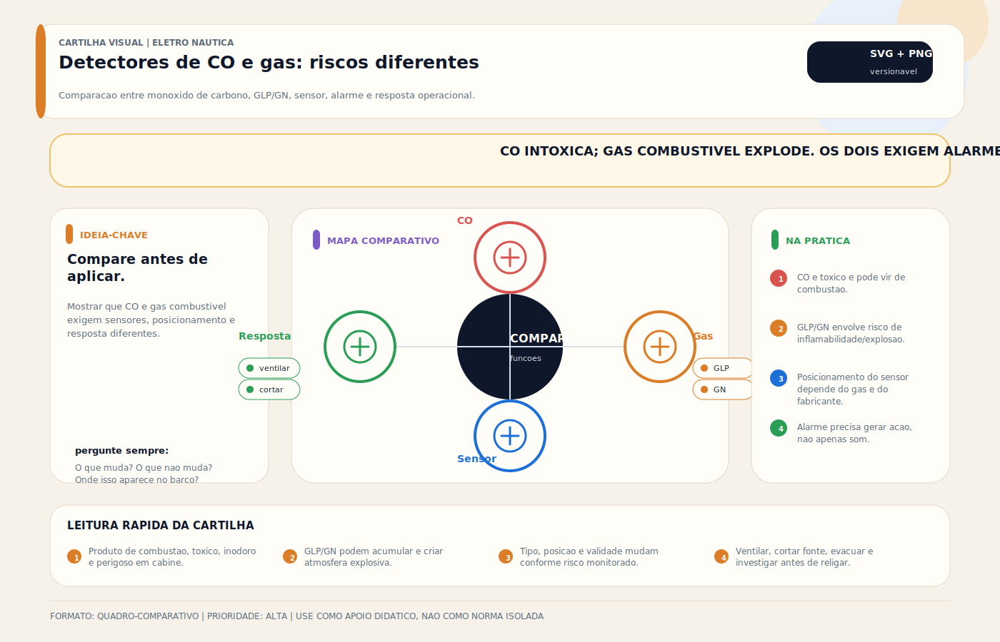

# Detector de CO — Monóxido de Carbono

> [!abstract] Resumo técnico
> Detector de CO é um alarme destinado a avisar a presença de monóxido de carbono em níveis perigosos dentro de áreas ocupáveis da embarcação. CO é gás tóxico, invisível e inodoro, associado a motores, geradores, aquecedores, fogões e outras fontes de combustão. Em barcos, o risco existe tanto em cabine quanto em áreas externas sujeitas a recirculação de exaustão.

## O que é

É um dispositivo de alarme, normalmente com sensor eletroquímico ou tecnologia equivalente, projetado para detectar CO em ambientes ocupáveis. O objetivo não é medir qualidade do ar com precisão laboratorial, e sim:

- alertar exposição perigosa;
- induzir resposta imediata da tripulação;
- reduzir risco de intoxicação durante repouso, permanência em cabine ou operação.

## Função na embarcação

- detectar CO gerado por fontes de combustão;
- avisar a tripulação antes de incapacidade ou intoxicação grave;
- complementar ventilação, manutenção e inspeção de exaustão;
- apoiar uma cultura de segurança em embarcações com espaços ocupáveis.

## Fundamentos mínimos

### CO não tem cheiro e pode se confundir com "mal-estar"

Fontes oficiais de segurança náutica alertam que sintomas de CO podem se parecer com enjoo, cansaço ou intoxicação alcoólica. Isso atrasa a reação e torna o detector ainda mais importante.

### O risco existe dentro e fora da cabine

CO pode se acumular em interiores, sob coberturas, próximo à popa, em áreas de plataforma e em cenários de recirculação de exaustão. A guarda costeira dos EUA destaca o chamado *station wagon effect* ou *back drafting*, especialmente em baixa velocidade, marcha lenta, embarcação parada e proximidade de outras embarcações.

### Detector não substitui manutenção de exaustão

Alarme é camada de proteção, não licença para operar com motor, gerador, aquecedor ou escape em condição duvidosa.

### Detector marinho não deve ser tratado como acessório doméstico genérico

Em ambiente náutico, vibração, umidade e disponibilidade de alimentação importam. O conjunto precisa ser compatível com a aplicação e mantido conforme instruções do fabricante.

## Projeto e instalação

### O que precisa ser definido

1. quais espaços são ocupáveis e onde as pessoas dormem;
2. quais fontes de combustão existem a bordo;
3. como a exaustão pode recircular em condição real de uso;
4. se o detector será alimentado por bateria própria, alimentação DC ou sistema integrado;
5. política de teste, substituição e resposta ao alarme.

### Diretrizes práticas

- instalar alarme marinho ou solução explicitamente adequada ao ambiente da embarcação;
- posicionar os alarmes em ou próximo dos espaços ocupáveis e de pernoite, conforme instrução do fabricante;
- não instalar no bilge só porque "é onde ficam os gases", pois CO não se comporta como GLP;
- evitar pontos de ventilação direta ou locais que descaracterizem a amostragem do ambiente;
- manter alimentação coerente com a função de segurança do equipamento.

## Onde costuma dar problema

| Problema | Causa provável |
| --- | --- |
| alarme ausente em barco com fonte de combustão | subestimação do risco |
| detector vencido ou ignorado | falta de manutenção e de cultura de segurança |
| alarme "falso" recorrente | exaustão real, produto inadequado ou instalação ruim |
| alarme fora de posição útil | instalação em ponto inadequado |
| risco persistente apesar do detector | vazamento de exaustão, ventilação ruim ou operação insegura |

## Diagnóstico prático

1. Confirmar data de substituição e integridade do equipamento.
2. Executar teste funcional pelo método previsto pelo fabricante.
3. Inspecionar o sistema de exaustão e as fontes de combustão.
4. Verificar cenários reais de recirculação de gases.
5. Confirmar que a tripulação sabe como responder ao alarme.

## Resposta ao alarme

- levar pessoas imediatamente para ar fresco;
- desligar fontes de combustão quando isso puder ser feito com segurança;
- ventilar a embarcação;
- tratar sintomas como emergência médica;
- não "resetar e seguir" sem investigar a causa.

## Boas práticas profissionais

- usar detector adequado ao ambiente marinho;
- testar regularmente conforme o fabricante;
- substituir o alarme ou sensor dentro do prazo recomendado;
- incorporar inspeção de exaustão, mangotes e ventilação à rotina técnica;
- instruir tripulação e passageiros sobre sintomas e resposta.

## Erros comuns

- achar que diesel ou gerador "não precisam" de preocupação com CO;
- instalar detector de fumaça achando que substitui detector de CO;
- ignorar alarme porque "ninguém sentiu cheiro";
- montar detector em local sem relação com a zona ocupada;
- usar detector vencido como se fosse proteção válida.

## Relação com outros sistemas

- **[[Aquecedor de Bordo - Cabin Heater]]** e **[[Gerador (AC)]]** — fontes potenciais de CO.
- **[[Sistema de Alarme Geral / Painel de Alarmes]]** — integração de aviso centralizado.
- **[[Extintor Automático — Combate a Incêndio na Casa de Máquinas]]** — segurança em espaços técnicos, mas com risco diferente.
- **[[Detector de Gás GLP / GN]]** — gás diferente, risco diferente e estratégia de instalação diferente.

## Normas e referências

- U.S. Coast Guard Boating Safety — material educativo e checklists sobre CO em embarcações;
- documentação do fabricante do detector;
- requisitos aplicáveis de certificação e instalação do equipamento utilizado.

## FAQ

**CO é problema só em cabine fechada?**

Não. Pode haver risco também em cockpit coberto, popa, plataforma e áreas de recirculação de exaustão.

**Detector de fumaça substitui detector de CO?**

Não. São dispositivos de finalidade diferente.

**Se o alarme disparou e depois parou, posso ignorar?**

Não. O evento precisa ser tratado como indício de condição insegura até que a causa seja entendida.

## Visual didático

Mostrar que CO e gas combustivel exigem sensores, posicionamento e resposta diferentes.

**Cautela:** Instalacao, vida util e posicionamento dos sensores devem seguir manual do fabricante e boas praticas de seguranca.

Material de apoio: [Detectores de CO e gas: riscos diferentes](../_visuals/generated/detectores-co-gas-camadas.md)

## Integração com outras notas

- [[Detector de Gás GLP / GN]]
- [[Sistema de Alarme Geral / Painel de Alarmes]]
- [[Extintor Automático — Combate a Incêndio na Casa de Máquinas]]
- [[Aquecedor de Bordo - Cabin Heater]]
- [[Gerador (AC)]]

## Perguntas que esta nota responde

- Por que detector de CO é crítico em embarcações?
- Onde estão os cenários reais de acúmulo de monóxido de carbono no barco?
- Como instalar e operar detector de CO com seriedade técnica?
