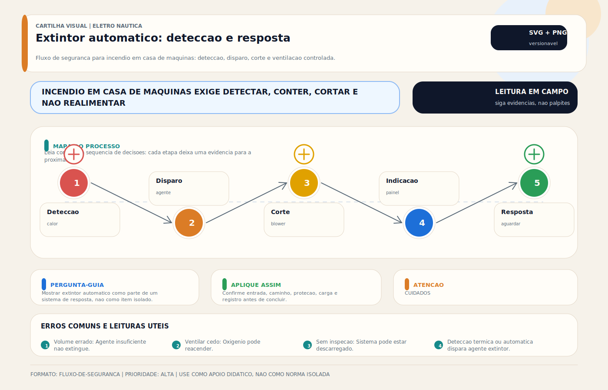

# Extintor Automático — Combate a Incêndio na Casa de Máquinas

> [!abstract] Resumo técnico
> Sistema fixo automático de supressão de incêndio em casa de máquinas é um subsistema de segurança crítica, normalmente pré-engenheirado, dimensionado para um volume de compartimento e integrado a alarmes, desligamentos e procedimentos operacionais. Não é "um extintor preso no teto": é um sistema que precisa funcionar mesmo quando ninguém consegue entrar no compartimento.

## O que é

É um sistema fixo destinado a detectar condição térmica de incêndio e descarregar agente extintor no compartimento protegido, normalmente a casa de máquinas ou um compartimento técnico equivalente.

Em embarcações de recreio, os arranjos mais comuns usam:

- cilindro pressurizado com agente limpo;
- elemento de atuação térmica ou detector/sistema equivalente;
- descarga por bico difusor;
- indicação de condição do cilindro;
- integração com alarme e, em sistemas mais completos, com disparo remoto e desligamentos automáticos.

## O que ele deve proteger

O foco principal é o compartimento onde coexistem:

- combustível;
- superfícies quentes;
- óleo;
- alternadores, starters, cabeamento e equipamentos elétricos;
- motores, geradores e exaustão.

Esse conjunto faz da casa de máquinas o local mais crítico da embarcação para incêndio oculto.

## O que muda de um sistema profissional para um improvisado

Sistema profissional considera:

- volume real protegido;
- estanqueidade relativa do compartimento;
- agente correto para a aplicação;
- posição dos bicos;
- integração com alarme;
- lógica de desligamento de motores, geradores e ventilação;
- manutenção certificada.

Sistema improvisado foca só no cilindro e esquece todo o resto.

## Agentes mais comuns

Nas embarcações de recreio, predominam agentes limpos. Em termos práticos:

- HFC-227ea/FM-200 aparece amplamente em sistemas legados e ainda é muito encontrado;
- FK-5-1-12/Novec 1230 aparece como solução moderna de agente limpo;
- CO2 existe, mas exige muito mais cautela por risco de asfixia e por características de aplicação.

A escolha do agente não deve ser feita só por preço. Devem entrar na análise:

- compatibilidade com ocupação humana;
- volume do compartimento;
- requisitos do fabricante do sistema;
- disponibilidade de manutenção e recarga;
- implicações ambientais e regulatórias.

## Dimensionamento correto

Em sistemas pré-engenheirados, o dimensionamento não deve ser reduzido a fórmula genérica de internet. O procedimento correto é seguir a tabela e o manual do fabricante para:

- volume máximo protegido;
- altura e geometria do compartimento;
- tipo de agente;
- número e tipo de bicos;
- temperatura de projeto;
- restrições de instalação.

Compartimento com ventilação aberta, passagem excessiva ou volume mal calculado compromete a concentração efetiva do agente.

## Integração obrigatória ou fortemente recomendável

Em projeto sério, o disparo do sistema deve conversar com outros subsistemas. Os mais importantes são:

- alarme visual e sonoro;
- desligamento de motores principais e auxiliares, quando aplicável;
- desligamento de geradores;
- parada de ventiladores e [[Blower]];
- fechamento ou bloqueio de ventilação forçada, quando a arquitetura do barco exigir;
- indicação no [[Sistema de Alarme Geral - Painel de Alarmes]].

Sem isso, o agente pode ser descarregado enquanto:

- o compartimento continua sendo ventilado;
- o motor segue puxando ar;
- a fonte de ignição continua ativa.

## Operação correta

Após disparo, a regra prática é:

- não abrir o compartimento imediatamente;
- não religar motor, gerador ou ventilação sem avaliação;
- ventilar e inspecionar de forma controlada;
- tratar o disparo como evento sério, não como falsa falha até prova contrária.

Abrir a casa de máquinas cedo demais pode reintroduzir oxigênio e reiniciar o incêndio.

## Inspeção e manutenção

Verificações típicas incluem:

- indicador de pressão, quando existente;
- massa do cilindro, quando aplicável;
- validade e conformidade da manutenção;
- integridade de suportes, bicos e linhas;
- condição do dispositivo de atuação térmica;
- teste funcional dos alarmes e intertravamentos sem descarregar agente;
- revisão profissional conforme manual e legislação aplicável.

Periodicidade exata depende do sistema, do agente, do fabricante e da jurisdição. Não é profissional tratar "recarregar a cada x anos" como verdade universal.

## Falhas típicas em campo

As mais comuns são:

- cilindro sem carga adequada;
- sistema instalado para volume maior do que consegue proteger;
- bico mal posicionado;
- ventilação não interrompida;
- motor/gerador continuando em funcionamento após disparo;
- sistema presente, mas sem manutenção real;
- tripulação sem procedimento claro de resposta.

## Diagnóstico profissional

O diagnóstico deve responder:

1. O compartimento está dentro do envelope do sistema instalado?
2. O agente e o modelo são adequados para a aplicação?
3. Há integração funcional com alarme, ventilação e desligamento?
4. A manutenção está rastreável e compatível com o fabricante?
5. A tripulação sabe o que fazer antes, durante e depois do disparo?

## Boas práticas

- usar sistema de fabricante reconhecido e manual disponível;
- dimensionar pelo volume e pela configuração real do compartimento;
- prever desligamento e bloqueio de ventilação conforme projeto;
- manter extintores portáteis complementares para outras áreas;
- registrar inspeções e manutenções;
- treinar resposta operacional do proprietário ou tripulação.

## Erros comuns

Os mais perigosos são:

- comprar o cilindro sem fechar a lógica de desligamentos;
- assumir que qualquer cilindro serve para qualquer casa de máquinas;
- manter o sistema sem inspeção formal;
- abrir o compartimento imediatamente após descarga;
- confundir proteção automática fixa com substituição total dos extintores portáteis.

## Referências de projeto

Para esta nota, o ponto mais seguro é sempre remeter ao conjunto:

- manual do fabricante do sistema;
- regulamentação aplicável à classe e ao tipo da embarcação;
- requisitos de integração com motores, geradores e ventilação.

## Visual didático

Mostrar extintor automatico como parte de um sistema de resposta, nao como item isolado.

**Cautela:** Sistema de combate a incendio deve seguir fabricante, classe de agente, volume protegido, inspecao e requisitos aplicaveis.

Material de apoio: [Extintor automatico: deteccao e resposta](../_visuals/generated/extintor-automatico-casa-maquinas.md)

## Integração com outras notas

- [[Blower]]
- [[Casa de Máquinas e Paiol]]
- [[Detector de CO — Monóxido de Carbono]]
- [[Detector de Gás GLP - GN]]
- [[Quadro Elétrico e Painel de Distribuição AC-DC]]
- [[Sistema de Alarme Geral - Painel de Alarmes]]
- [[Troubleshooting — Diagnóstico de Falhas Elétricas]]

## Perguntas que esta nota responde

- O que diferencia um sistema fixo de supressão realmente correto de um cilindro apenas instalado?
- Por que desligar motor e ventilação faz parte da eficácia do sistema?
- Que pontos precisam ser verificados para dizer que a proteção da casa de máquinas é confiável?
